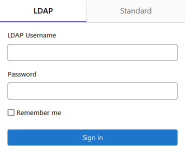
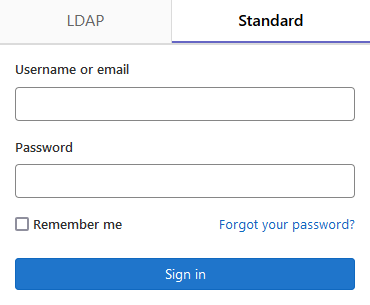

---
hide:
    toc: true
---

# Create Your Code.rc (GitLab) Account

**Code.rc** is an on-premises GitLab server running on UAB IT infrastructure, administered by Research Computing, and part of the Research Computing System (RCS).

Creating a Code.rc account is an automated, self-service process for researchers affiliated with UAB. External collaborators follow a different process.

## What Do I Need Before Starting?

Before starting, you'll need the following prerequisites.

- An [RCS Account](../rcs/index.md) in [Good Standing](../rcs/status.md#what-are-the-possible-statuses-good-standing-ok).

## How Do I Create a Code.rc Account?

Please select the tab that best described your affiliation to UAB to see instructions for creating a Code.rc account.

<!-- markdownlint-disable MD046 -->
=== "UAB Campus & UAB Medicine"

    Please select the LDAP tab and authenticate with your BlazerID credentials.

    

    

=== "External Collaborator (XIAS)"

    1. Ensure that your sponsor has included `https://code.rc.uab.edu` in the list of [approved URIs](../xias/1_sponsor_manage_sites.md) on the XIAS Site configuration page.

        !!! important

            XIAS account researchers will only be granted access if their sponsor adds the Code.rc URI to the list of approved URIs.

    1. Have your sponsor send a request to <support@listserv.uab.edu> for a Code.rc account for their XIAS Guest. Please have the sponsor use the following template.

    ```text
    I hereby request a Code.rc account created for a XIAS account, and affirm that the external collaborator has an RCS account in good standing.

    XIAS full name: _____
    XIAS email address: _____
    ```

    1. UAB Research Computing will create an account.
    1. You will receive an automated email from `donotreply.rc.code@uab.edu` with a link to create a password.
    1. Follow the link to create a password for your account.
    1. Navigate to <https://code.rc.uab.edu> to authenticate.
    1. Select the Standard tab and authenticate with your XIAS credentials. Only use the `name` portion of your XIAS email address `name@domain.tld`. Do not include the `@` symbol or anything after. Use the password you created in the previous steps.

        > Username or primary email: `name`
        >
        > Password: `********`

        

    1. Click `Sign in` to authenticate.

=== "Unaffiliated"

    

    
<!-- markdownlint-enable MD046 -->

## Next Steps

Now that your Code.rc (GitLab) account is created, learn more about how to use GitLab effectively.

- [Official GitLab Tutorials](https://docs.gitlab.com/tutorials/)
- [Code.rc](../../code.rc/index.md)
