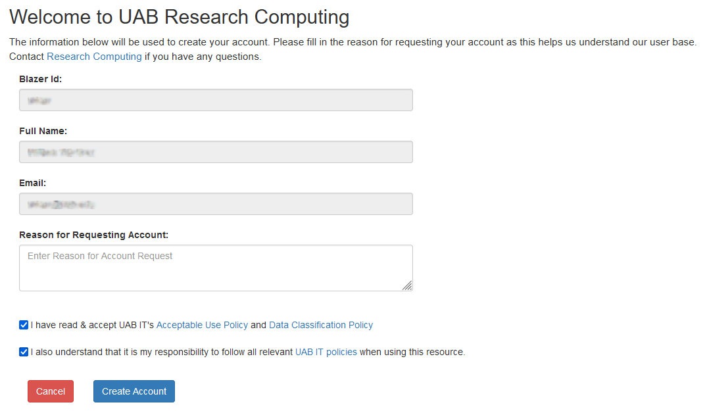
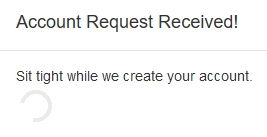

---
hide:
    toc: true
---

# Create Your Research Computing Systems (RCS) Account

Creating an RCS account is an automated, self-service process for UAB-affiliated researchers. External collaborators will need to follow a different process.

## What Do I Need Before Starting?

Before starting, you'll need to meet one of the following prerequisites.

- Have one of the following affiliations to UAB Campus: faculty, staff, student;
- _or_ be employed by UAB Medicine;
- _or_ have a XIAS account with a UAB-affiliated Sponsor.

Additionally, you must meet the following prerequisite.

- Your work on RCS must be research or in direct support of research.

<!-- markdownlint-disable MD046 -->
!!! security

    Direct patient care operations are not permitted on RCS. Please reach out to IT or IS contacts within your department for advice on how to proceed.
<!-- markdownlint-enable MD046 -->

## How Do I Create an RCS Account?

To create your account, use your browser to navigate to our web interface at <https://rc.uab.edu>.

You will be asked to login using Single Sign-on (SSO). Please select the tab that best describes your affiliation to UAB to see login instructions.

<!-- markdownlint-disable MD046 -->
=== "UAB Campus & UAB Medicine"

    Please login with your BlazerID credentials.

    

=== "External Collaborator (XIAS)"

    

    Please login with your XIAS account credentials. In the "BlazerID" box, put the email you used to register for your XIAS account. In the "Password" box, enter the password you configured when creating your XIAS account.

    > BlazerID: `name@domain.tld`
    >
    > Password: `********`

=== "Unaffiliated"

    

    
<!-- markdownlint-enable MD046 -->

When you have authenticated you will be automatically taken to a form to create your account. Please select the tab that best describes your affiliation to UAB to see form instructions. If you wish to stop, click the "Cancel" button at the bottom of the form, or close your browser.

<!-- markdownlint-disable MD046 -->
=== "UAB Campus & UAB Medicine"

    The form should be prefilled with your BlazerID, Full Name, and UAB Campus email address. Please verify the details are correct.

    See incorrect or missing information? Please [Contact Support](../../help/support.md).

    

=== "External Collaborator (XIAS)"

    The form should be prefilled as shown below. Only use the `name` portion of your XIAS email address `name@domain.tld` in the BlazerID field. Use your full XIAS email address in the Email field.

    > BlazerID: `name`
    >
    > Full Name: firstname lastname
    >
    > Email: `name@domain.tld`

    

=== "Unaffiliated"

    

    
<!-- markdownlint-enable MD046 -->

Please fill out the reason you wish to create an account in the form. It would be helpful to include information about your research use cases, needs, and how you believe RCS will help you.

You must read and agree to all relevant UAB IT policies. If you agree, please check the checkboxes.

When the form is completed, the "Create Account" button will become active. When you are ready, click the "Create Account" button to create your account. When you click this button, it will not be possible to stop the account creation process using the "Cancel" button.

After clicking the "Create Account" button, you should see a popup notification indicating that your account is being created. The process should take no longer than five minutes.

When the process is complete, you will be redirected to our [Open OnDemand](../../cheaha/open_ondemand/index.md) web interface.

Welcome to Cheaha and to Research Computing!

## Next Steps

Please take some time to familiarize yourself with responsibilities, expectations, and policies around use of RCS.

{{
    renderer.render_cards(
        cards.account.responsibilities
    )
}}

Research Computing has many services available to RCS account holders. To learn more about services that may interest you, please select the role that most closely matches yours.

<!-- markdownlint-disable MD046 -->
=== "Student | Staff | XIAS Guest"

    {{
        renderer.render_cards(
            cards.platforms.cheaha.ood.overview,
            cards.platforms.cheaha.slurm.overview,
            cards.data.individual_storage,
            cards.data.transfer_options,
            cards.education.training,
            cards.education.dsjc,
            cards.account.code_rc_create,
        ) | indent(4)
    }}

=== "Research Faculty Supervisor | Core Director"

    {{
        renderer.render_cards(
            cards.platforms.cheaha.ood.overview,
            cards.platforms.cheaha.slurm.overview,
            cards.data.shared_storage,
            cards.data.transfer_options,
            cards.platforms.cloud_rc.overview,
            cards.platforms.cloud_rc.web_server,
            cards.account.code_rc_create,
        )
    }} | indent(4)
<!-- markdownlint-enable MD046 -->


