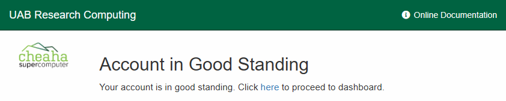
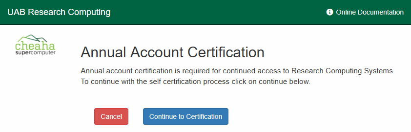
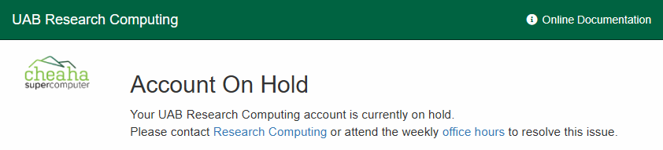
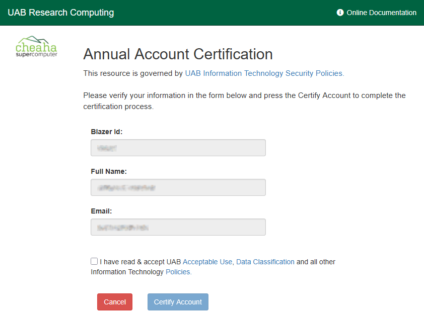

# Research Computing System (RCS) Account Status

All Research Computing System (RCS) accounts have a status. Statuses determine whether an account may access RCS services, and what actions may be required to restore access.

The following table has more information on each status, with links for more details. To check your status see [How Do I Check My RCS Account Status?](#how-do-i-check-my-rcs-account-status)

{{ read_csv("_res/status_summary.csv", keep_default_na=False) }}

## What Are the Possible Statuses?

<!-- markdownlint-disable MD046 -->
=== "Good Standing (OK)"

    When an account is in Good Standing (OK) status, all RCS services are accessible and no action is required.

    While in Good Standing (OK) status, The [Account Status page](#how-do-i-check-my-rcs-account-status) will show "Account in Good Standing", as shown below.

    

=== "Pre-Certification"

    When an account is in Pre-Certification status, all RCS services are accessible and action will be required soon.

    ?? days after entering Pre-Certification status, accounts will enter Certification status and action will be required. To prevent Certification status, you may certify at any time.

    While in Pre-Certification status, the [Account Status page](#how-do-i-check-my-rcs-account-status) will show "Account in Pre-Certification", as shown below.

    

    - [How Do I Certify My Account?](#how-do-i-certify-my-account)
    - [Why Is Certification Required?](#why-is-certification-required)

=== "Certification"

    When an account is in Certification status, all RCS services become inaccessible and action is required to restore access.

    ?? days after entering Certification status, accounts will enter Hold status. To prevent Hold status, complete the certification process.

    While in Certification status, the [Account Status page](#how-do-i-check-my-rcs-account-status) will show "Account requires Certification".

    

    - [How Do I Certify My Account?](#how-do-i-certify-my-account)
    - [Why Is My Account in Certification Status?](#why-is-my-account-in-certification-status)
    - [Why Is Certification Required?](#why-is-certification-required)

=== "Hold"

    When an account is in Hold status, all RCS services become inaccessible and action is required to restore the account.

    While in Hold status, the [Account Status page](#how-do-i-check-my-rcs-account-status) will show "Account on Hold".

    

    SSH connections are refused. Attempting to connect will display text like following, followed by disconnection.

    ```text
    Your account has expired; please contact your system administrator.
    account expired 2 days ago.
    ```

    If an account in Hold status is restored, it will be put in Certification status.

    - [Why Is My Account on Hold?](#why-is-my-account-on-hold)
    - [How Do I Restore My on Hold Account?](#how-do-i-restore-my-on-hold-account)
<!-- markdownlint-enable MD046 -->

## How Do I Check My RCS Account Status?

To check your RCS account status, navigate to our web interface at <https://rc.uab.edu/account> using your browser and log in as usual. When logged in, you should see a short page reflecting your current account status.

## How Do I Certify My Account?

To certify your account, click the button to be taken to the certification form, which should look like the following. Carefully review the information in the form and, when ready, click "Certify Account" to certify. You should see a popup notification confirming the process is working. After a few moments your account should be certified and returned to Good Standing (OK) status.



See [Certification Status :octicons-arrow-right-24:](#what-are-the-possible-statuses-certification) <!-- markdownlint-disable-line MD051 -->

## Why Is Certification Required?

Research Computing periodically reviews accounts to enhance system security and ensure compliance with [expectations, responsibilities, and policies](../responsibilities.md). Part of the review process is confirming each researcher intends to continue using RCS services, accomplished through a certification form.

The account certification process allows us to ensure RCS resources are associated only with active accounts and enable us to identify and retire inactive and unaffiliated accounts. These actions help us to enhance security and ensure resources are allocated fairly.

See [Certification Status :octicons-arrow-right-24:](#what-are-the-possible-statuses-certification) <!-- markdownlint-disable-line MD051 -->

## Why Is My Account in Certification Status?

Accounts may be put into Certification status when:

- one calendar year has passed since account creation or the last certification;
- inactive for ?? days;
- restored from [Hold status](#what-are-the-possible-statuses-hold). <!-- markdownlint-disable-line MD051 -->

See [Certification Status :octicons-arrow-right-24:](#what-are-the-possible-statuses-certification) <!-- markdownlint-disable-line MD051 -->

## Why Is My Account on Hold?

There are multiple reasons an account can be put on hold.

- Required for RCS maintenance.
- Extended account inactivity.
- Loss of RCS authorization.
- Non-compliance with:
    - IT policy;
    - UAB policy;
    - security requirements;
    - regulatory and legal requirements;
    - funding agency agreements;
    - software license, terms, contracts, and agreements;
    - data license, terms, contracts, and agreements.
- Unfair use or misuse of RCS services.
- When required for investigation.
- In emergencies to prevent unrecoverable loss of data.

See [Hold Status :octicons-arrow-right-24:](#what-are-the-possible-statuses-hold) <!-- markdownlint-disable-line MD051 -->

## How Do I Restore My on Hold Account?

To discuss restoration of an account in Hold status, please [Contact Support](../../help/support.md).

See [Hold Status :octicons-arrow-right-24:](#what-are-the-possible-statuses-hold) <!-- markdownlint-disable-line MD051 -->


