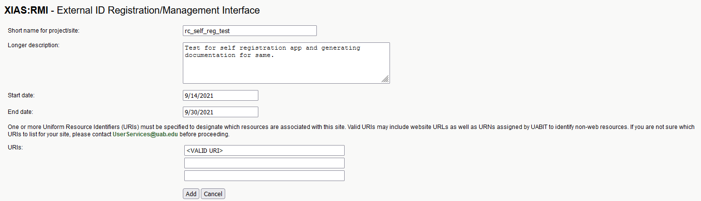

# Sponsor — Creating and Managing XIAS Sites





XIAS Sites tie external collaborators to specific technology resources at UAB through uniform resource identifiers (URIs). Connecting people to the resources they use enables UAB to maintain security and accountability.

## What Do I Need Before Starting?

Before starting, you'll need the following prerequisites.

- An [RCS Account](../rcs/index.md).
- A list of RCS resources each Guest needs access to.

## Where Will I Be Working?

- [XIAS Manage Projects/Sites page](https://idm.uab.edu/cgi-cas/xrmi/sites)

## How Do I Create a XIAS Site?

Creating a Site is the first phase of sponsoring access for external collaborators. Sites are reusable, and can be configured one time and used for multiple Guests. You can also make one site for each individual resource, and assign each Guest to multiple sites, giving you more flexibility over assignment.

1. Login to the [XIAS Manage Projects/Sites page](https://idm.uab.edu/cgi-cas/xrmi/sites).

    

1. Click New to open a form for creating a new Project/Site.

    

1. Fill in the form. All fields are required.

    1. **Short name for project/site**: (Required) A compact, memorable name for your Site.
    1. **Longer description**: (Required) A complete, concise description of the Site and its resources.
    1. **Start date**: (Required) The start date of the Site. Can be today.
    1. **End date**: (Required) An expiration date for the Site.

        <!-- markdownlint-disable MD046 -->
        !!! warning

            XIAS accounts associated with this Site may lose access to resources after the end date.
        <!-- markdownlint-enable MD046 -->

    1. **URIs**: (Required) One or more uniform resource identifiers (URIs) associated with the Site.

        Resource identifiers associated with RCS resources.

        {{ read_csv("account/xias/_res/rcs_uri.csv") }}

        <!-- markdownlint-disable MD046 -->
        !!! tip

            If you aren't sure which URI to use for an RCS resource, please [Contact Support](../../help/support.md).

            For other UAB resources, please contact <UserServices@uab.edu>.
        <!-- markdownlint-enable MD046 -->

    Below is an example of a filled in form.

    

1. Click Add to submit the form. You should be taken to a page summarizing the created Project/Site.

    

### Next Steps

To continue creating a XIAS account, move to [2. Sponsor — Manage Users](./2_sponsor_manage_users.md).

## How Do I Manage a XIAS Site?

Login to the [XIAS Manage Projects/Sites page](https://idm.uab.edu/cgi-cas/xrmi/sites). You will see a table of existing Sites.

- To view a Site, click the View button next to the desired Site. You will see a read-only view of the Site's configuration.
- To edit a Site, click the Edit button next to the desired Site. You will be able to change Sites steps created in [Creating a XIAS Site](#how-do-i-create-a-xias-site).
- Click the User button to be taken to the Manage Users page. The page will show a table of Users associated with the selected Site. See [How Do I Manage a Xias User](./2_sponsor_manage_users.md#how-do-i-manage-a-xias-user).


