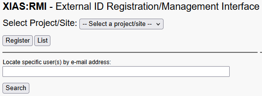
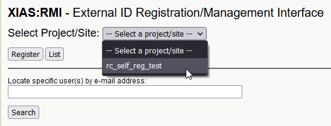
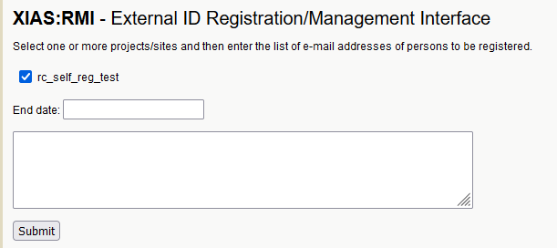
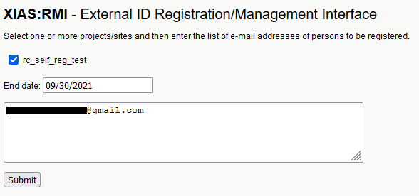
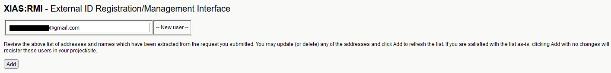
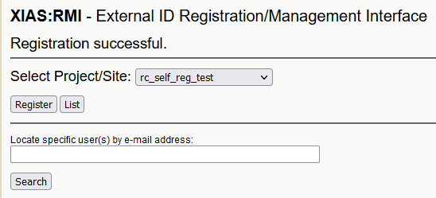
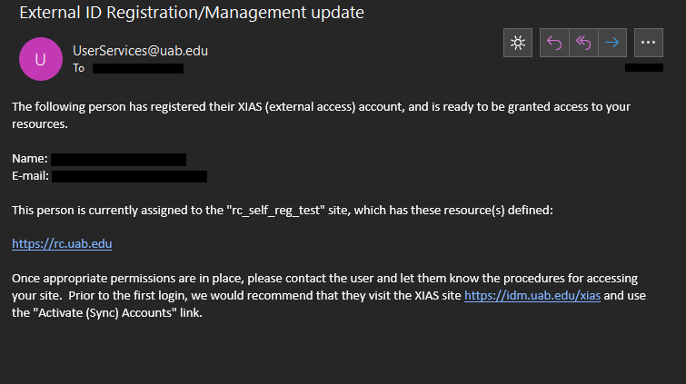
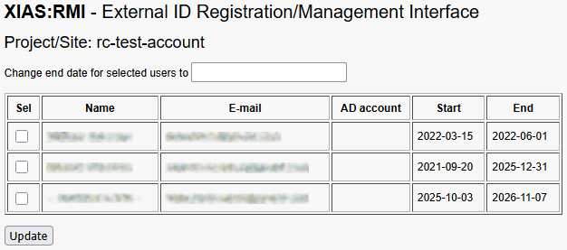

# Sponsor — Creating and Managing XIAS Users





XIAS Users tie external collaborators to UAB's Identity Management (IDM) system. Creating a XIAS User means an external collaborator will be able to use Single Sign-on (SSO) to login to UAB technology resources.

## What Do I Need Before Starting?

Before starting, you'll need the following prerequisites.

- A [Research Computing System (RCS) Account](../rcs/index.md).
- At least one configured [XIAS Site](./1_sponsor_manage_sites.md).
- The email address each Guest wants to register with.

## Where Will I Be Working?

- [XIAS "Manage Users" page](https://idm.uab.edu/cgi-cas/xrmi/users)

## How Do I Create a XIAS User?

Creating a User is the second phase of sponsoring access for external collaborators. Each User may be assigned to multiple Sites, but at least one Site must exist to create a User.

1. Login to the [XIAS "Manage Users" page](https://idm.uab.edu/cgi-cas/xrmi/users).

    

1. In the Select Project/Site drop down menu, select the Site you want to add Users to.

    

1. Click Register. You should be taken to a form.

    

1. Fill in the form. The Site you selected in the previous step should be listed with a checked checkbox.

    1. **Site Checkboxes**: (Required) Leave the Site you selected checked. You may check additional Sites if appropriate. At least one Site must be checked.
    1. **End date** (Required) An expiration date for the User's association to the Site. Can be today. Cannot be later than the Site's end date.
    1. **Text box** (Required) Enter a list of email addresses of Users to add to the Site. One email address per line.

    

1. Click Submit. You should be taken to a page requesting your confirmation the email addresses you entered are correct.

    

1. If the email addresses are not correct, make any necessary corrections.
1. When you are satisfied, click Add. Emails will be automatically sent by the XIAS system to all added email addresses. You should be taken to the XIAS User Management Webpage. You should see the text "Registration successful" near the top of the page.

    

## Next Steps

The next steps will be done by the XIAS Users you've created. Please direct them to [3. Guest — Create XIAS Account](./3_guest_create_xias_account.md).

When they have completed account creation, you should receive an email from `UserServices@uab.edu` like the following.

## How Do I Manage a XIAS User?



<!-- markdownlint-disable MD046 -->
!!! info

    There is currently no way to remove a User from a Site using the XIAS Manage Users page. Instead update their end date to a date after the start date and before today.

    If you must remove the user completely, please contact <askit@uab.edu>.
<!-- markdownlint-enable MD046 -->

Login to the [XIAS "Manage Users" page](https://idm.uab.edu/cgi-cas/xrmi/users).

### How Do I Update User End Dates?

1. In the Select Project/Site drop down menu, select the Site whose users you want to View.

    

1. Click List. The page should update. You should see a table of Users at the top of the page.

    

1. Enter a new end date into the "Change end date for selected users to" field.
1. Check the checkboxes in the rows of Users whose end dates you want to update.
1. Click Update. The page should update. You should see the new end dates shown immediately.

<!-- markdownlint-disable MD046 -->
!!! tip

    You can also search for Users by email address using the "Locate specific user(s) by e-mail address" field.
<!-- markdownlint-enable MD046 -->


