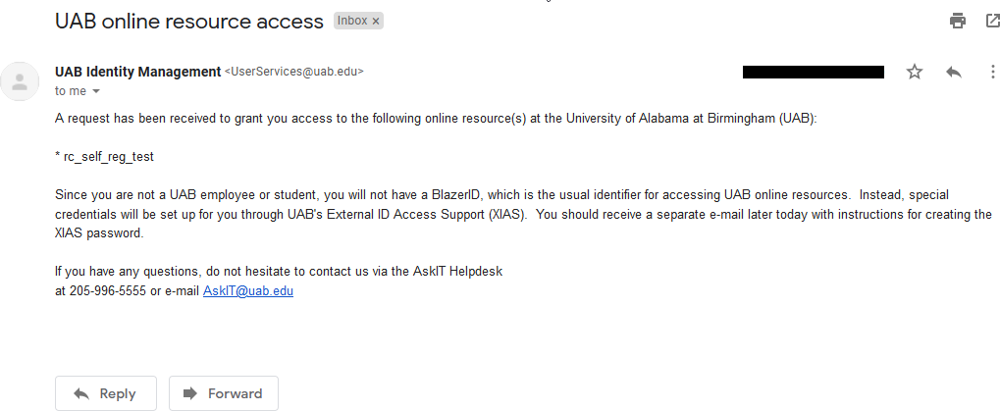
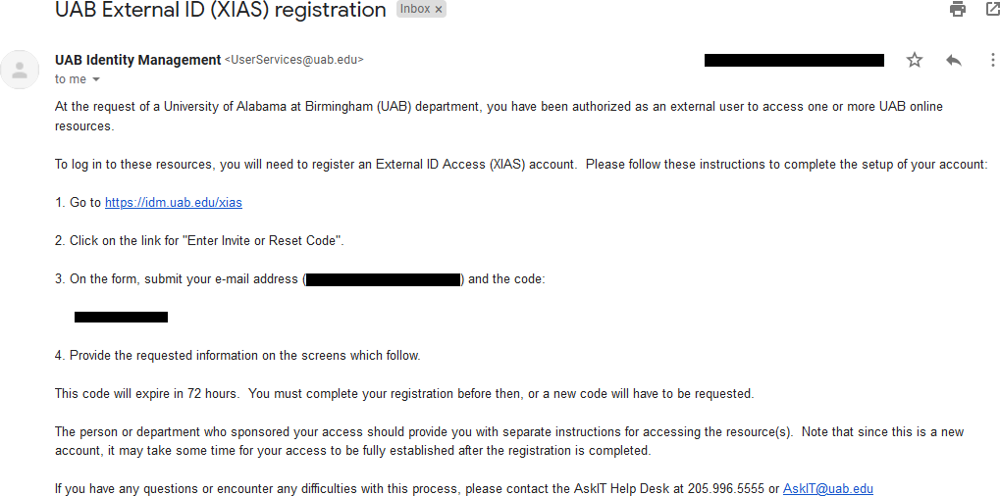
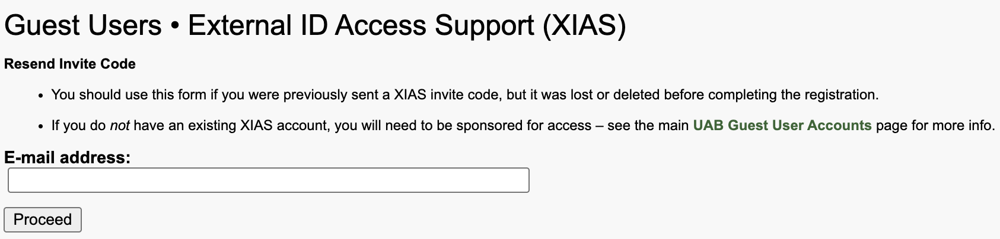
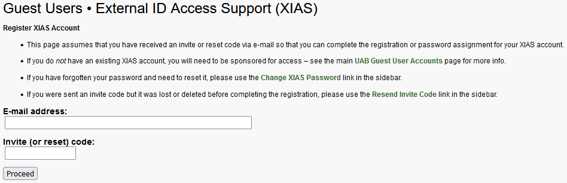
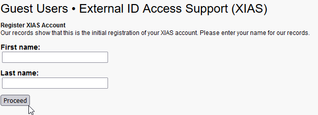
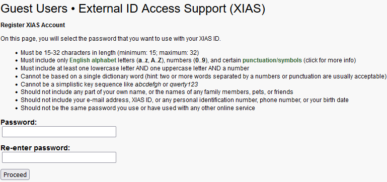
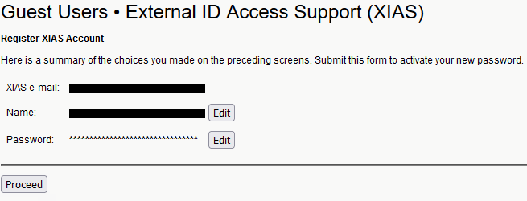
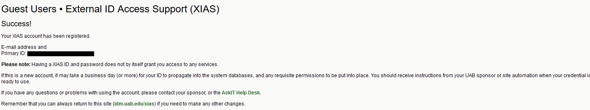

# Guest - Creating a XIAS Account

These instructions are for guests who have been registered by UAB faculty and staff to use internal UAB resources. Once a request for a XIAS account has been made by your UAB sponsor, you will need to follow these instructions to complete the XIAS registration and obtain access to UAB resources. All of the links used on this page are available at the [UAB XIAS Guest Users](https://apps.idm.uab.edu/xias/top) page.

## What Do I Need Before Starting?

Before starting, you'll need the following prerequisites.

- A XIAS Sponsor who has completed the [Sponsor phases](./index.md) of XIAS account creation.
- Access to the email address you gave your Sponsor.

## How Do I Create a XIAS Account?

1. After your Sponsor completes their phases, you should receive your first email from `UserServices@uab.edu` (UAB Identity Management). This email may take a few minutes to arrive. The image below shows an example of this email. A second email will be sent later with additional instructions.

    

    <!-- markdownlint-disable MD046 -->
    ??? note "Contents of the first email from UAB Identity Management"

        > Subject: UAB online resource access
        >
        > From: UAB Identity Management `<UserServices@uab.edu>`
        >
        > A request has been received to grant you access to the following inline resource(s) at the University of Alabama at Birmingham (UAB):
        >
        > List of XIAS Sites
        >
        > Since you are not a UAB employee or student, you will not have a BlazerID, which is the usual identifier for accessing UAB online resources. Instead, special credentials will be set up for you through UAB's External ID Access Support (XIAS). You should receive a separate e-mail later today with instructions for creating the XIAS password.
        >
        > If you have any questions, do not hesitate to contact us via the AskIT Helpdesk at 205-996-5555 or e-mail `AskIT@uab.edu`.
    <!-- markdownlint-enable MD046 -->

1. You should receive a second email from `UserServices@uab.edu`(UAB Identity Management) within approximately one hour. This email will contain a code that you will need to use later. An example of this email is shown in the image below.

    

    <!-- markdownlint-disable MD046 -->
    ??? note "Contents of the second email from UAB Identity Management"

        > Subject: UAB External ID (XIAS) registration
        >
        > From: UAB Identity Management `<UserServices@uab.edu>`
        >
        > At the request of a University of Alabama at Birmingham (UAB) department, you have been authorized as an external user to access one or more UAB online resources.
        >
        > To log in to these resources, you will need to register an External ID Access (XIAS) account. Please follow these instructions to complete the setup of your account.
        >
        > 1. Go to `https://idm.uab.edu/xias`
        > 1. Click on the link for "Enter Invite or Reset Code".
        > 1. On the form, submit your e-mail address (`name@domain.tld`) and the code:
        >
        >     `code here`
        >
        > 1. Provide the requested information on the screens which follow.
        >
        > This code will expire in 72 hours. You must complete your registration before then, or a new code will have to be requested.
        >
        > The person or department who sponsored your access should provide you with separate instructions for accessing the resource(s). Note that since this is a new account, it may take some time for your access to be fully established after the registration is completed.
        >
        > If you have any questions or encounter any difficulties with this process, please contact the AskIT Help Desk at 205.996.5555 or `AskIT@uab.edu`.
    <!-- markdownlint-enable MD046 -->

    <!-- markdownlint-disable MD046 -->
    !!! danger

        Never click links in emails! Phishing emails target people who click links in emails. Read more about [UAB IT Security Awareness](https://www.uab.edu/it/home/security/awareness).
    <!-- markdownlint-enable MD046 -->

    If you did not receive this email, or are missing the code, please visit <https://apps.idm.uab.edu/xias/top> and click "Resend Invite Code" from the left-hand navigation menu. If this still does not work, please contact <AskIT@uab.edu> for assistance.

1. Use your browser to navigate to the link in the email, or click the following link <https://apps.idm.uab.edu/xias/top>. This will take you to the UAB Guest User Account (XIAS) page. An example of this page is shown in the image below.

    

1. Click the "Enter Invite or Reset Code" link in the left-hand navigation menu. On the right side of the page, under "Register XIAS Account", complete the form:

    - In the E-mail address field, enter the email address you provided to your Sponsor.

    - In the Invite (or reset) code field, enter the code you received in the second email.

    

1. Click Proceed. On the next form, under "Register XIAS Account" form contains text fields labeled 'First Name' and 'Last Name'. Type your first and last name in the corresponding fields.

    

1. Click Proceed. You will be taken to a third, final form. Enter a password in the text field labeled 'Password' following the requirements on the page, then type the same password in the text field labeled 'Re-enter password'.

    

1. Click Proceed. You will be taken to a confirmation page showing the XIAS e-mail, Name, and Password you entered. These fields are read-only. If you are not satisfied, click the Edit button next to the Name or Password field to make changes.

    

1. When you are satisfied, click Proceed. You will be taken to a success page showing a confirmation that your XIAS account has been updated, along with your e-mail address and Primary ID. Please read the information carefully and follow any instructions provided.

    .

## Next Steps

From here, you may create an [RCS Account](../rcs/index.md).

All RCS services require two-factor authentication (2FA) and some require UAB Campus Network VPN access.





## How Do I Manage My XIAS Account?

To manage your XIAS account, visit the [XIAS Guest Users page](https://apps.idm.uab.edu/xias/top). You can take the following actions to manage your XIAS account.

<!-- markdownlint-disable MD046 -->
!!! important

    XIAS accounts are different from RCS accounts. Managing one does not change the other.
<!-- markdownlint-enable MD046 -->


