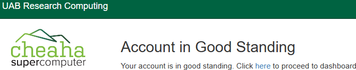
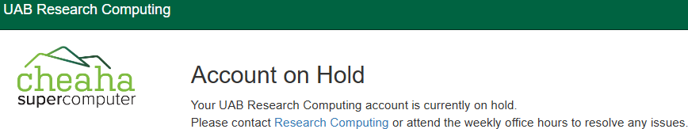

# Cheaha Account Management

These instructions are intended to guide researchers on creating new accounts and managing existing accounts.

## Creating a New Account

Creating a new account is a simple, automated, self-service process. To start, navigate to <https://rc.uab.edu>, our [Open OnDemand](../../cheaha/open_ondemand/index.md) web portal, and authenticate. The authentication process differs depending on your affiliation. Accounts are available to researchers with the following situations.

- If you are affiliated with UAB and have a BlazerID, please authenticate using Single Sign-On (SSO).
- If you are affiliated with UAB Medicine, you will need to use your BlazerID to authenticate via Single Sign-On (SSO) instead of your UABMC authentication process.
- If you are an external collaborator and have a XIAS account with access to Cheaha, please authenticate using your XIAS email address as the ID, not automatically generated `xias-XXXXXX-1` ID.
- If you are an external collaborator and do not have a XIAS account, you will need a UAB-affiliated sponsor and will need to follow our [XIAS Guest Account Instructions](../xias/guest_instructions.md). Your sponsor will need to follow our [XIAS Site Management](../xias/pi_site_management.md) and [XIAS Guest Management](../xias/pi_guest_management.md) documentation pages.

Once you have authenticated, you should see a page that looks like the following.

The form should be prefilled with your BlazerID or XIAS ID, full name, and email address. If any of these details are incorrect please [Contact Support](../../help/support.md). Please also fill out the reason you wish to create an account. To create a Cheaha account, you must check both boxes affirming your acceptance of relevant UAB IT policies. Until both boxes are checked, the "Create Account" button will not be usable.

When you are ready, click "Create Account" to start the account creation process. You should see a popup notification that looks like the following. After a few moments you should be redirected to our [Open OnDemand](../../cheaha/open_ondemand/index.md) web portal. If not, please [Contact Support](../../help/support.md).

Welcome to Cheaha and to Research Computing!

## Managing an Existing Account

If you already have an account and wish to check it's status, please visit your account status page at <https://rc.uab.edu/account>.

### Account in Good Standing

If your account is in good standing you should see a page like the following.

### Account Requires Certification

We review accounts periodically to ensure the system is being used fairly and as intended. Part of this process is to certify that researchers with accounts still wish to make use of Cheaha. Once per year every researcher will be required to certify their account before making use of Cheaha. If your account requires certification, when logging in to our [Open OnDemand](../../cheaha/open_ondemand/index.md) web portal you will see the following notification page.

.

To certify your account, click the button to be taken to the certification form, which should look like the following.

While the certification form looks similar to the new account creation form, please be sure to review all of the information carefully. To certify your account, you must check both boxes affirming your acceptance of relevant UAB IT policies. Until both boxes are checked, the "Create Account" button will not be usable.

When you are ready, click "Certify Account" to start the account creation process. You should see a popup notification confirming the process is working. After a few moments your account should be certified and you will be free to use Cheaha again. If not, please [Contact Support](../../help/support.md).

### Account on Hold

Mistakes happen, and sometimes what we thought we programmed wasn't quite what we actually programmed. When these kinds of mistakes occur, excess resources may get used. If this impacts performance or other users excessively, we may put a hold on your account. We may also put a hold on your account if you do not complete [Account Certification](#account-requires-certification) when required.

Other reasons for holds include, but are not limited to:

- Misuse (intentional or not) of Research Computing resources
- [IT Policy](https://www.uab.edu/it/home/policies) violations
- [HIPAA](https://www.uab.edu/it/home/policies/compliance/hipaa) or [FERPA](https://www.uab.edu/registrar/ferpa) violations related to use of Cheaha
- As part of a required investigation

In rare circumstances, we may also place a hold on your account if you possess the sole copy of data not owned by you.

If your account is on hold, you will see a page like the following.

If you SSH into the cluster while your account is on hold you will see the following text in your terminal.

If your account is on hold and we have not already contacted you, or you believe the hold to be in error, please [Contact Support](../../help/support.md).

### Authorization Error

Periodically, we review all researcher accounts to ensure they are authorized to use Cheaha based on affiliation status. If we find a researcher is no longer affiliated with UAB, we may disable the account. If you are not authorized to use Cheaha, you will see a page like the following.

If you believe this to be in error, please [Contact Support](../../help/support.md).
