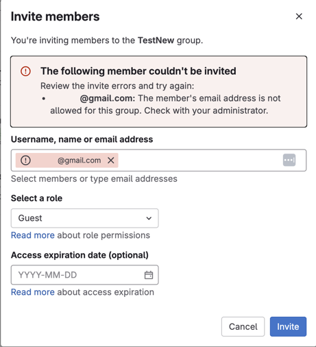

# UAB GitLab Overview and Registration

Welcome to UAB GitLab! This is a UAB-specific [GitLab](https://about.gitlab.com/). GitLab is similar to [GitHub](https://github.com/), but hosted here at UAB on secure servers.

## GitLab Use Cases

### For Researchers

GitLab can be used:

- For reproducibility
    - Analysis and software code can be kept in one, central repository everyone can use instead of spread across multiple computers/places.
    - Code can be versioned and tracked as it changes over time.
    - Software versions can be recorded, virtual environments can be documented, and containers can be recorded to help future-proof analyses.
- Collaboration
    - GitLab is a central place to create code, edit, and track needed code changes (issues) with your lab and collaborators.
    - Multiple people can use, modify, and merge changes in code while communicating with the broader team all along the way.
- Security
    - Unlimited private repositories for internal code projects.
    - Set behind UAB authentication.

### For Software Developers (and Researchers!)

UAB GitLab is useful for software developers. It is a single application for the entire software development lifecycle. From project planning and source code management to continuous integration (CI) and continuous deployment (CD), monitoring, and security.

Our GitLab instance may be found at <https://gitlab.rc.uab.edu>.

## UAB GitLab Registration

### UAB-Affiliated Researcher Registration

If you are a UAB affiliated researcher and have a BlazerID, you may create an account by logging in at the site above using the `ldap` tab. Please use your single sign-on (SSO) credentials.

<!-- markdownlint-disable MD046 -->
!!! note "Please use BlazerID and password instead of UABMC credentials"

    Please use your BlazerID and BlazerID password for UAB GitLab. UABMC credentials are a different sign in system and will likely not work. Central IT groups like Research Computing do not have a way to access UABMC credentials.
<!-- markdownlint-enable MD046 -->

## UABMC Researcher Registration

Please use your BlazerID and BlazerID credentials to sign in following the directions for UAB-Affiliated Researchers. UABMC credentials should not be used for UAB GitLab.

## XIAS External Collaborator Registration

If you are a collaborator with a XIAS account you'll need to follow a different procedure.

1. Ensure that your sponsor has included `https://gitlab.rc.uab.edu` in the list of approved URIs on the XIAS configuration page.
1. Email <mailto:support@listserv.uab.edu> providing your full name, XIAS account email address, and sponsor.
1. UAB Research Computing will create the account.
1. You will recieve an email from gitlab.rc.uab.edu with a link to create a password.
1. Navigate to <https://gitlab.rc.uab.edu>.
1. Click the `Standard` tab.
1. In the `Username or email` field type the part of your XIAS email address before the `@` symbol. Do not include the `@` symbol or anything after it.
1. Fill out the `Password` field with the GitLab password you created in Step #4.
1. Click `Sign in`.

<!-- markdownlint-disable MD046 -->
!!! warning

    XIAS account researchers can only be granted access if their sponsor adds the GitLab URL to the list of approved URIs. Please see [XIAS Sites](./xias/pi_site_management.md) for more information.
<!-- markdownlint-enable MD046 -->

## UAB GitLab Roles and User Permissions

Managing roles and user permissions within GitLab is essential for maintaining control over repositories and collaboration. Within UAB Research Computing's GitLab instance, a user (Owner) can assign and update user roles in a group. There are several roles for users within GitLab, and these roles determine the level of permissions a user will have within a Group or project. The available default roles within a project are;

1. Guest
1. Reporter
1. Developer
1. Maintainer
1. Owner

For example, a user assigned the "Guest" role has the least permissions, and the "Owner" has the most permissions. This table summarizes key features and permissions per user role in a Group.

| S.N. | Permission Description                   | Guest | Reporter | Developer | Maintainer | Owner |
|------|-------------------------------------------|--------|----------|-----------|------------|--------|
| 1    | Creates a new issue                       | ✔️     | ✔️       | ✔️        | ✔️         | ✔️     |
| 2    | Can leave comments                        | ✔️     | ✔️       | ✔️        | ✔️         | ✔️     |
| 3    | Able to write on project wall             | ✔️     | ✔️       | ✔️        | ✔️         | ✔️     |
| 4    | Able to pull project code                 | -      | ✔️       | ✔️        | ✔️         | ✔️     |
| 5    | Can download project                      | -      | ✔️       | ✔️        | ✔️         | ✔️     |
| 6    | Able to write code snippets               | -      | ✔️       | ✔️        | ✔️         | ✔️     |
| 7    | Create new merge request                  | -      | -        | ✔️        | ✔️         | ✔️     |
| 8    | Create new branch                         | -      | -        | ✔️        | ✔️         | ✔️     |
| 9    | Push and remove non-protected branches    | -      | -        | ✔️        | ✔️         | ✔️     |
| 10   | Includes tags                             | -      | -        | ✔️        | ✔️         | ✔️     |
| 11   | Can create, edit, delete milestones       | -      | -        | ✔️        | ✔️         | ✔️     |
| 12   | Can create or update commit status        | -      | -        | ✔️        | ✔️         | ✔️     |
| 13   | Write a wiki                              | -      | -        | ✔️        | ✔️         | ✔️     |
| 14   | Create new environments                   | -      | -        | ✔️        | ✔️         | ✔️     |
| 15   | Cancel and retry the jobs                 | -      | -        | ✔️        | ✔️         | ✔️     |
| 16   | Updates and removes registry image        | -      | -        | ✔️        | ✔️         | ✔️     |
| 17   | Can add new team members                  | -      | -        | -         | ✔️         | ✔️     |
| 18   | Push and remove protected branches        | -      | -        | -         | ✔️         | ✔️     |
| 19   | Can edit the project                      | -      | -        | -         | ✔️         | ✔️     |
| 20   | Manage runners, triggers, and variables   | -      | -        | -         | ✔️         | ✔️     |
| 21   | Add deploy keys to project                | -      | -        | -         | ✔️         | ✔️     |
| 22   | Able to manage clusters                   | -      | -        | -         | ✔️         | ✔️     |
| 23   | Configure project hooks                   | -      | -        | -         | ✔️         | ✔️     |
| 24   | Enable/disable branch protection          | -      | -        | -         | ✔️         | ✔️     |
| 25   | Rewrite or remove Git tags                | -      | -        | -         | ✔️         | ✔️     |
| 26   | Add users, change user roles              | -      | -        | -         | -          | ✔️     |

For a complete list of permissions each role can perform, please see [GitLab documentation for user permissions](https://docs.gitlab.com/user/permissions/). In the [Assign a User's GitLab Role](#assign-a-users-gitlab-role) section, you will see a guide to create, and assign user roles within your GitLab project.

### Assign a User's GitLab Role

For UAB's GitLab instance, only a user with the role "Owner" can assign or change a GitLab role for a user. For a User to be added to a Group, they would need to have a UAB GitLab account, see instructions [here](#uab-affiliated-researcher-registration) for setting one up. The following instructions are to guide you in creating a group and/or assigning user roles as a group owner.

#### Creating a Group on UAB's GitLab Instance

1. Log in to the UAB Research Computing GitLab instance [here](https://gitlab.rc.uab.edu/users/sign_in) using your UAB Credentials.

    

1. Click on the "Groups" menu option.

    

1. Select "New group".

    

1. Now select the "Create group" option. You may select the "Import group" option, if you already have projects and their associated data from a different GitLab instance ready. For this guide, we are assuming this is not the case, and you are setting up a new Group.

    

1. Fill out the form to create your group, make sure to include a name, and appropriate "Visibility level". There are three (3) levels for visibility, pick the option meeting your needs. Click on the "Create group" option, and this completes the Group creation process.

    

1. Now that your group has been created, we can now add users with varying roles that grant different user permissions.

    

#### Add and Assign User Roles

1. Click on the Group, you have owner permissions to. From within your group, click on the "Manage" pane located to the left of your Group. And then click on "Invite members". If you are already part of another Group, dependent on the permissions you have in those Groups, you may be able to add all members of a Group with the "Invite a group" option, but for this guide, we are focusing on the "Invite members" option.

    

1. The "Invite members" option, would open up to a mini window that shows an interface to invite members with their "Username, name or email address", an option to "Select a role", an option that allows you to set "Access expiration date" for a user, and the "Invite" button.

    

    The option "Select a role" is where you select what kind of role, you want the listed user(s) to have. Please refer to this section to see what each user role has permissions to do within your Group.

    

    <!-- markdownlint-disable MD046 -->
    !!! note

        You can only add uab.edu entities or domain emails to GitLab, you will get an error like in the image below if you do otherwise. Please see our section on [UAB GitLab Registration](#uab-gitlab-registration) to address adding external collaborators before attempting the prior steps.

    
    <!-- markdownlint-enable MD046 -->

1. Now you can see a list of Group members, showing their "Account" i.e. their Name and BlazerID, their "Source" i.e. how they joined the group, their "Role" i.e. level of permission within your Group, and Expiration i.e. how long they will have access to the group, unless this is changed, the default option is for a user to have access indefinitely. In this guide, one of the user's has an expiration of `2025-04-14`, after this date the user will no longer have access to your Group. In the last column we have "Activity" i.e. additional metadata for the user.

    

    You can also remove a user from your Group, by clicking on the "More actions" button, the three (3) vertical lines to the right of an Account, and click the "Remove member" option.

1. You can also change or update a user's role, by selecting one of the other options provided under the "Role" column for an Account. This converts the user's role within the Group.

    
