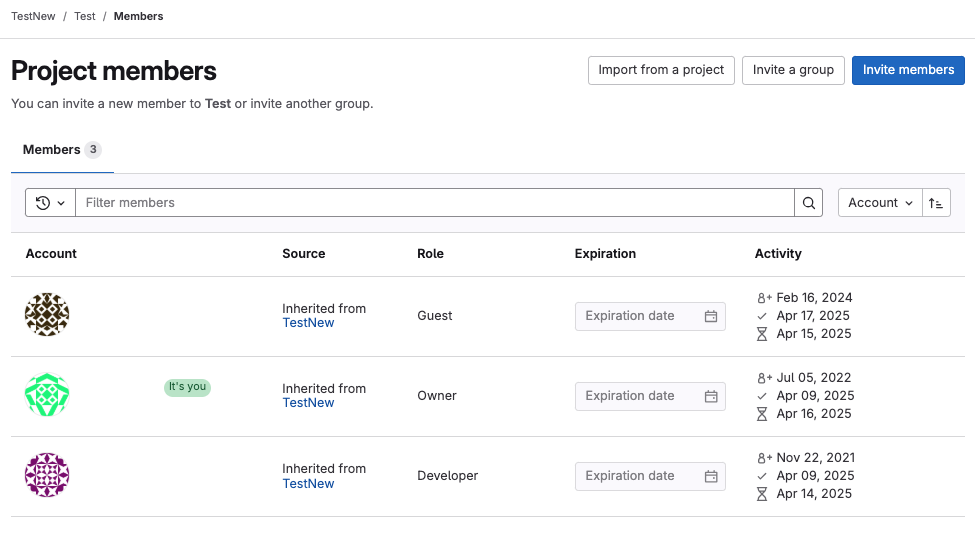

# UAB GitLab Overview and Registration

Welcome to UAB GitLab! This is a UAB-specific [GitLab](https://about.gitlab.com/). GitLab is similar to [GitHub](https://github.com/), but hosted here at UAB on secure servers.

## GitLab Use Cases

### For Researchers

GitLab can be used:

- For reproducibility
    - Analysis and software code can be kept in one, central repository everyone can use instead of spread across multiple computers/places.
    - Code can be versioned and tracked as it changes over time.
    - Software versions can be recorded, virtual environments can be documented, and containers can be recorded to help future-proof analyses.
- Collaboration
    - GitLab is a central place to create code, edit, and track needed code changes (issues) with your lab and collaborators.
    - Multiple people can use, modify, and merge changes in code while communicating with the broader team all along the way.
- Security
    - Unlimited private repositories for internal code projects.
    - Set behind UAB authentication.

### For Software Developers (And Researchers!)

UAB GitLab is useful for software developers. It is a single application for the entire software development lifecycle. From project planning and source code management to continuous integration (CI) and continuous deployment (CD), monitoring, and security.

Our on-premises GitLab instance may be found at <https://code.rc.uab.edu>.

## UAB GitLab Registration

### UAB-Affiliated Researcher Registration

If you are a UAB affiliated researcher and have a BlazerID, you may create an account by logging in at the site above using the `ldap` tab. Please use your single sign-on (SSO) credentials.

<!-- markdownlint-disable MD046 -->
!!! note "Please use BlazerID and password instead of UABMC credentials"

    Please use your BlazerID and BlazerID password for UAB GitLab. UABMC credentials are a different sign in system and will likely not work. Central IT groups like Research Computing do not have a way to access UABMC credentials.
<!-- markdownlint-enable MD046 -->

## UABMC Researcher Registration

Please use your BlazerID and BlazerID credentials to sign in following the directions for UAB-Affiliated Researchers. UABMC credentials should not be used for UAB GitLab.

## XIAS External Collaborator Registration

If you are a collaborator with a XIAS account you'll need to follow a different procedure.

1. Ensure that your sponsor has included `https://code.rc.uab.edu` in the list of approved URIs on the XIAS configuration page.
1. Email <support@listserv.uab.edu> providing your full name, XIAS account email address, and sponsor.
1. UAB Research Computing will create the account.
1. You will recieve an email from `code.rc.uab.edu` with a link to create a password.
1. Navigate to <https://code.rc.uab.edu>.
1. Click the `Standard` tab.
1. In the `Username or email` field type the part of your XIAS email address before the `@` symbol. Do not include the `@` symbol or anything after it.
1. Fill out the `Password` field with the GitLab password you created in Step #4.
1. Click `Sign in`.

<!-- markdownlint-disable MD046 -->
!!! warning

    XIAS account researchers can only be granted access if their sponsor adds the GitLab URL to the list of approved URIs. Please see [XIAS Sites](./xias/pi_site_management.md) for more information.
<!-- markdownlint-enable MD046 -->

## UAB GitLab Roles and User Permissions

Managing roles and user permissions within GitLab is essential for maintaining control over repositories and collaboration. Within UAB Research Computing's GitLab instance, a user (Owner) can assign and update user roles in a group. There are several roles for users within GitLab, and these roles determine the level of permissions a user will have within a Group or project. In GitLab, permissions are organized in a hierarchical group/project tree structure. At the top is a Group, which can contain subgroups and individual projects. This structure makes permission control easy to manage. Groups can represent schools, faculty, departments, labs or cores, while projects hold the actual code, issues, and CI/CD configurations for grants and research they administer.

The available default roles within a group/project are listed in the table;

{{ read_csv('account_management/res/gitlab_roles.csv', keep_default_na=False) }}

A user assigned the "Guest" role has the least permissions, and the "Owner" has the most permissions. The table summarizes key features and permissions per user role in a Group/Project. For a complete list of permissions each role can perform, please see [GitLab documentation for user permissions](https://docs.gitlab.com/user/permissions/). In the section [Assigning a User's GitLab Role](#assigning-a-users-gitlab-role), you will see a guide to create, and assign user roles within your GitLab project.

## Why Groups and Projects Are Important

With UAB GitLab’s instance of Group and Project structure, we offer a powerful way to mirror how your research lab or programs are structured. When we consider the organizational setup at UAB, where a Core oversees several specialized Labs. Each lab is led by a different PI, researcher or department. Within each Lab, multiple projects are being run, possibly by different teams, postdocs, or students. GitLab’s inheritance Group to Project model, shows Groups can contain subgroups and projects, making it possible to organize this exact structure digitally (Core->Lab/Department->Projects). The Core entity at UAB can be represented as a top-level group, each Lab as a subgroup, and individual projects (e.g., datasets, analysis pipelines, or software tools) as repositories within those subgroups.

This structure helps to maintain a clear navigation system, it also ensures efficient role and permission management. The Core can assign high-level oversight roles at the Group level, while Labs can manage their own subgroups independently. Developers and researchers can be granted access only to the projects they work on, without exposing unrelated projects or sensitive data they should not have access to, adhering to the principle of least privilege. Combined with GitLab’s role inheritance and ability to override roles at lower levels, this design promotes scalability, security, and accountability, while supporting collaborative research across a complex institutional environment like UAB.

## Assigning a User's GitLab Role

For UAB's GitLab instance, only a user with the role "Owner" can assign or change a GitLab role for a user across "Projects" or "Groups". Whereas, a "Maintainer" has project-level privileges and can only manage users that are part of a "Project" within a "Group", the "Owner" has group-wide privileges that extend to the "Projects" under their "Group". Remember, for a User to be added to a Group, they would need to have a UAB GitLab account set up. Please see the [UAB Affiliated Researcher Registration](#uab-affiliated-researcher-registration) page for setting one up.

The following instructions are to guide you in creating a group and/or assigning user roles as a group owner.

### Creating a Group in UAB's GitLab Instance

1. Log in to the [UAB Research Computing GitLab instance](https://code.rc.uab.edu/users/sign_in) using your UAB Credentials.

    

1. Click on the "Groups" menu option.

    

1. Select "New group".

    

1. Now select the "Create group" option. You may select the "Import group" option, if you already have projects and their associated data from a different GitLab instance ready. For this guide, we are assuming this is not the case, and you are setting up a new Group.

    

1. Fill out the form to create your group, make sure to include a name, and appropriate "Visibility level". There are three (3) levels for visibility, pick the option meeting your needs. Click on the "Create group" option, and this completes the Group creation process.

    

    <!-- markdownlint-disable MD046 -->
    !!! note

        GitLab allows you to define Group visibility using "Public", "Internal", or "Private" settings. A public Group is visible to and can be cloned by anyone, even without a GitLab account. An internal Group is visible to any authenticated UAB GitLab user, but access to contribute is still controlled by roles. A private Group is only visible and accessible to users who have been explicitly granted access. These settings work in tandem with permissions to control both who sees what and what they can do in a Group. See [GitLab documentation](https://docs.gitlab.com/user/public_access/) for more information.
    <!-- markdownlint-enable MD046 -->

1. Now that your group has been created, we can [add users with varying roles](#add-and-assign-user-roles-within-a-group-or-project) that grant different user permissions.

    

### Creating a Project in UAB's GitLab Instance

As a Maintainer or Owner you can create Projects from within a Group. Steps 1 and 2 are same as the instructions for [Creating a Group](#creating-a-group-in-uabs-gitlab-instance), there is a slight deviation at the third step.

1. Log in to the [UAB Research Computing GitLab instance](https://code.rc.uab.edu/users/sign_in) using your UAB Credentials.

    

1. Click on the "Groups" menu option. And select the appropriate Group.

    

1. From within the group, Select "New project".

    

1. Now select from one of the options to create new project, in this example we use the "Create blank project" option. You may select the "Import project" option, or "Create from template" option. For this guide, we are assuming this is not the case, and you are setting up a new Project.

    

1. Fill out the form to create your Project, make sure to include a name, and appropriate "Visibility level". There are three (3) levels for visibility, pick the option meeting your needs. Click on the "Create project" option, and this completes the Project creation process.

    

    <!-- markdownlint-disable MD046 -->
    !!! note

        GitLab allows you to define project visibility using "Public", "Internal", or "Private" settings like in a group. A public project is visible to and can be cloned by anyone, even without a GitLab account. An internal project is visible to any authenticated UAB GitLab user, but access to contribute is still controlled by roles. A private project is only visible and accessible to users who have been explicitly granted access. These settings work in tandem with role-based permissions that control who can see what and what they can do in a project. See [GitLab documentation](https://docs.gitlab.com/user/public_access/) for more information.
    <!-- markdownlint-enable MD046 -->

1. Now that your project has been created, we can [add users with varying roles](#add-and-assign-user-roles-within-a-group-or-project) that grant different user permissions. To see members in your project, select the "Manage" option  and then select the "Members" option. This will take you to the list of members who are part of that project.

    

### Add and Assign User Roles Within a Group or Project

1. Click on the Group/Project, you have requisite permissions to (Owner for Groups, Owner or Maintainer for Projects). From within your Group/Project, click on the "Manage" pane located to the left of your Group/Project. And then click on "Invite members". If you are already part of another Group, dependent on the permissions you have in those Groups, you may be able to add all members of a Group with the "Invite a group" option, but for this guide, we are focusing on the "Invite members" option.

    

    <!-- markdownlint-disable MD046 -->
    !!! note

        Please note, GitLab follows a "Group to Project" inheritance model, where a user added to a Group, would inherit that same role, when a new Project is created unless that role is changed. For instance, a user maybe assigned a Guest role at the Group level, but may have a higher role assigned at the project level.
    <!-- markdownlint-enable MD046 -->

1. The "Invite members" option, would open up to a mini window that shows an interface to invite members with their "Username, name or email address", an option to "Select a role", an option that allows you to set "Access expiration date" for a user, and the "Invite" button.

    

    The option "Select a role" is where you select what kind of role, you want the listed user(s) to have. Please refer to this [section](#uab-gitlab-roles-and-user-permissions) to see what each user role has permissions to do within your Group/Project.

    

    <!-- markdownlint-disable MD046 -->
    !!! note

        You can only add uab.edu entities or domain emails to GitLab, you will get an error like in the image below if you do otherwise. Please see our section on [UAB GitLab Registration](#uab-gitlab-registration) to address adding external collaborators before attempting the prior steps.

    
    <!-- markdownlint-enable MD046 -->

1. Now you can see a list of Group/Project members, showing their "Account" i.e. their Name and BlazerID, their "Source" i.e. how they joined the group, their "Role" i.e. level of permission within your Group, and "Expiration" i.e. how long they will have access to the group, unless this is changed, the default option is for a user to have access indefinitely. In this guide, one of the user's has an expiration of `2025-04-14`, after this date the user will no longer have access to your Group/Project. In the last column we have "Activity" i.e. additional metadata for the user.

    

    You can also remove a user from your Group/Project, by clicking on the "More actions" button, the three (3) vertical lines to the right of an Account, and click the "Remove member" option.

    <!-- markdownlint-disable MD046 -->
    !!! note

        To manage security risks please apply the principle of Least Privilege when assigning roles. The principle states that users should be given the minimum level access to perform their roles. This is to mitigate security risks and operational errors. This principle ensures you limit members of your Group who can intentionally or unintentionally make destructive or irrevocable changes.
    <!-- markdownlint-enable MD046 -->

1. You can also change or update a user's role, by selecting one of the other options provided under the "Role" column for an Account. This changes the user's role within the Group/Project.

    
