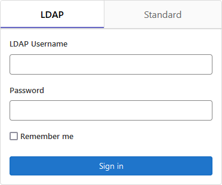

# UAB User Instructions

Our GitLab instance may be found at <https://gitlab.rc.uab.edu>.

## UAB Affiliated Users

If you are a UAB affiliated user and have a BlazerId, you may create an account by logging in at the site above using the `ldap` tab. Please use your single sign-on (SSO) credentials.

!!! note "UABMC Credentials Will Not Work"
    
    You must use your BlazerID and BlazerID password. UABMC credentials are a completely separate password database not accessible by central UAB services. Therefore, UABMC credentials will not work for RC GitLab or any other Research Computing services.

## XIAS Collaborators

If you are a collaborator with a XIAS account you'll need to follow a different procedure.

1. Ensure that your sponsor has included `https://gitlab.rc.uab.edu` in the list of approved URIs on the XIAS configuration page.
2. Email support@listserv.uab.edu requesting an account on the GitLab instance.
3. Navigate to <https://gitlab.rc.uab.edu>.
4. Click the `Standard` tab.
5. In the `Username or email` field type the part of your XIAS email address before the `@` symbol. Do not include the `@` symbol or anything after it.
6. Fill out the `Password` field with your XIAS account password.
7. Click `Sign in`.

!!! warning

    XIAS users can only be granted access if their sponsor adds the GitLab URL to the list of approved URIs. Please see [XIAS Sites](xias_sites.md) for more information.
