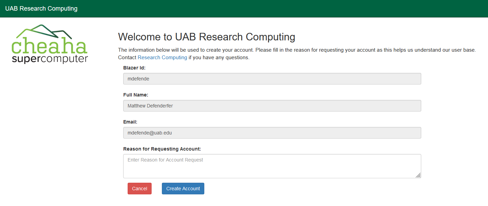

# UAB Researcher Instructions

These instructions are for researchers at UAB to request their own accounts on Cheaha using the Open OnDemand web portal.

Navigate to <https://rc.uab.edu>, authenticate with your UAB credentials, and if you do not have a Cheaha account, you will see the page shown below:

Your BlazerID and full name will already be filled in based on your authentication credentials. Please fill out a reason for needing a Cheaha account and press `Create Account`. Your account should be created and ready to use.

## UABMC Emails

Cheaha does not support use of uabmc emails and identities for login credentials. In order to use Cheaha, you will need either a Blazer ID or access through [XIAS](xias_guest.md).
