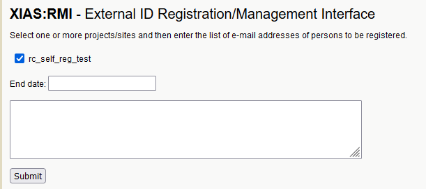
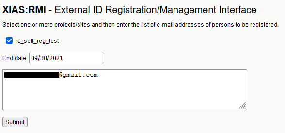
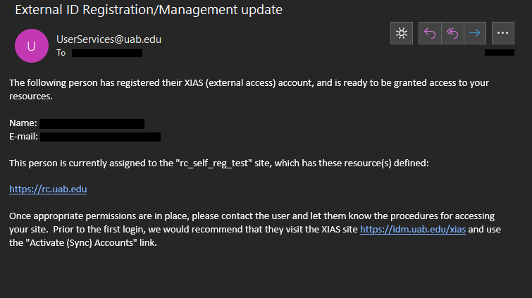
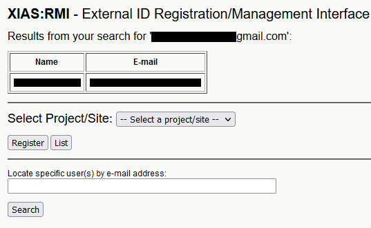
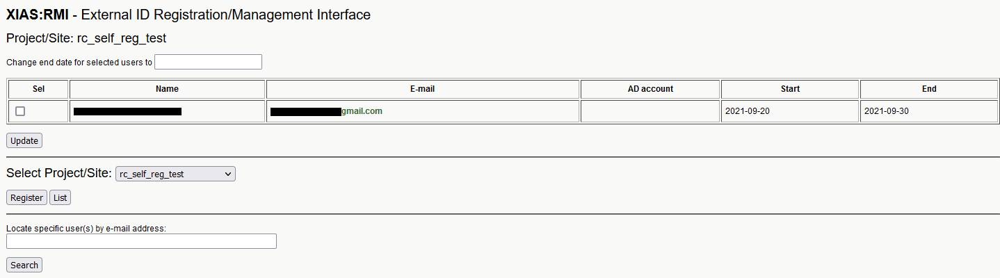

# Managing UAB XIAS Users

<!-- markdownlint-disable MD046 -->
!!! note

    These instructions are intended for use by UAB-employed PIs to organize external collaborators, also known as guests. UAB PIs: Please direct guests [here](guest_instructions.md) for instructions on creating their accounts.
<!-- markdownlint-enable MD046 -->

<!-- markdownlint-disable MD046 -->
!!! important

    To complete these steps you will first need to createa a [Project/Site](pi_site_management.md)
<!-- markdownlint-enable MD046 -->

UAB XIAS User management allow UAB faculty and staff to grant external collaborators access to specific resources on the internal UAB Campus Network. All XIAS users must be connected with at least one site, so you'll need to create one at the [UAB XIAS User Management Webpage](https://idm.uab.edu/cgi-cas/xrmi/sites). All XIAS Users must also have an expiration date.

## Adding Users

Before adding users, have a list of user emails handy for the site you wish to add users to, as well as expiration dates for each user. You will need to create a [Project/Site](pi_site_management.md) before you can add external collaborators.

1. To start go to the [UAB XIAS User Management Webpage](https://idm.uab.edu/cgi-cas/xrmi/sites) and click Manage Users in the left menu.

1. Select the Project/Site you wish to add users to from the drop down box.

    

1. Click "Register" to open a form for adding new users.

    

1. Fill in the form. All fields are required.

    1. **Checkbox list** - Leave the site checked.
    1. **End date** - An expiration date for the users being added. Cannot be longer than the end date for the selected Project/Site.
    1. **Text box** - Enter a list of e-mail addresses for users to add.

    

1. Click "Submit" to move to a confirmation page.

    

1. Check the emails are correct and click "Add" to submit the information Emails will be sent to all email addresses for next steps. You will be redirected to the UAB XIAS User Management Webpage, which should now have the text "Registration successful." near the top.

    

1. To complete their registration, please direct your external collaborators to the [UAB XIAS Guest Users page](https://idm.uab.edu/xias/top). When they have completed their registration, you should receive an email like the following.

    

1. Once the guest XIAS account has been created, the guest will need to login at <https://rc.uab.edu> and follow the automated [Cheaha Account Creation Process](../cheaha_account.md#creating-a-new-account) to create a Cheaha account. They will need to use the same email and password they used when creating their XIAS account.

## Discovering and Managing Users

There are two ways to discover XIAS users you are currently sponsoring.
The first is to search by email address. The second is to list all users
associated with a site.

### Discovering Users

1. To locate users by e-mail address: type their email into the "Locate specific user(s) by e-mail address" text field on the "Manage Users" page.

    

1. To manage users by site: select the site from the drop-down box and click the "List" button. The page will reload with a table containing name, email, and start and end dates. The end date is when the XIAS user registration expires. To change the end date for user(s), click the "Sel" checkbox next to their names, enter a date in the "Change end date for selected users to" text field, and click "Update".

    

### Revoking User Privileges

<!-- markdownlint-disable MD046 -->
!!! warning

    THIS INFORMATION IS PENDING TESTING
<!-- markdownlint-enable MD046 -->

Users cannot have their XIAS account deleted. However, privileges may be revoked. To revoke user privileges, follow the instructions for managing users by site. Update the desired user(s)' end date to a date earlier than the current date.

<!-- markdownlint-disable MD046 -->
!!! important

    If you need to urgently revoke privileges, please also notify UAB IT by emailing <askit@uab.edu> as soon as possible. Please be clear about what is needed and when.
<!-- markdownlint-enable MD046 -->
