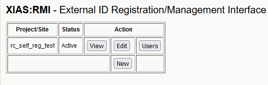

# Creating a UAB XIAS Project/Site

<!-- markdownlint-disable MD046 -->
!!! note

    These instructions are intended for use by UAB-employed PIs to organize external collaborators, also known as guests. UAB PIs: Please direct guests [here](guest_instructions.md) for instructions on creating their accounts.
<!-- markdownlint-enable MD046 -->

XIAS Project/Sites, or simply sites, tie external users to specific resources at UAB. By connecting people to the resource they use, UAB can maintain security and accountability. Creating a site is the first step to giving access to external collaborators, and the process can be thought of as "create once, use many times". All sites must have an expiration date for security reasons. To create a site you'll need at least one Uniform Resource Identifier (URI) relating to resources used by the site. If you aren't sure what URI(s) to list for your site, please contact <UserServices@uab.edu>.

1. To start go to the [UAB XIAS Project/Site Management Webpage](https://idm.uab.edu/cgi-cas/xrmi/sites).

    

1. Click "New" to open a form for creating a new Project/Site.

    

1. Fill in the form. All fields are required.

    1. **Short name for project/site** - A memorable name for your project or site.
    1. **Longer description** - A complete yet concise description of the project or site and its resources.
    1. **Start date** - The start date, can be today.
    1. **End date** - An expiration date for the project or site.
    1. **URIs** - One or more uniform resource identifier (URIs) associated with the site, to increase accountability.

        1. Cheaha URI: `https://rc.uab.edu`
        1. Cloud.rc URI: `https://cloud.rc.uab.edu`
        1. GitLab (code.rc) URI: `https://code.rc.uab.edu`
        1. Long-Term Storage (LTS) URI: `https://s3.lts.rc.uab.edu`

    

1. Click "Add" to submit the form. You should be taken to a page summarizing the created Project/Site.

    

1. When you visit the "Manage Projects/Sites" page in the future, you will see a table with the newly created Project/Site listed. Click "View" to return to the page seen in the previous step. Click "Edit" to return to the form from \[link\]. Click "Users" to manage users for this site.

    
