# Guest Instructions

These instructions are for guests who have been registered by UAB faculty and staff to use internal UAB resources. Once a request for a XIAS account has been made by your UAB sponsor, you will need to follow these instructions to complete the XIAS registration and obtain access to UAB resources. All of the links used on this page are available at the [UAB XIAS Guest Users](https://apps.idm.uab.edu/xias/top) page.

## Create Account

1. The first email you receive should be a notification that a request has been made to add you as a XIAS user. This email will include the project(s)/site(s) you're being added to.

    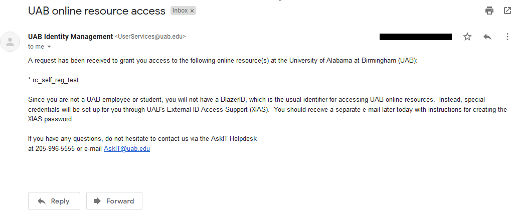

2. The next email you receive should contain instructions on how to register your account. This email may take an hour or so to arrive after the first. It will contain an invite code that you must enter at the XIAS website, along with the email address used to register you.

    

3. Navigate to the link in the email. Please practice good internet hygiene and copy the link text, instead of clicking the link! As of the time of writing the link will be to the [UAB XIAS Guest Users](https://apps.idm.uab.edu/xias/top) page. Once at the main page, click the "Enter Invite or Reset Code" link.

    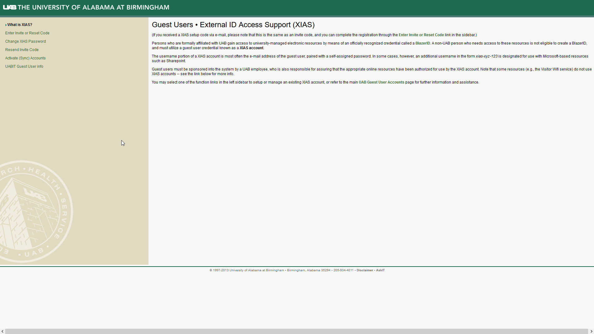

4. You will be taken to the "Register XIAS Account" page. Enter the email address used to register you for a XIAS account, and the code from the email you received with registration instructions. Then click proceed.

    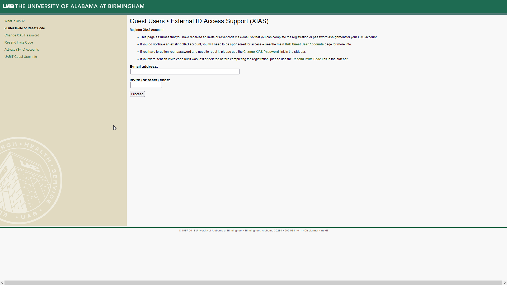

5. Enter your first and last names, then click proceed.

    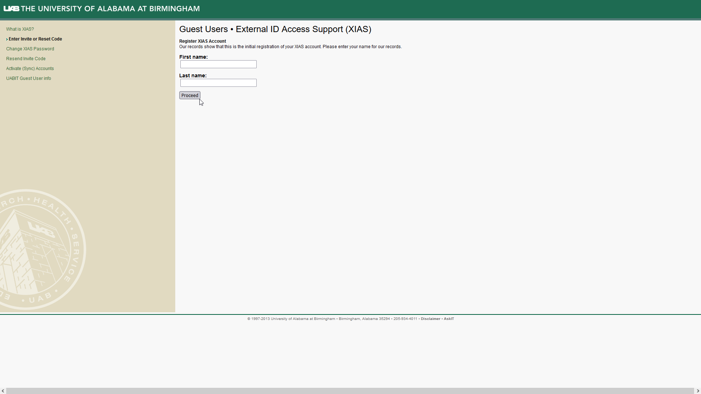

6. Enter a password that will be used with your XIAS account. This password can be changed later, and your account can be recovered if the password is lost. Click proceed.

    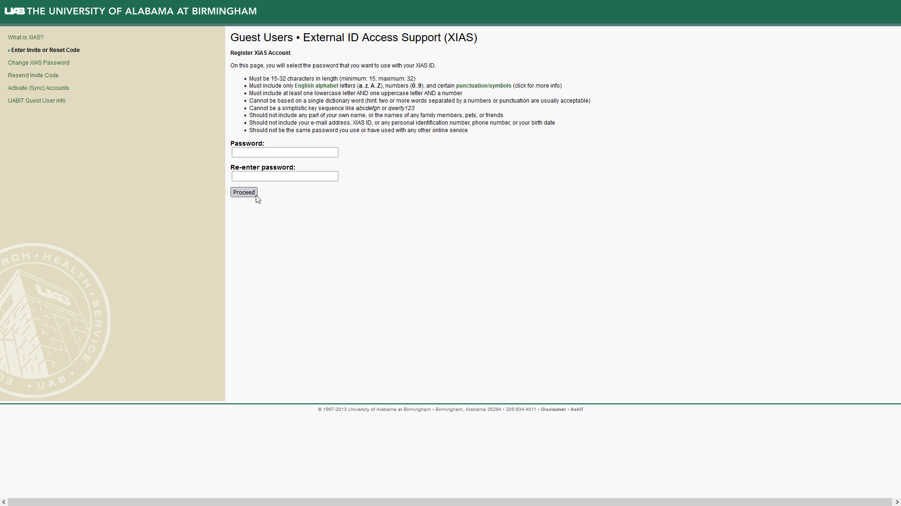

7. You will be taken to a confirmation page. If everything is acceptable, click proceed. Otherwise click edit next to the incorrect field. Your XIAS email cannot be changed. If the email is not correct you will need to communicate with your sponsor to start the entire process over from the beginning.

    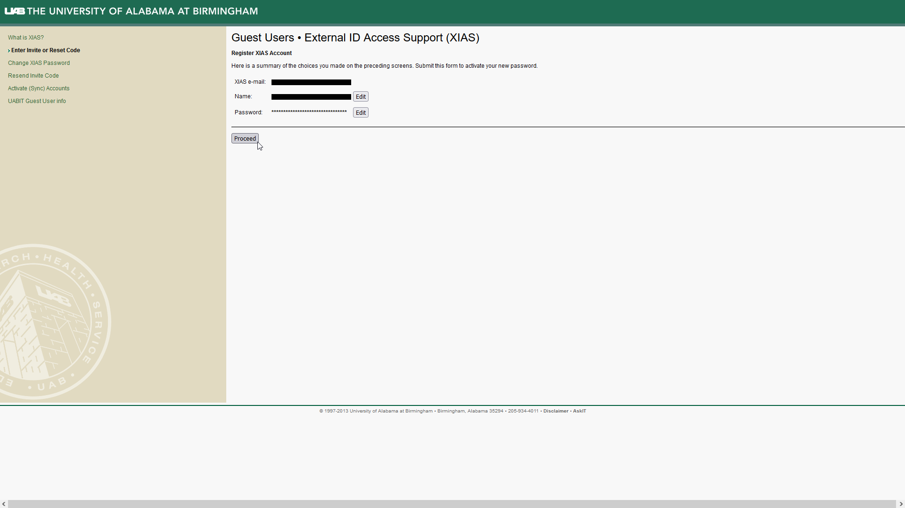

8. You should be taken to a page indicating success. Please carefully read the page and follow any instructions. If you do not see a success page, please contact your sponsor about next steps.

    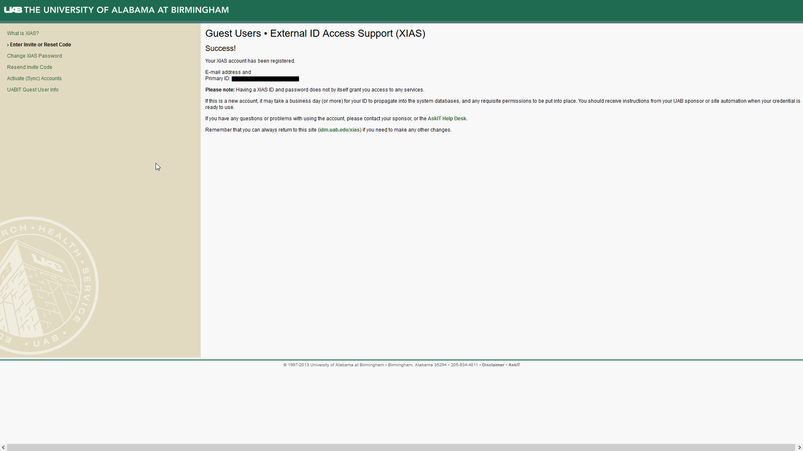

    Following this step, your account registration is complete and you
should be able to access the resources you have been granted permission
to use. Most internal UAB systems use a Single Sign-On (SSO) to simplify
and standardize logging in. For those sites that don't you will need to
activate your account manually.

9. To manually activate accounts for resources that do not use SSO click the "Activate (Sync) Accounts" link on the left hand navigation pane. Fill out the form using the email used to register the XIAS account and the current password.

    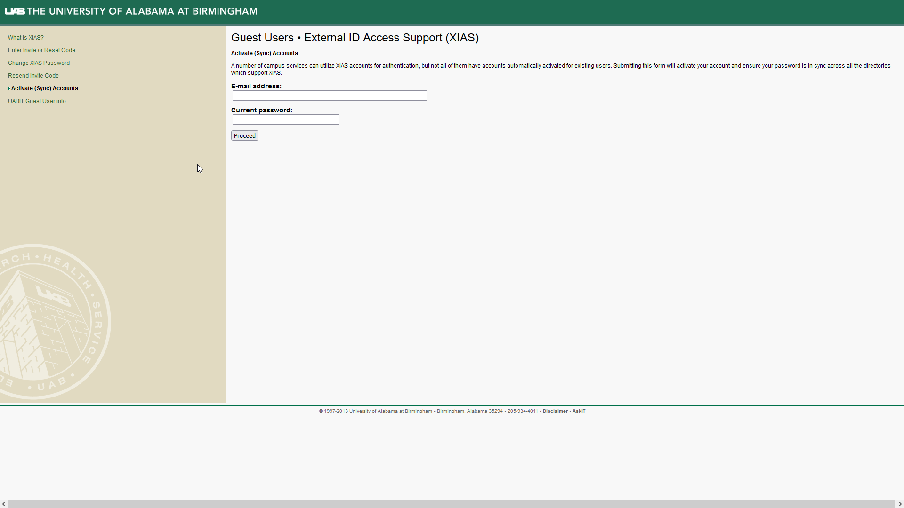

## Change Password and Recover From Lost Password

To change your password, or recover your account in case of a lost
password, please click the "Change XIAS Password" link in the left hand
panel of the main page. Once there, follow the instructions on the form.

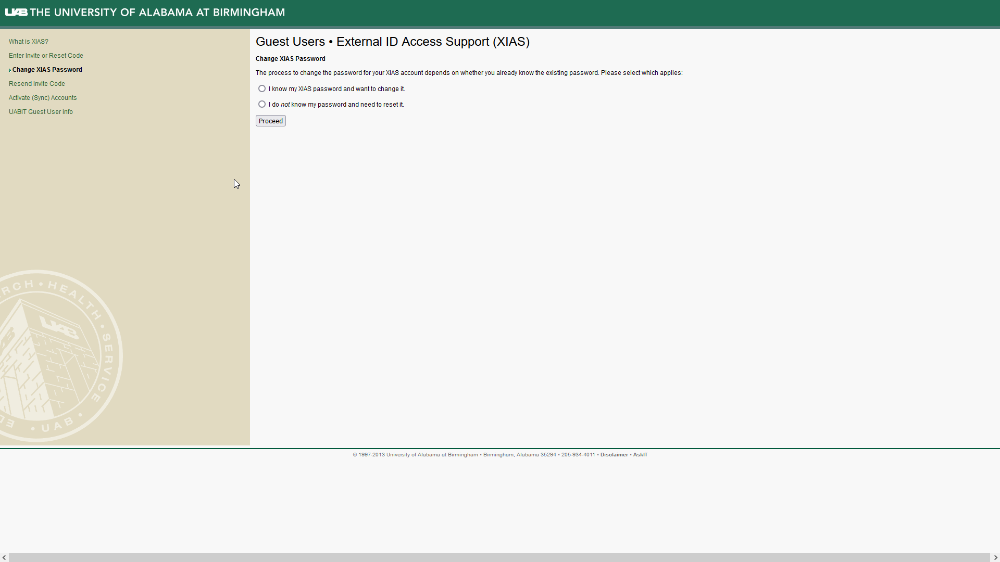

## Resend Invite Code

If your invite code has expired, you can have a new invite code sent to
you by clicking the "Resend Invite Code" link in the left hand panel of
the main page. Once there, follow the instructions on the form.

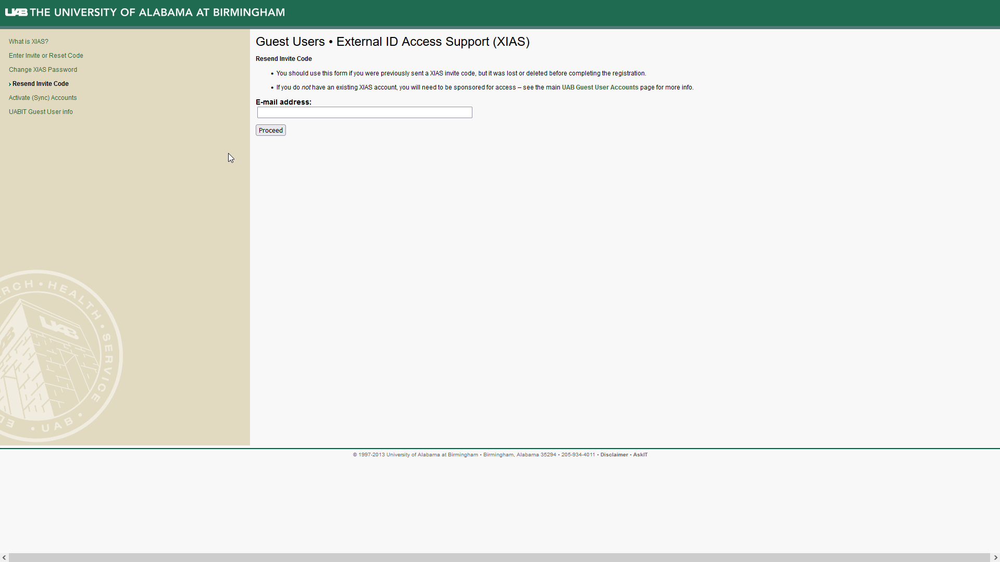

## Guest IT Info

For more information on UAB IT policies and other useful and helpful
information, please click the "UABIT Guest User info" link.

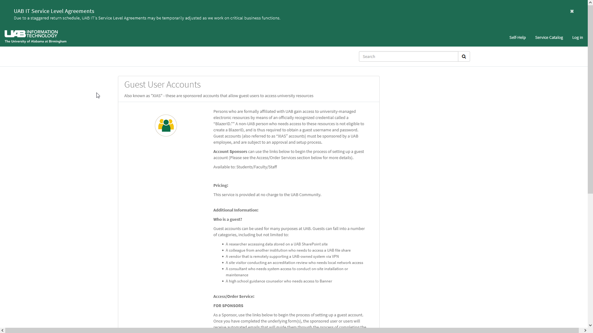
