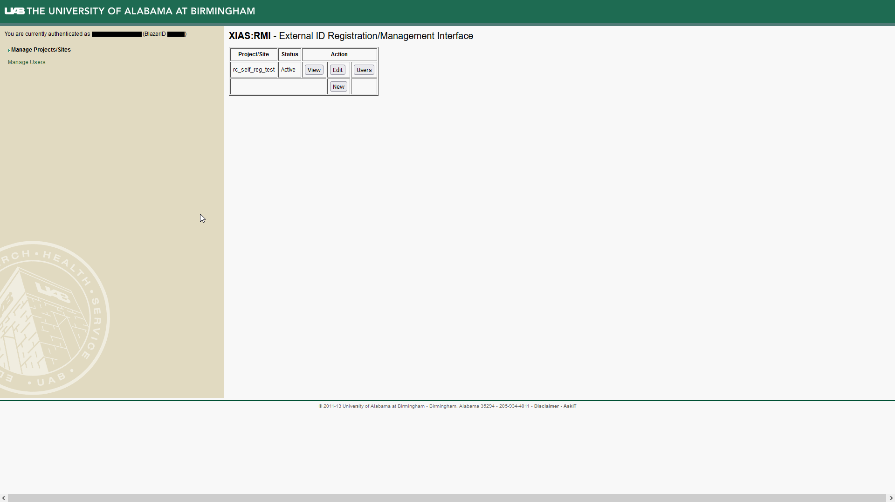
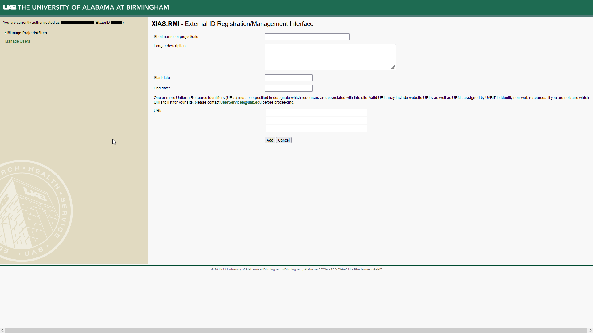
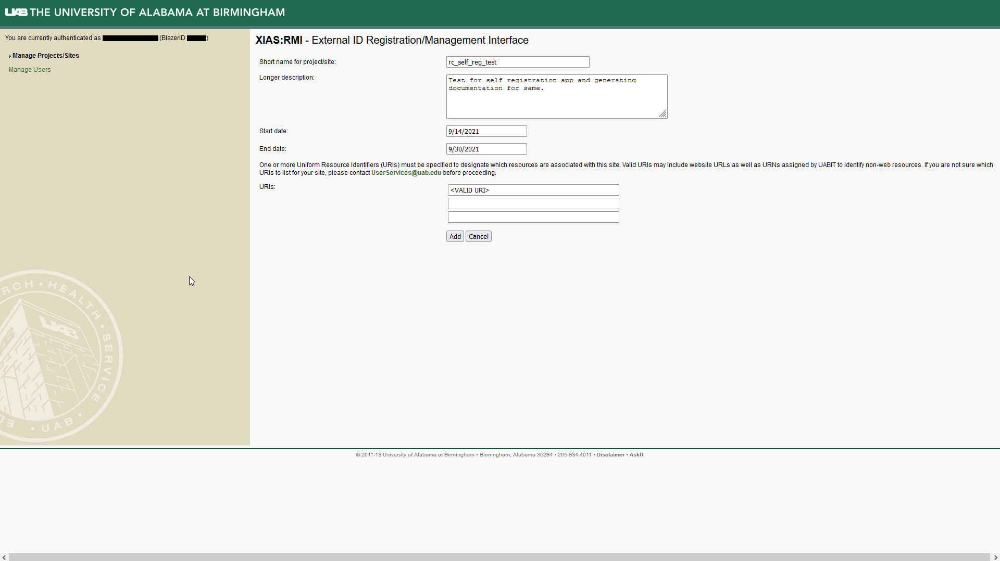
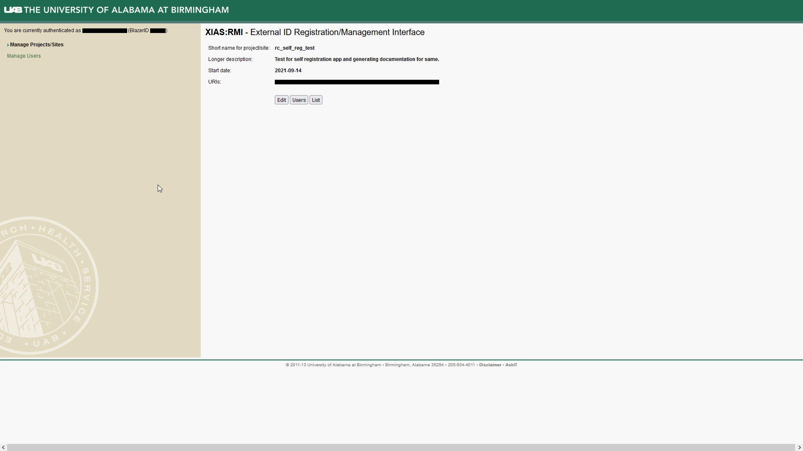

XIAS Project/Sites, or simply sites, tie external users to specific
resources at UAB. By connecting people to the resource they use, UAB can
maintain security and accountability. Creating a site is the first step
to giving access to external collaborators, and the process can be
thought of as "create once, use many times". All sites must have an
expiration date for security reasons. To create a site you'll need at
least one Uniform Resource Identifier (URI) relating to resources used
by the site. If you aren't sure what URI(s) to list for your site,
please contact <UserServices@uab.edu>.

1.  To start go to the [UAB XIAS Project/Site Management
    Webpage](https://idm.uab.edu/cgi-cas/xrmi/sites).

    

2.  Click "New" to open a form for creating a new Project/Site.

    

3.  Fill in the form. All fields are required.

    1.  **Short name for project/site** - A memorable name for your
        project or site.
    2.  **Longer description** - A complete yet concise description of
        the project or site and its resources.
    3.  **Start date** - The start date, can be today.
    4.  **End date** - An expiration date for the project or site.
    5.  **URIs** - One or more uniform resource locators (URIs)
        associated with the site, to increase accountability.

    

4.  Click "Add" to submit the form. You should be taken to a page
    summarizing the created Project/Site.

    

5.  When you visit the "Manage Projects/Sites" page in the future, you
    will see a table with the newly created Project/Site listed. Click
    "View" to return to the page seen in the previous step. Click "Edit"
    to return to the form from \[link\]. Click "Users" to manage users
    for this site.

    
