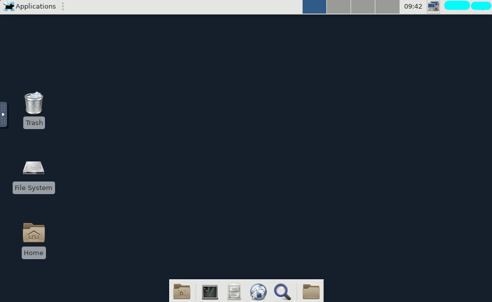
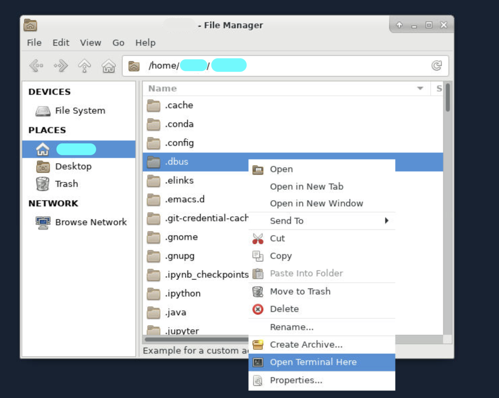
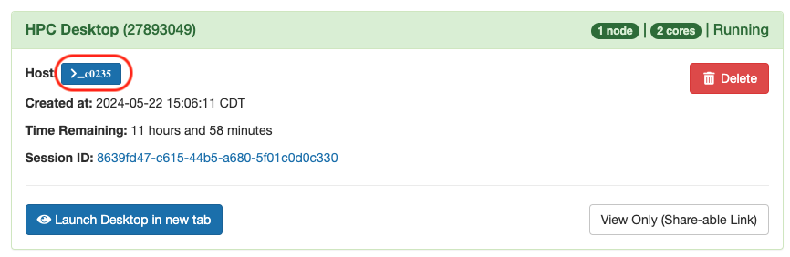
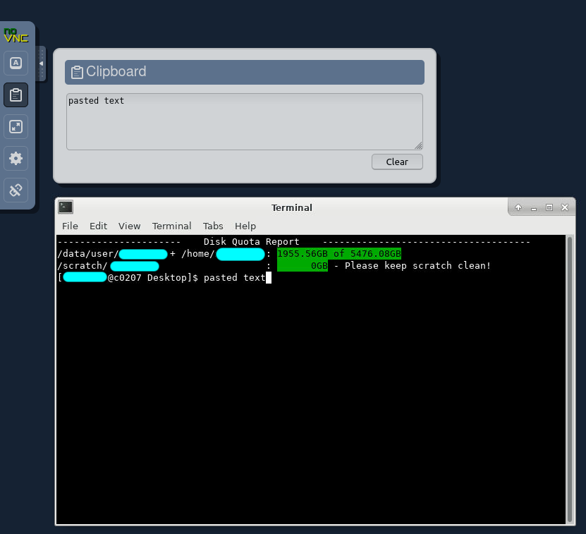

# HPC Desktop

The HPC Desktop is a general desktop interface for Cheaha. It can run all software installed on Cheaha including those with graphical interfaces which can't be run from a base terminal. To launch the HPC Desktop app, please navigate to the "Interactive Apps" menu option and select "HPC Desktop". A job creation form will appear, allowing you to configure the options you require to run your HPC Desktop session. Below the form, you will find a checkbox if you would like to receive an email notification when your session starts, as well as a blue "Launch" button to initiate the session.


It has the same functionality as a standard Centos 7 desktop including a web browser for accessing the internet. The HPC Desktop is a standard tool used for pipeline and analysis development when creating scripts to use in batch jobs. Below, you can see an example of the basic available desktop.



## Using the Terminal

The terminal (also known as the command line, unix shell or shell) allows users to interact with the system using text-based commands. The Terminal is commonly used in HPC environments like ours, for file management, module loading, job submission, and more. Common commands include navigating directories (`cd`), listing files (`ls`), moving or copying files (`mv`, `cp`), and checking your current working directory (`pwd`).

We recommend the Software Carpentries tutorial for getting familiar with terminal and shell commands. You can find details about the terminal and other recommended tutorials in our [Training Resources](../../education/training_resources.md#the-carpentries) page. Additional information is available in our documentation on the [shell](../../workflow_solutions/shell.md).

Below are examples of using appropriate commands within the terminal to;

### Navigate Directories

`cd /path/to/your/folder` - This will change the location within terminal, to the directory specified.

`ls` - This will list all files found in the directory.

`pwd` - This will return as an output the filepath of terminal's current location

### Run Commands

`module load Miniconda3` - This will load a module.

`conda activate myenv` - This will activate an already created Conda environment.

### File Management

`touch script.sh` - This will create an empty file named "script.sh".

`rm script.sh` - This will delete the referenced file.

`nano script.sh` - This will allow you to open the referenced file using a text editor called "Nano".

`vi scirpt.sh` - This will open the referenced file using another text editor called "Vim".

### Clipboard Functions to Cut, Copy, and Paste

You can also copy, cut and paste into a terminal on the HPC desktop job. To do this, please see our section [Copy-Paste Into HPC Desktop](./hpc_desktop.md#copy-paste-into-hpc-desktop).

## Accessing the Terminal

The Terminal is available within the HPC Desktop App on Cheaha, and can be accessed several ways;

1. From the HPC Desktop, you can access the terminal by clicking on its icon. This will open the shell, by default you will see an output showing your home directory.

    

1. You can also open the terminal from within a directory/folder, by right-clicking on the directory/folder, and then selecting the "Open Terminal Here" menu option. This will open the terminal in that directory.

    

1. You can also access the terminal, by clicking on the "Applications" button in the top left corner of an open HPC Desktop Interactive session. From the list of applications, select the "Terminal Emulator" option, this will also open a terminal for you to use.

    

1. Alternatively, a terminal can also be accessed from the blue "Host" button on a created interactive job. This will open a terminal in the compute node for that job to run commands as needed.

    

## Copy-Paste Into HPC Desktop

The HPC Desktop app is run through [noVNC](https://novnc.com/info.html). This setup means it is not possible to conventionally copy-paste text between the Desktop tab and other tabs or software on the host machine (i.e. a lab workstation or personal laptop). To copy-paste text, noVNC provides a control panel with a clipboard for passing text between the VNC session and the host machine. The control panel is available by clicking a tab on the far left of the screen, halfway down (see the red rectangle in the image below).


Once you click the tab, you'll see the control panel appear. The second option from the top will open a clipboard. Paste text from your local machine into the clipboard and then paste into either a terminal or another program in the VNC session. See below for an example.



To copy from the VNC to your personal machine, highlight the text you want to copy in the VNC session, and that text will appear in the clipboard. Select the text in the clipboard, copy it, and then paste it on your local machine. Images cannot be copy-pasted through this clipboard. Instead, images should be saved as a file and then transferred through tools such as [Globus](../../data_management/transfer/globus.md), [rclone](../../data_management/transfer/rclone.md), or an [scp utility](https://servicenow.iu.edu/kb?id=kb_article_view&sysparm_article=KB0024361).

## Visual Studio Code Remote Tunnel

It is possible to remotely access Cheaha using an HPC Desktop job as a host for Visual Studio Code (VSCode), with the "Remote - Tunnels" extension. You can read more about the extension and process at <https://code.visualstudio.com/docs/remote/tunnels>.

To use this method you will need either a GitHub account or Microsoft account. Microsoft accounts can be obtained using your SSO credentials through Microsoft.

<!-- markdownlint-disable MD046 -->
!!! warning

    Do not use "Remote - SSH" to access Cheaha, as all processes run on the login node. VSCode Server, and associated processes, running on the login node may be shut down at any time to free login node resources. Instead, please use "Remote - Tunnels" as described below.
<!-- markdownlint-enable MD046 -->

### What Security Does VSCode Remote Tunnel Use?

The VSCode Remote Tunnel extension uses the Dev Tunnels software product. The Dev Tunnels uses your GitHub or Microsoft credentials to authenticate, and data transfers through the tunnel are end-to-end encrypted. To learn more about Dev Tunnels security, please read <https://learn.microsoft.com/en-us/azure/developer/dev-tunnels/security>

<!-- markdownlint-disable MD046 -->
!!! note

    When using a tunnel, all information visible within VSCode is end-to-end encrypted and sent from Cheaha to your local machine through a third-party service (the tunnel). Use of any third party services and encryption for Restricted/PHI Data may require a risk assessment first. Please [contact us](../../help/support.md) if you need to use VSCode to work with PHI or other restricted data.
<!-- markdownlint-enable MD046 -->

### Downloading and Installing VSCode and VSCode Server

<!-- markdownlint-disable MD046 -->
!!! note

    Support for the Cheaha operating system (CentOS 7) ended with version 1.99 of VSCode, released in March, 2025. Versions 1.98.2 and earlier are still supported.

    The following instructions show how to download and install version 1.98.2. You will also need to install the same version of VSCode on your local computer. See the [VSCode documentation](https://code.visualstudio.com/updates/v1_98) for links to installers for the operating system on your local computer.

    It is important to deny any update requests for both VSCode CLI on Cheaha and your local VSCode. Connection between your local computer and Cheaha requires the same version on both ends. See [Automatically Rejecting Updates](#automatically-rejecting-updates) to learn how to automatically deny update requests.
<!-- markdownlint-enable MD046 -->

First, open a terminal on Cheaha. Run the following commands if you have used VSCode before to remove some hidden files. If you are installing VSCode for the first time, skip to the next code block.

``` bash
rm -r ${HOME}/.vscode
rm -r ${HOME}/.vscode-cli
```

Next, use the following commands to install both VSCode and VSCode Server:

``` bash
curl -L -o vscode_cli.tar.gz 'https://update.code.visualstudio.com/1.98.2/cli-alpine-x64/stable'
mkdir $HOME/bin
tar -xz -C ${HOME}/bin -f vscode_cli.tar.gz

export commit_sha='ddc367ed5c8936efe395cffeec279b04ffd7db78'
curl -L "https://update.code.visualstudio.com/commit:${commit_sha}/server-linux-x64/stable" -o vscode_server.tar.gz
mkdir -vp ~/.vscode-server/bin/${commit_sha}
tar --no-same-owner -xzv --strip-components=1 -C ${HOME}/.vscode-server/bin/"${commit_sha}" -f vscode_server.tar.gz
```

#### Automatically Rejecting Updates

See the [VSCode automatic updates documentation](https://code.visualstudio.com/docs/supporting/faq#_how-do-i-opt-out-of-vs-code-autoupdates).

#### Adding `code` to PATH

To avoid typing `./code` for commands, try adding `${HOME}/bin` to `$PATH` in your `~/.bashrc` before starting a job. Then you will only need to type `code` for commands. You can do this from the terminal with the following command:

``` bash
echo "export PATH=\$PATH:${HOME}/bin" >> $HOME/.bashrc
```

You only need to have this line or `export PATH=$PATH:${HOME}/bin:...` in your `.bashrc` once. You should check your `.bashrc` to make sure this line isn't already there before adding it.

### Starting a Tunnel

These steps should be performed each time you would like to create a tunnel.

1. Start an HPC Desktop job on Cheaha with the required resources. Note that all VSCode processing, including debuggers, unit testing, Jupyter Notebook server, file access, etc., all happen in this same job context. Adjust resources in relation to your development needs.
1. Within the HPC Desktop Job, open a terminal and run the command `code tunnel` (assumes you've added `code` to `$PATH`).
1. Select whether you would like to login with a Microsoft or GitHub account. You should then see a URL and code.

    

    

1. In your local browser, navigate to the URL and enter the code. If you see a `https://vscode.dev/tunnel/...` URL, ignore it. It leads to an online-only instance of VSCode running on a Microsoft Cloud service, not to your local machine.

    

    

1. Open VSCode on your local machine and click the `><` button in the lower-left corner of the main VSCode window to open the Command Palette. Select "Connect to Tunnel..." to find your tunnel.

    

    

1. Select the same login method as in step (3). You may be asked to login locally.

    

1. Select your tunnel from the list.

    

After the previous step, you should be connected to your tunnel. Now your local VSCode window is acting as a front-end for processing and file access occuring on Cheaha.

### VSCode Remote Tunnel Known Issues

- VSCode Remote Tunnel may not work over the "eduroam" wifi network. To work around this issue, try connecting to the [UAB VPN](../getting_started.md#accessing-cheaha) while on the "eduroam" wifi network.
