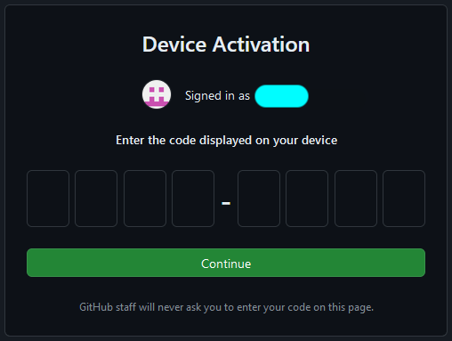

# HPC Desktop

The HPC Desktop is a general desktop interface for Cheaha. It can run all software installed on Cheaha including those with graphical interfaces which can't be run from a base terminal. It has the same functionality as a standard Centos 7 desktop including a web browser for accessing the internet. The HPC Desktop is a standard tool used for pipeline and analysis development when creating scripts to use in batch jobs. Below, you can see an example of the basic available desktop.

## Copy-Paste Into HPC Desktop

The HPC Desktop app is run through [noVNC](https://novnc.com/info.html). This setup means it is not possible to conventially copy-paste text between the Desktop tab and other tabs or software on the host machine (i.e. a lab workstation or personal laptop). To copy-paste text, noVNC provides a control panel with a clipboard for passing text between the VNC session and the host machine. The control panel is available by clicking a tab on the far left of the screen, halfway down (see the red rectangle in the image below).

Once you click the tab, you'll see the control panel appear. The second option from the top will open a clipboard. Paste text from your local machine into the clipboard and then paste into either a terminal or another program in the VNC session. See below for an example.

To copy from the VNC to your personal machine, highlight the text you want to copy in the VNC session, and that text will appear in the clipboard. Select the text in the clipboard, copy it, and then paste it on your local machine. Images cannot be copy-pasted through this clipboard. Instead, images should be saved as a file and then transferred through tools such as [Globus](../../data_management/transfer/globus.md), [rclone](../../data_management/transfer/rclone.md), or an [scp utility](https://kb.iu.edu/d/agye).

## Visual Studio Code Remote Tunnel

It is possible to remotely access Cheaha using an HPC Desktop job as a host for Visual Studio Code (VSCode), with the "Remote - Tunnels" extension. You can read more about the extension and process at <https://code.visualstudio.com/docs/remote/tunnels>.

To use this method you will need either a GitHub account or Microsoft account. Microsoft accounts can be obtained using your SSO credentials through Microsoft.

<!-- markdownlint-disable MD046 -->
!!! danger

    Do _NOT_ use the remote tunnel extension if you intend to view or work with [Restricted/PHI Data](https://www.uab.edu/it/home/policies/data-classification/classification-overview) while using VSCode.

    When using a tunnel, all information visible within VSCode is end-to-end encrypted and sent from Cheaha to your local machine through a third-party service (the tunnel). Use of any third party services and encryption for Restricted/PHI Data requires a risk assessment first, on a case-by-case basis.
<!-- markdownlint-enable MD046 -->

<!-- markdownlint-disable MD046 -->
!!! warning

    Do not use "Remote - SSH" to access Cheaha, as all processes run on the login node. VSCode Server, and associated processes, running on the login node may be shut down at any time to free login node resources. Instead, please use "Remote - Tunnels" as described below.
<!-- markdownlint-enable MD046 -->

**One-time setup:**

Install the [VSCode CLI](https://code.visualstudio.com/docs/editor/command-line) into your `/home/$USER` directory on Cheaha. Instructions for obtaining the CLI executable are available at <https://code.visualstudio.com/docs/remote/tunnels#_using-the-code-cli>.

To avoid typing `./code` for commands, try placing the untarred output into `~/bin/` and adding that directory to `$PATH` in your `~/.bashrc` before starting a job. Then you will only need to type `code` for commands.

**Each session setup:**

1. Start an HPC Desktop job on Cheaha with the required resources. Note that all VSCode processing, including debuggers, unit testing, Jupyter Notebook server, file access, etc., all happen in this same job context. Adjust resources in relation to your development needs.
2. Within the HPC Desktop Job, open a terminal and run the command `code tunnel` (assumes you've added `code` to `$PATH`).
3. Select whether you would like to login with a Microsoft or GitHub account. You should then see a URL and code.

    

    

4. In your local browser, navigate to the URL and enter the code. If you see a `https://vscode.dev/tunnel/...` URL, ignore it. It leads to an online-only instance of VSCode running on a Microsoft Cloud service, not to your local machine.

    

    

5. Open VSCode on your local machine and click the `><` button in the lower-left corner of the main VSCode window to open the Command Palette. Select "Connect to Tunnel..." to find your tunnel.

    

    

6. Select the same login method as in step (3). You may be asked to login locally.

    

7. Select your tunnel from the list.

    

After the previous step, you should be connected to your tunnel. Now your local VSCode window is acting as a front-end for processing and file access occuring on Cheaha.
