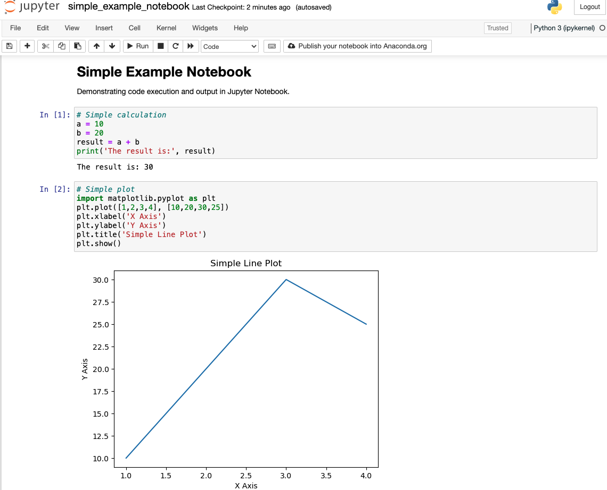
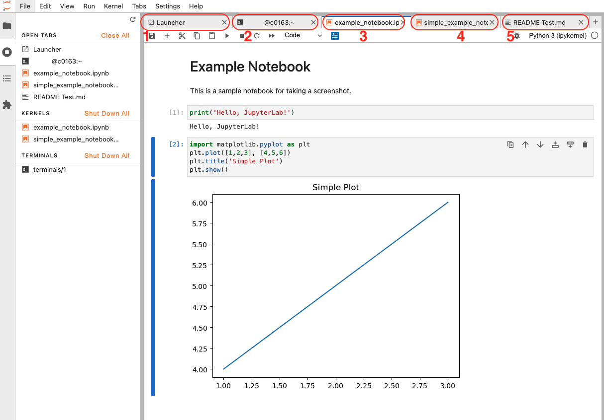

# Open OnDemand

Open OnDemand (OOD) is the web portal to access Cheaha. On it, we can submit interactive jobs in easy to use forms. These jobs include a generic desktop as well as specific apps such as RStudio or MATLAB. There is also access to a basic file manager for viewing and moving files.

The web portal can be accessed at <https://rc.uab.edu> and is available both on and off campus.

## Quickstart

To start a generic desktop job where any piece of software can run, do the following:

1. Go to [Cheaha's web portal](https://rc.uab.edu)
1. Click Interactive Apps > HPC Desktop at the top.
1. Select resources needed for the job, such as number of CPUs, amount of memory per CPU, job runtime, and partition.
      1. As an example, a generic desktop job could use 1 CPU and 8 GB of RAM.
      1. See our [partition table](https://docs.rc.uab.edu/cheaha/hardware/#summary) to determine which partition fits the job. The requested amount of time should not exceed the partition limit.
1. Click Launch at the bottom. This will open the "My Interactive Sessions" page and a job card will be created for the interactive job.
1. When the job card is created, the job is added to a queue. It will remain gray while in the queue, then turn blue when the job starts but is not yet ready for interaction. Once the job has been allocated resources and is actively running, it will turn green. Click the `Launch Desktop in new tab` button to open the interactive job.

Every interactive job requested in OOD is already set on a compute node. This bypasses the login node and is the preferred method for running interactive jobs on Cheaha.

### Choosing Resources

For a more complete description of how to select resources, please see our [Creating an Interactive Job](ood_layout.md#creating-an-interactive-job) section.

## Debugging OOD Job Failures

If your OOD job cards are disappearing after being allocated or during the job, see our [OOD Job Failures section](ood_layout.md#debugging-ood-job-failures) for instructions on how to retrieve the logs and submit a ticket to Research Computing support.

## Choosing the Right Jupyter Application

This section compares Jupyter Notebook and JupyterLab to help you decide which works best for your needs.

Jupyter environments like [Jupyter Notebook](./ood_jupyter_notebook.md) and [JupyterLab](./ood_jupyterlab.md) have revolutionized the way researchers, analysts, and developers interact with code.  Both applications are open-source, web-based tools for creating documents with code, equations, visualizations, and narrative text. Both offer can help with preliminary data analysis, including data exploration, analysis, and visualization.Whether you're writing Python scripts to visualize genomic data, running simulations, or working through computational workflows, you've likely encountered one or both of these tools. We provide detailed documentation on using them effectively on Cheaha.

### What Do They Have in Common?

Jupyter Notebook and JupyterLab both have the following features. Both...

- ...have the same kernel system. Notebooks used in one can be migrated to the other.
- ...allow interactive code execution, plotting, markdown, and data visualization.
- ...can run Python, R, Julia, and other supported languages.
- ...can be made portable and reproducible.
- ...are available on Cheaha.

### How Do I Choose?

#### Jupyter Notebook

Jupyter Notebook (or simply Jupyter) is the classic, streamlined experience focusing on individual notebooks. The Jupyter Notebook interface is useful for teaching, learning, preliminary, or lightweight research tasks. Consider using Jupyter Notebooks if any of the following sound relevant to you.

1. Suitable for beginners: simpler interface and faster to learn.
1. Great for teaching or workshops, with minimal distractions.
1. Perfect for quick data exploration and visualization. You can start in a few minutes.

In the screenshot below, you can see the Jupyter Notebook interface, with sample code and output cells.

Of similar scientific software, Jupyter Notebook's interface is similar to Maple, Mathematica, and R Markdown, but makes use of different syntax and supports multiple programming languages through kernel extensions, e.g., Python, R, and Julia.

#### JupyterLab

JupyterLab is the next-generation interface for Jupyter, designed as a feature-rich, web-based "interactive development environment". While it includes many features, its core strength lies in supporting interactive, exploratory workflows. Consider using JupyterLab if any of the following sound relevant to you.

1. Work with multiple notebooks, terminals, and files in one interface, running in one Cheaha job.
1. Organize software projects with separate files displayed side by side.
1. Customize behavior with extensions (e.g., Git GUI, table of contents).

JupyterLab's interface is similar to IDEs such as RStudio, Microsoft Visual Studio, PyCharm, Spyder, IntelliJ IDEA, Eclipse, and Code::Blocks. It is also similar to VSCode with appropriate extensions.
