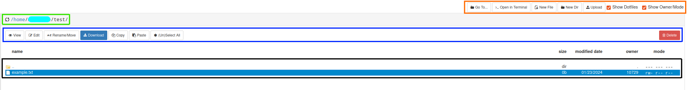

# File Browser

OOD provides an web-based file browser for your files on Cheaha. In order to access it, in the toolbar click `Files --> <dir>`, where `<dir>` is one of the choices of your `$HOME`, `$USER_SCRATCH`, or `$USER_DATA` directories. This will open up the following page:

This page has a few parts to it:

1. **Home directory (red):** A link to your `$HOME` directory and all of its subdirectories for easier navigation. This is always `$HOME` even if you chose `$USER_DATA` or `$USER_SCRATCH` to open.
2. **Working directory (green):** The absolute path for the current directory you are in along with hyperlinks to the parent directories for easier navigation.
3. **File List (black):** A list of all file and folders in the working directory along with select information. Hidden files and file permissions can be shown using the radio button in Command Bar at the top right (orange).
4. **File Command Menu (blue):** A list of commands to perform to a file or directory.

    <!-- markdownlint-disable MD046 -->
    !!! danger

        Be careful deleting files here. They will be gone forever!
    <!-- markdownlint-enable MD046 -->

5. **OOD Command Menu (orange):** A list of commands for navigating in the file browser, file or folder creation, and opening a terminal.

## OOD Command Menu

### Uploading Data

Data can be uploaded from your local machine using this interface. Use the `Upload` button in the OOD Command Menu at the top right to select files from your local browser. Additionally, you can drag and drop files from your machine into the File List window as well.

This should be limited to small files only. For large files or datasets, please use Globus instead.

### Opening a Terminal

You can also open a bash terminal in the current directory using the `>_Open in Terminal` command. This should only be used for small tasks when fine-grain researcher control is necessary because the terminal is running on the login node. For compute-intensive tasks, either request an interactive session in the terminal or request an HPC Desktop session through the Interactive Apps and use the terminal there.
