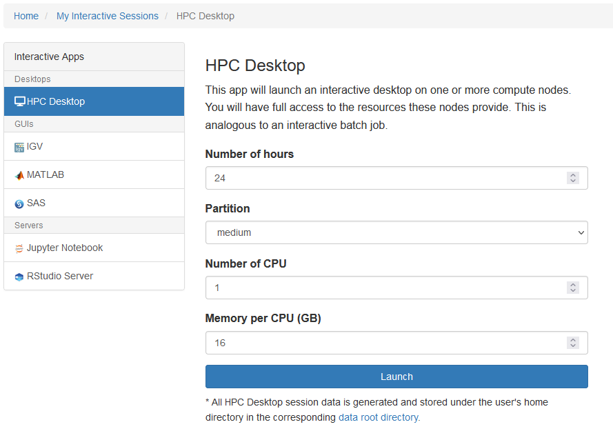
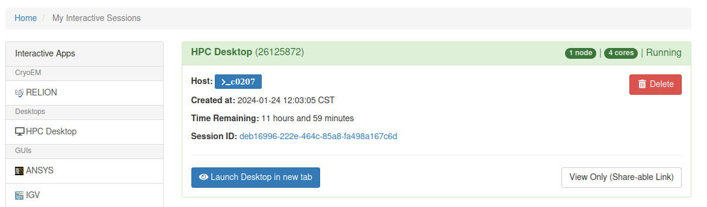
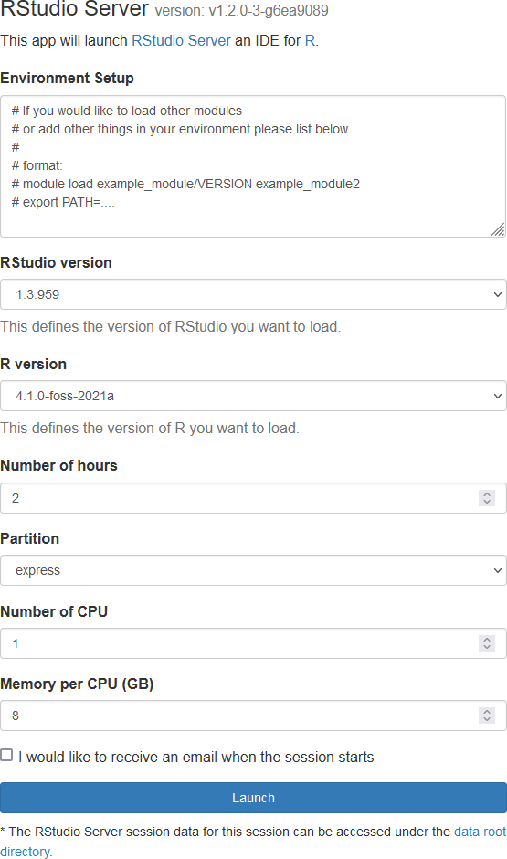
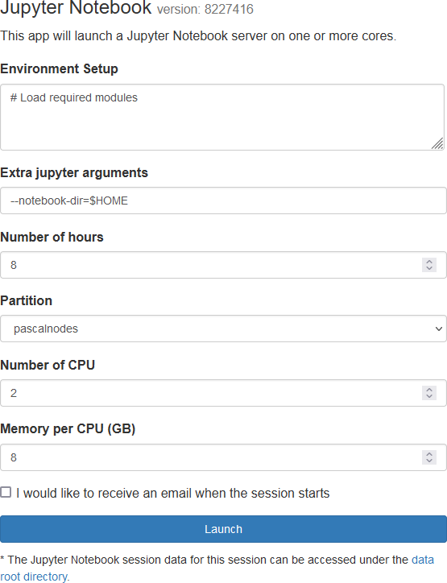
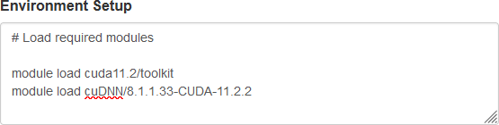
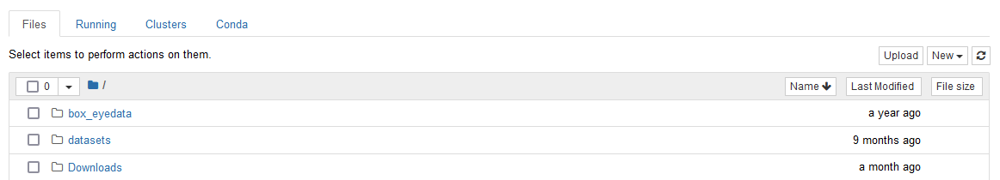
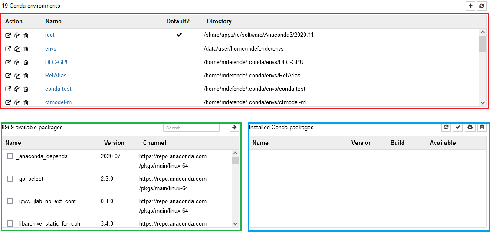

# Interactive Apps

The Interactive Apps dropdown from the toolbar will list a few standalone programs you are able to launch directly from the browser as well as an HPC Desktop that will allow you access all of the other software on Cheaha.

Currently, the available standalone programs are IGV, Matlab, RStudio, SAS, and Jupyter.

All of the interactive apps have similar setup pages. For instance, if we click HPC Desktop, the following screen will appear:

This will allow to choose the number of hours, partition, number of cpus, and memory per cpu needed for the job. These fields are common to all interactive apps and are required. Not all partitions are available when creating an interactive job in OOD. For instance, if you need to use the `largemem` partition, request those resources in a terminal session for an interactive job or submit a batch job.

!!! tip

<!-- markdownlint-disable-next-line -->
    You can decrease wait time in the queue by choosing resources carefully. The closer your request is to actual usage, the more optimal your wait time will be. Please see our section on [Job Efficiency](../job_efficiency.md) for more information.

Once you've selected the compute resources you need, Launch the job. This will bring you to the My Interactive Sessions page. This page looks like:

There will be basic information about the number of cores and nodes as well as the job ID in the top part of the job card. The amount of time remaining in the job is included in the card as well as a quick link to the file browser in the `Session ID` field. Click `Launch Desktop in new tab` to open your interactive VNC session.

!!! note

<!-- markdownlint-disable-next-line -->
    For HPC Desktop, you do not need to request resources after you open the Desktop. You are already on a compute node. Any tasks you run will use the resources you requested when initializing the job.

!!! note

<!-- markdownlint-disable-next-line -->
    You can request another interactive session in a terminal in HPC Desktop. Only the terminal you requested the other interactive session in will have access to the new resources. Everything else in the HPC Desktop will run with the resources you requested when creating the initial job.

These interactive jobs can be stopped early by clicking `Delete` on the right side of the job card.

## Standalone Programs

As shown earlier, some software can be run outside of the VNC session. Setup for most of these follow the same rules as creation of an HPC Desktop job in terms of requesting resources. You will also need to select the version of software to use for the job.

!!! note

<!-- markdownlint-disable-next-line -->
    Versions in OOD and versions seen when loading modules in a terminal may not match. If you need a specific version available in OOD, submit a support ticket at \<support@listserv.uab.edu\>

### RStudio Server

RStudio is available for use graphically in your browser via OOD. As with other standalone programs, you'll need to select the resources required using the job creation form. You'll also need to select both the version of RStudio you wish to use, and the version of R you wish to use. The job creation form is shown below.

To adjust the environment, please use the Environment Setup box to load modules or Anaconda environments. A common strategy when there is difficulty building R packages is to search for it on [Anaconda](../conda.md), create an Anaconda environment with that package already built, and load the environment in the Environment Setup box. An example is shown below.

### Jupyter Notebook

Jupyter Notebooks are available for use graphically in your browser via OOD. As with other standalone programs, you'll need to select the resources required using the job creation form. The form is shown below.

To adjust the environment, please use the Environment Setup box to load modules. For GPU applications it is generally necessary to load one of our `cuda##.#/toolkit` modules, and possibly a `cuDNN` module. These are required for `tensorflow`, `keras` and `pytorch`. Use `module spider cuda` and `module spider cudnn` to view the list of appropriate modules. An example is shown below.

!!! tip

   You do not need `module load Anaconda3` in the `Environment Setup` field, it is loaded automatically.

!!! warning

   Having `conda activate` statements in the `Environment Setup` field can cause unexpected and silent job failure. Please do not activate conda environments in the Environment Setup field.

The `Extra Jupyter Arguments` field allows you to pass additional arguments to the Jupyter Server as it is being started. It can be helpful to point the server to the folder containing your notebook. To do this, assuming your notebooks are stored in `/data/user/$USER`, also known as `$USER_DATA`, put `--notebook-dir=$USER_DATA` in this field. You will be able to navigate to the notebook if it is in a subdirectory of `notebook-dir`, but you won't be able to navigate to any other directories. An example is shown below.

Submitting the job will bring you to the `My Interactive Jobs` window while the Jupyter job is initialized. Click `Connect to Jupyter` to open the Jupyter Home Page.

!!! note

<!-- markdownlint-disable-next-line -->
    If you get a Failed to Connect message when opening the job, close the tab and wait a couple of minutes. Jupyter is still initializing and takes some time after the job first begins running.

#### The Jupyter Server Home Page

The Jupyter Server Home Page will look like the following

From here, you can navigate to and select an existing notebook, or you can create a new one using one of your existing virtual environments or the base environment. Once inside a Jupyter notebook, you can use the `Kernel --> Change kernel` menu to select your preferred Anaconda environment.

!!! note

   The `ipykernel` package must be installed in your preferred environment for it to appear in the `Change kernel` menu.

!!! tip

   Anaconda environments used with Open OnDemand Jupyter do not need the `jupyter` package installed. The server software is already taken care of.

#### Python Libraries and Virtual Environments

To run Jupyter with specific libraries and packages outside of the base install, you will need to create a virtual environment first. You can do this either in an HPC Desktop job or in the `Conda` tab of the Jupyter homepage.

The `Conda` has the following layout:

{: .center}

1. Current environments (red): a listing of the current existing environments in your `$HOME/.conda/envs` folder.
2. Available packages (green): a list of all packages available to install from conda sources.
3. Installed packages (blue): a list of the packages installed in the currently selected environment.

To create a new environment, click the `+` button at the top of the `Current environments` pane and enter the name of the environment. After it has been created, you can select packages to install by searching for the package name at the top right of the `Available packages` pane. After selecting the package, click the `->` button, and the package and all its dependencies will be installed.

!!! note

<!-- markdownlint-disable-next-line -->
    If a package is not available using the `conda` command directly, it will not be listed as an available package. Use a terminal window to install the package as necessary.

!!! note

<!-- markdownlint-disable-next-line -->
    In order to use an environment with Jupyter, the `ipykernel` library is necessary. Creating an environment in the Conda tab will autoinstall this library. If using the terminal, use `conda install ipykernel` to install it.

After successfully creating your environment, navigate to the Files tab. You can create a new notebook using the `New` dropdown menu in the top right. Select your virtual environment of choice, and a notebook will be created and opened.
