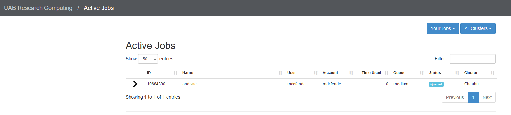
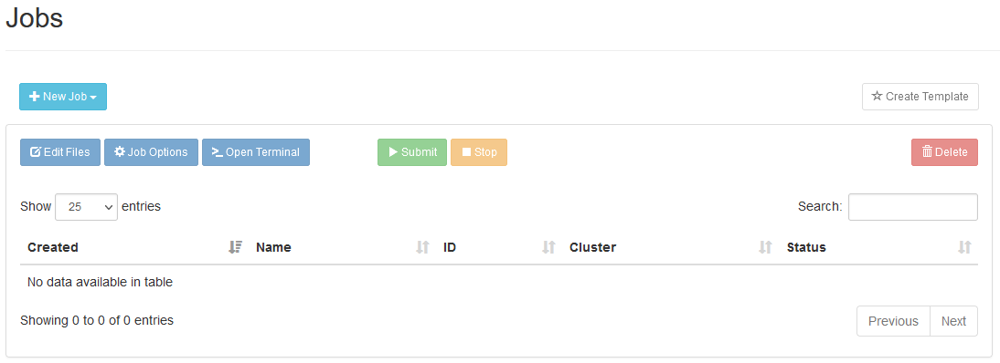

# Job Viewer and Composer

Using the Jobs dropdown menu in the toolbar, you can view the status of your current submitted jobs and how long they have been running as well as submit new jobs via the job composer.

## View Current Jobs

Click `Jobs > Active Jobs`. This will open a new window with you current active jobs that looks like:

{: .center}

There are fields such as job ID, job name, time spent active, and the queue or partition. You can sort your job list by any of these fields and can filter for specific jobs using the Filter option at the top right.

Additionally, you can view more detailed information about a job by clicking the arrow to the left of the job ID. The resulting table will look like:

{: .center}

This table shows extra information such as the total number of nodes, CPUs, time limit, and memory requested for the job. The path to the output file for the job created by SLURM will also be listed. You can open the file location in a file browser or in a terminal here.

You can end a currently running job by pressing Delete at the bottom right of these expanded job details.

## Job Composer

The job composer allows you to create SLURM jobs directly in the web interface without having to create a VNC session. Clicking `Jobs > Job Composer` will bring up a new window:

{: .center}

To create a job:

1. Select `New Job > From Default Template`. This will bring up the job details window pane.
2. Click `Open Editor` at the bottom of the Job Details. This will open an editable document in another browser window.
3. Paste or type in your script directives including SBATCH options. Once done, click `Save` in the top left of the editor and close the tab.
4. In the main job window, click `Submit`, and your job will be submitted to the scheduler. View its status on the `Active Jobs` page.
