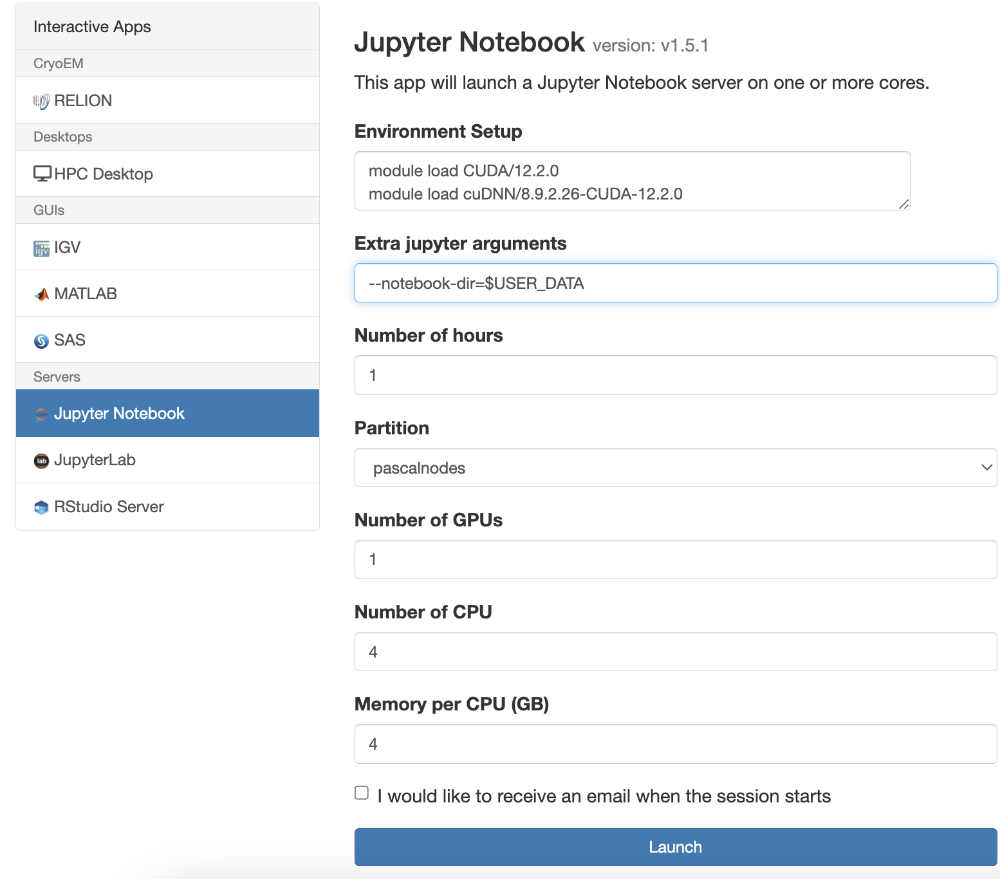
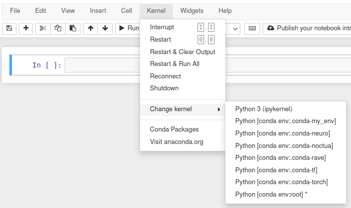
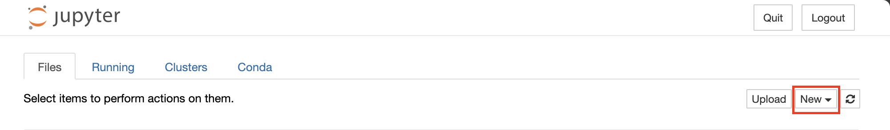
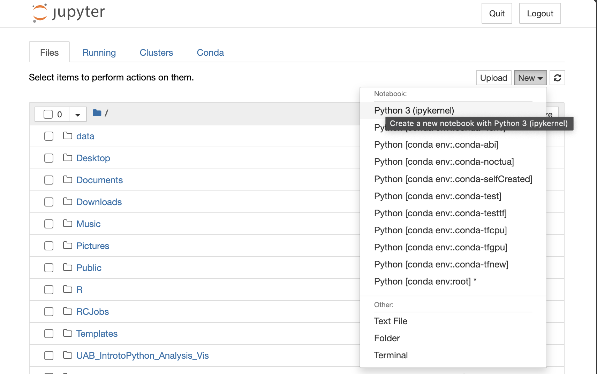
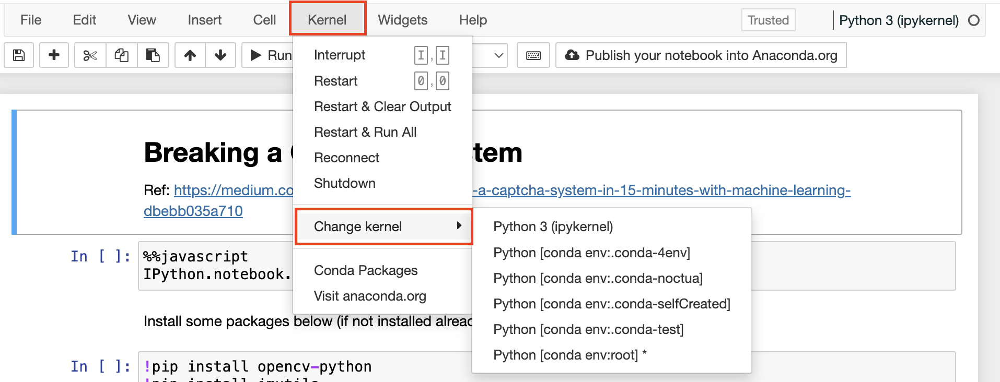
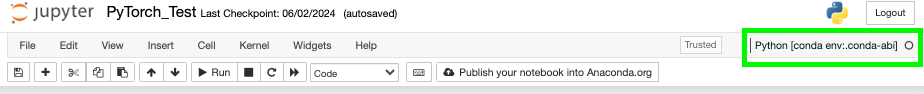
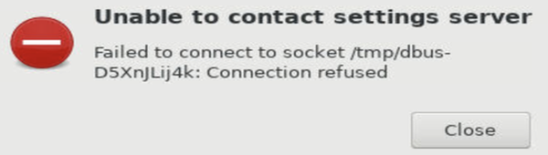
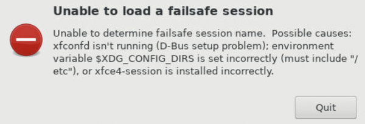

# Jupyter Notebook

Jupyter Notebooks and [Jupyter Lab](./ood_jupyterlab.md) are both available as standalone apps in OOD. Jupyter is commonly used with Anaconda environments. If you are unfamiliar with Anaconda environments please see the [Working with Anaconda Environments section](#working-with-anaconda-environments) below before continuing here.

To launch the Jupyter Notebook, select the menus 'Interactive Apps -> Jupyter Notebook'. The job creation and submission form appears:



As with all interactive apps, you'll need to select the resources required using the job creation form. Jupyter Notebook may also require additional initial setup before the app launches.

## Environment Setup

To modify the environment that Anaconda and Jupyter Notebook will run in, please use the Environment Setup field to load modules and modify the environment `$PATH`. Be aware that any changes to the environment made in this window will be inherited by terminals as well as notebooks opened within Jupyter Notebook.

### CUDA

For GPU applications, we load a `CUDA/*` module to make the CUDA toolkit available. If a computation involves deep learning workflows, it is recommended to load the `cuDNN/*-CUDA-*` module that corresponds to the version of a `CUDA/*` module loaded. These are required for popular Machine Learning/Deep Learning/Artificial Intelligence libraries like TensorFlow, Keras, and PyTorch. Using the commands `module spider cuda/` and `module spider cudnn` while show you the list of available modules. An example of what to put in the Environment Setup field when using a version of Tensorflow compatible with CUDA version 12.2.0 is shown below.

Please see our [Training Resources page](../../education/training_resources.md#the-carpentries) for a link to an introductory deep learning course.

```shell
# ENVIRONMENT SETUP
module load CUDA/12.2.0
module load cuDNN/8.9.2.26-CUDA-12.2.0
```

For information on which versions of CUDA to load for Tensorflow and PyTorch, please see [Tensorflow Compatibility](../slurm/gpu.md#tensorflow-compatibility) and [PyTorch Compatibility](../slurm/gpu.md#pytorch-compatibility).

For information on partition and GPU selection, please review our [hardware information page](../hardware.md) and [GPU Page](../slurm/gpu.md).

<!-- markdownlint-disable MD046 -->
!!! note

    The latest CUDA and cuDNN are now available from [Conda](../slurm/gpu.md#cuda-and-cudnn-modules).
<!-- markdownlint-enable MD046 -->

For more information on GPU efficiency please see [Making the Most of GPUs](../slurm/gpu.md#making-the-most-of-gpus).

<!-- markdownlint-disable MD046 -->
!!! important

    April 21, 2025: Currently, GPU-core affinity is not considered for GPU jobs on interactive apps. This may mean selecting multiple GPUs results in some GPUs not being used. To mitigate this, it is recommended that you only request for 1 GPU for your jobs. Please note, this applies to GPU nodes available on the amperenodes partition.
<!-- markdownlint-enable MD046 -->

## Extra Jupyter Notebook Arguments

The `Extra Jupyter Notebook Arguments` field allows you to pass additional arguments to the Jupyter Server as it is being started. It can be helpful to point the server to the folder containing your notebook. To do this, assuming your notebooks are stored in `/data/user/$USER`, also known as `$USER_DATA`, put `--notebook-dir=$USER_DATA` in this field. You will be able to navigate to the notebook if it is in a subdirectory of `notebook-dir`, but you won't be able to navigate to any other directories. An example is shown below.


## Working With Other Programming Languages Within Jupyter Notebook

To work with other programming languages within Jupyter Notebook, you need to install the corresponding kernel for each language, similar to the process used for Python with the `ipykernel`. This can be done using package managers such as `pip` or `conda`, or by following language-specific instructions. For example, to install `R kernel` for the R language, we can run the `conda install -c r r-essentials` command. Please ensure that the kernel is installed in your Anaconda environment. Then, select the desired language environment from the kernel dropdown menu.

Once the necessary kernels are installed, if you wish, you can write and run multiple code cells in different languages within a single notebook. Easily switch between kernels and select the preferred one for each language, and then proceed to run the code cells in their respective languages.

## Working With Anaconda Environments

By default, Jupyter Notebooks will use the base environment that comes with the Anaconda3 module. This environment contains a large number of popular packages and may useful for something quick, dirty, and simple. However, for any analysis needing specific package versions or special packages, you will need to create your own environment and select it from the `Kernel` menu. For information on creating and managing Anaconda environments please see our [Using Anaconda page](../../workflow_solutions/using_anaconda.md). Then please review our [Cheaha-specific Anaconda page](../software/software.md#anaconda-on-cheaha) for important tips and how to avoid common pitfalls.

To change the kernel, use the `Kernel` dropdown and select `Change Kernel`. From the list, choose the kernel corresponding to your desired Anaconda environment (see below for an example). If your environment isn't appearing, you may be missing the ipykernel package. To do so, use `conda install ipykernel` to get the `ipykernel` package installed into your environment, so Jupyter can recognize your environment.



### Creating an Environment for Use With Jupyter Notebook

We can create a new environment, that houses all of the packages, modules, and libraries we need for our current Jupyter Notebook to implement functions and operations, run all of its cells and deliver desired outputs. Follow the steps below to accomplish this;

1. Access the terminal using your preferred method.

    - [OOD Terminal](./ood_layout.md#opening-a-terminal). Be sure to run the following steps in a job!
    - [OOD HPC Desktop Job Terminal](./hpc_desktop.md). This method will ensure terminal commands are run in a job.

1. [Create](../../workflow_solutions/using_anaconda.md#create-an-environment) and [activate](../../workflow_solutions/using_anaconda.md#activate-an-environment) your new environment, following the linked steps.

1. [Install your desired packages into your activated environment](../../workflow_solutions/using_anaconda.md#install-packages).

1. Remember to install `ipykernel` in your activated environment, using `conda install ipykernel`.

1. Go into your working Jupyter Notebook file, and [change to the created environment](#changing-environments-using-jupyter-notebook-gui).

### Changing Environments Using Jupyter Notebook GUI

1. When your Jupyter Notebook Job has been created on Cheaha, and you want to load an environment you have already created. Select from the dropdown menu "New". You can find this in the top right corner of the Jupyter Notebook landing page. 

1. When you click new, you would see a dropdown of environments that are available for you to use. If you do not see your created environment listed, you may need to install `ipykernel` using `conda install ipykernel` in your cheaha shell within your activated environment. You may have to refresh the page to see your newly created environment. Select the preferred existing environment you created. 

    On another note, you may want to replicate an environment setup to handle a project, research, or analysis but you are already working on a Jupyter Notebook file. You can select a different environment from the Jupyter Notebook file by;

    1. Selecting the Jupyter Notebook File from your landing page.

    1. While in the file, look for the menu option "Kernel", select this. In the Kernel dropdown option, select "Change kernel". Then select your preferred kernel environment. Wait a few seconds for it to load, and you are ready to use your preferred environment. Selecting this would open a new Jupyter Notebook file with your selected environment. 

    1. Your selected environment would appear in the top right corner.

## Common Issues in OOD Jupyter Notebooks

### Python Executable Issues

Jupyter Notebook by default loads `Anaconda3`. Hence do not load any versions of `Anaconda3` module in the `Environment Setup` field in the OOD Jupyter Notebook, as it causes Python mismatch, and the errors are hard to diagnose.

Having custom installs of Anaconda/Miniconda/ can cause the above similar issue. If you have installations of any of these software in your personal space, delete those directories and instead use the `Anaconda3` module.

To identify a Python mismatch, use the commands `which python` and `python --version` to confirm the desired Python executable and version. Within the `conda` environment, `which python` prints the path of the Python executable (e.g. `~/.conda/envs/remora/bin/python`). If it doesn't match the expected version, an unexpected Python version may be in use.

`conda init` append an incorrect version of Python to the front of the `$PATH`, an environment variable containing directories where the operating system looks for executable files. When you attempt to execute a Python-related command, the system will find the first matching executable in the directories listed in the modified `$PATH`. If the first entry corresponds to the version of Python added by `conda init`, that specific version will be used which lead to Python mismatch and hard-to-diagnose errors.

### Unexpected/Silent Job Failure

Having `conda activate` and `source activate` statements in the OOD Jupyter Notebooks' `Environment Setup` field can cause unexpected and silent job failure. Avoid using `conda activate` in the `Environment Setup` field.

### Timeout in Loading Jupyter Notebook

If you encounter a "Failed to Connect" message while trying to open the job, and experience a timeout issue in loading the OOD Jupyter Notebook, it is recommended to close the tab and wait for a few minutes. Jupyter is still in the process of initializing and may take some time after the job initially starts running.

### VNC Error When Launching OOD Jupyter Notebook

While launching an OOD HPC Desktop Job or any OOD Applications, if the user gets errors, `Unable to contact settings server` and/or `Unable to load a failsafe session`, it is recommended to follow the below guidelines.

 

Using `conda init` causes a block of code automatically inserted into the `.bashrc` file in your `$HOME` directory. This code block may interfere with the proper functioning of various OOD applications, resulting in a VNC error. To address this issue, it is recommended to follow the instructions outlined in the [FAQ entry](https://ask.cyberinfrastructure.org/t/why-do-i-get-an-error-when-launching-an-open-ondemand-hpc-interactive-session/2496).

### Pip Installs Packages Outside of Environment

When installing packages within a `conda` environment using `pip`, it's crucial to ensure that you install `pip` first within the same conda environment and use `pip` from that environment. If `pip` is used outside of conda or within an environment without `pip` installed, the packages are installed to `~/.local`. This can lead to unexpected package conflicts, as Python loads packages from `~/.local` before loading from Anaconda environments, and shows the following error,

```bash
Requirement already satisfied: numpy in /home/$USER/.local/lib/python3.11/site-packages (1.26.3)
```

For the above case, deleting the `~/.local` directory and then installing `pip` within an environment, will fix this error. Ensure you input the correct file path, we suggest copying the filepath found in the output "Requirement already satisfied: numpy in /home/$USER/.local/lib/python3.11/site-packages (1.26.3)".

```bash
rm -rf /home/$USER/.local/lib/python3.xx/site-packages
```

Replace `python3.11` in the command with the appropriate Python version.

<!-- markdownlint-disable MD046 -->
!!! important

    Please note, using the `rm -rf` command would permanently delete the specified file or specified directory and its contents.
<!-- markdownlint-enable MD046 -->

Here's an example of the correct procedure for installing `pip` packages within a `conda`:

1. Load the `Anaconda3` module using `module load Anaconda3`.
1. Create or activate the desired Anaconda environment. Please refer to the [Anaconda documentation](../../workflow_solutions/using_anaconda.md#create-an-environment)
1. Install `pip` within the `conda` environment using `conda install pip` or `conda install python`. `pip` and `python` are packaged together, installing one will always install the other.
1. Use `pip` when this `conda` environment is active to install packages. Please refer to [Installing packages with `pip`](../../workflow_solutions/using_anaconda.md#installing-packages-with-pip)

### Tensorflow and PyTorch GPU Issues

If you are using Jupyter Notebook with TensorFlow or PyTorch and no GPU is found, please see our Slurm GPU page sections on [TensorFlow Compatibility](../slurm/gpu.md#tensorflow-compatibility) and [PyTorch Compatibility](../slurm/gpu.md#pytorch-compatibility).
