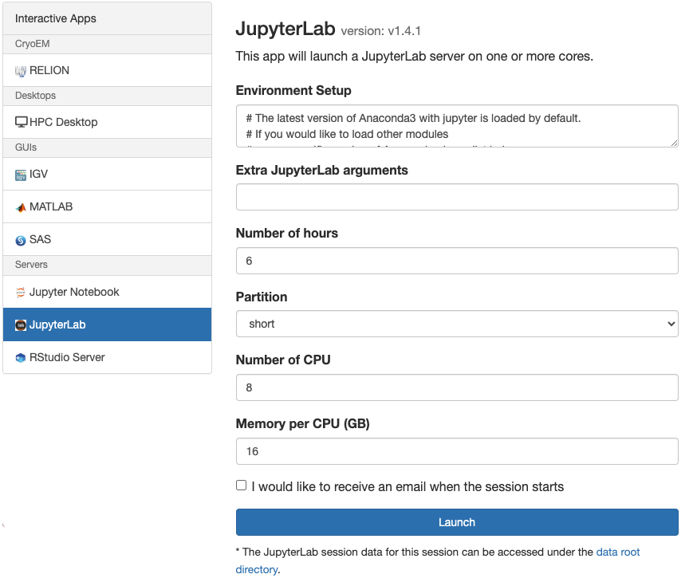
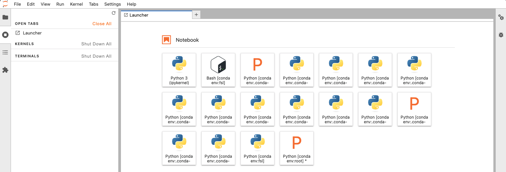
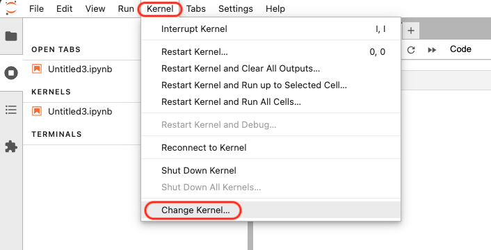
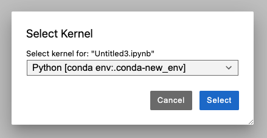
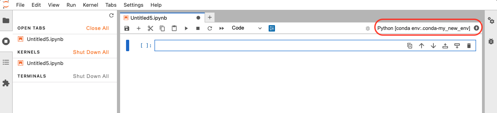

# JupyterLab

As described on JupyterLab's [documentation page](https://jupyterlab.readthedocs.io/en/latest/):

> JupyterLab is a highly extensible, feature-rich notebook authoring application and editing environment, and is a part of [Project Jupyter](https://docs.jupyter.org/en/latest/), a large umbrella project centered around the goal of providing tools (and [standards](https://docs.jupyter.org/en/latest/#sub-project-documentation)) for interactive computing with computational notebooks. A [computational notebook](https://docs.jupyter.org/en/latest/#what-is-a-notebook) is a shareable document that combines computer code, plain language descriptions, data, rich visualizations like 3D models, charts, graphs and figures, and interactive controls. A notebook, along with an editor like JupyterLab, provides a fast interactive environment for prototyping and explaining code, exploring and visualizing data, and sharing ideas with others.

To launch a JupyterLab session on Cheaha, visit out [Open OnDemand home page](https://rc.uab.edu/), and select the menu items "Interactive Apps -> JupyterLab". The job submission form appears, as shown below. Select the resources your job needs, and configure the environment and provide extra arguments. Please read on for more information.

## Environment Setup

Every software application runs in an environment, including Conda and JupyterLab. To modify the environment, use the "Environment Setup" field to load modules and configure [environment variables](../../workflow_solutions/shell.md). Everything added to this field will be inherited by all terminals and notebooks opened within your JupyterLab session.

### CUDA

See our [Jupyter Notebook CUDA section](./ood_jupyter_notebook.md#cuda).

## Extra JupyterLab Arguments

See our [Jupyter Notebook Arguments section](./ood_jupyter_notebook.md#extra-jupyter-notebook-arguments).

## Working With Other Programming Languages Within JupyterLab

Please follow the instructions found in our [Working With Other Programming Languages Within Jupyter Notebook section](./ood_jupyter_notebook.md#working-with-other-programming-languages-within-jupyter-notebook).

## Working With Conda Environments Using JupyterLab

By default, JupyterLab on Cheaha will launch using the `base` conda environment. While this default environment includes a wide range of popular packages and can be helpful for quick or exploratory tasks, it is not recommended for research workflows that require specific package versions or custom dependencies. For reproducible and stable analysis, it’s best to create and use a dedicated Conda environment tailored to your project or research workflow. Once created, you can register the environment as a Jupyter kernel and select it directly from within JupyterLab. For information on creating and managing Conda environments please see our [Using Anaconda page](../../workflow_solutions/using_anaconda.md). Then please review our [Cheaha-specific Anaconda page](../software/software.md#anaconda-on-cheaha) for important tips and how to avoid common pitfalls.

The python icons you see in the image above, are Conda environments that open into a Notebook (like with Jupyter Notebooks) interface with the selected environment activated.

### Creating a Conda Environment for Use With JupyterLab

Please see instructions for creating a Conda environment in the [Creating an Environment for use with Jupyter Notebook section](./ood_jupyter_notebook.md#creating-an-environment-for-use-with-jupyter-notebook).

### Changing Conda Environments in JupyterLab

1. From the JupyterLab interface, click on the "Kernel" menu in the top navigation bar, and choose the "Change Kernel" option.

1. A new dialog window will open, with a list of all available kernels that match your Conda environments. Select your preferred kernel and click on the "Select" button. If you do not see your environment in here, then you will need to install the "ipykernel" package with `conda install ipykernel`.

1. Your selected environment would appear in the top right corner.

### Finding Extensions

Please visit [JupyterLab's official documentation page](https://jupyterlab.readthedocs.io/en/stable/user/extensions.html#extensions) to get more information about JupyterLab Extensions.

## Common Issues in OOD JupyterLab

### Python Executable Issues

See our [Python Executable Issues section](./ood_jupyter_notebook.md#python-executable-issues) on our [Jupyter Notebook page](./ood_jupyter_notebook.md).

### Unexpected/Silent Job Failure

See our [Unexpected/Silent Job Failure section](./ood_jupyter_notebook.md#unexpectedsilent-job-failure) on our [Jupyter Notebook page](./ood_jupyter_notebook.md).

### Tensorflow and PyTorch GPU Issues

See our [Tensorflow and PyTorch GPU Issues section](./ood_jupyter_notebook.md#tensorflow-and-pytorch-gpu-issues) on our [Jupyter Notebook page](./ood_jupyter_notebook.md).
