# Navigating Open OnDemand

After creating your Cheaha account, going to [rc.uab.edu](https://rc.uab.edu) will take you to the Open OnDemand (OOD) homepage:

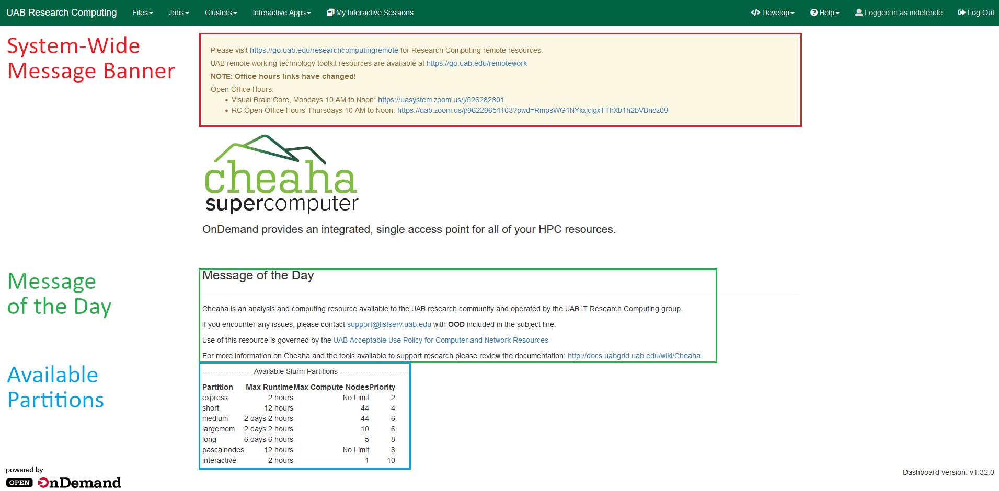

The landing page contains information about current updates to the system, a message of the day with links to our support email and documentation, as well as a helpful [partition table](../getting_started.md#partitions) to help you determine which partition to submit your jobs to. You can access all of the different features of OOD using the navigation tabs at the top of the screen. The most commonly used features are covered below.

## File Browser

You can open a file browser in a new tab by clicking the `Files` dropdown and selecting which default directory you would like to access from the following options.

- [Home Directory](../../data_management/cheaha_storage_gpfs/individual_directories.md)
- [/data/scratch/$USER](../../data_management/cheaha_storage_gpfs/network_scratch.md) (network scratch)
- [/data/user/$USER](../../data_management/cheaha_storage_gpfs/individual_directories.md)
- [/scratch/$USER](../../data_management/cheaha_storage_gpfs/network_scratch.md) (network scratch)

<!-- markdownlint-disable MD046 -->
!!! note

    "/data/scratch" is a symbolic link to "/scratch", so they point to the same directory.
<!-- markdownlint-enable MD046 -->

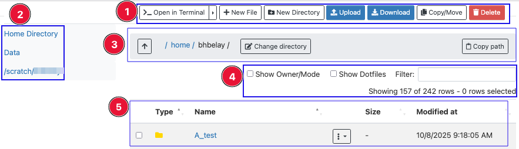

You can see the current working directory at the top (green) along with its file and folder list (black). There are also control bars for both working with files (blue) as well as the file browser itself (orange).

### Renaming/Moving File

You can use the `Rename/Move` button in the control bar to either `rename` a selected file with a desired name or `move` it to a preferred location by specifying the full path of the destination.

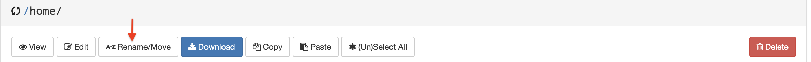

<!-- markdownlint-disable MD046 -->
!!! danger

    Make sure you never leave the box empty while renaming the files! If it's left empty, you risk losing the files, which cannot be recovered. This problem has been noted in OOD version < 2.0.0.
<!-- markdownlint-enable MD046 -->

Below is an example that shows how leaving the box empty while renaming the folder "test_rename" results in the loss of the folder itself.

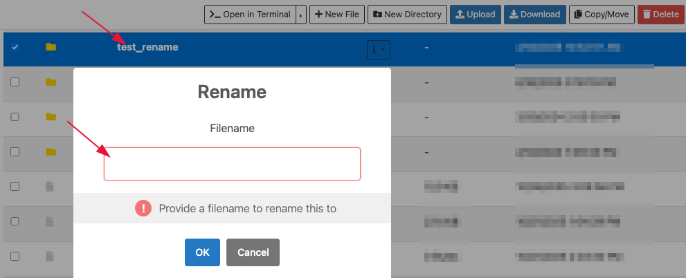

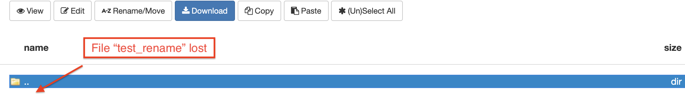

### OOD Command Menu

#### Uploading Data

Data can be uploaded from your local machine using this interface. Use the `Upload` button in the OOD Command Menu at the top right to select files from your local browser.

<!-- markdownlint-disable MD046 -->
!!! important

    This should be limited to small files only (< 1 MB). For large files or datasets, please use [Globus](../../data_management/transfer/globus.md) instead.
<!-- markdownlint-enable MD046 -->

#### Opening a Terminal

You can also open a bash terminal in the current directory using the `>_Open in Terminal` command. This should only be used for small tasks since the terminal is running on the login node. For compute-intensive tasks, either request an interactive session in the terminal or request an HPC Desktop session through the Interactive Apps and use the terminal there.

#### Show Dotfiles

Selecting the `Show Dotfiles` option will show the hidden files (those beginning with `.`) in the current folder.

#### Show Owner

Selecting the `Show Owner/Mode` option will show the permissions for the files in the working directory. These permissions (`mode`) can be used to investigate permission issues in shared spaces like `/data/project` directories. The `owner` column shows the Unix ID for the user who owns the file or directory. There is not a known way to change it to the username so its use is limited.

## Interactive Apps

There are two tabs used to interact with applications in OOD, the Interactive Apps dropdown, used to select resources and start jobs, and the My Interactive Sessions tab, used to view currently running interactive apps. As shown below. 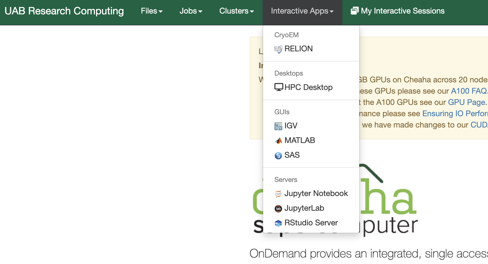

### Creating an Interactive Job

The Interactive Apps dropdown has a list of specific software setup to run on Cheaha that you can interact with through a browser window such as RStudio, MATLAB, and Jupyter. There is also an HPC Desktop app that provides a general VNC desktop to run all available software on Cheaha. See the [quickstart](index.md#quickstart) for how to create an example HPC Desktop job. Below, you can see a general form for selecting job resources.

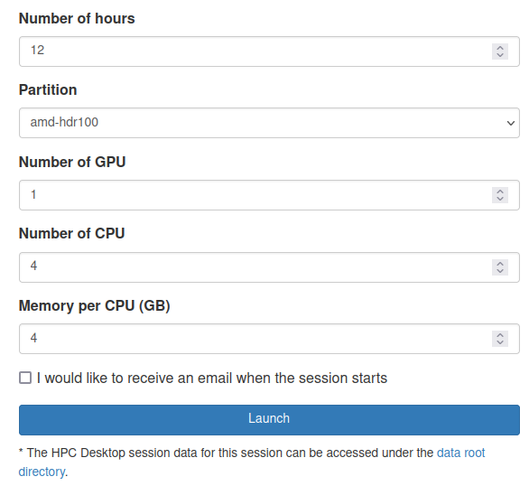

The interactive apps have the following fields to customize the resources for your job:

1. Number of Hours: the maximum number of hours the job will run for. Interactive apps will stay allocated for this amount of time unless the job is manually deleted or crashes. The selected number of hours should be less than or equal to the max runtime for your selected partition.
1. Partition: the partition the job will be allocated in. See our [Partitions](../getting_started.md#partitions) section for more information about which partition to choose for your job.
1. Number of GPUs: Total number of GPUs to request (max of 4 on pascalnodes or 2 on amperenodes)
1. Numer of CPUs: Total number of CPUs to request
1. Memory Per CPU (GB): GB of memory multiplied by the requested number of CPUs.

<!-- markdownlint-disable MD046 -->
!!! note

    The "number of GPUs" field is ignored if a partition is selected that has no GPUs.
<!-- markdownlint-enable MD046 -->

<!-- markdownlint-disable MD046 -->
!!! tip

    You can decrease wait time in the queue by choosing resources carefully. The closer your request is to actual usage, the more optimal your wait time will be. Please see our section on [Job Efficiency](../job_efficiency.md) for more information.
<!-- markdownlint-enable MD046 -->

Every interactive app has resources only allocated on a single node, and resources are shared among all processes running in the app. Make sure the amount of memory you request is less than or equal to the max amount per node for the partition you choose. We have a table with [memory available per node](../hardware.md#cheaha-hpc-cluster) for each partition.

For more information on GPU efficiency please see [Making the Most of GPUs](../slurm/gpu.md#making-the-most-of-gpus).

<!-- markdownlint-disable MD046 -->
!!! important

    April 21, 2025: Currently, GPU-core affinity is not considered for GPU jobs on interactive apps. This may mean selecting multiple GPUs results in some GPUs not being used.
<!-- markdownlint-enable MD046 -->

#### Environment Setup Window

In addition to requesting general resources, for some apps you will have the option to add commands to be run during job startup in an Environment Setup Window. See below for an example showing how to load CUDA into a Jupyter job so it can use a GPU.

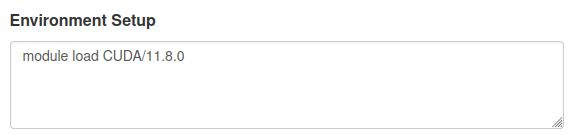

For jobs such as RStudio and Jupyter, some modules like CUDA need to be loaded beforehand so the application has access to it. This can also include loading compiler modules such as CMake and GCC for compiling package installations or editing your `$PATH` specifically for the interactive app without needing to edit your `.bashrc`. See the software specific pages for more examples on how to use the Environment Setup.

<!-- markdownlint-disable MD046 -->
!!! Note

    In the OOD session, the module is automatically reset at the beginning of every session by default. Therefore, avoid using `module reset` in the 'Environment Setup' box. See [best practice for loading modules](../software/modules.md#best-practice-for-loading-modules) for more information.
<!-- markdownlint-disable MD046 -->

<!-- markdownlint-disable MD046 -->
!!! note

    The latest CUDA and cuDNN are now available from [Conda](../slurm/gpu.md#cuda-and-cudnn-modules).
<!-- markdownlint-enable MD046 -->

#### Launching Interactive Sessions

Once you have completed the form fields with the necessary parameter for the job, click on the blue `Launch` button. The interactive session will be initiated and placed into the scheduling queue, changing the job state to `Queued`.

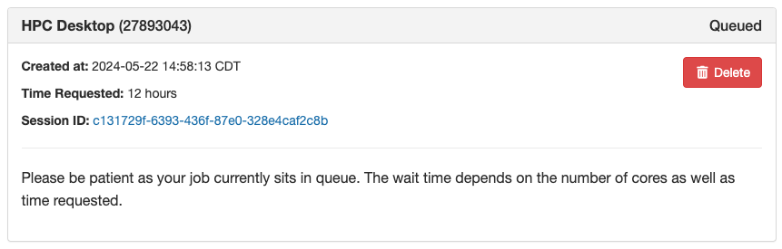

Depending on the resources requested, you may need to wait for some time. After the resources are allocated, the job state will change to `Starting`.

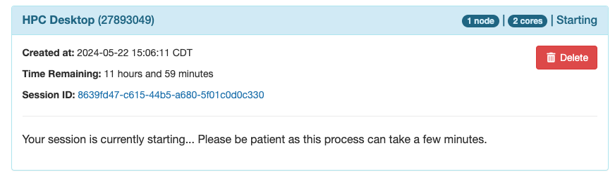

Once the job is launched on the compute nodes, the state will switch to `Running`. You will then see the option `Launch Desktop in new tab` button. Click this button to open the interactive VNC session in a new tab. Alternatively, you can also click the blue button in the `Host` field to open a terminal directly. This terminal is opened on the compute node and so can run any commands you need.

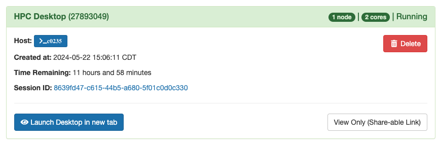

### My Interactive Sessions

The My Interactive Sessions page lists the available apps and your current interactive sessions. If you are logged out, disconnected, or lose track of an interactive application (because of a closed tab or computer shutdown) you can reconnect to running applications on this page. The My Interactive Sessions page looks like:

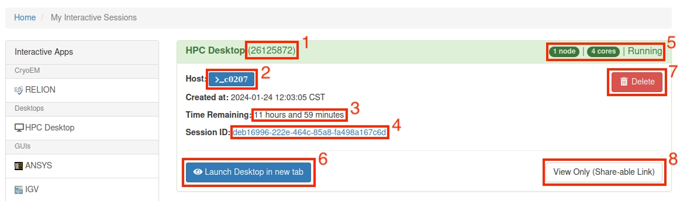

For each job running via Open OnDemand, there will be a card listed on this page:

1. **Job ID**: The jobID assigned by the Slurm scheduler for this specific job.
1. **Host**: The node on which the job is currently running.
1. **Time Remaining**: The amount of time remaining from the total requested time.
1. **Session ID**: This is the unique ID for the OOD session for this job, which can be clicked to access the OOD log directory for troubleshooting.
1. **Node, Cores and State**: Information about the number of node, cores assignment, and state of the job.
1. **Launch Desktop in new tab**: Click this button to open your interactive VNC session.
1. **Delete**: Click this button if you want to cancel/stop a running job, and/or delete the session if the job has already ended.
1. **View Only (Share-able Link)**: Click this button to share the URL of your job with someone. It allows them to watch as you interact with the program and assist you. However, they can only view and cannot control or enter any data.

The Job ID and Session ID are important for diagnosing issues you may encounter on Cheaha while using Open OnDemand. These interactive jobs can be stopped early by clicking the `Delete` button on the job card.

<!-- markdownlint-disable MD046 -->
!!! bug

    If your job fails to launch, see [debugging OOD jobs](#debugging-ood-job-failures) for instructions on how to access OOD job data and submit a support ticket.
<!-- markdownlint-enable MD046 -->

#### Debugging OOD Job Failures

On occasion, interactive jobs created in OOD will crash on startup and cause the job card to disappear. Most of these failures are caused by improper environment setup prior to job creation. To troubleshoot OOD applications, retrieving logs from failed jobs is essential. These logs are stored in `/data/user/$USER/ondemand/batch_connect/sys`, but each log directory is named using a hash value rather than a recognizable `JobID`, making it difficult to identify logs for a specific job after it has ended. To retrieve the correct log directory, use the following command:

`sacct -j <jobid> -o jobid,workdir --parsable`

This command retrieves the job's working directory, where the logs are stored. Replace `<jobid>` with the failed job ID when running the command. Then, you can download the logs, zip them, and attach the ZIP file to a support ticket for our review. If you are unable to run the `sacct` command, please email <support@listserv.uab.edu>, and we will provide you with the necessary download link.

Alternatively, you can create a new job and follow the steps below to retrieve and submit the log files.

1. Create a new job with the same setup as the job that failed.
1. When the job is in queue, click the link in the `Session ID` field in the job card before the job fails (see the image below for an example). This will open a file browser in a new tab.

    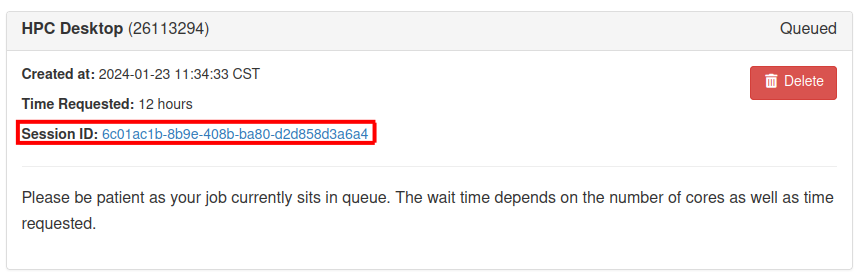

1. Wait for the job to fail. Afterwards, refresh the file browser, select all of the files (do not include the `desktops` or `..` folders), and click `Download`.

    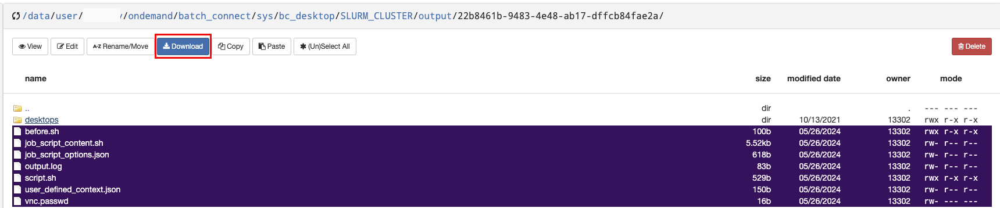

1. Take all of the files that were downloaded, put them in a new folder, and zip the folder.

[Submit a ticket](../../index.md#how-to-contact-us) to us explaining the issue with the zip folder created in Step 4 attached to the email, and we will be happy to assist. If you would like to inspect the log yourself for debugging, the `output.log` typically will contain the relevant error messages.
