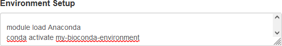
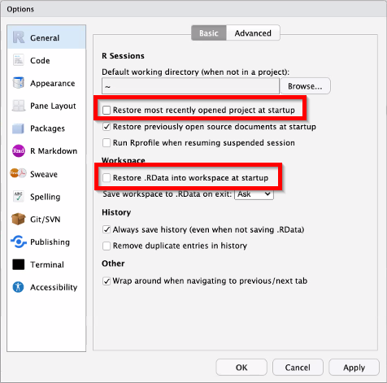

# RStudio

RStudio is available for use graphically in your browser via OOD. As with other standalone programs, you'll need to select the resources required using the job creation form. You'll also need to select both the version of RStudio you wish to use, and the version of R you wish to use. To adjust the environment, please use the Environment Setup field to load modules besides R and RStudio as seen below. All other modules and paths should be loaded here as it is difficult to load and consistently use modules once RStudio starts.



<!-- markdownlint-disable MD046 -->
!!! important

    Unless an older version of R is absolutely necessary, it is highly suggested to always use the newest version of R and RStudio for both updated functionality within those software as well as updated compilers for package installation. Using the newest version of R solves most known package installation errors.
<!-- markdownlint-enable MD046 -->

## RStudio and Python

If you have a workflow that uses both R and Python, it is strongly recommended to use the [reticulate](https://rstudio.github.io/reticulate/) package along with Anaconda environments. Reticulate allows researchers to load Python packages into a native R session as objects. For instance, if someone prefer some functionality of the `pandas` package but has other code already written in R, they can import `pandas` to R and use both simultaneously.

This also allows researchers to download precompiled command line binaries into an Anaconda environment and easliy use them in their R scripts.

For setup, use the following steps:

1. In a terminal on a compute node, either in an HPC Desktop job or by clicking the blue Host button on any job card:

    1. Load the `Anaconda3` module
    1. Create an Anaconda environment. More information about how to create Anaconda environments can be found [in our documentation](../../workflow_solutions/using_anaconda.md).
    1. Activate your environment and install your requuired python packages using either `pip install` or `conda install` depending on the package source.

    <!-- markdownlint-disable MD046 -->
    !!! note

        The preceding steps should only need to be run once. If other Python packages need to be installed in the same environment, repeat steps 1 and 3. You will not need to recreate your environment.
    <!-- markdownlint-enable MD046 -->

1. In RStudio:

    1. Add the command `module load Anaconda3` to the Environment Setup window when requesting the RStudio job.
    1. If not already installed, install the `reticulate` package using either `install.packages` or the [renv](#rstudio-projects-and-renv) package.
    1. Use `reticulate::use_condaenv('env_name')` to load your conda environment.
    1. From here, you will be able to interact with all of the python packages and non-python precompiled binaries in your Anaconda environment using R and RStudio. Please read more about how to do that in [reticulate's documentation](https://rstudio.github.io/reticulate/#importing-python-modules).

For cases where your R code only needs access to precompiled binaries or libraries and does not need to import any Python libraries, you can instead create your Anaconda environment and add the following lines into the Environment Setup window:

``` bash
module load Anaconda3
conda activate <env_name>
```

This will add those binaries and libraries to your environment `$PATH` which RStudio will inherit.

<!-- markdownlint-disable MD046 -->
!!! important

    If you're wanting to directly use any Python package in R, **DO NOT** include the `conda activate` command in the Environment Setup. Use `reticulate` instead as described above.
<!-- markdownlint-enable MD046 -->

## RStudio Projects and `renv`

The most recent versions of RStudio installed on Cheaha support R Projects as well as package management through the `renv` package. Please read more about improving analysis reproducibility using both of these tools in our [workflow solutions](../../workflow_solutions/r_environments.md)

## Using Pandoc and `knitr` Within RStudio

If you want to use RMarkdown to create reports in RStudio, R modules using version 4.2.0 and later include `knitr` compatibility. Please use the latest versions of both R and Rstudio for fully integrated `knitr` functionality.

## Starting With a Clean Session to Avoid Errors

By default, RStudio loads the most recently opened project at startup and restores the `.RData` file into the workspace. If you only work on a single project, this may be helpful. If you frequently change projects then these default settings can create difficult-to-diagnose errors, or you may inadvertently alter a project by adding incorrect packages, for example.

To reduce the risk of these kinds of errors, uncheck the highlighted fields below in the RStudio Options menu under the "General" selection.

- Restore most recently opened project at startup
- Restore .RData into workspace at startup


