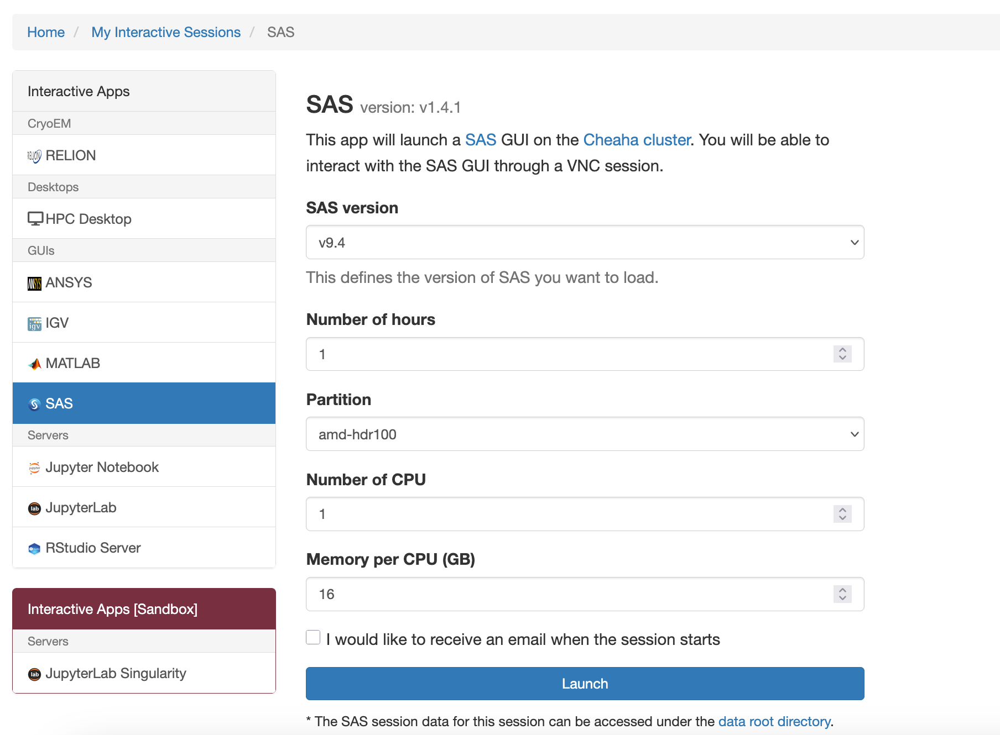

# SAS Interactive Apps

SAS is available for use graphically in your browser via OOD. As with other standalone programs, you will need to select the resources required using the job creation form. You will also need to select the version of SAS you wish to use.

To launch SAS, select the menu: Interactive Apps -> SAS. The job creation and submission form will appear, where you can configure:

