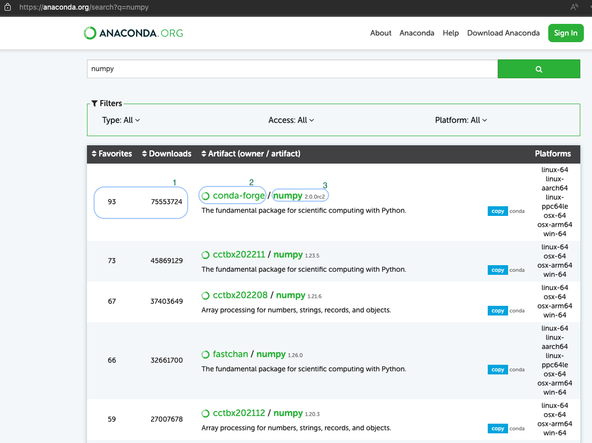

# Good Practice for Finding `conda` Software Packages

Finding `conda` software packages involves searching through the available channels and repositories to locate the specific packages that contain functions that you need for your environment. Channels instruct `conda` where to look for packages when installation is to be done. In the sections below, you will see information on how to locate packages important for your work, ensure the packages are up-to-date, figure out the best way to install them, and finally compose an environment file for portability and replicability.

## Step-by-Step Guide to Finding `conda` Software Packages

If we find the package at one of the channel sources mentioned above, we can check the Platform version to ensure it is either "noarch" (if available) or linux. After noting the version, we can click the "source" or "repo" link (if available) or "homepage". Then we try to find the latest version. For a package found on GitHub, click "Releases" on the right-hand side. Verify that the latest Release is the same as, or very close to, the version on the `conda-forge` channel or PyPI. If so, the package is being maintained on `conda-forge` or PyPI and suitable for use. Note the exact software name, version, and channel (if not on PyPI). We prefer searching using the following methods, and usually have the most success in the order listed below.

- Using Google: You may already be familiar with the exact `conda` package name you require. In the event this is not the case, a simple web engine search with key words usually finds the package. For example, a web search for a `conda` package would be something along the lines of "conda package for `Generic Topic Name`". Your search results, should return popular package names related to the topic you have searched for. In the sections below, there is an attempt to provide a detailed step-by-step guide on how to find Conda packages using "numpy" as an example.

- Conda-Forge: The conda-forge channel is the primary source for finding Conda packages while using Miniforge. You can visit [Conda-forge](https://conda-forge.org/packages/) and use the search bar to find the package you need. For example, when you get the package name from your web search (using numpy). You will enter name of the package in the search bar as shown below. But please take note to look for packages that show that package is available via the conda-forge channel.


You may also search on the [Anaconda](https://anaconda.org) page. However, ensure you always use the package with the `conda-forge` Artifact. Enter the package name, then review results of your search, it is advised to use “Artifacts” that are compatible with the platform you are working with, as well as a package that has the most “Favorites” and “Downloads” numbers. Click on the portion that contains the name of the package (highlighted 3 in the image below). 1 highlights the Artifact, Favorite and Downloads numbers, the selection 2 highlights the Channel where this package is stored.

Review results of your search, it is advised to use "Artifacts" that are compatible with the platform you are working with, as well as have the most "Favorites" and "Downloads" numbers. Click on the portion that contains the name of the package (highlighted 3 in the image below). 1 highlights the Artifact, Favorite and Downloads numbers, the selection 2 highlights the Channel where this package is stored. Always take note of this, as only packages installed from the `conda-forge` or `bioconda` channel are open-source and devoid of any usage restrictions.



<!-- markdownlint-disable MD046 -->
!!! important

    The `anaconda` and `r` channels are subject to the Anaconda Terms of Service and may not be used for UAB business. The `conda-forge` and `bioconda` channels are free to use.
<!-- markdownlint-enable MD046 -->

Follow the installation instructions you see in the image below.


- Using the `conda` Search Command: You can use the `conda search <package_name>` command directly in your terminal to find packages. Replace `<package_name>` with the package you would like to search for. To do this on Cheaha, make sure to `module load Miniforge3` first, and follow the instructions to [activate](../../workflow_solutions/using_conda.md#activate-an-environment) an environment. Then do `conda search numpy`. You should get a long list of numpy packages. Review this output, but take note of the highlighted portions in the image. The section with a red selection shows the numpy versions that are available, The section with a blue selection shows the channel where each numpy version is stored. Ensure you pick the stable versions that are associated with either `conda-forge` or `bioconda`.


You can then install numpy with a specific version and from a specific channel with.

```bash
    conda install -c conda-forge numpy=2.0.0rc2
```
<!-- markdownlint-disable MD046 -->
!!! important

    The `anaconda` and `r` channels are subject to the Anaconda Terms of Service and may not be used for UAB business. The `conda-forge` and `bioconda` channels are free to use.
<!-- markdownlint-enable MD046 -->

- Using Specific channels: You can also get packages using specific `conda` channels listed below.

    - Conda-Forge: A community-driven channel with a wide variety of packages.Visit [Conda-Forge](https://conda-forge.org/)

    - Bioconda: A channel specifically for bioinformatics packages. Visit [Bioconda](https://bioconda.github.io/)

You should specify a channel in your search, and it will show you a list of the packages available in that channel, using `conda search -c <channel_name> <package_name>`, remember to replace <channel_name> and <package_name> with the channel and package names you are searching for respectively. An example would be.

```bash
    conda search -c conda-forge numpy
```

If we find the package at one of these sources, we check the Platform version to ensure it is either noarch (if available) or linux for it to work on Cheaha ("noarch" is usually preferred for the sake of portability). Noting the version, we can click the "source" or "repo" link (if available) or "homepage". Then we try to find the latest version. For a package found on GitHub, click "Releases" on the right-hand side. Verify that the latest Release is the same as, or very close to, the version on `conda-forge` or PyPI. If so, the package is being maintained on `conda-forge` or PyPI and suitable for use. Note the exact software name, version, and channel (if not on PyPI).


If we don't find a package using Google, or the `conda-forge` and PyPI pages are out of date, then it may become very hard to use the software in a `conda` environment. It is possible to try installing a git repository using pip, but care must be taken to choose the right commit or tag. You can find more [info here](https://pip.pypa.io/en/stable/cli/pip_install/#examples). To search for a git repository try:

1. github "name".
1. gitlab "name".

Remember to replace name with name of `conda` package.

<!-- markdownlint-disable MD046 -->
!!! note

There are issues with out-of-date software. It may have bugs that have since been fixed and so makes for less reproducible science. Documentation may be harder to find if it isn't also matched to the software version. Examining the README.md file for instructions may provide some good information on installing the package. You can also reach out to us for [support](../../help/support.md) in installing a package.
<!-- markdownlint-enable MD046 -->

When we have a complete list of `conda` packages and channels, then we can create an environment from scratch with all the dependencies included. For `conda` packages, add one line to dependencies for each software. For PyPI packages add - pip: under dependencies. Then under - pip:add `==` to pin the version, see below. The advantage to using an environment file is that it can be stored with your project in GitHub or GitLab, giving it all the benefits of [version control](../../workflow_solutions/git_collaboration.md).

```yaml
name: test-env
dependencies:
  - bioconda::methbat=0.13.2  # Pinned version from bioconda channel
  - conda-forge::python=3.10.4  # Pinned version from conda-forge channel
  - pip
  - pip:
    - numpy==1.26.4  # Pinned version for pip
    - git+https://github.com/user/repo.git  # Example of installing from a Git repo
    - http://insert_package_link_here  # For URL links
```

 For git repos, add them under `- pip:` based on examples [here](https://pip.pypa.io/en/stable/cli/pip_install/#examples). See the section [Replicability versus Portability](../../workflow_solutions/using_conda.md#replicability-versus-portability) for more information.

The above configuration is only for illustration purposes, to show how channels and dependencies can be used. It is best to install all of your packages from conda channels, to avoid your environment breaking. Only packages that are unavailable via conda, should be installed via pip. If you run into challenges please [contact us](../../index.md#how-to-contact-us).

## Key Things To Remember

1. Exploring Package Documentation: For each package, check the documentation to understand its features, version history, and compatibility.

1. Regularly consider updating your environment file to manage dependencies and maintain compatible software environments. Also newer software tends to resolve older bugs, consequently improving the state of science.

1. Verify Package Version and Maintenance: Ensure you are getting the latest version of the package that is compatible with your environment. Verify that the package is actively maintained by checking the source repository (e.g., GitHub, GitLab). Look for recent commits, releases, and issue resolutions. The concepts of version pinning and semantic versioning, explain this in detail.

## Version Pinning

Version pinning in `conda` environments involves specifying exact versions of packages to ensure consistency and compatibility. This practice is crucial for reproducibility, as it allows environments to be reproduced exactly, a critical component in research and collaborative projects. Version pinning also aids stability, by preventing unexpected changes that could break your environment, code or analysis. This practice also maintains compatibility between different packages that rely on specific dependencies. To implement version pinning, you can create a YAML file that lists the exact versions of all installed packages or specify versions directly when [creating](../../workflow_solutions/using_conda.md#create-an-environment) or updating environments using Conda commands.

## Semantic Versioning

[Semantic versioning](https://semver.org) is a versioning scheme using a three-part format (MAJOR.MINOR.PATCH) to convey the significance of changes in a software package. In `conda` environments, it plays a role in managing compatibility, version pinning, dependency resolution, and updating packages. The MAJOR version indicates incompatible API changes, i.e. same software package but operation and interaction are mostly different from what you are accustomed to in the previous version. The MINOR version adds backward-compatible functionality, i.e. same version of software package but now contains new features and functionality. Operations and interactions are still mostly the same. While PATCH version includes backward-compatible bug fixes, i.e. same major and minor versions now have a slight change, perhaps a bug or some small change, still same features, operations and interactions, just the minor bug fix. Using semantic versioning helps maintain consistency and compatibility by ensuring that updates within the same major version are compatible, and by allowing precise control when specifying package versions.

In practice, updating a Major version of a package may break your workflow, but may increase software reliability, stability and fix bugs affecting your science. Changing the major version may also introduce new bugs, these concerns and some others are some of the tradeoffs that have to be taken into consideration. Semantic versioning helps with managing `conda` environments by facilitating precise [version pinning](#version-pinning) and dependency resolution. For instance, you can pin specific versions using Conda commands or specify version ranges to ensure compatibility as shown in the examples above. Semantic versioning also informs upgrade strategies, letting us know when to upgrade packages based on the potential impact of changes. By leveraging semantic versioning, you can maintain stable and consistent environments, which is essential for smooth research workflows.
