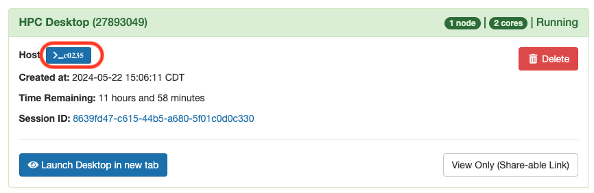
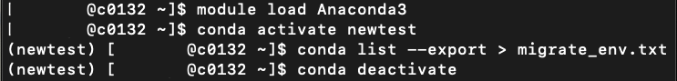
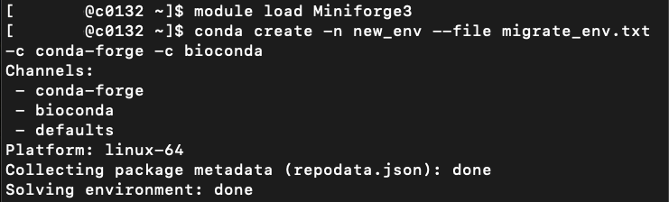
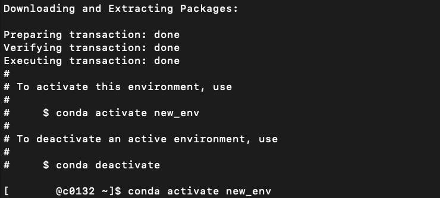
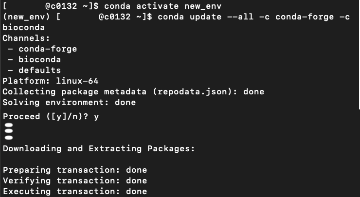
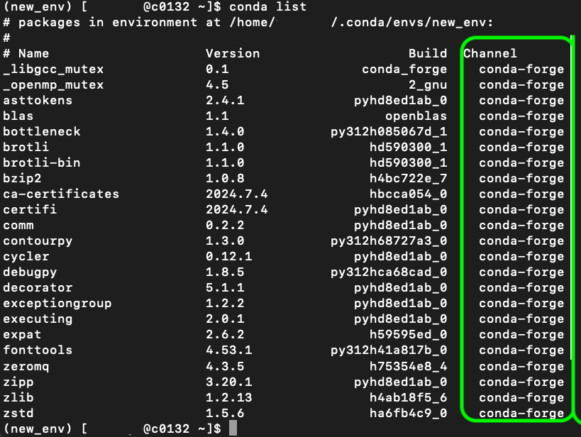

# Migrating Conda Environments using Miniforge

This tutorial will guide you through the steps necessary for migrating Conda environments originally installed with the `default`, `anaconda` or `r` channels to use the Miniforge module and the `conda-forge` or `bioconda` channels.

## Prerequisites

**Access to Terminal**
Access the terminal on Cheaha. You can access the terminal for a compute node on Cheaha, after creating an interactive job. Click on the highlighted part of the image below to access the terminal.



## Steps for Migrating your Conda Environment

**Load Anaconda Module**
You will need to load the Anaconda module using the `module load Anaconda3` command, in a terminal.

**Activate the Original Conda Environment**
Activate the environment you want to migrate:

```bash
conda activate <your_old_environment>

```

Replace `<your_old_environment>` with the name of your existing Conda environment. In this tutorial the environment `newtest` will be used as an example.

```bash
conda activate newtest

```

   

**Export the Environment to a .txt File:**
Export the environment to a `.txt` file, which captures the list of installed packages and their versions:

   ```bash
   conda list --export > <filename.txt>

   ```

Name the file as you see fit.

   ```bash
   conda list --export > migrate_env.txt

   ```

When the file has been created, deactivate your Anaconda environment, and do a module reset using the `conda deactivate` and `module reset` commands respectively.

**Load the Miniforge Module**
The next step is to load the Miniforge module on Cheaha using the `module load Miniforge3` command.

**Create a New Conda Environment:**

By default Miniforge creates a new environment using the `conda-forge` channel, but for this example we specifically include the option to use the conda-forge and bioconda channels:

   ```bash
   conda create -n <new_environment_name> --file <environment_backup.txt> -c conda-forge -c bioconda

   ```

Replace `<new_environment_name>` with your desired new environment name. This command will read from the `environment_backup.txt` file and install the packages from the specified channels like `conda-forge` and `bioconda` channels.

   ```bash
   conda create -n new_env --file migrate_env.txt -c conda-forge -c bioconda

   ```



After completing the above steps we will now need to update the environment using the Conda-Forge or Bioconda channels.



**Activate the New Environment:**
Activate the new environment you created:

   ```bash
   conda activate <new_environment_name>

   ```

**Update All Packages to Use the Conda-Forge Channel:**

Update all packages in the environment to ensure they are installed from the `conda-forge` or `bioconda` channels:

   ```bash
   conda update --all -c conda-forge -c bioconda

   ```

   

Now we have created the environment and updated the packages inside the environment, we can verify packages within our environment by following the below steps.

**Check Installed Packages:**
Verify that all packages have been correctly installed using the `conda-forge` or `bioconda` channels:

   ```bash
   conda list

   ```

Look at the "channel" column to ensure most packages are from `conda-forge` or `bioconda`.



**Test the New Environment:**

Run your scripts or workflows that depend on this environment to confirm that everything functions as expected. You may then decide to remove your old environments to free up space.

**Remove the Old Environment:**

If everything works correctly with your new environment, you can remove the old environment:

   ```bash
   conda env remove -n <your_old_environment>

   ```

You may or may not switch modules to delete the environment, but we advise you switch modules to delete environments created with the Anaconda module.

   ```bash
   conda env remove -n newtest

   ```

   
