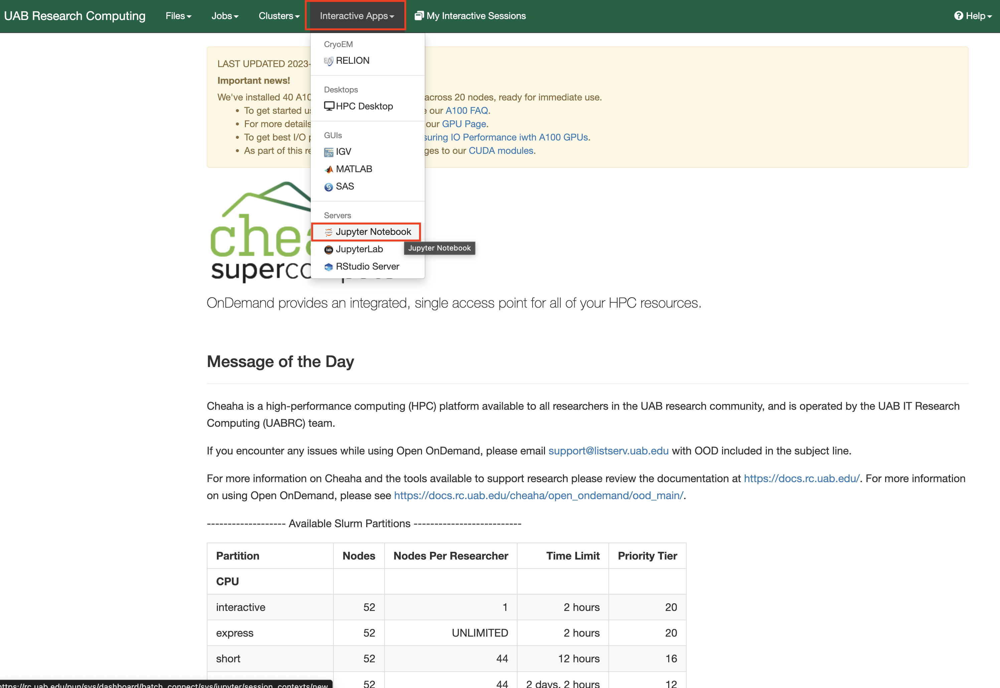
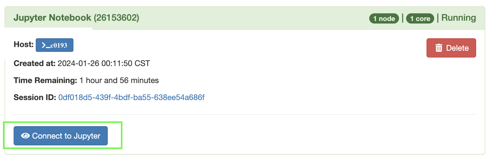
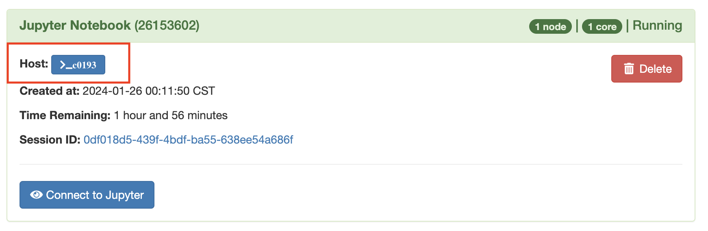
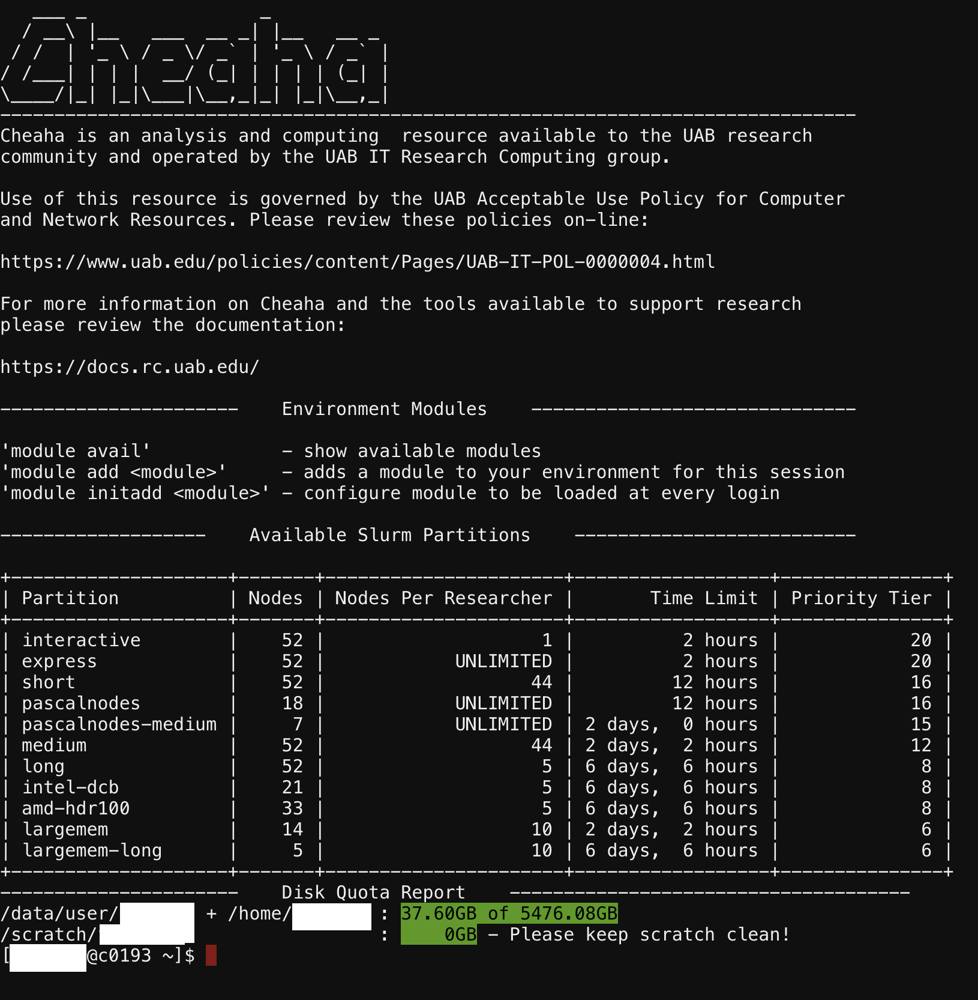
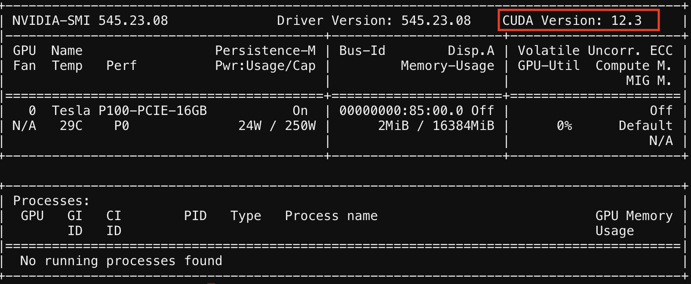
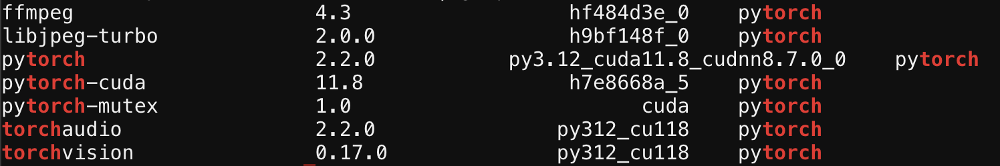
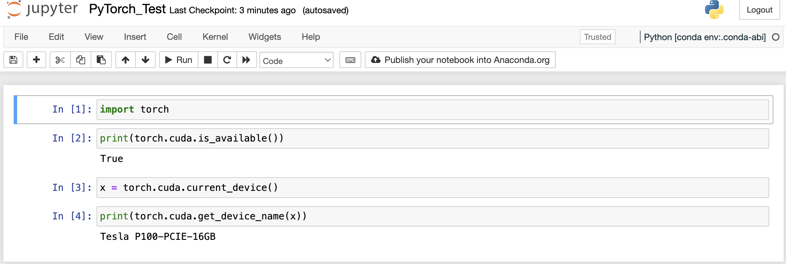
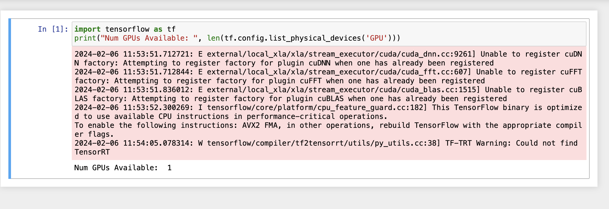

# Anaconda Environment Tutorial for PyTorch and TensorFlow

The below tutorial would show you steps on how to create an Anaconda environment, activate, and install libraries/packages for machine and deep learning (PyTorch and Tensorflow) using an Anaconda environment on Cheaha. There are also steps on how to access the terminal, as well as using Jupyter Notebook's Graphical User Interface (GUI) to work with these Anaconda environments. There are detailed steps here to guide your creation of a [Jupyter Notebook job.](../open_ondemand/ood_layout.md#interactive-apps)

<!-- markdownlint-disable MD046 -->
!!! note

    CUDA modules are used in this tutorial. Please note that the latest CUDA and cuDNN are now available from [Conda](../slurm/gpu.md#cuda-and-cudnn-modules). The tutorial provides good practices, but ages over time. You may need to modify the scripts to be suitable for your work.
<!-- markdownlint-enable MD046 -->

<!-- markdownlint-disable MD046 -->
!!! note

    Be mindful that there are special considerations when submitting GPU jobs to maximize performance. See [Making the Most of GPUs](../slurm/gpu.md#making-the-most-of-gpus) for more information. This is not necessary for the tutorial in this page, but may benefit your research computation.
<!-- markdownlint-enable MD046 -->

## Installing Anaconda Environments Using the Terminal

To access the terminal (shell), please do the following.

1. Login to [rc.uab.edu](https://rc.uab.edu)

1. Create a job on Cheaha using the Interactive Apps dropdown option.

1. Select Jupyter Notebook and fill out the options, as per your project needs, then click Launch. For more information on compute needs, and a guide for selecting the right options, please see our [Job Efficiency - Estimating Resources](../job_efficiency.md#estimating-compute-resources) page.

    

1. Click the Connect to Jupyter button 

    You will see the below interface. 

1. When the job has been created, on the My Interactive Sessions page, click the button in front of Host (usually colored blue) in the format >_c0000.

    

    This should open into a terminal as shown below.

    

1. In this interface, you can create, and activate environments, as well as install packages, modules and libraries into your activated environment.

## How Do We Create a Custom Environment for PyTorch and TensorFlow

The instructions below, provide a recommended step by step guide to creating and activating an environment that has PyTorch and/or TensorFlow installed and ready to use for deep learning projects.

Please see our [Training Resources page](../../education/training_resources.md#the-carpentries) for a link to an introductory deep learning course.

## Installing PyTorch Using the Terminal

There are two instances of PyTorch that can be installed, one requiring GPUs, and another utilizing only CPUs. The use of GPUs improve compute speeds and are preferred. For both instances of pytorch, please follow these steps;

1. For a correct installation of pytorch using GPUs, we have to ensure some conditions are met (Request a partition that has GPUs, and then load the requisite `CUDA` module). You can see our [documentation](../hardware.md#details) for details on our Partition offerings. The command below shows how to load the CUDA toolkit in your environment setup form (see image below) when requesting for resources.

```bash
module load CUDA/11.8.0
```


<!-- markdownlint-disable MD046 -->
!!! note

    The cudatoolkit version may vary, as at the time of this tutorial, 11.8 is the version used. Running `nvidia-smi`, as in the image below, will show you the status, version and other information on GPUs in your created job session. The CUDA version is highlighted. The GPU CUDA Version available on Cheaha as of 2025-02-25 is `12.6.0`. Newer versions are available from [Conda](../slurm/gpu.md#cuda-and-cudnn-modules). Because the toolkit version used is lower than the Cheaha GPU version, it works.
<!-- markdownlint-enable MD046 -->



1. [Access the terminal](#installing-anaconda-environments-using-the-terminal).

1. [Create an Environment](../../workflow_solutions/using_anaconda.md#create-an-environment) and [Activate the Environment](../../workflow_solutions/using_anaconda.md#activate-an-environment).

<!-- markdownlint-disable MD046 -->
!!! note

    When installing packages, modules, and libraries into environments, remember to also install `ipykernel` using `conda install ipykernel`. The `ipykernel` package must be installed for Jupyter to find it.

    See our [Working With Anaconda Enironments section](../../cheaha/open_ondemand/ood_jupyter_notebook.md#working-with-anaconda-environments) for how to switch environments in [Jupyter Noteooks](../../cheaha/open_ondemand/ood_jupyter_notebook.md).

<!-- markdownlint-enable MD046 -->

1. Run the following command to install a GPU compatible PyTorch version into your environment.

    ```bash
    conda install pytorch torchvision torchaudio cudatoolkit=11.8 -c pytorch -c nvidia
    ```

1. Verify PyTorch is installed using the following command.

    ```bash
    conda list torch
    ```

    You should get an output like the image and code section below.

    

    ```bash

    # Package details

    # Name        Version   Build                           Channel
    ffmpeg        4.3       hf484d3e_0                      pytorch
    libjpeg-turbo 2.0.0     h9bf148f_0                      pytorch
    pytorch       2.2.0     py3.12_cuda11.8_cudnn8.7.0_0    pytorch
    pytorch-cuda  11.8      h7e8668a_5                      pytorch
    pytorch-mutex 1.0       cuda                            pytorch
    torchaudio    2.2.0     py312_cu118                     pytorch
    torchvision   0.17.0    py312_cu118                     pytorch
    ```

The same process can be followed for installing the deep learning library Tensorflow, with some diffrences. See the [Install Tensorflow GPU Using the Terminal](#install-tensorflow-gpu-using-the-terminal) section below. You may decide to install the TensorFlow library into the same environment or create a new one. As a best practice, you may want to install these libraries in different environments.

## Using PyTorch on Jupyter Notebook

As an example we will be using a sample Jupyter Notebook with just a simple torch function to test if a GPU will be utilized with PyTorch functions. Run the command in a cell, and if your output is `True`, then you have your GPU setup to support PyTorch functions.

```python
import torch

print(torch.cuda.is_available())
x = torch.cuda.current_device()
print(torch.cuda.get_device_name(x))
```



## Install TensorFlow GPU Using the Terminal

1. Create a new environment that is compatible with supported tensorflow versions, use the below command to do this. For this tutorial we will use Python 3.11.

    ```bash
    conda create -n tensorflow python=3.11
    ```

1. Activate the conda environment created in Step 1.

    ```bash
    conda activate tensorflow
    ```

1. The TensorFlow CPU and GPU versions requires pip to be up-to-date. To install and upgrade pip to the latest version, within your conda environment use the below command. See our [section](../../cheaha/open_ondemand/ood_jupyter_notebook.md#pip-installs-packages-outside-of-environment), on why installing pip within a conda environment is advised.

    ```bash
    pip install --upgrade pip
    ```

1. Install TensorFlow with pip

    ```bash
    pip install tensorflow[and-cuda]
    ```

The image below shows an output that the TensorFlow library will utilize the available GPU.



<!-- markdownlint-disable MD046 -->
!!! note

    The information (I) and warning (W) outputs notifies you of the installed Tensorflow binary and how it would function. The I output informs you that the installed Tensorflow library will utilize your CPU for additional speed when GPUs are not the most efficient way to do processing for these operations. The W output tells you TensorRT is not available, please note TensorRT is not currently supported on our systems.
<!-- markdownlint-enable MD046 -->

Now that you have completed the tutorial, you can find more Anaconda information here, [Using Anaconda page](../../workflow_solutions/using_anaconda.md#anaconda).
