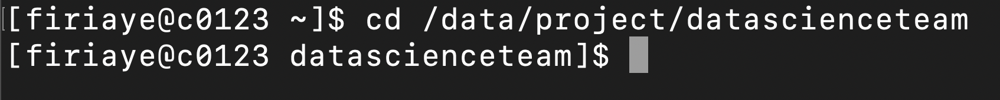
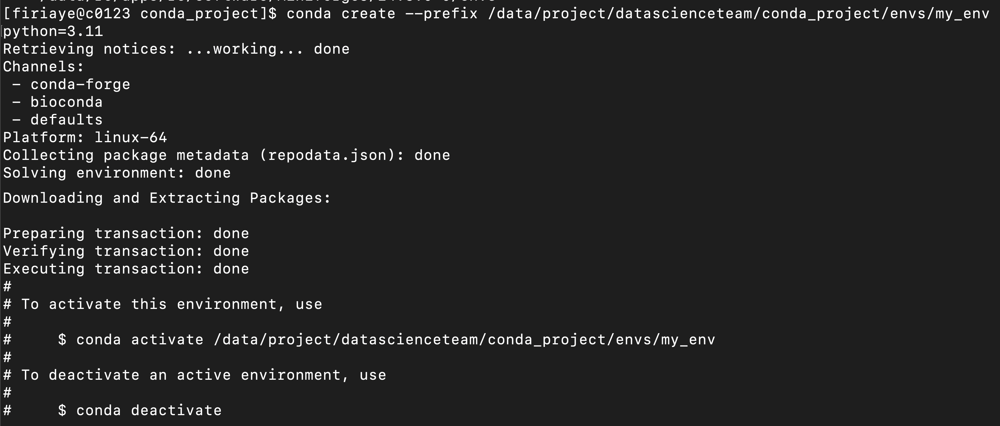
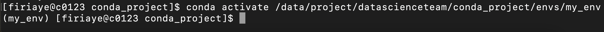
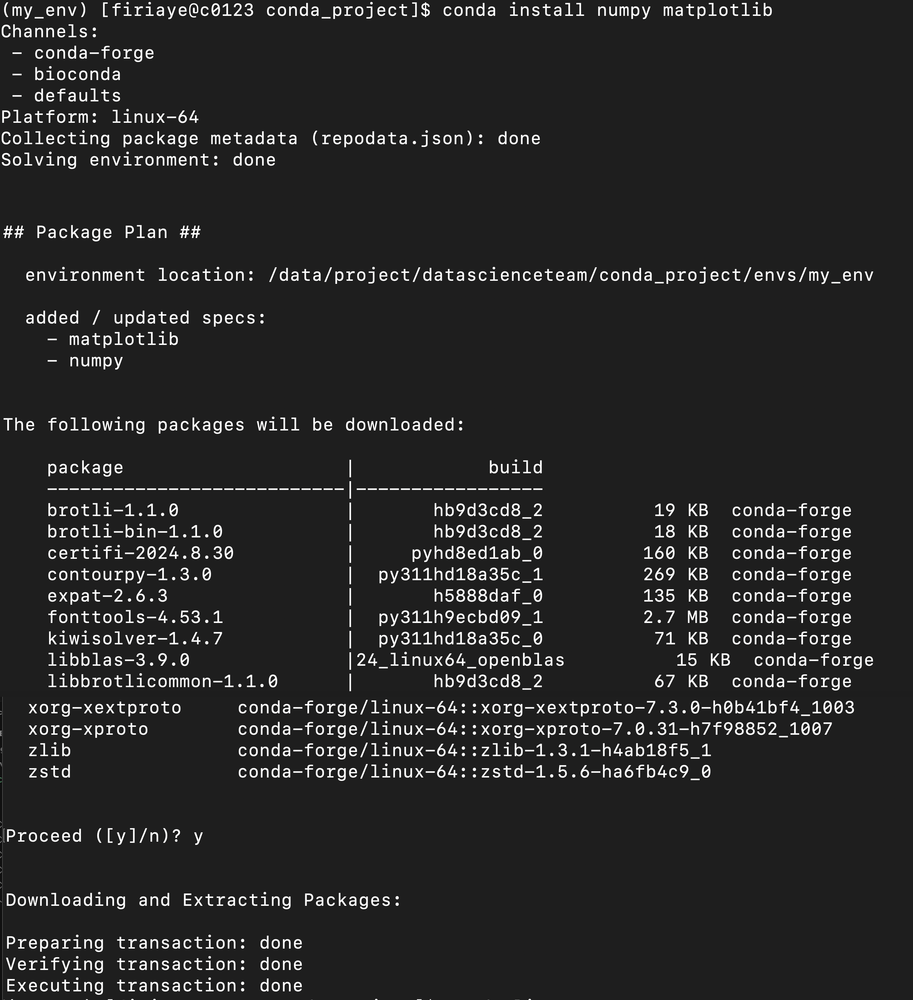

# Using Conda in a Project Space on Cheaha

This tutorial will guide you through setting up and using a Conda environment in a project space on Cheaha. In this tutorial we use Miniforge3, a minimal installer for Conda, which will simplify the environment setup and management. For this tutorial, we are creating a new Conda environment, activating it, and installing two Conda packages.

## Load the Miniforge3 Module

Next, log in to Cheaha, and gain access to a Compute Node using the Terminal. There are detailed instructions [here](../getting_started.md#login-vs-compute-nodes). When in a compute node, load the Miniforge3 module to use Conda:

```bash
module load Miniforge3
```


## Create a Conda folder in your Project Space on Cheaha

**Navigate to the shared location where you want to create your Conda folder. Make sure that this location has the necessary permissions for all collaborators:**

```bash
cd /data/project/chosen/shared/location
```



**Create the Conda folder:**

```bash
mkdir conda_project

cd conda_project
```


**You may need to adjust the permissions to ensure the folder is accessible by all members of your project space on Cheaha:**

```bash
chmod -R 770 conda_project
```


This command grants read, write, and execute permissions to the user and group (i.e. You as owner of the project space on Cheaha, as well as members of your project space), this will allow members of your project space on Cheaha access, and restrict others.

## Initialize Conda

To create a Conda environment that can be shared with members of your project space, we use the command below to initialize Conda in the folder location:

```bash
conda config --add envs_dirs /data/project/preferred/shared/location/conda_project/envs
```


This command sets the Conda environment directory to the shared folder within your project space on Cheaha.

## Create a Conda Environment in the Shared Folder

Now, create a new Conda environment in the shared project folder:

```bash
conda create --prefix /data/project/preferred/shared/location/conda_project/envs/my_env python=3.11
```



Replace `/data/project/preferred/shared/location/conda_project/envs/my_env` with the path to your shared folder and `python=3.11` with the desired version of Python or any other package you want to install. This will create a Conda environment named `my_env`. This can be replaced with an environment name of your choosing.

### Activate the environment

```bash
conda activate /data/project/chosen/shared/location/conda_project/envs/my_env
```



## Install Packages in the Conda Environment

Once the environment is activated, install any necessary packages:

```bash
conda install <package name>
```

<package_name> is a placeholder for the actual name of the software package you want to install in your conda environment.

For example, if you want to install numpy and matplotlib, you would replace <package_name> with numpy, and matplotlib like this:

```bash
conda install numpy matplotlib
```



You can replace `numpy matplotlib` with the name(s) of package(s) required for your project. When you're done working, deactivate the environment:

```bash
conda deactivate
```

## Share the Environment with Collaborators

Share the location of the Conda environment ( `env` ) with your collaborators, and the below steps will activate that environment. They must load the Miniforge3 module before they can activate the environment in the project space:

```bash
module load Miniforge3
conda activate /path/to/shared/location/my_project/envs/my_env
```

## Managing the Conda Environment

We have [documentation](../../workflow_solutions/using_anaconda.md#using-anaconda) on managing Conda environments within your personal Cheaha account. That guide also applies to managing environments in a shared project space on Cheaha. The only exception would be to use the command [here](#activate-the-environment), that references the location of your environment within a project space you have access to, so you can activate it.
