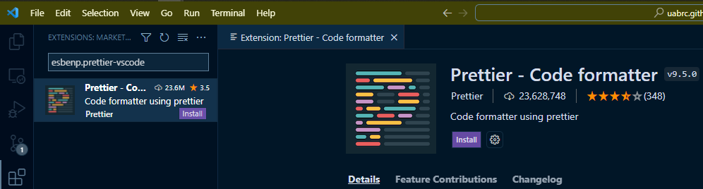

# Contributor Guide

We welcome contributions from our community. To ensure a high-quality documentation experience, we have some guidelines for contributors who wish to create.

## Prerequisites

We are using Visual Studio Code (VSCode) for development with the following extensions installed. While VSCode is not required, it can help with automating formatting, linting and Anaconda environment management. VSCode may be obtained from [Visual Studio Code](https://code.visualstudio.com/) and documentation is available at [VSCode: Docs](https://code.visualstudio.com/docs).

It is assumed you have Anaconda installed on your local machine. See <https://docs.anaconda.com/anaconda/install/> for more information on installing Anaconda.

### Required VSCode Extensions

- Python: `ms-python.python` (for Anaconda environment management)
- Markdown All in One: `yzhang.markdown-all-in-one`
- markdownlint: `DavidAnson.vscode-markdownlint`
- Prettier - Code formatter: `esbenp.prettier-vscode`

Search for and install extensions using the extension menu (keyboard shortcut: ++ctrl+shift+x++). More information on managing extensions is available at [VSCode: Extension Marketplace](https://code.visualstudio.com/docs/editor/extension-marketplace).



### Handy VSCode Hotkeys

- Open command palette: ++ctrl+shift+p++
- Open extensions: ++ctrl+shift+x++
- Open new terminal: ++ctrl+shift+grave++
- Find in all files: ++ctrl+shift+f++
- Commenting and uncommenting code using ++ctrl+slash++
    - For a single line, click anywhere on that line to place the caret, then press ++ctrl+slash++
    - For commenting a block of text, select the block, then press ++ctrl+slash++

### VSCode `settings.json` Additions

To make the best use of formatting extensions for this project, please add the following block to your `settings.json` file. These changes can be made:

  1. Within the VSCode project file in the `.vscode` folder, affecting only this project. To make these changes find or create the file `.vscode/settings.json` *--OR--*
  2. To the global VSCode settings file, affecting all projects. To change the global file, press ++ctrl+shift+p++ to open the Command Palette, then search for `Preferences: Open Settings (JSON)` and append the following content.

```json
  "[html]": {
    "editor.defaultFormatter": "vscode.html-language-features"
  },
  "[markdown]": {
    "editor.defaultFormatter": "yzhang.markdown-all-in-one",
    "editor.detectIndentation": false,
    "editor.insertSpaces": true,
    "editor.tabSize": 4,
    "editor.wordWrap": "on"
  },
  "[yaml]": {
    "editor.defaultFormatter": "esbenp.prettier-vscode"
  },
  "markdown.extension.list.indentationSize": "inherit",
  "markdownlint.config": {
    "MD046": { "style": "fenced" }
  }
```

### Obtaining a Working Copy of the Code

Before you can get started working on contributions, you'll need a copy of the repository. The first step, done only once, is to fork the repository in GitHub to your personal account. The repository is located at <https://github.com/uabrc/uabrc.github.io>. More in-depth documentation on forking can be found at [GitHub: Fork a Repo](https://docs.github.com/en/get-started/quickstart/fork-a-repo).

Once the fork has been created, you can clone your fork using the Command Palette (++ctrl+shift+p++) and `Git: Clone...` in VSCode, or at the command line. More information on cloning can be found at [GitHub: Cloning a Repository](https://docs.github.com/en/repositories/creating-and-managing-repositories/cloning-a-repository). More information on using git can be found at our [git page](../workflow_solutions/git_collaboration.md).

### Local Machine Setup (Laptop/Desktop)

The Python extension will activate when you open any Python file. The file `test.py` has been added for convenience, simply open that file to activate the extension. The extension will show the currently activated environment near the bottom-left corner of the VSCode window. There is no other known way to activate the Python extension at this time.

Please [create an Anaconda environment](../workflow_solutions/using_anaconda.md#create-an-environment) using `build_env.yml` using the following in the VSCode terminal.

```shell
conda env create -f build_env.yml
```

Activate the environment in VSCode by clicking the currently activated environment in the bottom-left of the VSCode window. A menu will appear allowing you to select from discovered environments. You may need to reload VSCode to get the environment to appear if it was just created.

To build the documentation locally, use `mkdocs build` in the VSCode terminal. Be sure to fix all warnings before submitting a pull request.

## Workflow for Contributing

The workflow below assumes you are using VSCode and all of the prerequisites listed above. Some familiarity with git and GitHub are assumed.

### Create a working branch

You'll need to create a new branch on your local machine (the working branch). The purpose of a branch is to encapsulate a coherent set of changes to add or deprecate a feature, or fix a bug. Typically each bug is associated with one issue, or a set of very closely-related issues. See our [Issue Tracker](https://github.com/uabrc/uabrc.github.io/issues) for available issues.

- A branch should be created to resolve an issue, and lives only until the issue is resolved.
- Give the branch a short but meaningful name for your intended changes.
- For bug fixes use names like `fix-broken-link` or `fix-page-formatting`.
- For new features or pages, use names like `feat-lts-page` or `feat-accessibility-improvement`.
- Command to create new branch in terminal: `git checkout -b <name>`.

### Implement your changes

You'll need to add, remove or otherwise modify files as appropriate to implement the changes you intend.

- [Stage and commit](../workflow_solutions/git.md#staging-and-committing-changes) changes in small units as you go.
- Be sure you are on the correct [branch](../workflow_solutions/git.md#how-do-i-manage-branches), i.e. your working branch!
- VSCode facilitates staging and committing files.

    

### Verify your changes

1. [Activate](../workflow_solutions/using_anaconda.md#activate-an-environment) your conda environment.
    1. Open the file `test.py` in the repository to start the Python extension.
    2. Select the interpreter using <https://code.visualstudio.com/docs/python/environments#_select-and-activate-an-environment>
2. Open a VSCode terminal using ++ctrl+shift+grave++.
3. Execute the command `mkdocs serve`

    

4. If a new browser tab does not open automatically, use your browser to navigate to `http://localhost:8000`.
5. Ensure your changes look and function as expected.

    

### Make a pull request

1. [Push](../workflow_solutions/git.md#pushing) your local working branch to your GitHub remote repository.
2. Navigate to the upstream repository at <https://github.com/uabrc/uabrc.github.io>.
3. Click the "Pull requests" tab and click the "New pull request" button.

    

4. Click the link "compare across forks".

    

5. There are four drop-down menus.
    1. The left two drop-down menus are for the base repository and should say `uabrc/uabrc.github.io` and `main` by default. Be sure that they do.
    2. In the third drop-down menu, select your fork.
    3. In the fourth drop-down menu, select your working branch.

    

6. Click the "Create pull request" button to open the pull request creation form.
    1. Give your pull request a concise and informative name. The name should describe what the pull request changes at a high level.
    2. In the description box, give details about what was changed at a conceptual level. The actual details of the changes can be viewed in the "Commits" and "Files changed" tabs.
    3. If you want reviewers to be able to make changes to your pull request (recommended) then leave the "Allow edits" checkbox checked.

    

### Wait for review

From here your pull request will go through a review process. The following criteria are checked.

1. No linting errors
2. Correct formatting
3. Image alternate text (alt text)
4. Images must use the gallery functionality, formatted as ``. Note the leading `!` in the alttext.
5. Valid internal and external links.
6. Quality, organization and accuracy of contribution.

We will do our best to check information for accuracy, as well as proofread the text. Bear in mind Research Computing staff time is limited and we are not infallible, so please double-check your pull requests! Your audience is your research colleagues at UAB and beyond, and possibly even you at a future date!

## Reviewing Pull Requests

<!-- markdownlint-disable MD046 -->
!!! note

    Currently only RC Data Science staff have permissions to review pull requests.
<!-- markdownlint-enable MD046 -->

Reviewing a pull request means obtaining a copy of the pull request branch and [Verifying the Changes](#verify-your-changes) on your local machine or on your fork. GitHub provides a facility for obtaining pull request branches directly from the upstream repository.

### Add upstream remote

[Add the Upstream Remote](../workflow_solutions/git.md#managing-remotes) using `git remote add upstream https://github.com/uabrc/uabrc.github.io.git`.

### Pull the pull request

1. [Fetch](../workflow_solutions/git.md#fetching-and-pulling) the pull request with `git fetch upstream pull/<id>/head:<branch-name>`.

    

    1. Replace `<id>` with the pull request id number.
    2. Replace `<branch-name>` with the branch name from the pull request source.

2. [Checkout](../workflow_solutions/git.md#checking-out-existing-branches) the branch using `git checkout <branch-name>`.
3. Follow the instructions for [Verifying Changes](#verify-your-changes)
4. (Optional) make modifications to the pull request.
    1. Before starting, make sure that the pull request author has allowed edits to their branch.
    2. [Add the Author's Fork as a Remote](../workflow_solutions/git.md#managing-remotes).
    3. [Push changes to the Author's Fork](../workflow_solutions/git.md#pushing). Be sure to push to the correct remote!

## File Organization

- Main headings are based on [UAB Research Computing services](https://www.uab.edu/it/home/research-computing/research-digital-marketplace)
- Favor placing new pages and information into an existing section over creating
- Approach documentation from a problem solving angle rather than a technology. Examples:
    - Section title "Installing Software Yourself with Anaconda" vs "Anaconda"
    - Section title "Running Analysis Jobs" vs "SLURM"
- Put redirects for any page moves in case someone has bookmarked a page (see Redirect section below)

## Markdown Formatting

- Links must be one of the following formats including all punctuation and brackets:
    - Bare:
        - `<https://google.com>`
        - `<support@listserv.uab.edu>`
    - Named with a schema:
        - `[website](https://google.com)`
        - `[email](mailto:support@listserv.uab.edu)` note the `mailto:` schema!
    - Relative internal
        - `[relative internal](help/faq.md)`
- All internal links must be relative. For example, use `./file.md` not `/docs/file.md`.

## Redirects

If a page name must change, or the location of a page must change, it is necessary to create a redirect for that page so we don't break bookmarks and incoming links targeting our documentation.

Redirecting pages is possible using the plugin at <https://github.com/datarobot/mkdocs-redirects>. To redirect a page, add a line in `mkdocs.yml` under the following keys. The line takes the form `original page location: new page location`, and each side of `:` must be a full path under `docs/`. An example is below.

```yaml
plugins:
  - redirects:
      redirect_maps:
        account_management/uab_researcher.md: account_management/cheaha_account.md
```

## Section Index Pages

To create a section index page:

1. Create a file called `index.md` in a reasonable directory location for that section.
2. Add something like the following to that section entry under `nav:` in `mkdocs.yml`.

    ```yml
    nav:
      ...
      - Cheaha Guide:
        - cheaha/index.md  # add the index.md here.
        - Hardware: ...
        - ...
      ...
    ```

3. When a site visitor clicks `Cheaha Guide` in the nav pane, the page `cheaha/index.md` will be loaded.

## Linting Known Issues

There are known issues with the markdown linter and some of our non-standard plugins, especially admonitions (specifically a conflict involving fenced vs indented code blocks). To fix these cases please use one of the following methods. The `<lint warning code>` can be found by hovering over the yellow squiggles in VSCode to bring up the warning lens.

Please do not use these to silence all linter warnings, only for fixing known issues. Please read the warning lenses given by VSCode to identify the cause of the warning.

### Silence Linter Warning for a Block

```markdown
<!-- markdownlint-disable <lint warning code> -->
`linter error here`

`maybe multiple lines`
<!-- markdownlint-enable <lint warning code> -->
```

### Silence Linter Warning for a Single Line

We encourage denoting the warning being silenced here by filling out the `<lint warning code>`, though it isn't required for the single line case.

```markdown
<!-- markdownlint-disable-next-line <lint warning code> -->
`linter error here just for this line`
```

### False Positive Lint Warnings from Admonitions

We allow and encourage the use of [admonitions](https://squidfunk.github.io/mkdocs-material/reference/admonitions/#supported-types) in our documentation, where appropriate. Because these are created using a plugin and are "non-standard" `markdown`, the VSCode `markdownlint` extension does not recognize admonitions and may produce a false positive warning about inconsistent code block styles.

Two styles of code block are allowed in `markdown`: `fenced` and `indented`. To work around the false positive warning about admonitions, we require all code blocks to be `fenced`. This is enforced by adding an entry to the [VSCode `settings.json` file](#vscode-settingsjson-additions). Now all admonitions will be consistently assigned the warning `MD046`, which can be disabled by placing all admonitions in between the following comment block fences. The comment lines must be indented to the same level as the start of the admonition.

```markdown
<!-- markdownlint-disable MD046 -->

<!-- markdownlint-enable MD046 -->
```

The process can be simplified in VSCode using snippets. Bring up the command palette and type `snippets` and open `Preferences: Configure User Snippets`. Then type `markdown` and open it. A `json` file will be opened. Add the following content between the outermost braces and then save the file.

```json
  "Disable Markdown Lint MD046 for a Block": {
    "prefix": "md046 disable",
    "body": [
      "<!-- markdownlint-disable MD046 -->",
      "$TM_SELECTED_TEXT",
      "<!-- markdownlint-enable MD046 -->"
    ],
    "description": "Disables warning Markdown Lint MD046 for the selected block."
  }
```

The snippet will surround selected text with the appropriate linter disable fencing for MD046. To use the snippet, opne the IntelliSense lens using `ctrl + space` (or `cmd + space`), then type `md046` until the `prefix` shows up as the first entry in the list. Then press `tab`.

The workaround is needed because `markdownlint` has no plans to add support for admonitions. There is no `markdownlint` plugin for that support either, and we don't have the ability to develop such a plugin.

## Slurm Hardware, Partitions, QoS Tables

Building hardware tables is a semi-automated script based on a manually curated table. The repository is located here: <https://gitlab.rc.uab.edu/rc-data-science/data-science-internal/cluster-fabric-docs>. Be warned that the scripts may move to a github.com repo in the future.

Building Partition and QoS tables is automated based on `scontrol` output. The repository is located here: <https://github.com/wwarriner/slurm_status_tools>. Be warned the link may change in the future when we fork to the UABRC group that houses the docs repo.

## Accessibility

Color vision deficiency checker: <https://www.toptal.com/designers/colorfilter/>
Contrast checker: <https://webaim.org/resources/contrastchecker/>

## Branding Guidance

- Brand main page: <https://www.uab.edu/toolkit/branding>
- Brand colors: <https://www.uab.edu/toolkit/brand-basics/colors>
- Copyright guidance: <https://www.uab.edu/toolkit/trademarks-licensing/uab-trademarks>

## Terminology

- `Research Computing (RC)` for the IT group supporting campus HPC resources.
- `UAB Campus Network` for the hard-wired network physically located on UAB campus, and the UAB Secure wifi.
- `UAB Campus VPN` for the VPN to tunnel remote connections through the UAB Campus Network.
