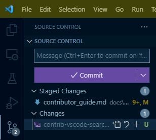
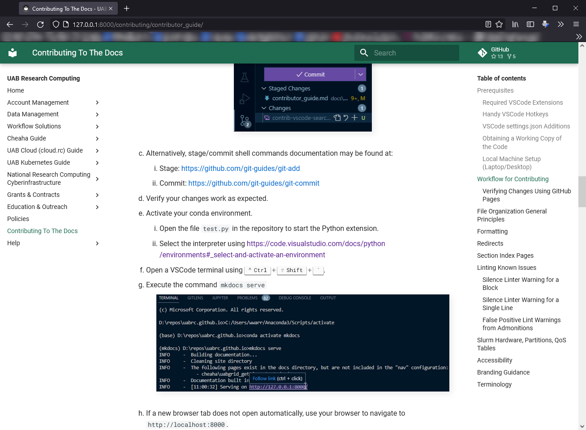
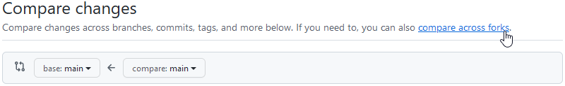
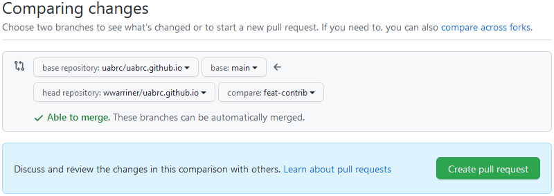
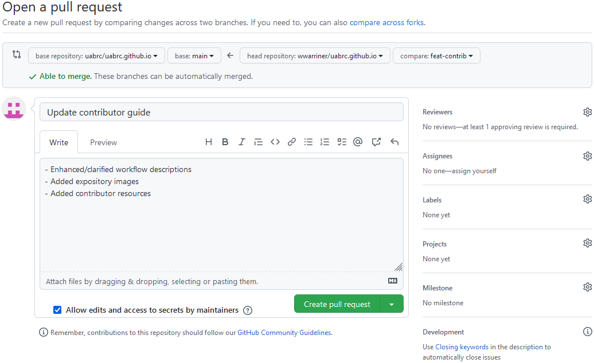
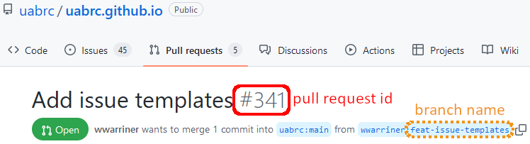

# Contributor Guide

We appreciate any and all opportunities to improve our documentation, and your contributions are welcome! To ensure a high-quality documentation experience, we have some guidelines for contributors who wish to create.

## FAQ

### How Do I Report Content Inaccuracies or Errors?

- Prepare to write write down what you've found:
    - Note the URL of the page using your browser's address bar.
    - Note the section where the inaccuracy is located.
    - Have in mind a way to share what you've found and why you believe it is inaccurate.
- [Create a new issue](https://github.com/uabrc/uabrc.github.io/issues/new/choose)
    - Click "Get Started" next to "Inaccuracy Report".
    - Write a brief title that closely describes what you found.
    - Under "What is Inaccurate?" please write the specifics of what content is not accurate or contains errors, and any relevant explanations.
    - Under "Where is the Inaccuracy?" please paste the URL of the page from your browser's address bar, along with the section where you found inaccuracy.

## Creating Content

We welcome content from our community! Most style choices and formatting are automated by our VSCode development environment, and most validation steps are automated with pre-commit hooks and CI/CD.

If you wish to use VSCode, read [Our Preferred Development Environment](#our-preferred-development-environment), and most of the work should be taken care of for you. VSCode will provide syntax highlighting and formatting automatically if you install the recommended extensions. Some linter warnings cannot be fixed automatically, so please pay close attention to what they say, and reference our [Style Guide](#style-guide) for guidance.

If you choose not to use VSCode, be mindful of our [Style Guide](#style-guide) section below for guidance on how to craft content that meet our standards. Our [Automation](#development)

If you need assistance, please feel free to [contact us](../help/support.md).

### Our Preferred Development Environment

We understand that everyone has differing preferences when it comes to development environments, so please feel free to use the development environment of your choice. Please be aware that our content has been developed using VSCode and a collection of extensions, so the greatest level of support can be provided by us to you if you choose to use our tooling.

We are using Visual Studio Code (VSCode) for development with several extensions installed, listed below. The extensions are also in `.vscode/extensions.json` and should pop up as recommendations when you open this repository. We use VSCode for the productivity benefits related to local Conda environment management, git integration, and dynamic formatters and linting. Linting is provided by pre-commit hooks and in our Continuous Integration definitions.

VSCode may be obtained from [Visual Studio Code](https://code.visualstudio.com/) and documentation is available at [VSCode: Docs](https://code.visualstudio.com/docs). The extensions should automatically show up as recommendations when opening the repo, or they can be downloaded using the VSCode Extensions menu (++ctrl+shift+x++ on Windows or ++command+shift+x++ on Mac).

We assume you have a `conda` distribution on your local machine. If you are affiliated with UAB, please install [Miniforge](https://conda-forge.org/miniforge/). For detailed installation instructions, see here: <https://github.com/conda-forge/miniforge/?tab=readme-ov-file#install>. For more information on using `conda`, see our [Anaconda page](../workflow_solutions/using_anaconda.md).

### Style Guide

#### Documentation Markdown Files

Documentation file style is automated and enforced by `markdownlint` through Continuous Integration when a Pull Request is made and when changes are pushed to the main branch. Linting is controlled by the `.markdownlint.json` file in the repository root. Linting codes are documented here: <https://github.com/DavidAnson/markdownlint/tree/main/doc>. Our choices are outlined below. We are using [markdownlint-cli2](https://github.com/DavidAnson/markdownlint-cli2) for markdown linting.

To manually lint, see [the manual linting section](#manual-markdown-linting).

Admonitions are allowed, see more about [admonition false positives](#false-positive-lint-warnings-from-admonitions) for how to use them and pass markdownlint limitations.

Sometimes the Table of Contents, rendered on the right-hand side of pages, can get long or deeply nested, becoming hard to scan. If this happens on a page, use the `front matter` snippet. Move the caret to the top of the document, access the snippets menu from the command palette ++ctrl+shift+p++, select "Snippets: Insert Snippet", then select `front matter`. The default level is 3, but this can be adjusted as needed.

##### Headings

- **MD003**: Open ATX headers denoted by one or more leading hash `#` characters.
- **MD022 - Headings**: Headings must have exactly one blank line before and one after.
- **MD025 - Headings**: Only one top-level heading (single hash `#` character) allowed per file.
- **MD041 - Headings**: The first line in each file must be a top-level heading (single has `#` character).
- **MD043 - Headings**: Heading structure is not prescribed.

Headings are also checked for [title case consistency by a plugin](#title-casing-plugin).

##### Whitespace

- **MD009 - Whitespace**: Trailing spaces not allowed.
- **MD010 - Whitespace**: Hard tab characters `\t` not allowed.
- **MD012 - Whitespace**: Multiple consecutive blank lines not allowed.
- **MD030 - Whitespace**: Exactly one space character between list item markers and list item contents, e.g., `1. item`.

##### Lists

- **MD004**: Unordered list items markers are the dash `-` character.
- **MD007**: Unordered list indentation of 4 characters.
- **MD029**: All ordered list item markers are `1.` to provide consistent width and spacing for improved readability.

##### Code Blocks

- **MD031**: Fenced code blocks must have exactly one blank line before and one after.
- **MD040**: Fenced code block language may contain additional content, allowing the use of, e.g., line numbering with `mkdocs-material`.
- **MD046**: Code blocks must be fenced style, e.g., surrounded by `` ``` ``.
- **MD048**: Fenced code blocks must use backtick `` ` `` characters.

##### Misc

- **MD013**: Line length not enforced. Use word wrapping in your editor instead.
- **MD033**: No HTML elements allowed, e.g. `<br>`.
- **MD035**: Horizontal rules must be exactly `---`.
- **MD044**: Proper names should have correct capitalization. Code blocks are excluded, HTML elements are included. See the `.markdownlint.json` file, in the repository root, for a complete list.
- **MD049**: Emphasized text (_this text is emphasized_) must use single underscores, e.g., `_this text is emphasized_`.
- **MD050**: Strong text (**this text is strong**) must use double asterisks, e.g., `**this text is strong**`.
- **MD055**: Table rows must have leading and trailing pipe `|` characters.

#### CSV Files for Markdown Tables

Prefer to use commas `,` as separators, quoting entries with double quotes `"` where necessary. These are required by the default table reader plugin settings. Formatting and style are not automated at this time.

Most simple markdown formatting used within CSV Files will be rendered as expected, while other complex markdown features might not display as expected.

- **Avoid Complex Formatting**
    - Since markdown linters often ignore content within CSV tables, it is best to avoid complex formatting and limit heavy styling inside these tables.
- **Control Line Breaks within Table Cells**
    - Use `<br>` without surrounding spaces for a new line.
    - Use `<br>&nbsp;` to create a new, indented line within the cell. Including the extra two spaces enhances consistency with unordered lists elsewhere in markdown.
- **Limitations of CSV Tables**
    - CSV tables don’t support ordered lists effectively.
    - Stick to simple bullet lists with two-space indentation.
    - If a list requires multiple levels or detailed formatting, consider placing the content outside the table. A link to this content can be added to the table to maintain context.
- **Cross-Linking**
    - We encourage cross-linking from within tables to other parts of the documentation, or linking to external resources, as appropriate.
- **Creating Anchors for Internal Links**
    - When linking within the document, create anchors by using `<span id='$anchor-name'>text</span>`, where `$anchor-name` is the name you wish to use in the internal link and HTTPS URL. The anchor name should be in lowercase with only numerals and dashes `-` as separators. For example:
        - "Lab PI's" becomes the anchor `lab-pis` and you can format it in the text as `<span id='lab-pis'>Lab PI's</span>`.
        - Keep anchor names simple, matching headers as closely as possible for consistency across documentation generated by MkDocs material.

#### `.title-casing-ignore`

A list of custom title cased words and terms, one word/term per line. Words cannot contain spaces.

This list is ignored by the [title case checking plugin](#title-casing-plugin) in the mkdocs build process.

#### `mkdocs.yml`

Style is not automated at this time as the cost is greater than the benefit. Entries in the following keys should be sorted alphabetically. Write lists and maps in the dashed style, rather than the bracketed `[]` style.

- `markdown_extensions:`
- `plugins:`
- `plugins: redirects: redirect-maps:`

#### `build_env.yml`

Style is not automated at this time as the cost is greater than the benefit. Entires in the following keys should be sorted alphabetically.

### Development

The workflow below assumes you are using VSCode and all of the prerequisites listed above. Some familiarity with git and GitHub are assumed.

#### Obtaining a Working Copy of the Repository

Before you can get started working on contributions, you'll need a copy of the repository. The first step, done only once, is to fork the repository in GitHub to your personal account. The repository is located at <https://github.com/uabrc/uabrc.github.io>. More in-depth documentation on forking can be found at [GitHub: Fork a Repo](https://docs.github.com/en/pull-requests/collaborating-with-pull-requests/working-with-forks/fork-a-repo).

Once the fork has been created, you can clone your fork using the Command Palette (++ctrl+shift+p++) and `Git: Clone...` in VSCode, or at the command line. More information on cloning can be found at [GitHub: Cloning a Repository](https://docs.github.com/en/repositories/creating-and-managing-repositories/cloning-a-repository). More information on using git can be found at our [git page](../workflow_solutions/git_collaboration.md).

#### Local Machine Setup (Laptop/Desktop)

With the repository open for editing in VSCode, open a VSCode terminal window and follow the steps below.

1. Configure the Conda environment. This is the backbone of everything that makes the documentation work.
    1. Install `conda` on your machine using [Miniforge](https://conda-forge.org/miniforge/), if you haven't already.
    1. Configure `conda` to be visible to VSCode. The Miniforge default install choices will help do this correctly for your operating system. **Important:** On Windows, do _not_ add `conda` to your `PATH` variable as it can disrupt proper operating system functioning.
    1. Install the conda environment from `build_env.yml` using the following command.

        ```shell
        conda env create --file build_env.yml
        ```

1. Register the Conda environment with this repository in VSCode. Once this is done, the Conda environment should automatically load and be used when viewing any Python files, and should automatically activate in any new terminal windows within VSCode.
    1. Open the Command Palette (++ctrl+shift+p++).
    1. Search for "Python: Select Interpreter" and select it.
    1. Search for the installed environment and select it.

1. Install pre-commit hooks to enable automatic validation of files as you commit.
    - Run the terminal command `pre-commit install`

1. Install recommended extensions to enable automatic linting and formatting as you type and save your contributions.
    1. Open the VSCode Extensions browser.
        - Windows and Linux: ++ctrl+shift+x++
        - MacOS: ++cmd+shift+x++
    1. Type `@recommended` in the search field.
    1. Install the extensions from the list.

Now the [pre-commit hooks](#pre-commit-hooks) should function as expected and manual validation is available on your local machine. You will also be able to build and serve the documentation locally to help you check your contributions before making a pull request.

To build the documentation locally, press ++f5++ in VSCode to start a local server and open the docs in your browser. This is provided by the `.vscode/launch.json` file. Alternatively, use `mkdocs serve --open` in a terminal to get the same effect. Be sure you've got your `conda` environment activated! We recommend trying this now to test your setup.

##### Updating the Conda Environment

Run the following command to update the existing environment.

```shell
conda env update --name mkdocs --file build_env.yml --prune
```

#### Development Workflow

##### Create a Working Branch

You'll need to create a new branch on your local machine (the working branch). The purpose of a branch is to encapsulate a coherent set of changes to add or deprecate a feature, or fix a bug. Typically each bug is associated with one issue, or a set of very closely-related issues. See our [Issue Tracker](https://github.com/uabrc/uabrc.github.io/issues) for available issues.

- A branch should be created to resolve an issue, and lives only until the issue is resolved.
- Give the branch a short but meaningful name for your intended changes.
- For bug fixes use names like `fix-broken-link` or `fix-page-formatting`.
- For new features or pages, use names like `feat-lts-page` or `feat-accessibility-improvement`.
- Command to create new branch in terminal: `git checkout -b <name>`.

##### Implement Your Changes

You'll need to add, remove or otherwise modify files as appropriate to implement the changes you intend.

- [Stage and commit](../workflow_solutions/git.md#staging-and-committing-changes) changes in small units as you go.
- Be sure you are on the correct [branch](../workflow_solutions/git.md#how-do-i-manage-branches), i.e. your working branch!
- VSCode facilitates staging and committing files.

    

##### Verify Your Changes

1. [Activate](../workflow_solutions/using_anaconda.md#activate-an-environment) your conda environment.
    1. Open the file `test.py` in the repository to start the Python extension.
    1. Select the interpreter using <https://code.visualstudio.com/docs/python/environments#_select-and-activate-an-environment>
1. Open a VSCode terminal using ++ctrl+shift+grave++.
1. Execute the command `mkdocs serve`

    

1. If a new browser tab does not open automatically, use your browser to navigate to `http://localhost:8000`.
1. Ensure your changes look and function as expected.

    

##### Make a Pull Request

1. [Push](../workflow_solutions/git.md#pushing) your local working branch to your GitHub remote repository.
1. Navigate to the upstream repository at <https://github.com/uabrc/uabrc.github.io>.
1. Click the "Pull requests" tab and click the "New pull request" button.

    

1. Click the link "compare across forks".

    

1. There are four drop-down menus.
    1. The left two drop-down menus are for the base repository and should say `uabrc/uabrc.github.io` and `main` by default. Be sure that they do.
    1. In the third drop-down menu, select your fork.
    1. In the fourth drop-down menu, select your working branch.

    

1. Click the "Create pull request" button to open the pull request creation form.
    1. Give your pull request a concise and informative name. The name should describe what the pull request changes at a high level.
    1. In the description box, give details about what was changed at a conceptual level. The actual details of the changes can be viewed in the "Commits" and "Files changed" tabs.
    1. If you want reviewers to be able to make changes to your pull request (recommended) then leave the "Allow edits" checkbox checked.

    

##### Wait for Review

From here your pull request will go through a review process. The following criteria are checked.

1. No linting errors
1. Correct formatting
1. Image alternate text (alt text)
1. Images must use the gallery functionality, formatted as ``. Note the leading `!` in the alttext.
1. Valid internal and external links.
1. Quality, organization and accuracy of contribution.

We will do our best to check information for accuracy, as well as proofread the text. Bear in mind Research Computing staff time is limited and we are not infallible, so please double-check your pull requests! Your audience is your research colleagues at UAB and beyond, and possibly even you at a future date!

### File Organization

- Main headings are based on [UAB Research Computing services](https://www.uab.edu/it/home/research-computing/research-digital-marketplace)
- Favor placing new pages and information into an existing navigation section over creating a new section.
- Approach documentation from a problem solving angle rather than a technology. Examples:
    - Section title "Installing Software Yourself with Anaconda" vs "Anaconda"
    - Section title "Running Analysis Jobs" vs "Slurm"
- Add redirects for any pages that move, in case someone has bookmarked a page, see [redirects](#redirects)
- Images for a given page must be placed in a directory called `images/` at the same level as the page itself.

### New Markdown Pages

- Follow the [content style guide](#style-guide) when creating new pages.
- Add an entry to the `nav:` section of `mkdocs.yml`. Every page that isn't a Section Index must have a title and path, as shown below. The title will be checked for [title case consistency by a plugin](#title-casing-plugin). Paths are relative to the `/docs/` directory.

    ```yml
    nav:
        # other pages and sections
        - Page About a Specific Topic: /path/to/page.yml
        # other pages and sections
    ```

### Section Index Pages

To create a section index page:

1. Create a file called `index.md` in a reasonable directory location for that section.
1. Add something like the following to that section entry under `nav:` in `mkdocs.yml`.

    ```yml
    nav:
      ...
      - Cheaha Guide:
        - cheaha/index.md  # add the index.md here.
        - Hardware: ...
        - ...
      ...
    ```

1. When a site visitor clicks `Cheaha Guide` in the nav pane, the page `cheaha/index.md` will be loaded.

### Redirects

If a page name must change, or the location of a page must change, it is necessary to create a redirect for that page so we don't break bookmarks and incoming links targeting our documentation.

Redirecting pages is possible using the plugin at <https://github.com/datarobot/mkdocs-redirects>. To redirect a page, add a line in `mkdocs.yml` under the following keys. The line takes the form `original page location: new page location`, and each side of `:` must be a full path under `docs/`. An example is below.

```yaml
plugins:
  - redirects:
      redirect_maps:
        account_management/uab_researcher.md: account_management/cheaha_account.md
```

Maintain the list in alphabetic order.

### Accessibility Tools

- Color vision deficiency checker: <https://www.toptal.com/designers/colorfilter/>
- Contrast checker: <https://webaim.org/resources/contrastchecker/>

### UAB Branding Guidance

- Brand main page: <https://www.uab.edu/toolkit/branding>
- Brand colors: <https://www.uab.edu/toolkit/brand-basics/colors>
- Copyright guidance: <https://www.uab.edu/toolkit/trademarks-licensing/uab-trademarks>

## Automation

We strive to have CI/CD and pre-commit hooks aligned. This is achieved by using configuration files and consistent tool versioning where possible, and keeping-up-to-date where not.

### Configuration Files

- `.github/`
    - `workflows/`
        - `check_docs.yml`: Defines the pipeline for building the docs to verify integrity as part of pull requests only. Requires `reusable_check_markdown.yml` and `shared/build_docs_pages/action.yml`.
        - `check_python.yml`: Defines the pipeline for linting python code files.
        - `check_yaml.yml`: Defines the pipeline for linting yaml files.
        - `deploy_docs.yml`: Defines the pipeline for deploying the docs to GitHub Pages. Requires `reusable_check_markdown.yml` and `shared/build_docs_pages/action.yml`.
        - `reusable_check_markdown.yml`: Defines the pipeline for linting Markdown files.
    - `shared/`
        - `build_docs_pages/action.yml`: Defines a composite pipeline for building the docs.
- `.linkcheckerrc`: Defines configuration for linkchecker, a non-automated process for identifying broken and redirected URLs in the documentation. See `verification_scripts/linkchecker.py`.
- `.markdownlint-cli2.jsonc`: Defines constraints and configuration for the `markdownlint-cli2` command-line application.
- `.markdownlint.json`: Defines markdownlint rules.
- `.pre-commit-config.yaml`: Defines configuration of pre-commit hooks.
- `.title-casing-ignore`: List of words and terms to ignore for the [title case checking plugin](#title-casing-plugin).
- `.yamllint.yaml`: Defines yaml lint rules.
- `.ruff.toml`: Defines Python lint rules for the ruff linter.
- `build_env.yml`: Defines the Conda environment used to support this project's automation.
- `mkdocs.yml`: Defines the documentation content configuration.
    - See also `build_scripts/` for scripts used during the mkdocs build process.

### CI/CD

CI/CD is used to ensure consistency and formatting of markdown and YAML files via linting. This stage of validation checks for errors during the Pull Review process and during the build process on GitHub.

- Linting: `markdownlint` runs via [markdownlint-cli2-action](https://github.com/DavidAnson/markdownlint-cli2-action).
- Internal links are validated by the `mkdocs build` [validation configuration](https://www.mkdocs.org/user-guide/configuration/#validation).

Relevant files:

- `.github/**/*.yml`
- `.markdownlint-cli2.jsonc`
- `.markdownlint.json`
- `.title-casing-ignore`
- `.yamllint.yaml`
- `.ruff.toml`
- `build_env.yml`
- `mkdocs.yml`

### Pre-Commit Hooks

We use [pre-commit hooks](https://pre-commit.com/) to ensure contributions match our standards for consistency, formatting, and URL validity prior to pull requests.

- Pre-commit runs [markdownlint-cli2](https://github.com/DavidAnson/markdownlint-cli2) on markdown files.
- Pre-commit runs `mkdocs build` to validate links.
    - Internal links are validated by the `mkdocs build` [validation configuration](https://www.mkdocs.org/user-guide/configuration/#validation).

The `mkdocs-htmlproofer-plugin` can take substantial time to run. To disable it modify the file `.htmlproofer.env` to read `ENABLED_HTMLPROOFER=False`. Be sure not to commit this change! It is recommended to discard this change and re-run validaitions before submitting a pull request.

To use the pre-commit hooks, you _must_ have `conda` on your system `PATH` and have installed the bundled `build_env.yml` environment.

Relevant files:

- `.markdownlint-cli2.jsonc`
- `.markdownlint.json`
- `.pre-commit-config.yaml`
- `.title-casing-ignore`
- `.yamllint.yaml`
- `.ruff.toml`
- `build_env.yml`
- `mkdocs.yml`

### Mkdocs Plugins

#### Title-Casing Plugin

Headings are checked for title case consistency by a [custom mkdocs plugin](https://github.com/uabrc/mkdocs-title-casing-plugin). The following are checked:

- Page titles in the `nav:` section of `mkdocs.yml`.
- Headings in markdown page content files.

Warnings are emitted for inconsistent titles together with a suggestion of what title would pass the check. Title case checking is very hard and the suggestion is not perfect, please double-check its correctness. Software names like `renv`, `s3cmd`, and `cat` should be added to the `.title-casing-ignore` file including backticks, and used in headings with the backticks. More examples of the kind of words and terms to add are located in the ignore file.

### Manual Validation

#### Manual Pre-Commit Hooks

We are using [pre-commit](https://github.com/pre-commit/pre-commit) to automate commit validation. This includes [markdown linting](#manual-markdown-linting), [YAML linting](#manual-yaml-linting), and a [strict build of the documentation](#manual-documentation-build).

Relevant files:

- `pre-commit-config.yaml`

#### Manual Markdown Linting

We are using [markdownlint-cli2](https://github.com/DavidAnson/markdownlint-cli2) for markdown linting.

To run this command in isolation, without `pre-commit`, takes additional setup. The command-line interface and engine are not available through Conda. Instead you will need the Node Package Manager on your system. See the repo referenced above for installation instructions.

Run `markdownlint-cli2 "**/*.md" "#node_modules" 2> markdownlint-cli2-out.log` and review the output.

Relevant files:

- `.markdownlint-cli2.jsonc`
- `.markdownlint.json`

#### Manual YAML Linting

We are using [yamllint](https://github.com/adrienverge/yamllint) for YAML linting.

Run `yamllint . 2> yamllint-out.log`.

Relevant files:

- `.yamllint.yaml`

#### Manual Documentation Build

Run `mkdocs build --strict > mkdocs-build-out.log 2>&1`

Relevant files:

- `.title-casing-plugin`
- `mkdocs.yml`

#### Manual External URL Validation

We are using [linkchecker](https://github.com/linkchecker/linkchecker) to validate external repository URLs.

1. Run `python scripts/linkchecker.py`
1. Review `out/linkchecker-out.csv` (feel free to ignore `out/linkchecker.log` unless you want verbose details)

Output columns:

- `document-url`: URL as it is written in the documentation.
- `url-after-redirect`: URL after all redirection is complete.
- `document`: Location of the file containing the URL on the local filesystem.
- `line`: Line number where the URL is located.
- `column`: Column number of the first character in the URL.

Relevant files:

- `.linkcheckerrc`

### Known Issues

#### Linting Known Issues

There are known issues with the markdown linter and some of our non-standard plugins, especially admonitions (specifically a conflict involving fenced vs indented code blocks). To fix these cases please use one of the following methods. The `$MD_LINTER_CODE`, referenced below, looks like `MD046` with various integers. The code specific to your issue can be found by hovering over the yellow squiggles in VSCode to bring up the warning lens.

This should only be used to silence the specific known issues below. In all other cases, please read the warning lenses given by VSCode to identify the cause of the warning and what can be done about them. Please contact our maintainers if you need assistance.

##### How to Silence Linter Warnings

###### Silence Linter Warning for a Block

```markdown
<!-- markdownlint-disable $MD_LINTER_CODE -->
`linter error here`

`maybe multiple lines`
<!-- markdownlint-enable $MD_LINTER_CODE -->
```

###### Silence Linter Warning for a Single Line

We encourage denoting the warning being silenced here by filling out the `$MD_LINTER_CODE`, though it isn't required for the single line case.

```markdown
<!-- markdownlint-disable-next-line $MD_LINTER_CODE -->
`linter error here just for this line`
```

##### False Positive Lint Warnings From Admonitions

We allow and encourage the use of [admonitions](https://squidfunk.github.io/mkdocs-material/reference/admonitions/#supported-types) in our documentation, where appropriate. Because these are created using a plugin and are "non-standard" `markdown`, the VSCode `markdownlint` extension does not recognize admonitions and may produce a false positive warning about inconsistent code block styles.

Two styles of code block are allowed in `markdown`: `fenced` and `indented`. To work around the false positive warning about admonitions, we require all code blocks to be `fenced`. All admonitions are assigned the warning [`MD046`](https://github.com/markdownlint/markdownlint/blob/main/docs/RULES.md#md046---code-block-style), which can be disabled by placing all admonitions in between the following comment block fences. The comment lines must be indented to the same level as the start of the admonition.

```markdown
<!-- markdownlint-disable MD046 -->
!!! admonition

    Admonition Content
<!-- markdownlint-enable MD046 -->
```

The process can be simplified in VSCode using the `md046 disable` snippet, included in this repository at `.vscode/markdown.code-snippets`. When used, the snippet will automatically surround selected text with the appropriate fencing to disable markdownlint MD046. To use the snippet, select all of the lines belonging to the admonition, open the Command Palette (++ctrl+shift+p++), select "Snippets: Insert Snippet", then search for `md046 disable` and select it.

This workaround is needed because `markdownlint` has no plans to add support for admonitions. There is no `markdownlint` plugin for that support either, and we don't have the ability to develop such a plugin.

## Reviewer Guidance

<!-- markdownlint-disable MD046 -->
!!! note

    Currently only RC Data Science staff have permissions to review pull requests.
<!-- markdownlint-enable MD046 -->

Reviewing a pull request means obtaining a copy of the pull request branch and [Verifying the Changes](#verify-your-changes) on your local machine or on your fork. GitHub provides a facility for obtaining pull request branches directly from the upstream repository.

### Add Upstream Remote

[Add the Upstream Remote](../workflow_solutions/git.md#managing-remotes) using `git remote add upstream https://github.com/uabrc/uabrc.github.io.git`.

### Pull the Pull Request

1. [Fetch](../workflow_solutions/git.md#fetching-and-pulling) the pull request with `git fetch upstream pull/<id>/head:<branch-name>`.

    

    1. Replace `<id>` with the pull request id number.
    1. Replace `<branch-name>` with the branch name from the pull request source.

1. [Checkout](../workflow_solutions/git.md#checking-out-existing-branches) the branch using `git checkout <branch-name>`.
1. Follow the instructions for [Verifying Changes](#verify-your-changes)
1. (Optional) make modifications to the pull request.
    1. Before starting, make sure that the pull request author has allowed edits to their branch.
    1. [Add the Author's Fork as a Remote](../workflow_solutions/git.md#managing-remotes).
    1. [Push changes to the Author's Fork](../workflow_solutions/git.md#pushing). Be sure to push to the correct remote!

## Internal Developer Notes

### Slurm Hardware, Partitions, QoS Tables

Building hardware tables is a semi-automated script based on a manually curated table. The repository is located here: <https://gitlab.rc.uab.edu/rc-data-science/metrics/rc-hardware>. The repository is only accessible to developers at this time.

Building Partition and QoS tables is automated based on `scontrol` output. The repository is located here: <https://github.com/wwarriner/slurm_status_tools>. To use, install the Conda environment at the linked repo, activate it, and run the following commands.

```bash
python -u sstatus.py -c partitions > partitions.csv
python -u sstatus.py -c qos > qos.csv
```

## Terminology

- `Duo 2FA` for the two-factor authentication solution used to authenticate UAB BlazerID credentials.
- `Research Computing (RC)` for the IT group supporting campus HPC resources.
- `Slurm` instead of "SLURM" for the HPC job scheduler.
- `UAB Campus Network` for the hard-wired network physically located on UAB campus, and the UAB WiFi Network ("UABSecure").
- `UAB Campus VPN` for the virtual private network to tunnel remote connections through the UAB Campus Network.
- `NVIDIA Clara Parabricks` for the NVIDIA sequencing software. Use once to introduce, then use simply "Parabricks".

Also see the `.title-casing-ignore` for additional specific titles.
