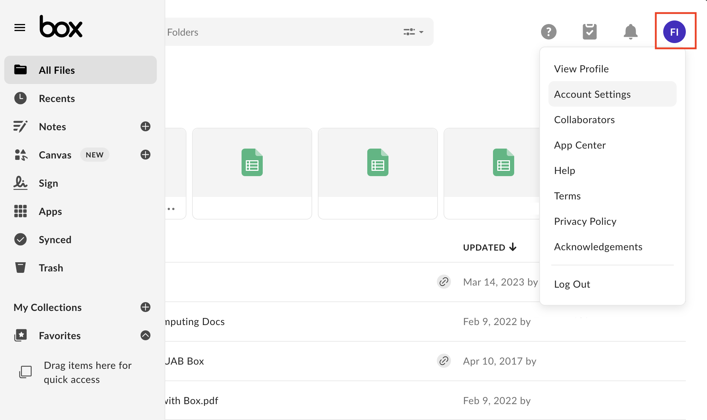

# Alternative Storage Options

UAB IT offers alternative storage options to faculty, staff, and students. These storage options are supported by UAB IT and can be used to augment your research operations. Please see the following URL for more details about each option: <https://www.uab.edu/it/home/tech-solutions/file-storage/storage-options>.

Please note these services are maintained by other groups within UAB IT. If you encounter issues, please [contact AskIT](https://www.uab.edu/it/home/) for assistance.

## Box Storage

To find information on Box, and how to log in to your Box account, please see the [UAB IT documentation](https://www.uab.edu/it/home/tech-solutions/file-storage/box).

### Finding Your Box Storage Total

The following steps will guide you on how to access your Box Storage total, how much Box storage you have used, and how much storage you have left.

1. When you are logged into Box, click on your Profile Icon. This should be at the top-right corner of any UAB Box page. The icon should contain your intials in the format "FL" where "F" is the first letter of your first name or given name and "L" is from your last name. For example, Jordan Smith would have "JS" in the icon.

1. On the drop down menu select "Account Settings". A tab named "Account" should now be visible.

    

1. Scroll down the tab Account, to a section named "Account Details". Your Box storage information would now be visible.

    
