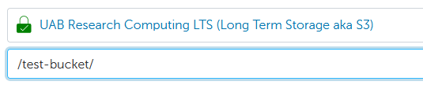

# Connecting to LTS

LTS is not available as a mounted filesystem on local computers or Cheaha. You must use an interface to transfer data between LTS and whichever machine you are using. There are a variety of interfaces with the following recommendations.

## Globus

[Globus](../transfer/globus.md#long-term-storage-s3-lts-connector) is a general file transfer system that operates through a web browser and is recommended for most file transfer needs. UAB has an S3 connector for Globus that can transfer data to and from LTS as long as the user has access to the desired buckets.

To connect to the LTS endpoint in Globus, search `UAB Research Computing LTS` in the search bar and enter your access and secret keys given to you by Research Computing staff. You will be able to see the buckets owned by the allocation associated with the keys you entered.

<!-- markdownlint-disable MD046 -->
!!! important

    If your LTS allocation was given permission to access a bucket owned by another allocation, it will not automatically appear in the Globus file browser. You can access buckets you have `s3:ListBucket` permissions on by typing `/<bucket-name>/` in the Path field under the LTS endpoint.

    
<!-- markdownlint-enable MD046 -->

Globus is very useful for single transfers of data either to or from LTS and is available on any computer with an internet connection. However, it is currently not capable of managing buckets. This must be done through a command line interface.

### Managing LTS Credentials on Globus

See our [Globus - Adding LTS Allocation Credentials](../transfer/globus.md#adding-lts-allocation-credentials) section for more information.

## Command Line

While globus is the recommended tool for most data transfers, command line tools are necessary for planned, regular transfers as well as managing permissions on buckets. We recommend the following two tools for different purposes:

1. [s3cmd](https://github.com/s3tools/s3cmd) is a Python tool that we suggest using for managing bucket permissions as well as small transfers.
1. [s5cmd](https://github.com/peak/s5cmd) is a Go package that transfers data much more quickly than s3cmd, especially as the file size and/or quanitity increases. It does not have full bucket management capabilities.

### Installation of `s3cmd` and `s5cmd` on Cheaha

To install the tools on Cheaha, you can request a compute node through Cheaha's [Open OnDemand web portal](../../cheaha/open_ondemand/ood_layout.md#creating-an-interactive-job).Once your job is launched, open a terminal to execute the commands listed below. You do not need to install both tools if they aren't necessary. Both are available to install into [Anaconda](../../workflow_solutions/using_anaconda.md) environments. It's suggested to create a single environment named `s3` and install both s3cmd and s5cmd into it for easy access to both tools. Specific install and usage commands for each are given in their respective sections. You can create the general environment using the following commands:

``` bash
module load Anaconda3
conda create -n s3 -c conda-forge pip s5cmd
conda activate s3
pip install s3cmd
```

Please note that the instructions mentioned above are specific to the Cheaha system. To transfer data between your individual computer and LTS, you will need to install `s3cmd` or `s5cmd` on your machine. Please refer to this [section](#installation-of-s3cmd-and-s5cmd-on-individual-systems-without-anaconda) for installation instructions specific to your operating system.

<!-- markdownlint-disable MD046 -->
!!! note

    We manually install pip into the conda environment so that `pip` will install `s3cmd` into the conda environment as opposed to `$HOME/.local`. This way, you do not need to add the `.local` folder to your path whenever you want to use `s3cmd`.
<!-- markdownlint-enable MD046 -->

### `s3cmd`

s3cmd is a tool used for managing buckets and objects in Amazon S3 (Simple Storage Service). s3cmd is our suggested tool for operations such as listing buckets, managing bucket permissions, synchronizing directories with s3 buckets, and for small periodic file transfers. If high-speed transfer of a large files is required, we recommend using [s5cmd](#s5cmd). See the [preceding section](#command-line) for instructions on how to install both it and s5cmd into an Anaconda environment.

#### Configuring `s3cmd`

Configuring s3cmd is necessary to establish a secure connection for accessing your LTS bucket in Amazon S3. Once you have s3cmd installed and the environment active, you can start the configuration process like so:

``` bash
s3cmd --configure [-c $HOME/profile_name]
```

You can run the configuration either with or without the `[-c]` option. If you use it, a file named `profile_name` will be created in your home directory with your login credentials and other information. If you omit the `-c` option, a file called `$HOME/.s3cfg` will be created by default. This can be helpful if you have multiple S3 profiles you are using. If you use UAB LTS as your only S3 storage platform and are only managing a single allocation, it's suggested to omit the `-c` option. If you are a PI or data manager and are managing both an individual and a shared allocation, you will need to make a separate profile for each allocation.

<!-- markdownlint-disable MD046 -->
!!! note

    After configuration, the `s3cmd` command will default to using the `.s3cfg` file for credentials if it exists. If you create a separate named profile file, you will need to add that to the `s3cmd` call each time you run it.
<!-- markdownlint-enable MD046 -->

During configuration, you will be asked to enter some information. You can follow the example below, inputting your user-specific information where required. Lines requiring user input are highlighted.

``` text hl_lines="2 3 4 7 10 13 14 17 20 34 41"
Access key and Secret key are your identifiers for Amazon S3. Leave them empty for using the env variables.
Access Key: <access key>
Secret Key: <secret key>
Default Region [US]: <leave blank>

Use "s3.amazonaws.com" for S3 Endpoint and not modify it to the target Amazon S3.
S3 Endpoint [s3.amazonaws.com]: https://s3.lts.rc.uab.edu

Use "%(bucket)s.s3.amazonaws.com" to the target Amazon S3. "%(bucket)s" and "%(location)s" vars can be used if the target S3 system supports dns based buckets.
DNS-style bucket+hostname:port template for accessing a bucket [%(bucket)s.s3.amazonaws.com]: %(bucket).s3.lts.rc.uab.edu

Encryption password is used to protect your files from reading by unauthorized persons while in transfer to S3
Encryption password: <leave blank or enter password>
Path to GPG program [/usr/bin/gpg]: <leave blank>

When using secure HTTPS protocol all communication with Amazon S3 servers is protected from 3rd party eavesdropping. This method is slower than plain HTTP, and can only be proxied with Python 2.7 or newer
Use HTTPS protocol [Yes]: <leave blank>

On some networks all internet access must go through a HTTP proxy. Try setting it here if you can't connect to S3 directly
HTTP Proxy server name: <leave blank>

New settings:
  Access Key: <access key>
  Secret Key: <secret key>
  Default Region: US
  S3 Endpoint: https://s3.lts.rc.uab.edu
  DNS-style bucket+hostname:port template for accessing a bucket: %(bucket).s3.lts.rc.uab.edu
  Encryption password:
  Path to GPG program: $HOME/bin/gpg
  Use HTTPS protocol: True
  HTTP Proxy server name:
  HTTP Proxy server port: 0

Test access with supplied credentials? [Y/n] n

Save settings? [y/N] y
```

<!-- markdownlint-disable MD046 -->
!!! important

    1. If you choose to test access using your credentials, the test may fail. Do not rely on the automatic test results, test access yourself by either creating a bucket or listing files from a existing bucket using the commands listed below.
    1. To locate the appropriate "Path to GPG program" for Ubuntu and Mac operating systems, please use the command `which gpg`. The location may vary depending on your operating system.
<!-- markdownlint-enable MD046 -->

#### `s3cmd` Commands

``` bash
# General command structure for s3cmd
s3cmd [-c profile_file] <command> [options] [-n --dry-run]
```

The `[-c profile_file]` is only required if you are using credentials NOT saved in the `$HOME/.s3cfg` file. Otherwise, you can omit it.

To see a list of all available commands, use `s3cmd --help`. Additionally, if you want to test an action without actually running it (i.e. it prints all actions that would be performed), you can add the `-n` or `--dry-run` option. A list of selected commands are provided below for reference

``` bash
# Create a bucket
s3cmd mb s3://<bucket>

# List a bucket/path within the bucket
s3cmd ls [-r, --recursive] s3://<bucket/path>

# Check bucket or folder size
s3cmd du -H s3://<bucket/path/>

# transfer a file or folder from local to a bucket
s3cmd put <source> s3://<bucket/path/destination/>

# transfer a file or folder from a bucket to a local drive
s3cmd get s3://<bucket/path/source/> <destination>

# transfer between two S3 locations
s3cmd cp s3://<bucket/path/> s3://<bucket/path/>

# sync an S3 location with a local source. The S3 destination will be made exactly the same as the source including file deletions.
# The source is unaltered. The S3 bucket/folder can be either the source or the destination
s3cmd sync <source> s3://<bucket/path/destination>

# remove a single object or all objects within a given path
s3cmd rm s3://<bucket/path/file> [--recursive]

# remove an entire bucket
s3cmd rb s3://<bucket>

# get info about the bucket
s3cmd info s3://<bucket>
```

<!-- markdownlint-disable MD046 -->
!!! danger

    Be extremely cautious using `sync`. If there are files in the destination that are not in the source, it will delete those files in addition to adding files to the destination. If data is deleted from LTS, it is not recoverable.
<!-- markdownlint-enable MD046 -->

<!-- markdownlint-disable MD046 -->
!!! note

    When using `ls` to list buckets, it will only show the buckets you own, not buckets you have been given permissions on. This is a limitation of the S3 system. You can still interact with any buckets you have been given relevant permissions on, but you will need to remember the names of the buckets you don't own.
<!-- markdownlint-enable MD046 -->

### `s5cmd`

s5cmd is a parallel transfer tool suggested for period transfers of large and/or many files at a time. It has options for customizing how many processors are available for transferring data as well as how many chunks files can be broken into during transfer to minimize transfer time. See the [preceding section](#command-line) for instructions on how to install both it and s3cmd into an Anaconda environment

#### Configuring `s5cmd`

The s5cmd software does not use the same authentication file as s3cmd. Instead, it uses official AWS SDK to access S3 including LTS. The default credentials file for AWS CLI would found at `${HOME}/.aws/credentials`. This file is then populated with different profiles and their access and secret keys. You can create the necessary file with the following commands.

``` bash
mkdir ${HOME}/.aws
touch ${HOME}/.aws/credentials
```

Open the credentials file with your favorite editor (i.e. `vim`, `nano`, `gedit`, etc.) and create a default profile by adding the following lines.

``` text
[default]
aws_access_key_id = <access_key>
aws_secret_access_key = <secret_key>
```

<!-- markdownlint-disable MD046 -->
!!! note

    Do not include the `<>` symbols in the credentials file when saving your keys
<!-- markdownlint-enable MD046 -->

One of the benefits of this credential method is that multiple sets of credentials can be kept in the same file. For instance, if you have both a shared allocation and an individual allocation, you could set your individual allocation as the default profile and then add your shared allocation keys under a named profile like so:

``` text
[default]
aws_access_key_id = <individual_access_key>
aws_secret_access_key = <individual_secret_key>

[shared-allocation]
aws_access_key_id = <shared_access_key>
aws_secret_access_key = <shared_secret_key>
```

If you have multiple shared allocations, i.e. for both a lab and a Core, you could add another entry like `[shared-allocation]` with a distinct name.

#### `s5cmd` Commands

s5cmd has the following general form.

``` bash
s5cmd --endpoint-url https://s3.lts.rc.uab.edu [global_options] command [command options] [arguments]
```

Here, global options must be kept separate from command specific options. For instance, the `--endpoint-url` option is a global option that specifies the URL for the S3 server. This must be included with every s5cmd command to communicate with UAB LTS, otherwise it will default to accessing AWS servers. Other global options include `--numworkers` and `--profile`, the number of available CPUs and which allocation to use in the `credentials` file, respectively. You can see a list of global options and the list of available commands by running `s5cmd --help`. A selection of commands are listed below.

``` bash
# copy all files from a local directory to a bucket using a single CPU
s5cmd --endpoint-url https://s3.lts.rc.uab.edu cp /path/to/directory/* s3://bucket/

# copy all files from a local directory to a bucket using 10 CPUs  and allowing the files to be broken into 5 parts during transfer
s5cmd --endpoint-url https://s3.lts.rc.uab.edu --numworkers 10 cp --concurrency 5 /path/to/directory/* s3://bucket/

# sync an S3 bucket (destination) to a local directory (source)
s5cmd --endpoint-url https://s3.lts.rc.uab.edu sync /path/to/directory/ s3://bucket/

# remove all objects with a given prefix from a bucket
s5cmd --endpoint-url https://s3.lts.rc.uab.edu rm s3://bucket/prefix/*
```

As with s3cmd, be very careful using the `sync` and `rm` commands as these can/will delete files either locally or on LTS. There are many more commands s5cmd can use as well as a number of command options that can be used to customize how an operation is performed. Please see the help documentation for a full list.

It's important to note that the main functionality of s5cmd over s3cmd is the parallelization options given by the `--numworkers` global option and the `--concurrency` local option for `cp` and `sync` commands. Choosing not to use these options will result in unoptimized performance.

<!-- markdownlint-disable MD046 -->
!!! important

    When setting the value for `--numworkers`, do not select a value beyond the number of CPUs you have requested for your job! This can cause high context switching (meaning individual CPUs are switching between multiple running processes) which can affect job performance for all jobs on a node.
<!-- markdownlint-enable MD046 -->

#### Switching Between LTS Allocations Profiles

By default, `s5cmd` uses the `[default]` profile. To use a different profile, specify the `--profile` flag. For example, to copy all files from a local directory to a bucket in a shared LTS allocation using a single CPU, run the following command:

`s5cmd --endpoint-url https://s3.lts.rc.uab.edu --profile <shared-allocation-profile-name> cp /path/to/directory/* s3://bucket/`

Replace `<shared-allocation-profile-name>` with the profile name defined for your shared LTS allocation in your `~/.aws/credentials` file.

### Installation of `s3cmd` and `s5cmd` on Individual Systems Without Anaconda

The installation instructions and software dependencies may differ depending on the operating system being used. Following are the installation instructions tested for different operating systems. You may also use [Anaconda](../../workflow_solutions/using_anaconda.md) to install either or both packages.

#### Ubuntu

To install `s3cmd` please use the following commands.

```bash
sudo apt update
sudp apt install s3cmd
```

To install `s5cmd`, you will have to first install `go` software version `>=1.19`. Please refer to the [Download page](https://go.dev/dl/), and [installation instruction](https://go.dev/doc/install) for further details. After intalling `go`, you can build `s5cmd` in your `$HOME` directory using the below steps.

```bash
cd $HOME
go install github.com/peak/s5cmd/v2@master
```

The below steps are to add `go` bin directory to your system's `PATH` which allows you to run `s5cmd` from any location in your terminal.

```bash
echo 'export PATH=$PATH:$HOME/go/bin' >> ~/.bashrc
source ~/.bashrc
```

#### Mac

Use the following commands to install `s3cmd` and `s5cmd` on a Mac System.

```bash
brew install s3cmd
brew install peak/tap/s5cmd
```

You may need to install `gpg` on a Mac using the below command,

```bash
brew install gnupg
```

#### Windows

To install `s3cmd` and `s5cmd` on a Windows system, you will first need to install [Windows Subsystem for Linux (WSL)](../../uab_cloud/remote_access.md#windows-subsystem-for-linux-wsl). Once WSL is installed, you can use the command line instructions for [Ubuntu](#ubuntu) to install `s3cmd` and `s5cmd`.

For more information on `s3cmd` and `s5cmd`, please refer to the official [s3tools Page](https://s3tools.org/download), and [s5cmd page](https://github.com/peak/s5cmd?tab=readme-ov-file).

## Alternatives

There are other tools for interfacing with LTS such as rclone. Please see our [rclone documentation](../transfer/rclone.md) for more details.
