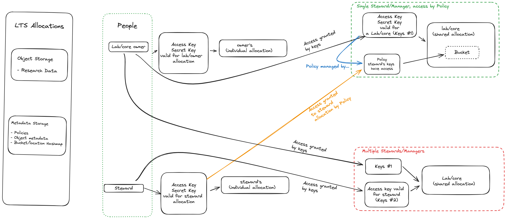

# A Model for Top-level LTS Permissions

Understanding top-level access rights for Long-Term Storage (LTS) spaces is essential for effective data management and security. This section aims to clarify common misconceptions regarding access rights and provide a model for navigating these complexities. It will outline the relationships between allocations and keys, as well as the responsibilities of stewards who manage these permissions. By understanding these concepts, we can enhance our ability to protect sensitive data and create an efficient data management environment.

## Key Components

- **Allocation**: An allocation represents a designated storage space with a unique name.
- **Keys**: Keys are the credentials that grant access to an allocation. There are two types of keys:

    - Access Key: The public identifier used to access the allocation, similar to a username.
    - Secret Key: The private password-like credential that must be kept confidential.

Each pair of keys (access + secret) should only be known by one person. This is critical for maintaining security and preventing unauthorized access.

- **Stewards**: Stewards are individuals responsible for managing an allocation. Stewards need a full access key pair to perform tasks like creating, deleting, and maintaining buckets. Each steward must maintain separate key pairs for their allocations and any lab/Core allocations they manage.
- **Lab/Core PIs**: Lab/core PIs are the owners of allocations. They are responsible for overseeing the management of allocated storage spaces, ensuring compliance with data management policies, and designating appropriate stewards, if needed, to assist in the management of allocation.

## Adding a Steward to a Lab/Core Allocation

In LTS, lab members can be granted access via [policy](policies.md). However, policies do not provide permissions to perform the following actions:

- Create buckets
- Delete buckets
- Rename buckets

To perform these actions, a steward must be assigned full access and provided with a complete set of access and secret keys for the allocation. When a steward is added to a lab/Core allocation, they receive full access keys to manage the allocation's buckets, including the ability to create, delete, rename, and maintain them, with a unique key set specific to that allocation.

To better understand top-level LTS permissions, the relationships between allocations, keys, the steward role and access rights can be visualized as follows.

### Understanding Permissions and Responsibilities

**Steward Responsibilities**:

- Stewards can create, delete, and manage buckets but must maintain the confidentiality of their secret keys.
- Understanding which key pairs correspond to which allocations is crucial for effective management.

**Key Handling, Distribution and Ownership**:

- Stewards will have distinct key pairs for:
    - Individual Allocation: Specific to the steward’s personal allocation.
    - Lab/Core Allocations: Unique key pairs for each lab/Core allocation they manage.
- Keys should be treated as sensitive information. Only one individual should know a key pair.
- Each key pair corresponds to a specific allocation, ensuring that access rights are clearly defined.
- Mismanagement of keys can lead to unauthorized access and potential data loss.

It is the responsibility of the steward to manage multiple key pairs, ensuring that they use the correct pair for each allocation and keeping all secret keys. Allocation keys act as access controls, with the owner holding the pair of keys. When a Steward is appointed, they are not merely users, they are given full access with their own set of access and secret keys, making them co-managers with independent control and the responsibility to manage the space effectively.

If you, as a lab/core PI, do not wish to manage the LTS space yourself, we recommend assigning data Steward permissions to someone who is both trustworthy and has knowledge of, or willingness to learn, [JSON](https://docs.fileformat.com/web/json/#google_vignette) and parts of the [Amazon AWS S3 API](https://docs.aws.amazon.com/AmazonS3/latest/API/Type_API_Reference.html). If you need help or have concerns about making this decision, please [contact us](../../index.md#how-to-contact-us).
