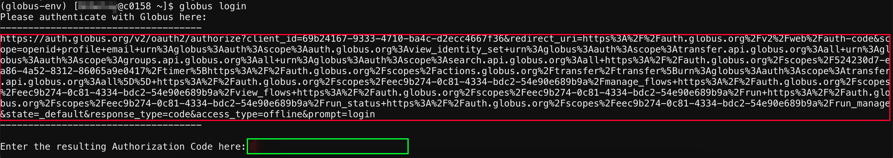
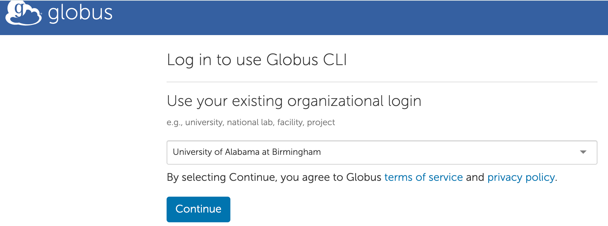
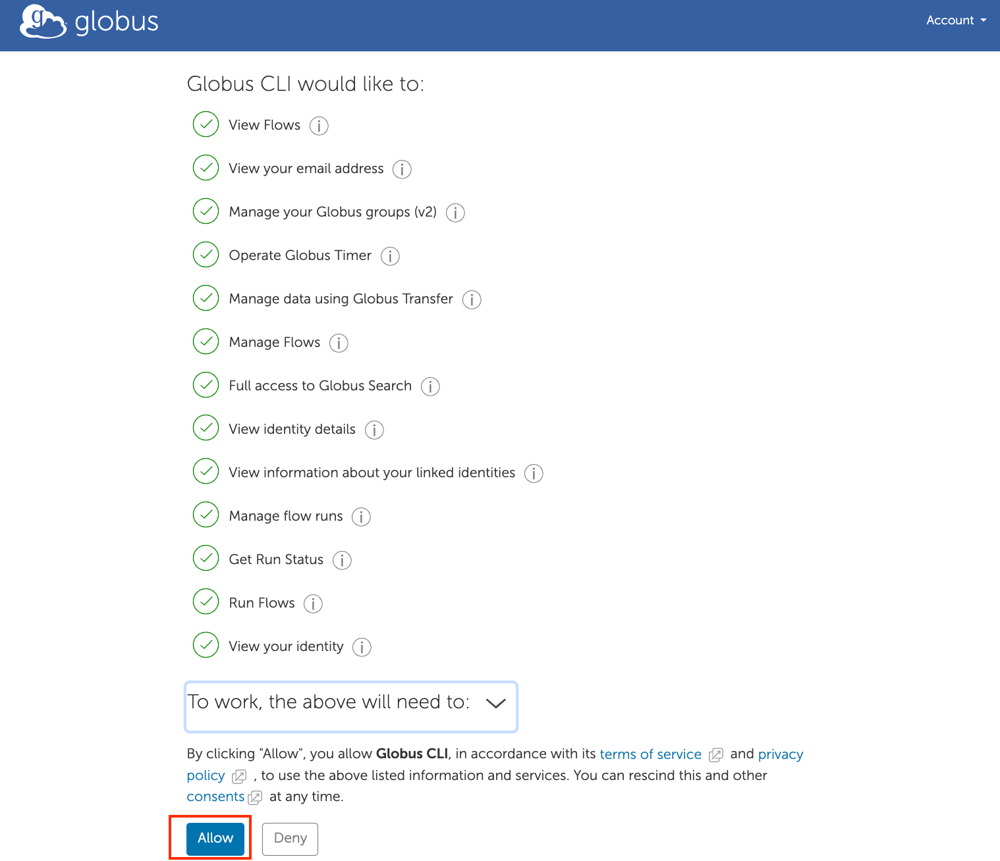
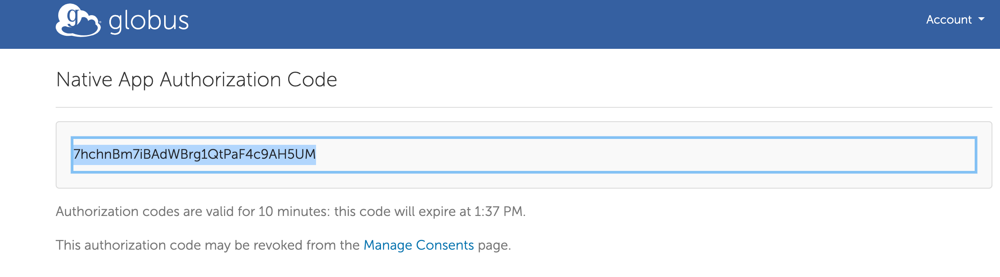
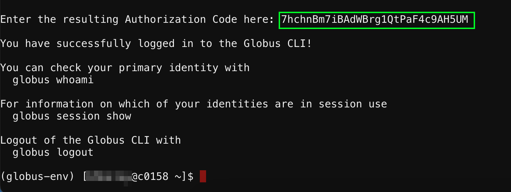
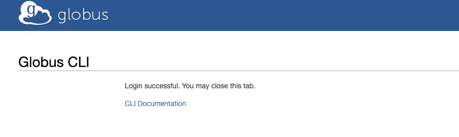
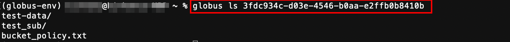

# Using Globus CLI for Large Data Transfers

As the demand for large data transfers continues to grow in research and industry, automating these processes has become increasingly important. Globus offers a robust solution for managing data transfers efficiently, and its command-line interface (CLI) provides a powerful way to streamline workflows. Users only need to install the CLI on one computer, allowing access to its features from any system connected to the Globus web interface.

In this tutorial, we will guide you through using the Globus CLI to efficiently manage and transfer large research data.  We will explore how to set up the Globus CLI for thess transfers and provide examples to help you get started.

## Prerequisites

To get up to speed, you should have a basic understanding of how to use the shell/terminal. If you are not familiar with these concepts, we recommend checking out our learning resources on [Basic Shell Usage](../../../workflow_solutions/shell.md#shell-reference).

## Why You Use Globus CLI?

The Globus CLI simplifies the process of transferring large research data by allowing users to interact with the Globus service directly from the command line. Key benefits include:

- **Ease of Use**: The CLI provides straightforward commands for common tasks, reducing the need for complex scripts.
- **Scalability**: Handle large data with minimal overhead, making it ideal for high-volume transfers.
- **Cross-Machine Usability**: Once installed, you don’t need to install the Globus CLI on every machine. You can access your configured environment and commands from any machine where it is set up.

## Installation

To get started, you can install the Globus CLI on Cheaha or your local system machine, though the process differs slightly. This tutorial provides instructions for installing the Globus CLI on both Cheaha and your personal computer using Conda. To use the Globus CLI, you need to activate the Conda environment in your current session.

### Installation of Globus CLI on Cheaha

```bash
module load Miniforge3
conda create -n globus-env
conda activate globus-env
conda install -c conda-forge globus-cli
```

If you prefer to install it on your personal computer, you can find detailed instructions on the Globus website in the [Globus CLI installation instructions](https://docs.globus.org/cli/#installation).

### How to Login to Globus CLI on Cheaha?

After the installation is complete, you must always activate the environment using the command, `conda activate globus-env`and login to Globus using the command, `globus login`.

- The command `globus login` will print a URL, marked in red below. Copy this URL and open it in a browser to obtain the authentication code to be pasted in the area marked with the green box.



If you are not currently logged into Globus on that computer, you will be prompted to login and authenticate with your BlazerID and password, as shown below, click on "Continue" and follow the page:


- Next, you will be asked to consent to the Globus CLI accessing your information, as shown below:



- After clicking "Allow", you will see an authorization code that you need to copy:



- Then, paste the authorization code into the shell where you ran the `globus login` command, as shown below:



You can verify that you are logged in using the command `globus whoami`  and you will see your email address displayed. If you want to logout just type `globus logout`.

### Installation of Globus CLI on Your Personal Machine

The installation instructions and software dependencies may differ depending on the operating system you are using. We assume you have a Conda environment installed; if not, you can install Miniforge. To install Miniforge, download it from the [Download Miniforge](https://conda-forge.org/download/) page and follow the installation instructions specific to your operating system.

Before creating a conda environment:

- Create a file named environment.yml with the following content: `globus-cli-env.yml` with below contents.

```yaml
name: globus-cli-env
channels:
  - conda-forge
dependencies:
  - python=3.12
  - globus-cli
```

- Then open your terminal and navigate to the directory where you saved the `globus-cli-env.yml`  file and then run the command: `conda env create -f globus-cli-env.yml`.
- After the environment is created, activate it with: `conda activate globus-cli-env`.
- To verify that the Globus CLI is installed correctly and the version, run: `globus version`. Or `globus -h` you will see the different globus CLI commands.

### How to Login to the Globus CLI on Your Machine

- To login to the globus, run the command `globus login`. If you are not currently logged into Globus on that computer, you will be prompted to login and authenticate with your BlazerID and password, as shown below, click on "Continue" and follow the prompts on the page:


- If you are already logged into the globus from your computer system, you will see the following login success message in your browser window after clicking the "Continue" button:



You can then close that browser tab and proceed to run any Globus commands you wish to execute.

## How to Transfer Data between Collections?

This section outlines the process for transferring data between collections using the Globus CLI. Follow the steps below to complete your data transfer successfully.

### login to the Globus GLI

Before you can transfer data, you need to log in to the Globus CLI. Depending on your environment, choose one of the following methods:

- To login from Cheaha, follow the steps given in the [How to Login to Globus CLI on Cheaha](#how-to-login-to-globus-cli-on-cheaha) section.
- To login from your local machine, please refer to the [How to login to the Globus CLI on Your Machine](#how-to-login-to-the-globus-cli-on-your-machine) section.

### Search Endpoint

Once you logged in to the Globus CLI, you can search for endpoints to identify the collections from which you want to transfer data. Use the following command:

```bash
globus endpoint search "search_keyword"
```

Please replace the `"search_keyword"` with a keyword that you wish to search the endpoint. The search term in the command globus endpoint `search_keyword` does not have to be an exact match with the endpoint's display name. Instead, the search encompasses a wider range of criteria, including the display names of endpoints, words or phrases found in the endpoint's description and the owner's name or email associated with the endpoint.

For example, if you want to find an endpoint containing the name `bhbelay`, you would use the command globus endpoint search `bhbelay`. This will display the endpoint information that includes this keyword in the display name, description, or owner information.


### Listing Directories in Endpoints

For transfers and other file operations, you should use the ID of endpoints, as names are just convenient for users to identify the intended endpoint. Once you have the ID, you can list the visible directories with the following command:


