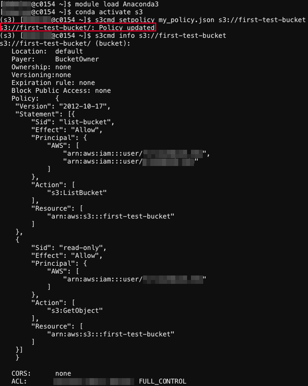

# Basic Workflow with Individual LTS and s3cmd

In this tutorial, we will guide you through using `s3cmd` on the Cheaha system to effectively manage and interact with your individual LTS account. We will cover the installation and configuration of `s3cmd`, and demonstrate essential operations, including creating buckets, listing, copying, downloading, and deleting [buckets and objects](../index.md/#terminology) in your LTS account. In addition, we will show you how to set and manage read and write access for other accounts to your LTS buckets and objects.

## Setting Up Your Environment

### Install s3cmd within Anaconda Environment on Cheaha

To interact with LTS using S3, you need the `s3cmd` tool installed. It is recommended to install it using `pip` within an Anaconda environment on Cheaha. Please avoid using `conda install s3cmd`, as that version will not work as expected. Instead, follow the below steps to install `s3cmd` using `pip`.

First, access our interactive Open OnDemand (OOD) portal at [https://rc.uab.edu](https://rc.uab.edu) and create a job on Cheaha using one of our interactive applications. For guidance, refer to our tutorial on [installing and setting anaconda environment](../../../cheaha/tutorial/pytorch_tensorflow.md/#installing-anaconda-environments-using-terminal).

Once your interactive apps session is launched, open the terminal as described in [step 5 of the Anaconda tutorial page](../../../cheaha/tutorial/pytorch_tensorflow.md/#installing-anaconda-environments-using-terminal) and run the below commands.

```bash
module load Anaconda3
conda create -n s3 
conda activate s3
pip install s3cmd
```

Once these steps are completed, verify the installation by running `pip list | grep "s3cmd"` in the terminal. If `s3cmd` is listed, as shown in the screenshot below, the package has been successfully installed.


### Install s3cmd on Your Local Systems

To install s3cmd on your local machine, please follow the instructions provided in [our s3cmd documentation for local installation](../../../data_management/lts/interfaces.md/#installation-of-s3cmd-and-s5cmd-on-personal-system).

### Configuring s3cmd for LTS Buckets

Properly configuring `s3cmd` is important for working with LTS buckets and objects. The configuration process varies depending on whether you have a single LTS account or multiple accounts to manage. In this section, we will provide a step-by-step guide tailored specifically for the **Cheaha** system and a researcher with an **individual LTS account**.

Open a terminal using one of the interactive apps on Cheaha. Activate your conda environment created in the [Install s3cmd using within Anaconda Environment](./individual_lts_tutorial.md/#install-s3cmd-within-anaconda-environment-on-cheaha) section, and then run the below command:

```bash
s3cmd --configure
```

This will prompt you to enter the access key and secret key associated with your individual LTS account. You will be asked for additional information, which will be displayed on the screen, as shown below. You can copy the necessary details from the example provided [here](../interfaces.md/#configuring-s3cmd).


Once the configuration is complete, `s3cmd` will generate a `.s3cfg` file in your home directory (`$HOME`), as shown below. To find your home directory in Cheaha and view the `.s3cfg` file, follow the instructions on our [Navigating Open OnDemand](../../../cheaha/open_ondemand/ood_layout.md/#navigating-open-ondemand) page. Be sure to check the **Show Dotfiles** option in the top right corner to make hidden files visible.


### Creating Buckets

Long Term Storage (LTS) services like Amazon S3 uses a specific data organization model based on **buckets** and **objects**. Think of buckets as folders that contain individual pieces of data called objects. Each bucket has a unique name. We have documentation about basic terminology on s3 storage system [here](../index.md/#terminology).

Once you have complete `s3cmd` configuration, you can create new buckets in your individual LTS storage. To create a bucket use a `mb`(make bucket) command:

```bash
s3cmd mb s3://your-bucket-name
```

Please replace `your-bucket-name` with your desired name. This command creates a new bucket that you named `your-bucket-name` in your LTS storage using the currently configured `s3cmd` profile. For example, the image below shows an LTS bucket named `first-test-bucket` that was created successfully after running the command `s3cmd mb s3://first-test-bucket`.


Bucket names must be unique across all LTS, we have detailed information about bucket naming [here](../index.md/#avoiding-duplicate-names-for-buckets). If you try to create a bucket with `s3cmd mb` and the name is taken in another namespace, you will see an `S3 error: 409 (BucketAlreadyExists)`. However, if the name is already in use within your own namespace, `s3cmd mb` might not show an error and could falsely indicate that the bucket is created. Even if no error appears, the bucket won’t actually be created if the name is already taken. To avoid confusion and ensure you create a unique bucket within your own namespace, you can use `s3cmd ls` to check existing buckets and choose a different name.

### Managing Buckets

To manage a bucket, various commands can be used. Below are some common `s3cmd` commands to interact with your LTS bucket and its objects:

- To **list all buckets** with your current `s3cmd` profile, use command: `s3cmd ls`.
- To **list all objects in a bucket** with your current `s3cmd` profile, use command: `s3cmd ls s3://your-bucket-name`.
- To **upload a file**  named `file.txt` to a bucket, use a command: `s3cmd put file.txt s3://your-bucket-name/`.
- To **download an object** named `file.txt` from a bucket, use a command:`s3cmd get s3://your-bucket-name/file.txt`.
- To **delete/remove** an object, use command: `s3cmd del s3://your-bucket-name/your-object-name`.
- To **delete/remove** a bucket, use command: `s3cmd rb s3://your-bucket-name`.

    <!-- markdownlint-disable MD046 -->
    !!! Note

        An S3 bucket cannot be deleted unless it is completely empty. If the bucket contains any objects, `s3cmd rb` will report an error, like `S3 error: 409 (BucketNotEmpty)` when you attempt to delete it. To remove all objects within the bucket, use: `s3cmd del -r s3://your-bucket-name --force`. You can then remove the bucket itself with: `s3cmd rb s3://your-bucket-name`.
    <!-- markdownlint-disable MD046 -->

    <!-- markdownlint-disable MD046 -->
    !!! danger

        Deleting objects and buckets cannot be undone. Once the delete command is entered, any data is lost permanently and cannot be restored.
    <!-- markdownlint-enable MD046 -->

You can find a variety of `s3cmd` commands in our documentation at [here](../../lts/interfaces.md/#s3cmd-commands) and on the [S3tools website](https://s3tools.org/usage). For quick reference, you can also use the `s3cmd --help` command to view available options directly in your terminal.

If you are continuing in the same session with your **conda environment already activated**, you can directly use the `s3cmd` commands. If you are starting a new session or returning at a later date, make sure to load the Anaconda module and activate your conda environment before using `s3cmd`.

### How to Grant Access to Other Accounts for your Buckets?

Managing access to your buckets is essential for both collaboration and security. By setting up specific policies, you can control who can view or modify your bucket’s contents. Follow these steps to grant access:

- Create a policy file: define a policy and save it as a `JSON` file. For guidance and details on creating and formatting policy files, refer to our [create a policy structure guide](../../lts/policies/#policy-structure). For example, you might create a policy file named `my_policy.json` with read permissions.
- Apply the policy: Use the command like `s3cmd setpolicy policy_file.json s3://your-bucket-name` to apply your defined read policy to your bucket. Replace `policy_file.json` with the name of your policy file and `your-bucket-name` with the name of your bucket.
- Verify the policy update: After applying the policy, you should see a `Policy updated` message if the operation was successful. You can also verify the applied policy by running: `s3cmd info s3://your-bucket-name`.

Below is a screenshot showing how to apply a policy file named `my_policy.json` to a bucket named `first-test-bucket`, and the command to view information about this bucket, including the policy file that we defined and applied.



Please note that the permissions granted are determined by the settings defined in your policy file. The policy demonstrated in this example is a **read-only** policy. Below, you can find examples of the different policies, including the read and write policies, you can set and apply for your buckets and objects in your individual LTS account.

- **Read-only Access**

    To allow another account to view and copy files from your bucket without making any changes, use the [read only permission policy](../policies.md/#read-only-for-all-files).

- **Read/Write Access**

    To grant another account the ability to both view and modify the contents of your bucket, use the [read/write permissions policy](../policies.md/#read-write-permissions).

For detailed information on LTS bucket policies and instructions on how to apply and remove bucket policies, please refer to our  [policy structure](../../lts/policies/#policy-structure) and [apply bucket policy](../policies.md#applying-a-policy) guides.
