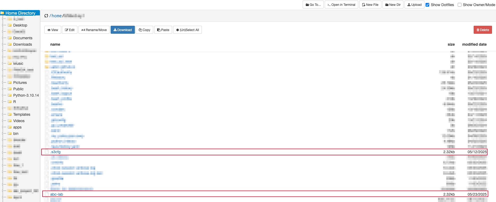

# Basic Workflow with shared LTS and s3cmd

This tutorial is intended for PIs, Core Directors, as well as their managers and stewards, who are responsible for managing shared LTS allocations for their Lab or Core. While the installation of `s3cmd` is the same as covered in [our individual LTS tutorial](./individual_lts_tutorial.md#install-s3cmd-within-conda-environment-on-cheaha), this tutorial focuses on configuring and using s3cmd for shared LTS allocations especially when you manage both individual and shared LTS.

We will walk through how to configure access for a shared LTS, switch between your individual and shared LTS allocations, and perform key operations such as creating and managing buckets and objects. We will also show you how to set up and manage read and write access for other allocations to your shared LTS buckets and objects.

## Prerequisites

To follow this tutorial effectively, you should have a basic understanding of the [prerequisites covered in our individual LTS tutorial](individual_lts_tutorial.md#prerequisites). In addition, you should have a shared LTS allocation already created by our team either with you as the owner or designated as a manager or steward for your Lab's or Core's shared LTS allocation.

## Configuring s3cmd for Shared LTS Buckets

Once you have `s3cmd` installed and your environment activated as done for in [our individual LTS tutorial](./individual_lts_tutorial.md#install-s3cmd-within-conda-environment-on-cheaha), you can begin the configuration process using the following command:

`s3cmd --configure -c $HOME/<lts-profile-name>`

In the same way, you can configure multiple LTS profiles if you own or manage more than one LTS allocation. Just use the corresponding access and secret keys, and replace `<lts-profile-name>` with an appropriate name for each profile. During configuration, you will be prompted to enter additional details, which will appear on screen as show below.

Once the configuration is complete, `s3cmd` will generate a file in your home directory `$HOME` using the profile name you provided. For example, if you name your shared LTS profile `abc-lab`, the configuration file will be saved as a$ `HOME/abc-lab`. This will be in addition to the default `.s3cfg` file that was previously configured for your individual LTS, as shown below.

## Switching between Individual and Shared LTS allocation Profiles

 If you own or manage more than one LTS allocations, such as individual and shared LTS allocations, you will need to switch between them to manage your buckets effectively.

 In this section, we focus on the two configurations: [individual LTS configuration](./individual_lts_tutorial.md#configuring-s3cmd-for-lts-buckets) and [shared LTS configuration](#configuring-s3cmd-for-shared-lts-buckets). The individual profile uses the default `.s3cfg` file, so you can run `s3cmd` commands without specifying the `-c` option. Refer our  individual LTS tutorials on [creating](./individual_lts_tutorial.md#creating-buckets) and [managing](./individual_lts_tutorial.md#managing-buckets) buckets for examples.

 For the shared profile ( `abc-lab`), you will need to explicitly pass the configuration file using the `-c` option followed by the profile configuration name with your usual `s3cmd` commands.

Here are examples for creating and listing buckets, and apply bucket policies:

- To **creating buckets** in your shared LTS, use the command: `s3cmd -c abc-lab mb s3://your-bucket-name`.
- To **list all buckets** you own with your shared LTS, use command: `s3cmd -c abc-lab ls`.
- To **apply a bucket policy** (e.g., write access from a policy file `my-policy.json`), use the command: `s3cmd -c abc-lab setpolicy /path/to/my-policy.json s3://your-bucket-name`.

Follow this same pattern for all other [`s3cmd` commands previously used to manage your individual LTS buckets](./individual_lts_tutorial.md#managing-buckets), just add the `-c` option followed by the shared LTS profile configuration name (`abc-lab` in this example) right after `s3cmd`.

If you have any questions about configuring LTS, switching between LTS allocations, or managing bucket access across multiple LTS profiles, please [Contact Us](../../../index.md#how-to-contact-us).
