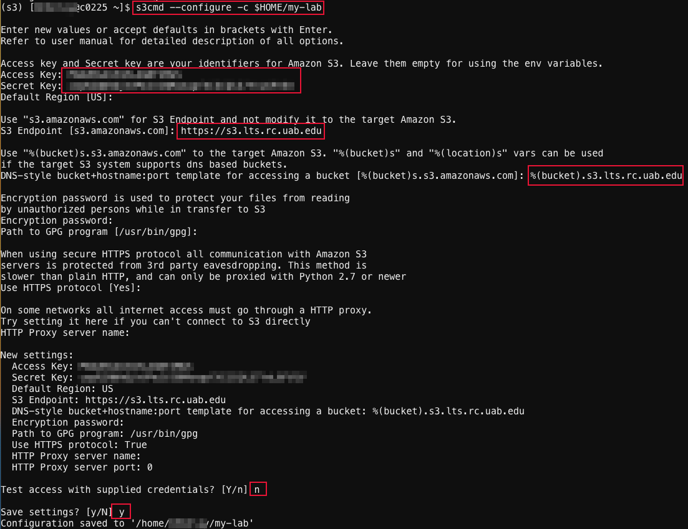

# Basic Workflow With Shared LTS and `s3cmd`

This tutorial is intended for PIs, Core Directors, as well as their managers and stewards, who are responsible for managing shared LTS allocations for their Lab or Core. While the installation of `s3cmd` is the same as covered in [our individual LTS tutorial](./individual_lts_tutorial.md#install-s3cmd-within-conda-environment-on-cheaha), this tutorial focuses on configuring and using s3cmd for shared LTS allocations especially when you manage both individual and shared LTS.

We will walk through how to configure access for a shared LTS, switch between your individual and shared LTS allocations, and perform key operations such as creating and managing buckets and objects. We will also show you how to set up and manage read and write access for other allocations to your shared LTS buckets and objects.

## Prerequisites

To follow this tutorial effectively, you should have a basic understanding of the [prerequisites covered in our individual LTS tutorial](individual_lts_tutorial.md#prerequisites). In addition, you should have a shared LTS allocation already created by our team either with you as the owner or designated as a manager or steward for your Lab's or Core's shared LTS allocation.

## Configuring `s3cmd` for Shared LTS Buckets

Once you have `s3cmd` installed and your environment activated as done for in [our individual LTS tutorial](./individual_lts_tutorial.md#install-s3cmd-within-conda-environment-on-cheaha), you can begin the configuration process using the following command:

`s3cmd --configure -c $HOME/<lts-profile-name>`

In the same way, you can configure multiple LTS profiles if you own or manage more than one LTS allocation. Just use the corresponding access and secret keys, and replace `<lts-profile-name>` with an appropriate name for each profile.

To start configuration, for example for the `my-lab` profile, run the command `s3cmd --configure -c $HOME/my-lab` in your terminal. During the configuration process, you will be prompted to enter various details, such as the Access Key, Secret Key, S3 Endpoint, and DNS-style bucket template.

The screenshot below shows the full terminal output of `s3cmd --configure -c $HOME/my-lab` using the `my-lab` profile as an example. When prompted, enter the Access Key and Secret Key provided by your lab. Use `https://s3.lts.rc.uab.edu` as the S3 endpoint. For the DNS-style bucket template, enter `%(bucket).s3.lts.rc.uab.edu`. Leave the remaining fields at their default values or blank. When asked to test the credentials, type `n` for `no`. Then, type `y` to save your configuration. For more details, please refer our [generic s3cmd configuration](../interfaces.md#configuring-s3cmd) guide.

Once the configuration is complete, `s3cmd` will generate a file in your home directory `$HOME` using the profile name you provided. For example, if you name your shared LTS profile `my-lab`, the configuration file will be saved as `$HOME/my-lab`. This will be in addition to the default `.s3cfg` file that was previously configured for your individual LTS, as shown below.

The screenshot displays a window listing files in the user's home directory. Among the listed files, `.s3cfg` appears alongside other dotfiles, and `my-lab` appears as a separate, non-hidden file. These entries confirm the presence of both configuration files created by `s3cmd`. To locate your home directory on Cheaha and view  both the `.s3cfg`  and `my-lab`files, follow the instructions on our [Navigating Open OnDemand](../../../cheaha/open_ondemand/ood_layout.md#navigating-open-ondemand) page. Make sure to enable the "Show Dotfiles" option in the top-right corner of the Open OnDemand (OOD) file browser to make hidden files visible.

## Switching Between Individual and Shared LTS Allocation Profiles

If you own or manage more than one LTS allocation, such as individual and shared LTS allocations, you will need to switch between them to manage your buckets effectively.

In this section, we focus on the two configurations: [individual LTS](./individual_lts_tutorial.md#configuring-s3cmd-for-lts-buckets) and [shared LTS](#configuring-s3cmd-for-shared-lts-buckets). The individual profile uses the default `.s3cfg` file, so you can run `s3cmd` commands without specifying the `-c` option. Refer our  individual LTS tutorials on [creating](./individual_lts_tutorial.md#creating-buckets) and [managing](./individual_lts_tutorial.md#managing-buckets) buckets for examples.

For the shared profile ( `my-lab`), you will need to explicitly pass the configuration file using the `-c` option followed by the profile configuration name with your usual `s3cmd` commands.

Here are examples for creating and listing buckets, and apply bucket policies:

- To **create buckets** in your shared LTS, use the command: `s3cmd -c my-lab mb s3://your-bucket-name`; note that `mb` is short for "make bucket".
- To **list all buckets** you own with your shared LTS, use command: `s3cmd -c my-lab ls`. Please that this command will list only the buckets you own. For buckets you have access to but do not own, you will need to remember the bucket names as they  will not appear in this list.
- To **apply a bucket policy** (e.g., write access from a policy file `my-policy.json`), use the command: `s3cmd -c my-lab setpolicy /path/to/my-policy.json s3://your-bucket-name`.

To manage your shared LTS buckets, repeat what you did with your [individual buckets](./individual_lts_tutorial.md#managing-buckets), and add the `-c my-lab` option.

If you have any questions about configuring LTS, switching between LTS allocations, or managing bucket access across multiple LTS profiles, please [Contact Us](../../../index.md#how-to-contact-us).
