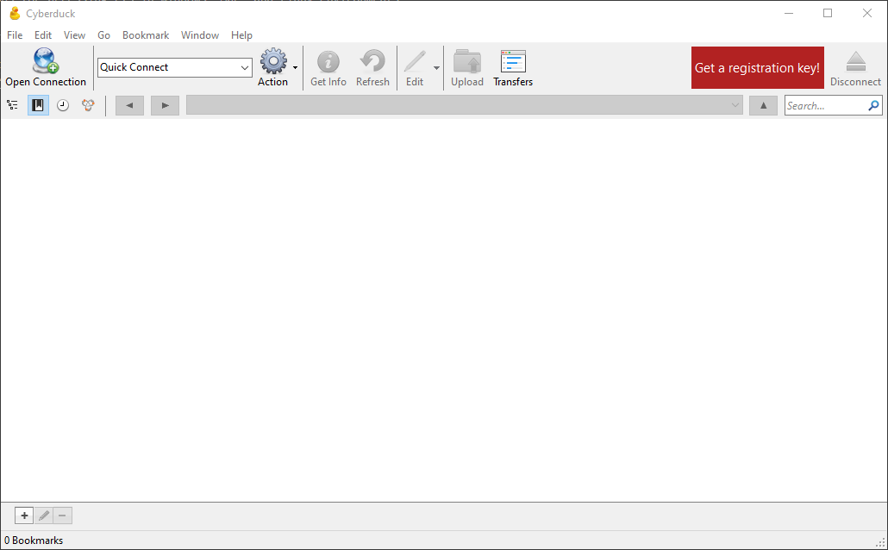
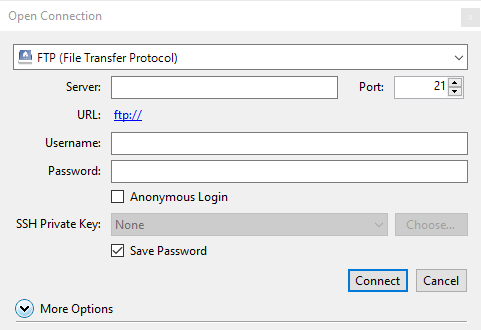

# Long-Term Storage

<!-- markdownlint-disable MD046 -->
!!! important

    This page is a work in progress. Please be patient as information is add or removed. Thank you.
<!-- markdownlint-enable MD046 -->

UAB Long-term storage (LTS) is an S3 object-storage platform hosted at UAB. This storage is designed to hold data that is not currently being used in analysis but should be kept for data sharing, recapitulation purposes, or reused for further analysis in the future. This documentation covers multiple methods for accessing LTS in Windows, Mac, and Linux environments.

<!-- markdownlint-disable MD046 -->
!!! important

    Currently, UAB LTS is only accessible using the campus network. If you are off campus and want to access LTS, please use the [UAB VPN](https://www.uab.edu/it/home/tech-solutions/network/vpn).

<!-- markdownlint-enable MD046 -->

## Requesting an Account

UAB researchers do not have automatic access to LTS, and currently, single sign on is not enabled. To request access to LTS, please send an email to [support@listserv.uab.edu](support@listserv.uab.edu). You will be then be given an Access Key and a Secret Access Key, both of which will be used later on. Keep track of both of these keys and do not share them with anyone else, these are your login credentials for LTS.

## Windows/Mac

To access LTS from Windows and Mac, we suggest using the [Cyberduck](https://cyberduck.io/download/) GUI which is free to download.

Once you have it installed and open, Cyberduck will look like this:



### Creating a Connection

First, download the [UAB CyberDuck Connection Profile](UAB S3 Object Storage.cyberduckprofile). After it's downloaded, double click the file to open it in Cyberduck. It will open the following connection creation window:



Input your Access Key and Secret Access Key sent to you by Research Computing after account creation in their appropriate fields. Once you've entered these keys you can close the connection creation window. This connection with the keys you entered is now saved as a bookmark for easy access in the future. Double click the created bookmark to open the connection to LTS.

### Creating a Bucket

Sets of storage objects are stored in what are called buckets. Buckets are sets of file systems for storing data. You can create different buckets for various purposes, such as separating buckets by dataset or project, or having a single bucket for all data you are moving off of Cheaha project storage.

In order to create a bucket, click `File > New Folder...` and then name the bucket you would like to create. Once the bucket is created, it will appear in the File window. An example could look like:


The bucket will have the symbol of a hard disk with an Amazon A brand on it. This is the root of the file system for that bucket. You can then double click into it to open that file system.

<!-- markdownlint-disable MD046 -->
!!! important

    Bucket names are shared across all LTS. This means you cannot create a bucket with a name that has already been created by someone else, even if that bucket is not shared with you. When creating bucket names, make them specific and/or unique. For example, davislab for storing data for the entire Davis lab or the name of a specific dataset that is being stored. Do not make names like trial or my-storage. 
<!-- markdownlint-enable MD046 -->

### Uploading and Downloading Data

Once you're inside the bucket, files can be uploaded easily through dragging and dropping from your local machine into the GUI. You can also use the `Upload` button in the toolbar to open a file browser and choose what to upload.

Downloading files from the bucket can be done by first selecting the file(s)/folder(s) to download and then clicking the `Actions` button in the toolbar. In that dropdown will be a `Download` option. You can also get to this dropdown through the `File` menu or by right-clicking.

<!-- markdownlint-disable MD046-->
!!! note

    By default, all buckets and files you upload are only available to you.Currently, there is not a known method to add permissions for individual researchers in the Cyberduck interface. If you need to add access to a bucket or set of files within a bucket, please look in the Linux guide below. If you do not have access to a personal Linux machine, Cheaha is available to use for this purpose.
<!-- markdownlint-enable MD046-->

### Alternative Interfaces

In addition to Cyberduck, there are other GUI based programs for interfacing with UAB LTS. [S3 Browser](https://s3browser.com/) is an easy-to-use program for uploading and downloading files. However more sophisticated tools, such as setting file permissions, are hidden behind a paywall. This tool is also only available on Windows platforms. researchers can investigate this tool if desired, however research computing will not provide direct support for this program.

## Linux/Command Line

Linux has very few workable GUIs capable of accessing S3 storage for free available, and so almost all tools for transferring from Cheaha to LTS will be command line interfaces (CLI). The positives for this are that CLIs offer a much broader range of function available to researchers for managing their LTS buckets.

### Different CLIs

There are a couple of different CLIs available to researchers on Cheaha to use. These are [rclone](https://rclone.org/) and [s3cmd](https://s3tools.org/s3cmd). This documentation will show how to perform each function using both tools where possible and will give a comparison chart contrasting what each tool is useful for.

<!-- markdownlint-disable MD046 -->
!!! note

    Of note, both rclone and s3cmd are available for Windows and Mac as well if you are comfortable using command line interfaces on those platforms. There are installation instructions for both of these tools on their respective websites.
<!-- markdownlint-enable MD046 -->

### rclone

#### rclone Configuration

<!-- markdownlint-disable MD046 -->
!!! note

    The installation instructions were tested on Cheaha's Linux platform. Installation for Mac and Windows systems will be different and not covered here.
<!-- markdownlint-enable MD046 -->

Before accessing the storage system, rclone needs to be installed and configured. Go to the [rclone downloads](https://rclone.org/downloads/) page and download the Linux Intel/AMD - 64 Bit package. Extract the package and then move the rclone application file to the `$HOME/bin` directory. You will have access to the `rclone` command in the terminal at any point now.

From here, rclone will need to be configured. This involves setting up the connection to the remote server. Open a terminal and enter `rclone config` to begin the configuration process.

<!-- markdownlint-disable MD046 -->
!!! note

    The locations where you will need to input either a command or select an option are preceded with a `$` for easier navigation.
<!-- markdownlint-enable MD046 -->

``` bash
$ rclone config

2022/02/22 13:02:15 NOTICE: Config file "/home/mdefende/.config/rclone/rclone.conf" not found - using defaults
No remotes found - make a new one
n) New remote
s) Set configuration password
q) Quit config

# select 'n' to create a new remote
$ n/s/q> n

# name the new remote
$ name> cloudrc
```

At this point, you've created a new remote configuration called cloudrc. This will be the remote name used in further commands. You can name the remote whatever you would like, but will need to replace cloudrc in the instructions with whichever name you chose, if you chose a different name.

``` bash
...
4 / Amazon Drive
  \ (amazon cloud drive)
5 / Amazon S3 Compliant Storage Providers including AWS, Alibaba, Ceph, Digital Ocean, Dreamhost, IBM COS, Lyve Cloud, Minio, RackCorp, SeaweedFS, and Tencent COS
  \ (s3)
6 / Backblaze B2
  \ (b2)
...

$ Storage> 5

...
2 / Alibaba Cloud Object Storage System (OSS) formerly Aliyun
  \ (Alibaba)
3 / Ceph Object Storage
  \ (Ceph)
4 / Digital Ocean Spaces
  \ (DigitalOcean)
...

$ provider> 3

Option env_auth.
Get AWS credentials from runtime (environment variables or EC2/ECS meta data if no env vars).
Only applies if access_key_id and secret_access_key is blank.
Choose a number from below, or type in your own boolean value (true or false).
Press Enter for the default (false).
 1 / Enter AWS credentials in the next step.
   \ (false)
 2 / Get AWS credentials from the environment (env vars or IAM).
   \ (true)

$ env_auth> 1 (or leave blank)

Option access_key_id.
AWS Access Key ID.
Leave blank for anonymous access or runtime credentials.
Enter a value. Press Enter to leave empty.

$ access_key_id> (Enter your access key given to you by research computing)

Option secret_access_key.
AWS Secret Access Key (password).
Leave blank for anonymous access or runtime credentials.
Enter a value. Press Enter to leave empty.

$ secret_access_key> (Enter your secret access key given to you by research computing here)

Option region.
Region to connect to.
Leave blank if you are using an S3 clone and you don't have a region.
Choose a number from below, or type in your own value.
Press Enter to leave empty.
   / Use this if unsure.
 1 | Will use v4 signatures and an empty region.
   \ ()
   / Use this only if v4 signatures don't work.
 2 | E.g. pre Jewel/v10 CEPH.
   \ (other-v2-signature)

$ region> (Leave empty)

Option endpoint.
Endpoint for S3 API.
Required when using an S3 clone.
Enter a value. Press Enter to leave empty.

$ endpoint> s3.lts.rc.uab.edu
```

From here, press Enter to accept default options until it gives you a summary of your connection

``` bash
[cloudrc]
type = s3
provider = Ceph
access_key_id = ****************** # these will be filled in on your screen
secret_access_key = ********************************
endpoint = s3.lts.rc.uab.edu
--------------------
y) Yes this is OK (default)
e) Edit this remote
d) Delete this remote
y/e/d>
```

Make sure everything looks correct here, then press Enter. At this point, it will bring you back to the main configuration menu. You can choose the `Quit Config` option and exit back to a basic terminal.

#### rclone Command Structure

Pretty much all rclone commands have the same structure:

``` bash
rclone <subcommand> [options] <remote>:<bucket>
```

<!-- markdownlint-disable MD046 -->
!!! important

    For all commands, replace everything in `<>` with the necessary values. Do not include the `<>` symbols in your command.
<!-- markdownlint-enable MD046 -->

To see a list of all subcommands available to rclone, you can use `rclone --help`. You can also use the `--help` option with any subcommand to see a detailed explanation of what it does plus any options you may want or need to set when calling it.

#### rclone: Creating a Bucket

Buckets are essentially the root folder of a filesystem where you are storing your data. These can be created using the `mkdir` rclone subcommand

``` bash
rclone mkdir cloudrc:<bucket>
```

After the bucket is created, files can be uploaded and stored in it.

<!-- markdownlint-disable MD046 -->
!!! important

    Bucket names are shared across all LTS. This means you cannot create a bucket with a name that has already been created by someone else, even if that bucket is not shared with you. When creating bucket names, make them specific and/or unique. For example, davislab for storing data for the entire Davis lab or the name of a specific dataset that is being stored. Do not make names like trial or my-storage. 
<!-- markdownlint-enable MD046 -->

#### rclone: Listing Buckets and Contents

To list all buckets you have available, use the `lsd` subcommand with only the remote specified:

``` bash
rclone lsd cloudrc:
```

To list all contents inside a bucket, use the `ls` subcommand with the remote and bucket specified. You can also be specific about the path to the directory you want to list.

``` bash
rclone ls cloudrc:<bucket/path/to/directory>
```

This outputs all files along with their directory path recursively. So if you only specify the main bucket, it will output every file in the bucket no matter how deep in the directory tree.

To only list files and folders in a given directory, you can use the `lsf` subcommand

``` bash
rclone lsf cloudrc:<bucket/path/to/directory>
```

#### rclone: Uploading Files and Folders

Uploading files and folders can be done a couple of ways. The first is by using the `copy` subcommand. This will add files from the source to the destination.

``` bash
rclone copy <source> cloudrc:<bucket/destination>
```

The second method is using the `sync` subcommand. This subcommand makes the destination identical to the source. The `-i` option can be added to make it interactive, asking you whether to copy or delete each file.

``` bash
rclone sync [-i] <source> cloudrc:<bucket/destination>
```

<!-- markdownlint-disable MD046 -->
!!! danger

    Be extremely cautious using sync. If there are files in the destination that are not in the source, it will delete those files in addition to adding files to the destination. If data is deleted from LTS, it is not recoverable.
<!-- markdownlint-enable MD046 -->

#### rclone: Deleting Files and Directories

File deletion is performed using the `delete` subcommand.

``` bash
rclone delete cloudrc:<bucket/path/to/file>
```

Directory deletion is handled using the `purge` subcommand. Be very cautious with this, as this deletes all files and subdirectories within the directory as well.

``` bash
rclone purge cloudrc:<bucket/path/to/folder>
```
