# Globus

<!-- markdownlint-disable MD046 -->
!!! announcement

    We are aware of reduced transfer speed into and out of [Long-Term Storage (LTS)] when using Globus and are working on a solution. For some use cases, [`s5cmd`](../lts/interfaces.md#s5cmd) may be a faster alternative. Please see [Our News Section](../../news/posts/2025-04-07-reduced-lts-transfer-speeds-on-globus.md) for more information.
<!-- markdownlint-enable MD046 -->

Globus is a powerful tool for robustly and securely managing data transfers to and from collaborators and within UAB Research Computing. Globus is recommended for most single-use, day-to-day data transfer use-cases.

UAB Research Computing uses High Assurance Endpoints, meaning there are additional security measures in place to reduce risk and move toward HIPAA compliance. Generally speaking, if you have used Globus in the past, the data transfer interface has not changed, but there are a few new restrictions/changes.

1. You will be prompted to prove authorization each time you access a UAB Research Computing endpoint or attempt to download files to your local machine from such an endpoint. If you are already logged in with Single Sign-On (SSO) the process is simple. If not, you will need to authenticate with SSO.
1. Bookmarks are not allowed in High Assurance endpoints.
1. In the newer version, Globus "Endpoints" have been moved under "Console", which can be located in the left-hand navigation pane.
       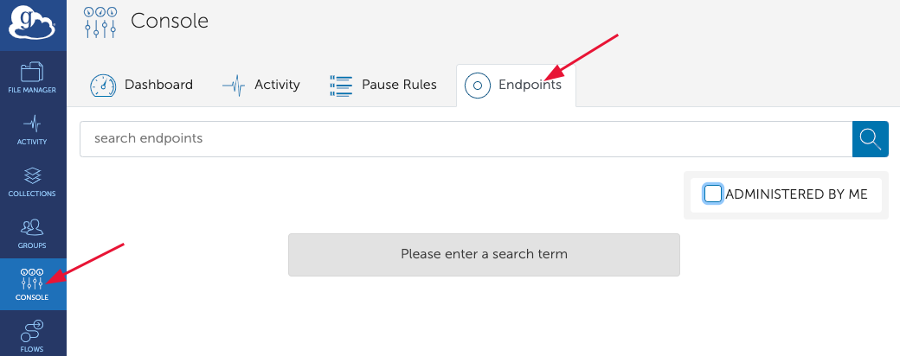

For more detailed information on High Assurance please see the Globus official pages below:

- [High Assurance Security Overview](https://docs.globus.org/guides/overviews/security/high-assurance-overview/)
- [High Assurance Collections](https://docs.globus.org/guides/overviews/high-assurance/)

## Setting Up Globus Connect Personal

[Globus Connect Personal](https://www.globus.org/globus-connect-personal) is software meant to be installed on local machines such as laptops, desktops,
workstations and self-owned, local-scale servers. Globus maintains excellent documentation for installation on [MacOS](https://docs.globus.org/globus-connect-personal/install/mac/), [Linux](https://docs.globus.org/globus-connect-personal/install/linux/) and [Windows](https://docs.globus.org/globus-connect-personal/install/windows/).

To verify your installation is complete, please visit <https://app.globus.org> and log in. Click "Collections" in the left-hand navigation pane and then click the "Administered By You" tab. Look in the table for the Guest Collection you just created.

## Managing Identities

Globus Identities is a concept helping to map Globus Accounts (one per person) to institutions (one or more per person).

Most UAB researchers will have a single identity, their UAB identity, tied to their BlazerID. Some researchers may have external collaborations or appointments that provide additional entities which need access to other endpoints on Globus.

To manage your identities, navigate to <https://app.globus.org/account/identities> and sign in.

<!-- markdownlint-disable MD046 -->
!!! important

    To use UAB Research Computing endpoints, you will need to ensure you are using your UAB identity.
<!-- markdownlint-enable MD046 -->

## Moving Data Between Collections

1. Log in to the Globus App online at <https://app.globus.org> using UAB Single Sign-On (SSO). Start typing "University of Alabama at Birmingham" into the "Use your existing organizational login" text box and selected it when it appears in the list.

    

1. Click File Manager in the left-hand navigation pane.

    

1. Ensure the center icon for the "Panels" selection is picked.

    

1. Click the "Search" icon in the "Collection" text box near the top-left or top-right of the page to locate an endpoint/collection. An endpoint is a server that provides access to data stored in a cluster. A Collection can be a Mapped Collection or Guest Collection, which represents a user's own collection of files or directories mapped from storage endpoints to their Globus account for easy management, sharing and accessing. Please refer to the [Globus endpoints and collections](https://docs.globus.org/guides/overviews/collections-and-endpoints/) to know more. There are multiple ways to find an endpoint. For some endpoints you may be asked to log in, which is true of all UAB endpoints. Some UAB endpoints may also require that you be on the UAB Campus VPN.

    

    1. Begin typing in the box to search for an endpoint. To find UAB-related endpoints, search for "UAB". There are two Cheaha endpoints

        1. Cheaha cluster on-campus (UAB Science DMZ) for machines that are either on the UAB Campus Network, or connected to the UAB Campus VPN.
        1. Cheaha cluster off-campus (UAB Science DMZ) for machines that are _not_ on the UAB Campus Network and _not_ on the UAB Campus VPN.

    1. The "Recent" tab shows endpoints/collections that have most recently been used.

        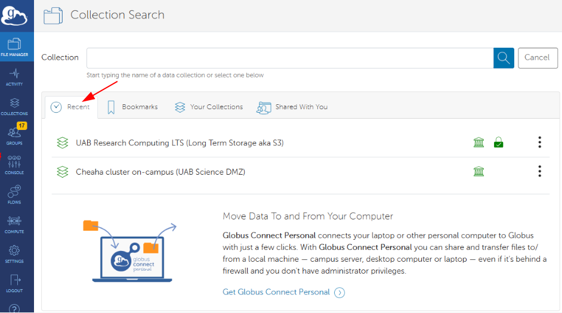

    1. The "Bookmarks" tab shows a list of collection bookmarks. Bookmarks may not reference folders within UAB Research Computing or other High Assurance endpoints.

        

    1. The "Your Collections" tab shows all collections owned by you. For most researchers this will be one or more Globus Connect Personal collections.

        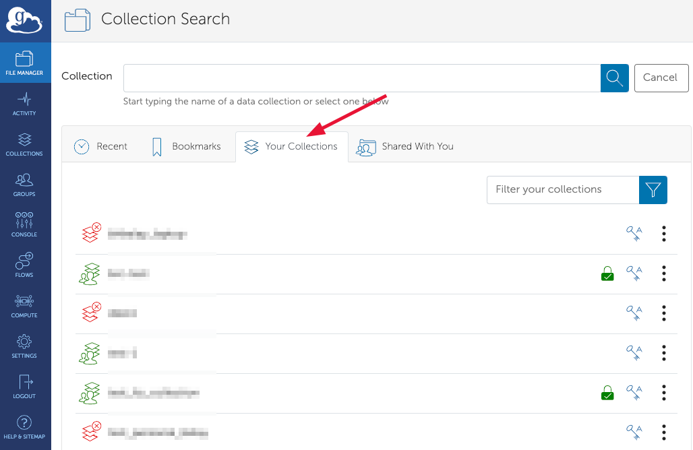

    1. The "Shared With You" tab shows any private collections that have been shared with you by other users, possibly collaborators.

1. When an endpoint/collection has been selected you will see a list of folders and files on the default path for that endpoint/collection in the bottom box. You can use the "Path" box to type a path to find the files you are looking for.

    

1. Repeat the process of selecting an endpoint/collection for the other "Collection" text box.

    

1. When both endpoints have been selected and you have chosen the correct paths for each collection, select files and/or folders on the side you wish to transfer FROM. We will call this side the source collection, and the other side the target collection. Selections may be made by clicking the checkboxes that appear when you hover over each file or folder.

    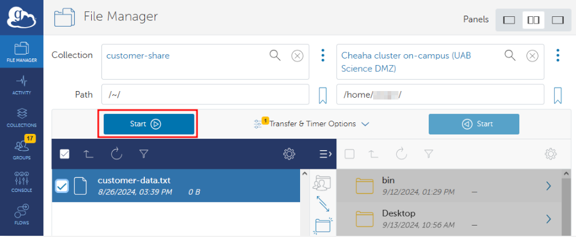

1. When all files and folders have been selected from the source collection, click the "Start" button on the source collection side. This will start a transfer process from source to target. The files will be placed in the currently open path on the target collection.

    

1. A green pop-up notification will appear indicating the transfer has started. Click "View details \>" to be taken to the status of the transfer. You can also check on the status of any transfers by clicking the "Activity" button in the left-hand navigation pane.

<!-- markdownlint-disable MD046 -->
!!! note

    File permissions from the source will not be copied to the destination. Please read more at [this ask.ci FAQ](https://ask.cyberinfrastructure.org/t/why-cant-other-users-access-data-i-transferred-to-a-project-space-on-cheaha/2527/3).
<!-- markdownlint-enable MD046 -->

### Transfer and Sync Options

Between the two "Start" buttons on the "File Manager" page is a "Transfer & Timer Options" drop down menu. Click that button to change the options. More information on each option. A brief summary of the options under "Transfer Settings" are...

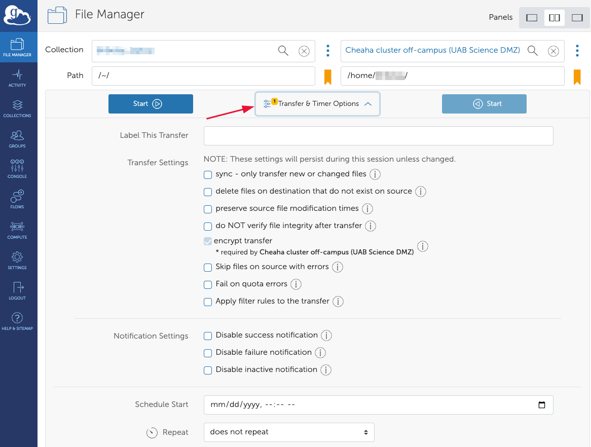

1. sync - Sync files only, rather than create new files.
1. delete files - Delete any files on the target that are not on the source. Useful for forcing identical filesystems when syncing.
1. preserve source - Copies file "modified time" metadata.
1. verify integrity - Verifies that checksums are identical on source and target after transfer completes. The default option is to verify integrity. Its highly recommended to leave this unchecked.
1. encrypt transfer - Encrypts data before leaving source and decrypts after arriving at destination. Recommended for all transfers, required and enforced for all UAB endpoints. It is checked by default.
1. skip files - Skips source files that cause errors during the transfer. Otherwise the entire transfer will stop when an error is encountered.
1. quota fail - Fails instead of retries when the target storage quota is exceeded.
1. Apply filter - Filter rules can be used to customize and fine-tune the transfer process, ensuring that only the desired files/directories are transferred while excluding others based on the rules defined.

Below the "Transfer Settings", there are additional options available that you can enable to customize notification of success/failure, and schedule the transfer to occur at specific time.

### Common Errors

1. File Not Found - This may mean that a file was not readable by Globus. Check that the file hasn't moved or changed names during the transfer. It is recommended to not modify files while they are being transferred by Globus.
1. Permission Denied - Globus is not able to access the files because permissions do not allow it. For Globus Connect Personal, be sure the containing folder is on the "Accessible Folders" list. Be sure that your Cheaha account has access to read the file.

### Project Space Permissions

Globus does not preserve permissions nor ownership when data is transferred, instead using whatever permissions are default at the target location, and making the owner the authenticated user who initiated the transfer. Typically this is not an issue, but may cause problems for [Project Storage directories](../index.md#what-shared-storage-solutions-are-available). Please see our [Project Directory Permissions Section](../cheaha_storage_gpfs/project_directories.md#project-directory-permissions) for more information.

### More Information

A [Globus FAQ](https://docs.globus.org/faq/globus-connect-endpoints/) is available for additional information on endpoints and transfers.

## Connectors

UAB Researcher Computing has subscriptions to connectors for cloud services and other types of filesystems.

### UAB Box Connector

To use the UAB Box Connector, [search for a collection/endpoint](#moving-data-between-collections) like usual and enter "UAB Box" into the search box. Select the endpoint labeled "UAB Box". You should see a list of files and folders that are available to you at <https://uab.app.box.com>. File transfers work as they would with any other endpoint or collection.

### Long-Term Storage S3 (LTS) Connector

<!-- markdownlint-disable MD046 -->
!!! important

    [LTS](../lts/index.md) behaves differently from other file systems and comes with a few possible pitfalls. Keep in mind the following three rules: (1) all data must be in buckets, (2) buckets are only allowed in the root folder, and (3) buckets must have unique names.
<!-- markdownlint-enable MD046 -->

To use the UAB [LTS](../lts/index.md) Connector, [search for a collection/endpoint](#moving-data-between-collections) like usual and enter "UAB LTS" into the search box. Select the endpoint labeled "UAB Research Computing LTS (Long Term Storage aka S3)". If you have stored data within LTS already you should see a list of folders, otherwise you will see an empty space where folders may be placed. Each folder corresponds to a [bucket](../lts/index.md#terminology) in LTS. To create a bucket, click "New Folder" in the "File Manager" window in Globus. Note that buckets must have globally unique names. Read on for more information about possible pitfalls.

  

#### Adding LTS Allocation Credentials

Before you can manage an LTS allocation using Globus, you'll need to add the [LTS S3 Access and Secret Keys](../lts/index.md#requesting-an-allocation) to the LTS endpoint. To do so, please follow the instructions given below.

1. In your browser, navigate to <https://app.globus.org> and login using UAB SSO.
1. Click "Collections" in the left-hand navigation pane.
1. In the search field at the top of the "Collection" page, enter "UAB LTS" and then click the search button. Be sure to uncheck "Recently Used" if it is checked. You should see a collection titled "UAB Research Computing LTS (Long Term Storage aka S3)" appear in the search results.
1. Click the right arrow indicator at the right-hand side of the "UAB Research Computing LTS" result. You should be taken to the Overview page for the "UAB Research Computing LTS" endpoint.

    

1. Near the top of the Overview page, click the "Credentials" tab". After some time, you should see a form requesting your "AWS IAM Access Key ID" and "AWS IAM Secret Key".
1. Enter the two requested keys in the appropriate boxes, then press "Continue". For data security reasons, you may be asked to authenticate again with your UAB SSO credentials. If you have more than one set of keys, you will need to choose which to enter. At this time, there doesn't appear to be a way to enter or use more than one set of credentials at a time with Globus.

    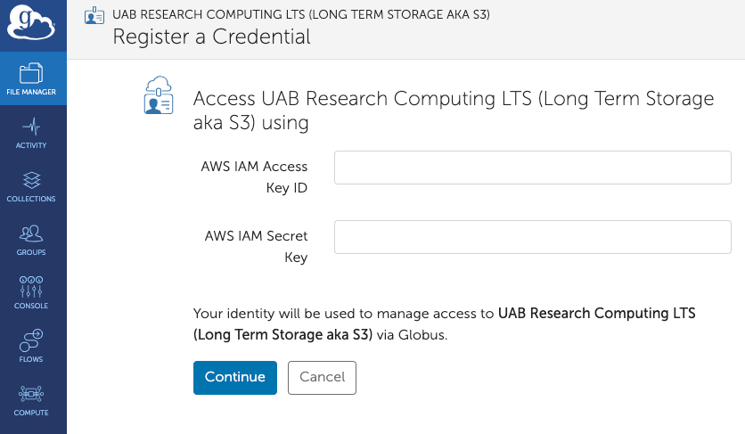

1. You should be taken back to the UAB Research Computing LTS endpoint Overview page with the Credentials tab selected. There should now be one entry on this page showing your AWS IAM Access Key ID and your Globus Identity (i.e., your `BlazerID@uab.edu` email address). If you have multiple Access Keys and ever wish to change which one is being used with Globus, then click the "Trash Can" icon next to the entry on this page to delete it, and start the key entry process over from the previous step.

    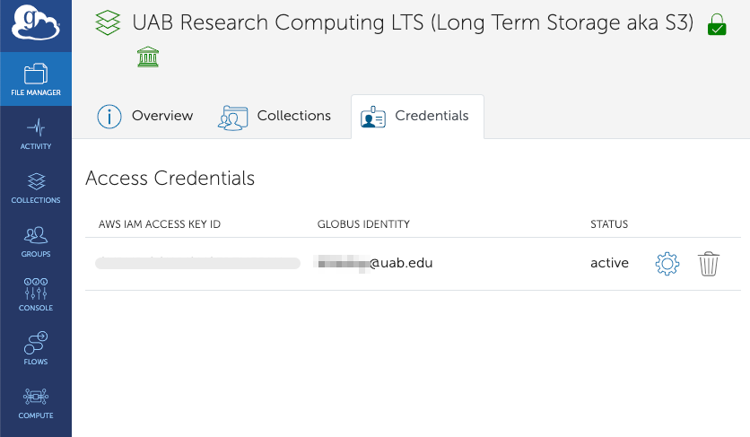

At this point you are able to access the LTS allocation associated with the Access Key you entered, and any buckets which have granted access to that Access Key. If you have more than one Access Key, e.g. for each of your personal and project allocations, you will need to choose which key to enter above. If you ever wish to change credentials, then click the "Trash Can" icon next to the entry shown in step 6, above, and start the key entry process over.

#### Data Must Be in Buckets

All data transferred to LTS must be placed in a bucket, and may _not_ be placed directly into the root directory. Attempting to move data to the root directory will result in an unhelpful error message in the "Activity" window.


Clicking on the "view event log" link shows the following.


```text
Error (transfer)
Endpoint: UAB Research Computing LTS (Long Term Storage aka S3) (184408b4-d04b-4513-9912-8feeb6adcab3)
Server: m-a201b5.9ad93.a567.data.globus.org:443
Command: STOR /test.log
Message: The connection to the server was broken ---
Details: an end-of-file was reached\nglobus_xio: An end of file occurred\n
```

#### Buckets Must Have Globally Unique Names

When creating new buckets, the name must be unique across all buckets on the system. If a duplicate bucket name, for example `first-test-bucket`, is entered, a long error message will appear in a small space next to the new bucket name. For readability, the expanded message is shown below.


```text
Remote Endpoint Failure: Path already exists, Error (mkdir)
Endpoint: UAB Research Computing LTS (Long Term Storage aka S3) (184408b4-d04b-4513-9912-8feeb6adcab3)
Server: 138.26.220.68:443
Message: Path '/first-test-bucket/' already exists
```

At first glance, requiring unique names across all buckets on the system may sound very restrictive, but it is necessary for LTS to be as fast as it is. Fortunately, there is an easy way to deal with the limitation. See our LTS section on [good naming practice](../lts/index.md#avoiding-duplicate-names-for-buckets) for how to avoid duplicate names. For example, if you want to name a bucket `ai-lab` for storing data related to the entire AI lab or a specific dataset, you can append a universally unique identifier (UUID) to the name. To generate a UUID, visit <https://www.uuidgenerator.net/>, and a 16-byte UUID will be automatically generated. You can then copy it and append it to the name `ai-lab`, as shown below.


Similarly, if an invalid bucket name, such as `first_test_bucket`, is entered (due to the use of an underscore, which doesn’t follow LTS bucket naming rules), an error will also be displayed as shown below. To avoid this, please refer to the guidelines for [valid bucket name in LTS](../lts/lts_faq.md#what-are-valid-bucket-names-in-lts).


```text
Bad Gateway: Endpoint Error, Error (mkdir)
Endpoint: UAB Research Computing LTS (Long Term Storage aka S3) (184408b4-d04b-4513-9912-8feeb6adcab3)
Server: 138.26.220.68:443
Command: MKD /first_test_bucket/
Message: Fatal FTP Response ---
Details: 500
globus_gridftp_server_s3_base: S3
Error accessing "": ErrorInvalidBucketName: ErrorInvalidBucketName: \r\n
```

To cancel or dismiss these errors, click the `refresh list` button on the Globus collection panel, or scroll all the way to the right in the red area of the error message and click the `x` symbol as shown below.


Uploading a top-level folder that does not follow the bucket naming rules will cause an error similar to the one encountered when creating a bucket with an invalid name. When uploading a folder with a name similar to a bucket in your LTS, Globus will sync and save all sub-folders and files into that bucket. Subfolders also need to follow naming rules, but they inherit the uniqueness from the parent name. This is part of why we recommend random UUIDs. If you attempt to upload a folder with a name that matches an existing bucket in someone else's space, you will encounter a `permission denied error`, as shown below.

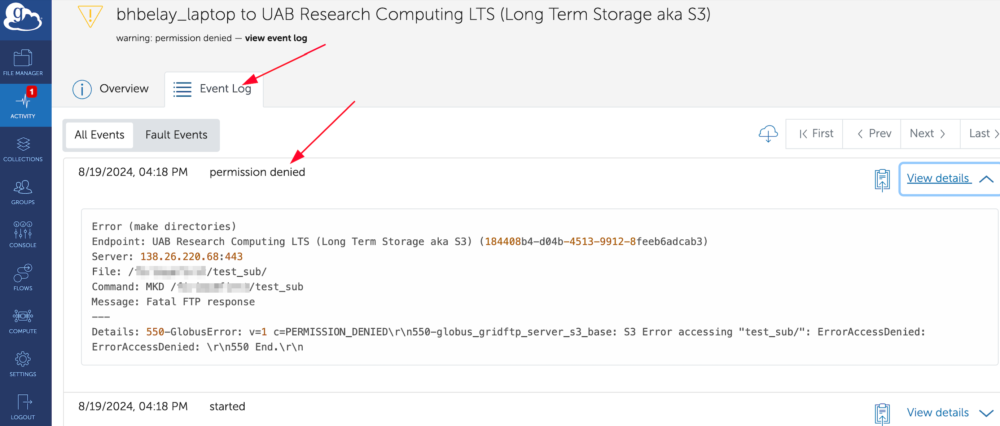

Globus can create buckets. By default, buckets are created without a policy, meaning only you can access them until a policy is added. However, Globus cannot be used to modify or add policies. In addition, files transferred to a bucket will become objects with the same name, as long as the name is valid and not duplicated. Globus does not recognize or handle metadata, so you cannot use it to view or modify metadata. For guidance on defining policies for your bucket, please refer to our documentation on [policy structure](../lts/iam_and_policies.md#policy-structure) and [applying a policy](../lts/iam_and_policies.md#applying-a-policy).

## Using Bookmarks

To save a bookmark, use the File Manager interface to select a collection and navigate to a path on that collection. Then click the "Create Bookmarks" button as shown below.


To manage bookmarks, click on the Collection search bar, then select the Bookmarks tab. To edit a bookmark, click the 'Pencil' icon. To delete a bookmark, click the 'Trash Bin' icon.


<!-- markdownlint-disable MD046 -->
!!! note

    It is not possible to create bookmarks within High Assurance Endpoints.
<!-- markdownlint-enable MD046 -->

## Managing Guest Collections From a Globus Connect Personal Endpoint

It is NOT RECOMMENDED to make Globus Connect Personal Guest Collections public as this is insecure. It is more difficult to manage access controls for the entire Globus Connect Personal Collection than for a Guest Collection. Guest collections make it simpler to share different data with distinct collaborators, and to manage who has access to what data. Be secure, use Guest Collections!

### Creating a Guest Collection

1. Click "Collections" in the left-hand navigation pane.

1. Click the "Administered By You" tab (or) you can search for the collections in search.

    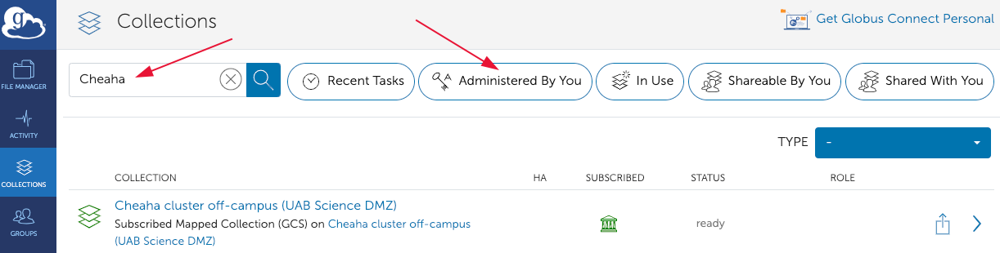

1. In the table, find the collections you wish to share data from and click its name. You will be taken to the page for that collection.

1. Click the "Collections" tab.

    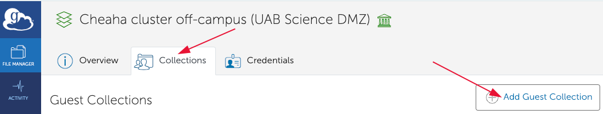

1. Click the "Add a Guest Collection" button.

1. Fill out the form.

    

    1. Manually enter a path or click the Browse button to select a folder.
    1. Give a short but memorable name for your Guest Collection. This information will be useful for your collaborators.
    1. Optionally fill in a more detailed description of the Guest Collection for your records.
    1. Optionally fill in searchable keywords.
    1. Other additional options include, information link, contact email, organization/department.
    1. Default directory, if left empty, is equivalent to the first field "Directory".

1. Click "Create Collection" to move to the next step. You will be taken to the page for the newly created collection, which is now a full-fledged Guest Collection. Any further references to "an endpoint" will be about the newly created, Guest Collection.

1. Make sure you are on the "Permissions" tab. You should see a permissions table with your name in it.

    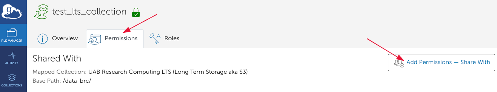

1. Click "Add Permissions -- Share With" to share your Guest Collection with other users.

1. Fill out the form.

    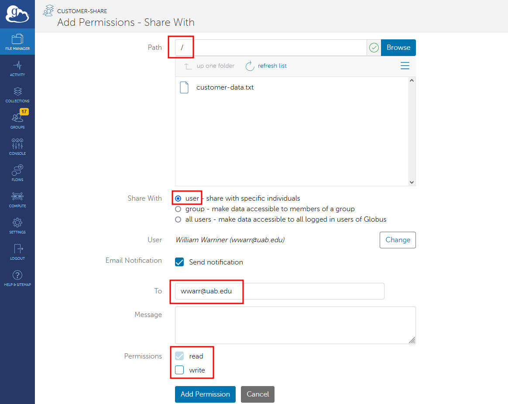

    1. Optionally enter a path within the shared endpoint or use the Browse button. If you leave the path as just a slash, the entire shared endpoint will be shared with the permitted users.
    1. Select who to share with.
        1. User - One or more users.
        1. Group - All members of a group.
        1. All Users - All globus users.
        1. Public - Makes data accessible to everyone.

            <!-- markdownlint-disable MD046 -->
            !!! danger

                It is important to note that options (iii) and (iv) poses a high risk in terms of security. Therefore, we strongly advise against this practice.This will expose information to everyone on Globus!
            <!-- markdownlint-disable MD046 -->

    1. Search for users to add, or a group, depending on your choice above. You should be able to find any globus user using the search box.

        <!-- markdownlint-disable MD046 -->
        !!! warning

            Be certain of which user you are selecting! Check the email address domain.
        <!-- markdownlint-disable MD046 -->

    1. If adding users, optionally enter a message so they know why they are being added.
    1. Select permissions. Read is automatically selected and cannot be changed. Write permissions are optional.

1. Click "Add Permission" to add permissions for these users or groups. You will be returned to the page for the Guest Collection and should be on the "Permissions" tab and should see the user or group in the table.

### Deleting a Guest Collection

1. Click "Collections" in the left-hand navigation pane, then

1. Click the "Administered By You" tab.

    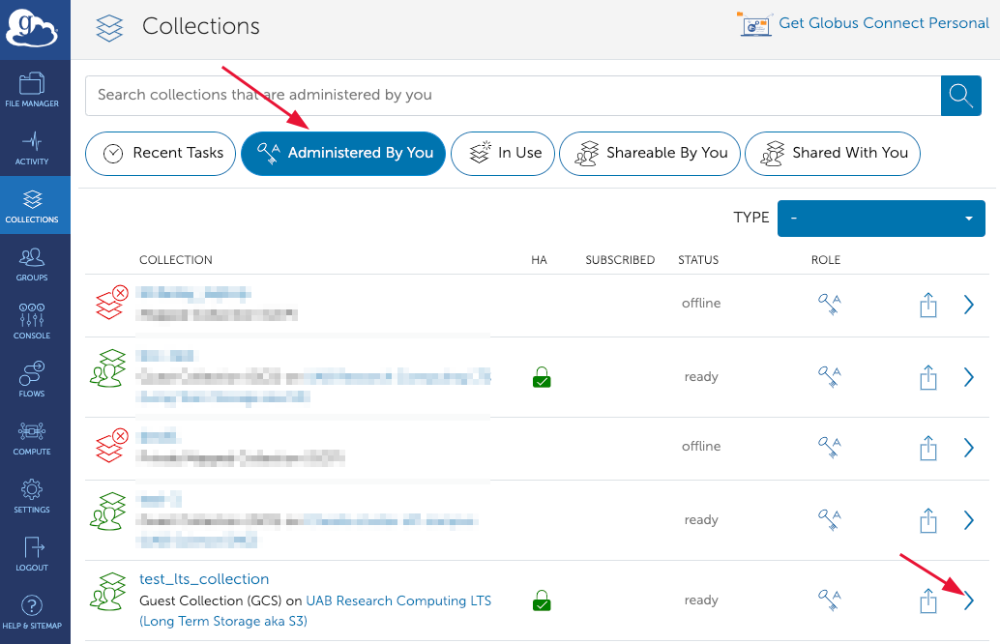

1. Click the right caret ">" icon at the right side of the row with the collection you wish to delete. You will be taken to the information page for that collection.

    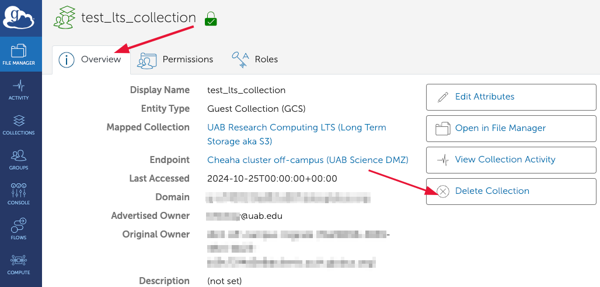

1. Click "X Delete Collection" and a confirmation dialog will open at the top of the page. Respond to the dialog to delete the Guest Collection, or to cancel.

    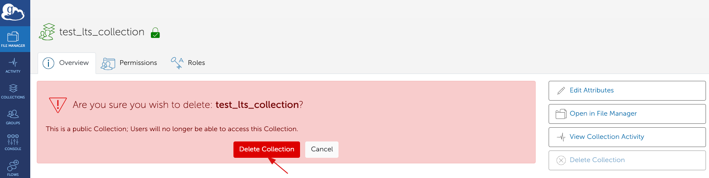

## Where Can I Learn More About Globus?

- See our [Tutorials](./tutorial/index.md)
- Visit the [Globus Events Calendar](https://www.globus.org/events) for official learning opportunities.
