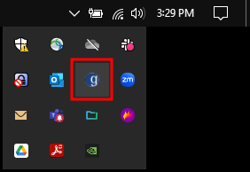
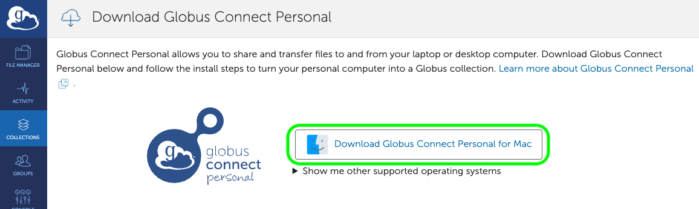
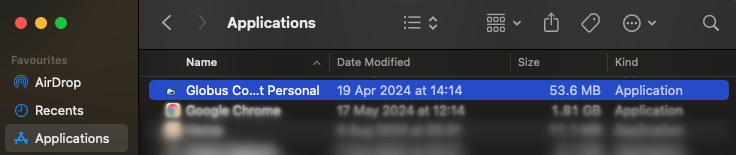

# How to Install Globus Connect Personal (GCP)

[Globus Connect Personal](https://www.globus.org/globus-connect-personal) is software designed for installation on local machines (laptops, desktops, workstations, and other self-managed systems) that lets you create and use a personal Globus Collection (endpoint). It is available for macOS, Windows, and Linux, and Globus provides excellent installation documentation for each platform:

- [MacOS](https://docs.globus.org/globus-connect-personal/install/mac/)
- [Windows](https://docs.globus.org/globus-connect-personal/install/windows/)
- [Linux](https://docs.globus.org/globus-connect-personal/install/linux/)

We do not cover Linux installation here; please refer to the official documentation if you need to install GCP on a Linux system. Below are the GCP installation instructions for Windows and MacOS:

- [Windows](#installing-gcp-on-windows)
- [MacOS](#installing-gcp-on-macos)

## Installing GCP on Windows

The following steps will guide you to install Globus Connect Personal (GCP) on your computer running Windows.

1. Navigate to the [Globus Connect Personal official page](https://www.globus.org/globus-connect-personal) and scroll down to find the GCP Windows version. Click on the "INSTALL NOW" button in the red box, as shown in the image below, to be taken to the official installation instructions and download link for GCP for Windows. The "INSTALL NOW" button is located below the text "Globus Connect Personal for Windows".

    

1. Click the "Download Globus Connect Personal" link on the instructions page, as shown below. This will redirect you to the GCP for Windows installer.

    

1. As shown in the image below, click the "Download Globus Connect Personal for Windows" button to download the installer to download the installer to your computer.

    

1. Find the installer on your computer and open it. Select where you would prefer to have your GCP installed and click the "Install" button.

    

    Please note you must have administrator permissions, to do this. If you are unable to do so, you will need to contact the IT department responsible for managing your computer.

1. When the installation is complete, click the "Finish" button to complete the GCP installation.

    

1. Following installation, GCP will launch in a new window. If it does not, look for it in your Start Menu.

    When GCP has started, click the "Log In" button to authenticate with Globus to begin the Collection setup process. This is a one-time setup to configure GCP to allow your machine to act as a Collection, enabling research data transfer with your computer.

    

    Note that if you uninstall and reinstall GCP, you will need to complete this process again. You should not need to repeat this process otherwise.

1. Grant the required consents. This is required to set up your computer as a Collection. Also provide a name for your consents. We recommend choosing a name that is short, memorable, and related to the purpose for the Collection.

    

1. Enter the details for your GCP Collection, and click save to continue. The following list describes the fields in the form shown below.

    - **Owner Identity:** is the person responsible for this Collection. This field should already be filled with UAB Campus or XIAS email address. If not, please select that email address here.
    - **Collection Name:** is the name for the Collection. This should be filled with the name of the Collection from the previous step.
    - **Description:** Feel free to enter descriptive information about the Collection here. This information will be displayed in the Globus Web App when the Collection is viewed by others.
    - **High Assurance:** Only check this box if the Collection has or will have PHI, HIPAA, or other protected data. If this is the case, please ensure that you have already completed a risk assessment with UAB Enterprise IT.

    

1. GCP Setup is now complete on your computer. Your computer is now serving your new Globus Collection and may be used to transfer data. Click "Exit Setup" to close the window.

1. After installation, locate your Windows System Tray. In it you should see a white lowercase letter "g" in a filled blue circle. If you do not, try finding the Globus Connect Personal application in your start menu and starting the application.

    

By default your Documents folder (typically `C:/Users/%username%/Documents`) is listed in your new Globus Collection. To change it continue on with [How Do I Choose Specific Folders Using Globus Connect Personal?](../globus/gcp_setup.md#how-do-i-choose-specific-folders-to-share-using-globus-connect-personal).

### Installing GCP on MacOS

The following steps will guide you to install Globus Connect Personal (GCP) on your computer running MacOS.

1. Navigate to the [Globus Connect Personal official page](https://www.globus.org/globus-connect-personal) and scroll down to find the GCP MacOS version. Click on the "INSTALL NOW" button in the red box in the image below to be taken to the official installation instructions and download link for GCP for MacOS. The "INSTALL NOW" button is located below the text "Globus Connect Personal for Mac".

    

1. Click the "Download Globus Connect Personal" link on the instructions page, as shown below. This will redirect you to the GCP for MacOS installer.

    

1. As shown in the image below, click the "Download Globus Connect Personal for MacOS" button to download the installer to download the installer to your computer.

    

1. Find the installer on your computer and open it. A new window will pop-up asking you to drag the Globus Connect Personal app into the Application folder on your computer. Do so to install GCP.

    

1. When the above step is completed navigate to your Application folder and look for the "Globus Connect Personal" application. Open it to proceed.

    

1. When GCP has started, click on "Log In" to authenticate with Globus to begin the Collection setup process. This is a one-time setup to configure GCP to allow your machine to act as a Collection, enabling research data transfer with your computer.

    

    Note that if you uninstall and reinstall GCP, you will need to complete this process again. You should not need to repeat this process otherwise.

1. Grant the required consents. This is required to set up your computer as a Collection. Also provide a name for your Collection. We recommend choosing a name that is short, memorable, and related to the purpose for the Collection.

    

1. Enter the details for your GCP Collection, and click save to continue. The following list describes the fields in the form shown below.

    - **Owner Identity:** is the person responsible for this Collection. This field should already be filled with UAB Campus or XIAS email address. If not, please select that email address here.
    - **Collection Name:** is the name for the Collection. This should be filled with the name of the Collection from the previous step.
    - **Description:** Feel free to enter descriptive information about the Collection here. This information will be displayed in the Globus Web App when the Collection is viewed by others.
    - **High Assurance:** Only check this box if the Collection has or will have PHI, HIPAA, or other protected data. If this is the case, please ensure that you have already completed a risk assessment with UAB Enterprise IT.

    

1. GCP Setup is now complete on your computer. Your computer is now serving your new Globus Collection and may be used to transfer data. Click "Exit Setup" to close the window.

1. After installation locate your MacOS notification, generally at the top-right of your display. In it you should see a white lowercase letter "g" in a fille black circle.

    

By default the `/Users/` folder is listed in your new Globus Collection. To change it continue on with [How Do I Share Specific Folders Using Globus Connect Personal?](../globus/gcp_setup.md#how-do-i-choose-specific-folders-to-share-using-globus-connect-personal).

If you have any questions or run into any issues, feel free to [Contact Us](../../../help/support.md#how-to-request-support).
