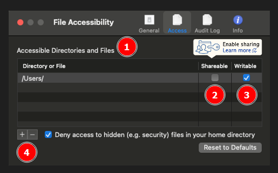

# How to Use Globus Connect Personal (GCP)

Globus Connect Personal (GCP) is a tool that lets you turn your personal computer into a Globus endpoint so you can transfer data to and from the Globus ecosystem.

## How Do I Choose Specific Folders to Share Using Globus Connect Personal?

### Choose Specific Folders on Windows

1. In your Windows system tray, locate the icon that looks like a small letter "g" in a circle. This is the icon for Globus Connect Personal. If you cannot locate the icon in the system tray, then open the Globus Connect Personal app on your computer and look for it again.

    

1. Right-click the icon to open the context menu and click "Options..."
    

1. A new window will appear with a tab labelled Access. In the Access tab is an interface to configure folders available on your GCP Collection. For most use cases, you should not check the writeable checkbox. Below is a summary of what each part of the menu does.

   - **(1) Accessible Folders** table with Folder, Shareable and Writeable columns. Any folder listed here will appear on your GCP Collection. Your research data folder or directories must be listed here to be shareable.
   - **(2) Shareable** column checkboxes controlling which folders can be shared with other users. Each of your research data directories must have this checkbox ticked to be shareable from the Collection. **Check this box only if you want to share your data with others.**
   - **(3) Writeable** column checkboxes controlling which folders can be written to by other users. If a folder is shared with other users, then they will be able to add, delete, or change the contents. We recommend against ticking these boxes for Research Cores serving data to customers. **Check this box only if you want others to be able to change your data.**
   - **(4) Plus `+` and minus `-` buttons** that allow you to add or remove folders from the list.
   - **(5) Save** button which saves changes made to this tab of the options.

    

1. Use the plus `+` and minus `-` buttons to add your research data folders and remove other folders, as needed. Click the "Shareable" checkbox next to each research data folder. Click "Save" when finished.

    In this example, we removed the default `C:/Users/%username%/Documents` folder with the minus `-` button and added the `D:/data` folder with the `+` button and check the "Shareable" box. You will want to pick the folder where your research data is stored.

    

1. Click the "General" tab. The "General" tab enables you to control some settings for the application itself and which folder is the default folder. The default folder will be the first one shown when accessing the Collection.

   - **(1) Run when Windows starts** checkbox enabling starting Globus Connect Personal when you start Windows. **Check this box if GCP should always be on when the computer is on.**
   - **(2) Home Folder** text field that lets you choose which folder will be the default folder for your Collection. We recommend setting this to your primary shared folder from the previous step to simplify navigating your Collection in the Globus Web App.
   - **(3) Save** button which saves changes made to this tab of the options. Be sure to click "Save" if you make changes here.

    

1. Check "Run when Windows starts" if needed. Change the "Home Folder" to match your research data folder. Click "Save" when done.

    In this example, we set the "Home Folder" to match the research data folder, `D:/data` we added in a previous step. If you have multiple research directories to share, you will need to choose just one for this field. Be sure to click save when you are done.

    

To verify the existence and accessibility of your Collection proceed to [How Do I Find Collections I Created or Own?](../globus/globus_organization_tutorial.md#how-do-i-find-collections-i-created-or-own)

### Choose Specific Folders on MacOS

1. In your MacOS notification area, locate the icon that looks like a small letter "g" in a circle. This is the icon for Globus Connect Personal. If you cannot locate the icon in the notification area, then open the Globus Connect Personal app on your computer and look for it again.

    

1. Right-click or command-click the icon to open the context menu. Click "Preferences…​".

    

1. A new window will appear with a tab labelled "Access". Click the "Access" tab if it is not already selected. In this "Access" tab is an interface to configure folders available on your GCP Collection. For most use cases, you should not check the writeable checkbox. Below is a summary of what each part of the menu does.

    - **(1) Accessible Directories and Files** table with "Directory or File", Shareable and Writeable columns. Any folder listed here will appear on your GCP Collection. Your research data folder or directories must be listed here to be shareable.

        <!-- markdownlint-disable MD046 -->
        !!! note

            The terms Directories and Folders are synonyms here.

        <!-- markdownlint-enable MD046 -->

    - **(2) Shareable** column checkboxes controlling which folders can be shared with other users. Each of your research data directories must have this checkbox ticked to be shareable. **Check this box only if you want to share your data with others.**
    - **(3) Writeable** column checkboxes controlling which folders can be written to by other users. If a folder is shared with other users, then they will be able to add, delete, or change the contents. We recommend against ticking these boxes for Research Cores serving data to customers. **Check this box only if you want others to be able to change your data.**
    - **(4) Plus `+` and minus `-`** buttons that allow you to add or remove folders from the list.

    

1. Use the plus `+` and minus `-` buttons to add your research data folders and remove other folders, as needed. Click the "Shareable" checkbox next to each research data folder. Click "Save" when finished.

To verify the existence of your collection and to find collections you created or own, please refer to [How Do I Find Collections I Created or Own?](../globus/globus_organization_tutorial.md#how-do-i-find-collections-i-created-or-own).

If you have any questions, please [Contact US](../../../help/support.md#how-to-request-support).
