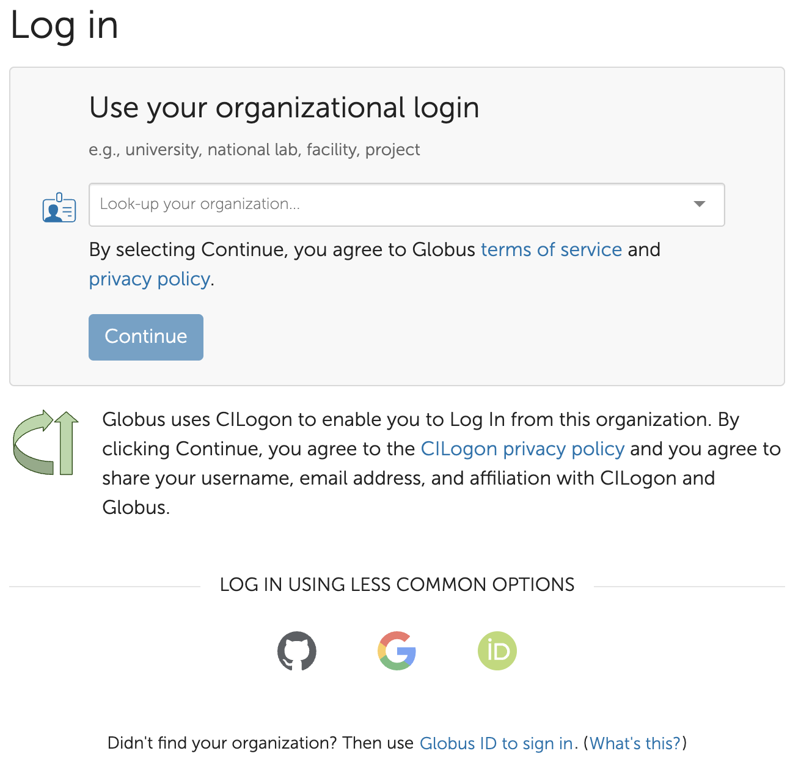
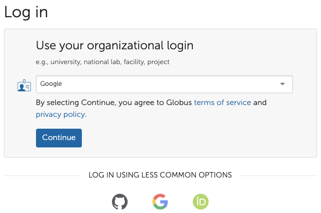
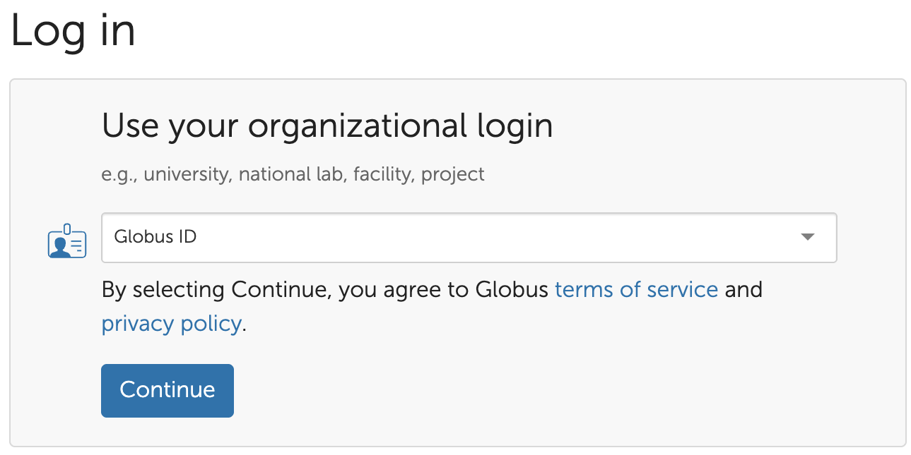

# Overview

XIAS accounts are limited identities intended only for accessing resources within the University of Alabama at Birmingham (UAB) environment. As a result, XIAS accounts cannot be used to access third-party licensed services such as Globus and Box.com.

External collaborators must access these third-party resources using their institution-approved authentication methods or personal accounts that comply with the service provider's requirements.

Additionally, many third-party services require users to accept Terms of Use or licensing agreements. Collaborators should ensure that any access method they use complies with their institution's policies and procedures regarding such agreement.

## Globus Access Options

External collaborators who need access to Globus should use one of the following authentication methods. UAB-affiliated users should continue using their BlazerID credentials. For instructions on getting started with Globus, see [Getting Started with Globus].

### Option 1: Institutional Credentials

If the collaborator's institution participates in Globus and has an approved identity provider, they should sign in using their institutional credentials.

### Option 2: OAuth Identity Providers

Globus uses OpenID Connect (OIDC) and OAuth 2.0 to provide secure authentication through trusted identity providers. Instead of creating a separate Globus username and password, you sign in using an existing identity, such as your university account, Google account, GitHub account, or another supported provider. This approach allows users to securely access Globus services while their credentials remain managed by their chosen identity provider. Collaborators may authenticate using supported Open Authentication (OAuth) providers, including:

- Google
- GitHub
- ORCID

#### Google

If your institution or organization is not listed as a Globus identity provider, or if you prefer using a personal account, you can sign in to Globus with your Google account. Globus supports Google authentication, allowing external users to securely access shared collections and transfer data.

On the Globus login page,

1. Use your browser to navigate to [Globus Login Page](https://app.globus.org). You should see a login page similar to the one shown below. Click "LOG IN".
1. After clicking "LOG IN", the organization search page will appear, as shown below.
1. Under Use your organizational login, select Google from the drop-down menu. Then, Click Continue.
1. You will be redirected to the Google sign-in page to authenticate with your Google account.
1. After successful authentication, you will be returned to Globus to continue accessing shared resources.

If you want to move data to or from your own computer, you will need to install Globus Connect Personal. The [Install Globus Connect Personal](../globus/gcp_install.md) and [Set Up Globus Connect Personal](../globus/gcp_setup.md) walk you through that process. Please note that the owner identity will be based on the Open Authentication you chose.

#### Globus ID

To access files shared by a UAB collaborator, please ask your UAB collaborator to follow the instructions in [How do I share a collection with others?](../globus/globus_organization_tutorial.md/#how-do-i-share-a-collection-with-others). External collaborator can also share your files with a UAB collaborator using the same process, provided the environment where your data is hosted is accessible through Globus. The data storage environment must have a Globus endpoint configured to enable file transfers.
