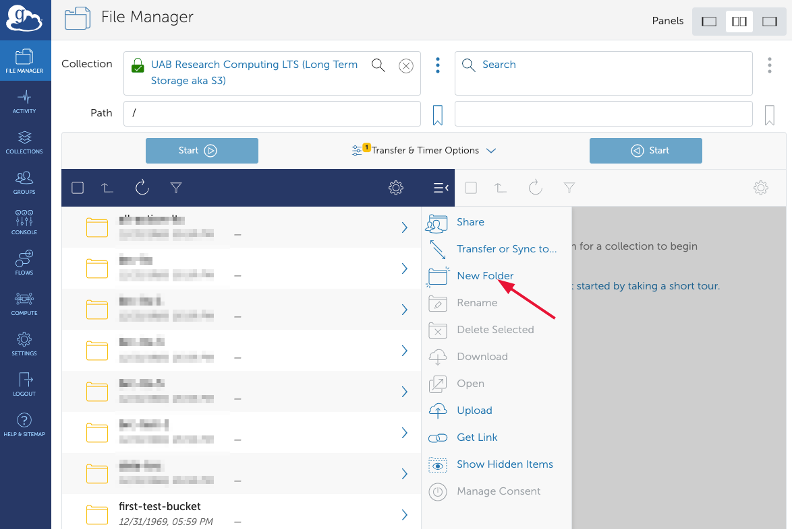
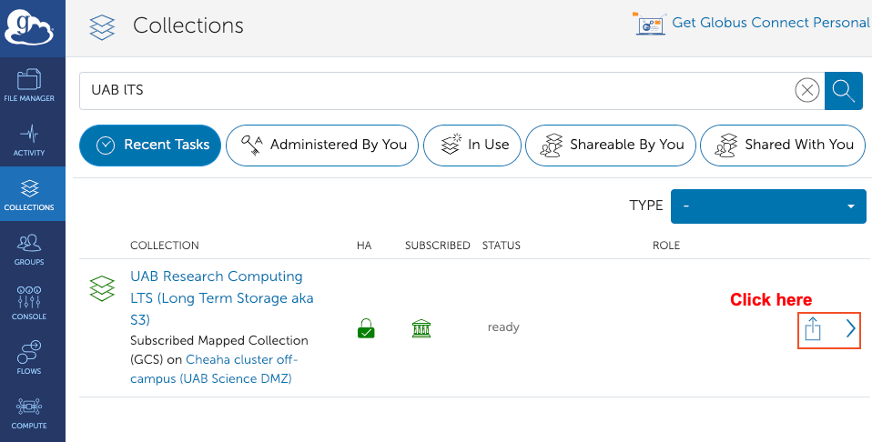
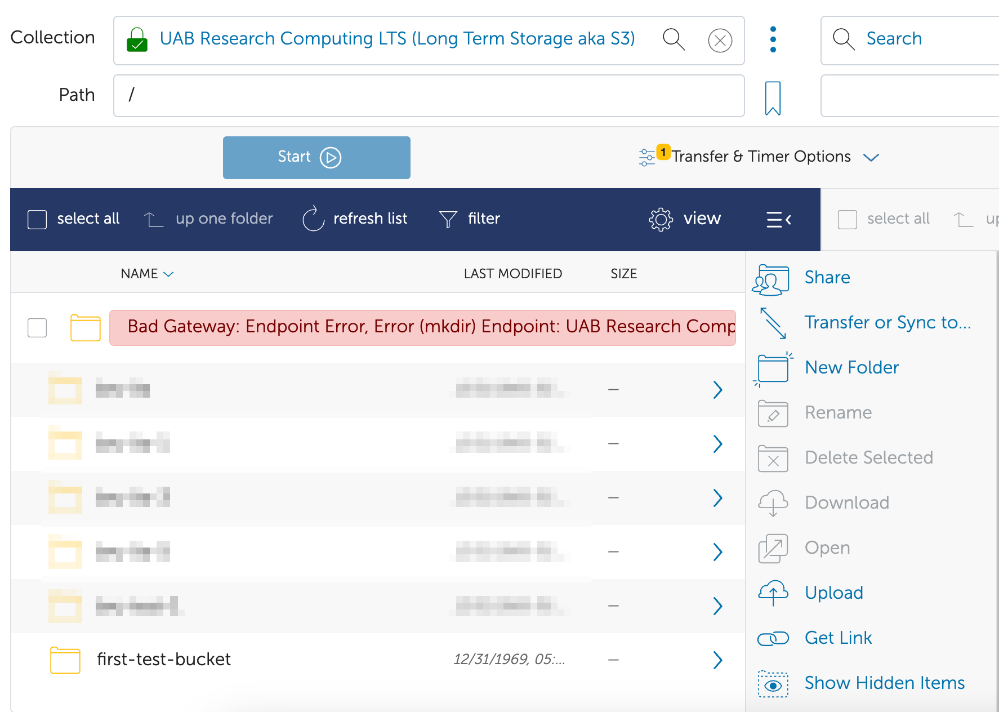
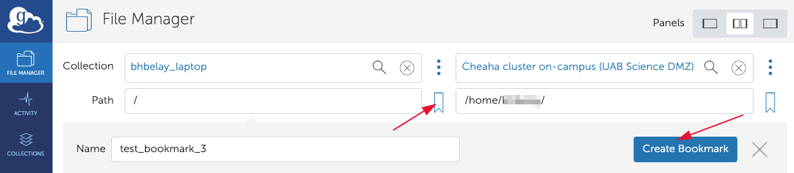
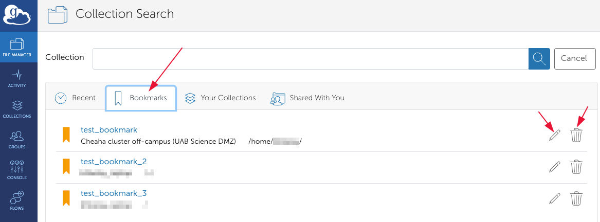

# Globus for Individual Researchers

Do you have data and need to move it to a different computer system? Want to use a graphical interface to do it? Want a service that will attempt to resume interrupted transfers? Want enforced encryption for your transfers? Then Globus is right for you.

These guides are intended for individual researchers who need to move data from one location to another. If you represet a group, manage a Research Core or lab and have never used Globus before, you'll want to start on this page. Then you will want to proceed to [Globus for Research Groups](../globus/globus_organization_tutorial.md).

The resource below will teach you how to effectively use Globus for managing and transferring research data. We will explore what Globus is, why you might use it, how it works, and we'll walk you through the essential steps to get started. You will learn how to set up your Globus account, access the Globus application, find Collections shared with you, and search for Collections by name.

Topics covered:

1. [Why Globus?](#why-globus)
1. [How Does Globus Work?](#how-does-globus-work)
1. [Prerequisites](#prerequisites)
1. [How Do I Get Onto the Globus Web App?](./login_to_globus.md#how-do-i-get-onto-the-globus-web-app)
1. [How Do I Search for Collections by Name?](#how-do-i-search-for-collections-by-name)
1. [How Do I Find UAB Storage Collections?](#how-do-i-find-uab-storage-collections)
1. [How Do I Find Collections Shared with Me?](#how-do-i-find-collections-shared-with-me)
1. [How Do I Transfer Data Between Collections?](#how-do-i-transfer-data-between-collections)
    1. [How Do I Transfer between a Collection and Cheaha?](#how-do-i-transfer-between-a-collection-and-cheaha)
    1. [How Do I Transfer between a Collection and LTS?](#how-do-i-transfer-between-a-collection-and-lts)
    1. [How Do I Transfer between LTS and Cheaha?](#how-do-i-transfer-between-lts-and-cheaha)
1. [How Do I Check Transfer Status?](#how-do-i-check-transfer-status)

## Why Globus?

Globus is a data transfer ecosystem that simplifies the process of transferring, sharing, and managing large datasets. It is used by research institutions around the world to move research data between different storage devices, computer systems, and institutions. Globus has many research data oriented features, making it ideal for many research data transfer scenarios. Below is a list of features.

- Straight-forward, browser-based, graphical interface.
- Compatible with [UAB Box](https://www.uab.edu/it/home/tech-solutions/file-storage/box).
- Compatible with [Long-Term Storage](../../storage/lts/index.md).
- Can be used with your laptop, desktop, or lab workstation via Globus Connect Personal (GCP).
- Transfers are automatically retried in the event of network or computer system outages.
- Transfers are encrypted end-to-end. Globus never sees your data.
- Suitable for transferring PHI and HIPAA data. Note: a UAB Enterprise IT risk assessment is required.

## How Does Globus Work?

Globus is an ecosystem of software intended to make research data transfer simpler. The Globus Web Application (Web App) at <https://app.globus.org> allows you to initiate transfers between any two Collections you have authorization to access. The Globus Connect Personal (GCP) software lets you turn any computer into a Globus Collection. At no point do Globus servers touch your research data. Instead, when you initiate a transfer between two Collections, the Globus application tells the two Collections that they need to talk to each other and data is sent directly between them. The Collections update the application with information you may need to know, such as how much data has transferred so far, how fast the transfer is proceeding, and any errors that occur. If the connection between Collections is interrupted for any reason, the Globus application will attempt to restart the transfer from where it left off.

## Prerequisites

For these guides, you will need your BlazerID or [XIAS ID](../../../account/xias/index.md) and password to authenticate using UAB Single Sign-On (SSO).

## How Do I Search for Collections by Name?

Please follow these instructions to search for a specific Collection by name.

1. [Get onto the Globus Web App](./login_to_globus.md#how-do-i-get-onto-the-globus-web-app).
1. You should see the File Manager page. If not, click File Manager in the left-hand navigation panel.

    

1. Click the Collection Search bar to open the Collection Search page.

    

1. In the example below, we typed "uab box" to search for the UAB Box Collection, which connects to UAB's Box.com service.

    

1. Click the name of the Collection to be taken back to the file manager page with the Collection filled in.

    

If you can't find a particular Collection this way, but know it was shared with you, try [finding Collections shared with me](#how-do-i-find-collections-shared-with-me). Proceed on to learn [how to find UAB storage Collections](#how-do-i-find-uab-storage-collections).

## How Do I Find UAB Storage Collections?

UAB offers [multiple storage resources](../../index.md). The following resources may be accessed through Globus Collections.

- Cheaha file system (GPFS) including [individual directories](../../storage/index.md#what-individual-storage-solutions-are-available) and [project directories](../../storage/cheaha_storage_gpfs/project_directories.md).
- [Long-Term Storage (LTS)](../../storage/lts/index.md).
- [UAB Box](https://www.uab.edu/it/home/tech-solutions/file-storage/box).

To find these resources on Globus, use the following steps.

1. [Get onto the Globus Web App](./login_to_globus.md#how-do-i-get-onto-the-globus-web-app).
1. You should see the File Manager page. If not click File Manager in the left-hand navigation panel.

    

1. Click the Collection Search bar to open the Collection Search page.

    

1. In the search bar, type one of the following, depending on which resource you need, and select the appropriate entry.

    - **Cheaha Filesystem (GPFS)**: Type "UAB Cheaha" and select the "UAB RCS Cheaha HPC", the  collection currently supported.

        

    - **Long-Term Storage (LTS)**: Type "UAB LTS" and select the entry labeled "UAB Research Computing LTS (Long Term Storage aka S3)".

        

    - **UAB Box**: Type "UAB Box" and select the entry labeled "UAB Box".

        

Proceed on to learn [how to find Collections shared with you](#how-do-i-find-uab-storage-collections).

## How Do I Find Collections Shared With Me?

Globus allows users to share Collections with others. Other researchers, labs, and Research Cores on campus may invite you to their Collections to share data with you. The following instructions let you view Collections shared with you.

1. [Log in to Globus using your credentials](./login_to_globus.md#how-do-i-get-onto-the-globus-web-app)
1. You should see the File Manager page. If not click File Manager in the left-hand navigation panel.

    

1. Click the Collection Search bar to open the Collection Search page.

    

1. Click the Shared With You tab. The list of Collections will be filtered down to all Collections others have granted you access to, which should help you find the Collections you need.

    

1. Click the name of the Collection to be taken back to the file manager page with the Collection filled in.

    

If you can't find a particular Collection this way, but know its name, try [searching for Collections](#how-do-i-search-for-collections-by-name).

## How Do I Transfer Data Between Collections?

This section outlines common data transfer scenarios between Globus Collections and Research Computing storage systems.

- [Between a Collection and Cheaha](#how-do-i-transfer-between-a-collection-and-cheaha)
- [Between a Collection and LTS](#how-do-i-transfer-between-a-collection-and-lts)
- [Between LTS and Cheaha](#how-do-i-transfer-between-lts-and-cheaha)

### How Do I Transfer Between a Collection and Cheaha?

Please use the following instructions to transfer data from a Collection to [Cheaha GPFS](../../storage/cheaha_storage_gpfs/index.md). These instructions may also be used for other buckets on LTS, provided you have access and know their file path.

The direction of transfer may also be reversed to transfer data from Cheaha to a Collection. Note that some Collections may not allow you to transfer data back, such as some of those provided by Research Cores.

These instructions can be generalized to any two Collections you have access to on Globus.

1. [Log in to Globus using your credentials](./login_to_globus.md#how-do-i-get-onto-the-globus-web-app).

1. Find the Collection [by filtering](#how-do-i-find-collections-shared-with-me) or [by searching](#how-do-i-search-for-collections-by-name) in the left side Collection Search bar.

1. Once you have selected the Collection you wish to transfer data from, repeat the process to [search](#how-do-i-search-for-collections-by-name) for a Cheaha Collection in the Collection Search bar on the right side of the file manager page. Search for "UAB Cheaha" to find and select the "UAB RCS Cheaha HPC", the  collection currently supported.

1. When you select a Cheaha Collection, or any other High Assurance (HA) Collection or Guest Collection, you will be prompted to re-authenticate. Click the Continue button to do so, then select your UAB email address.

    

    

1. At this point, your file manager page should look something like the following image. At this point, both Collection Search bars should have a Collection filled in. The left side should be the Collection you wish to transfer from. The right side should be a Cheaha Collection. You should see files and folders on both sides.

    

1. Locate the path on the source Collection side. Either type the path into the Path field manually, or use the graphical selection field to click on folder names to navigate the filesystem.

1. Repeat the process on the Cheaha Collection side to locate the destination path on the Cheaha Collection side.

1. Select the file and folders you wish to transfer on the source Collection side. Do so by clicking the checkboxes next to the file and folder names.

    

1. To start the transfer, click the "Start" button on the side you made your selections. A transfer will be started and you should see a green toast notification at the upper-right corner of the web page. Press the "X" button to dismiss the notification or click "View Details" to be taken to the Activity page to see more details about the transfer.

    

From here you can proceed to other related tutorials to initiate other transfers or
[return to the index](#globus-for-individual-researchers).

- [How Do I check transfer status?](#how-do-i-check-transfer-status)
- [How Do I Transfer Between a Collection and LTS?](#how-do-i-transfer-between-a-collection-and-lts)
- [How Do I Transfer Between LTS and Cheaha?](#how-do-i-transfer-between-lts-and-cheaha)

### How Do I Transfer Between a Collection and LTS?

<!-- markdownlint-disable MD046 -->
!!! note

    These instructions assume that you have already an LTS allocation, and your LTS collection is already set up in Globus. If you don't yet have an LTS allocation and/or If this is your first time managing an LTS allocation with Globus, you will need to  [Request LTS Allocations](../../storage/lts/index.md#requesting-an-allocation) and [add your LTS S3 access and secret keys to the LTS endpoint](#adding-lts-allocation-credentials). This is a one-time setup.
<!-- markdownlint-enable MD046 -->

Please use the following instructions to transfer data from a Collection to a [bucket on LTS](../../storage/lts/index.md). These instructions may also be used for other directories on Cheaha, provided you have access and know their file path.

The direction of transfer may also be reversed to transfer data from LTS to the destination Collection. Note that some Collections may not allow you to transfer data back, such as some of those provided by Research Cores.

These instructions can be generalized to any two Collections you have access to on Globus.

1. [Log in to Globus using your credentials](./login_to_globus.md#how-do-i-get-onto-the-globus-web-app).

1. Find a Collection [by filtering](#how-do-i-find-collections-shared-with-me) or [by searching](#how-do-i-search-for-collections-by-name) in the left side Collection Search bar.

1. Once you have selected the shared Collection you wish to transfer data from, repeat the process to [search](#how-do-i-search-for-collections-by-name) for the LTS Collection in the Collection Search bar on the right side of the file manager page. Search for "UAB LTS" to find it.

1. When you select the LTS Collection, or an High Assurance (HA) Collection, you will be prompted to re-authenticate. Click the "Continue" button to do so, then select your UAB email address.

    

    

1. At this point, your file manager page should look something like the following image. Both Collection Search bars should have a Collection filled in. The left side should be the Collection you wish to transfer from. The right side should be the "UAB Research Computing LTS (Long Term Storage aka S3)" Collection. You should see files and folders on both sides.

    

1. Locate the path on the source Collection side. Either type the path into the Path field manually, or use the graphical selection field to click on folder names to navigate the filesystem.

1. Repeat the process on the LTS Collection side to locate the destination path on the LTS Collection side.

1. Select the file and folders you wish to transfer on the source Collection side. Do so by clicking the checkboxes next to the file and folder names.

    

1. To start the transfer, click the "Start" button on the side you made your selections. A transfer will be started and you should see a green toast notification at the upper-right corner of the web page. Press the "X" button to dismiss the notification or click "View Details" to be taken to the Activity page to see more details about the transfer.

    

From here you can proceed to other related tutorials to initiate other transfers or
[return to the index](#globus-for-individual-researchers).

- [How do I check transfer status?](#how-do-i-check-transfer-status)
- [How Do I Transfer Between a Collection and Cheaha?](#how-do-i-transfer-between-a-collection-and-cheaha)
- [How Do I Transfer Between LTS and Cheaha?](#how-do-i-transfer-between-lts-and-cheaha)

### How Do I Transfer Between LTS and Cheaha?

Please use the following instructions to transfer data from a [bucket on LTS](../../storage/lts/index.md) to a project directory on Cheaha. These instructions may also be used for other buckets on LTS and directories on Cheaha, provided you have access and know their file paths.

The direction of transfer may also be reversed to transfer data from Cheaha to LTS.

These instructions can be generalized to any two Collections or Collections you have access to on Globus.

1. [Log in to Globus using your credentials](./login_to_globus.md#how-do-i-get-onto-the-globus-web-app).

1. Find the LTS Collection by [searching](#how-do-i-search-for-collections-by-name) in the Collection Search bar on the left side of the file manager page. Search for "UAB LTS" to find it.

1. Once you have selected the LTS Collection, repeat the process to [search](#how-do-i-search-for-collections-by-name) for a Cheaha Collection in the Collection Search bar on the right side of the file manager page. Search for "Cheaha cluster" to find it.

    Pay close attention in choosing which of the two you need. Choosing incorrectly could lead to slow transfers. Answer the following questions to help you decide. Is the first Collection you selected...

    - ...part of a lab or Research Core on campus? Select "on-campus".
    - ...on a computer on the UAB Campus Network or UAB Wifi or the UAB Campus VPN? Select "on-campus".
    - ...at a different institution? Select "off-campus".
    - ...on a computer on a home network? Select "off-campus".

1. Both the LTS and Cheaha Collections are High Assurance (HA) Collections and you will be prompted to re-authenticate. Click the "Continue" button to do so, then select your UAB email address.

    

    

1. At this point, your file manager page should look something like the following image. Both Collection Search bars should have a Collection name filled in. The left side should be the LTS Collection. The right side should be a Cheaha Collection. You should see files and folders on both sides.

    

1. Locate the source path on the LTS Collection side. Either type the path into the Path field manually, or use the graphical selection field to click on folder names to navigate the filesystem.

1. Repeat the process on the Cheaha Collection side to locate the destination path on the Cheaha Collection side.

1. Select the file and folders you wish to transfer on the source Collection side. Do so by clicking the checkboxes next to the file and folder names.

    

1. To start the transfer, click the "Start" button on the side you made your selections. A transfer will be started and you should see a green toast notification at the upper-right corner of the web page. Press the "X" button to dismiss the notification or click "View Details" to be taken to the Activity page to see more details about the transfer.

    

From here you can proceed to other related tutorials to initiate other transfers or
[return to the index](#globus-for-individual-researchers).

- [How do I check transfer status?](#how-do-i-check-transfer-status)
- [How Do I Transfer Between a Collection and Cheaha?](#how-do-i-transfer-between-a-collection-and-cheaha)
- [How Do I Transfer Between a Collection and LTS?](#how-do-i-transfer-between-a-collection-and-lts)

## How Do I Check Transfer Status?

To check the status of your transfers, please follow the instructions below.

1. [Log in to Globus using your credentials](./login_to_globus.md#how-do-i-get-onto-the-globus-web-app).

1. In the Globus Web App, click "Activity" in the left navigation panel to go to the Activity page. There will be a list overview of transfers, with the most recent at the top.

    

1. To see more details about a transfer, click the transfer title. There will be two tabs. The Overview tab will have information and statistics about the transfer. The Event Log tab will have information about events that occurred during transfer, including start, stop, and any errors. The Event Log is useful for diagnosing issues with failed transfers.

    

<!-- markdownlint-disable MD046 -->
!!! note

    File permissions from the source will not be copied to the destination. Please read more at [this ask.ci FAQ](https://ask.cyberinfrastructure.org/t/why-cant-other-users-access-data-i-transferred-to-a-project-space-on-cheaha/2527/3).
<!-- markdownlint-enable MD046 -->

## Transfer and Sync Options

Between the two "Start" buttons on the "File Manager" page is a "Transfer & Timer Options" drop down menu. Click that button to change the options. More information on each option. A brief summary of the options under "Transfer Settings" are...


1. sync - Sync files only, rather than create new files.
1. delete files - Delete any files on the target that are not on the source. Useful for forcing identical filesystems when syncing.
1. preserve source - Copies file "modified time" metadata.
1. verify integrity - Verifies that checksums are identical on source and target after transfer completes. The default option is to verify integrity. Its highly recommended to leave this unchecked.
1. encrypt transfer - Encrypts data before leaving source and decrypts after arriving at destination. Recommended for all transfers, required and enforced for all UAB endpoints. It is checked by default.
1. skip files - Skips source files that cause errors during the transfer. Otherwise the entire transfer will stop when an error is encountered.
1. quota fail - Fails instead of retries when the target storage quota is exceeded.
1. Apply filter - Filter rules can be used to customize and fine-tune the transfer process, ensuring that only the desired files/directories are transferred while excluding others based on the rules defined.

Below the "Transfer Settings", there are additional options available that you can enable to customize notification of success/failure, and schedule the transfer to occur at specific time.

### Common Errors

1. File Not Found - This may mean that a file was not readable by Globus. Check that the file hasn't moved or changed names during the transfer. It is recommended to not modify files while they are being transferred by Globus.
1. Permission Denied - Globus is not able to access the files because permissions do not allow it. For Globus Connect Personal, be sure the containing folder is on the "Accessible Folders" list. Be sure that your Cheaha account has access to read the file.

### More Information

A [Globus FAQ](https://docs.globus.org/faq/globus-connect-endpoints/) is available for additional information on endpoints and transfers.

## Long-Term Storage S3 (LTS) Connector

<!-- markdownlint-disable MD046 -->
!!! important

    [LTS](../../storage/lts/index.md) behaves differently from other file systems and comes with a few possible pitfalls. Keep in mind the following three rules: (1) all data must be in buckets, (2) buckets are only allowed in the root folder, and (3) buckets must have unique names.
<!-- markdownlint-enable MD046 -->
UAB Researcher Computing has subscriptions to connectors for LTS and other types of filesystems. To use the UAB [LTS](../../storage/lts/index.md) Connector, enter "UAB LTS" into the Collection search box. Select the endpoint labeled "UAB Research Computing LTS (Long Term Storage aka S3)". If you have stored data within LTS already you should see a list of folders, otherwise you will see an empty space where folders may be placed. Each folder corresponds to a [bucket](../../storage/lts/index.md#terminology) in LTS. To create a bucket, click "New Folder" in the "File Manager" window in Globus. Note that buckets must have globally unique names. Read on for more information about possible pitfalls.

  

### Adding LTS Allocation Credentials

Before you can manage an LTS allocation using Globus, you'll need to add the [LTS S3 Access and Secret Keys](../../storage/lts/index.md#requesting-an-allocation) to the LTS endpoint. To do so, please follow the instructions given below.

1. In your browser, navigate to <https://app.globus.org> and login using UAB SSO.
1. Click "Collections" in the left-hand navigation pane.
1. In the search field at the top of the "Collection" page, enter "UAB LTS" and then click the search button. Be sure to uncheck "Recently Used" if it is checked. You should see a collection titled "UAB Research Computing LTS (Long Term Storage aka S3)" appear in the search results.
1. Click the right arrow indicator at the right-hand side of the "UAB Research Computing LTS" result. You should be taken to the Overview page for the "UAB Research Computing LTS" endpoint.

    

1. Near the top of the Overview page, click the "Credentials" tab". After some time, you should see a form requesting your "AWS IAM Access Key ID" and "AWS IAM Secret Key".
1. Enter the two requested keys in the appropriate boxes, then press "Continue". For data security reasons, you may be asked to authenticate again with your UAB SSO credentials. If you have more than one set of keys, you will need to choose which to enter. At this time, there doesn't appear to be a way to enter or use more than one set of credentials at a time with Globus.

    

1. You should be taken back to the UAB Research Computing LTS endpoint Overview page with the Credentials tab selected. There should now be one entry on this page showing your AWS IAM Access Key ID and your Globus Identity (i.e., your `BlazerID@uab.edu` email address). If you have multiple Access Keys and ever wish to change which one is being used with Globus, then click the "Trash Can" icon next to the entry on this page to delete it, and start the key entry process over from the previous step.

    

At this point you are able to access the LTS allocation associated with the Access Key you entered, and any buckets which have granted access to that Access Key. If you have more than one Access Key, e.g. for each of your personal and project allocations, you will need to choose which key to enter above. If you ever wish to change credentials, then click the "Trash Can" icon next to the entry shown in step 6, above, and start the key entry process over.

### Data Must Be in Buckets

All data transferred to LTS must be placed in a bucket, and may _not_ be placed directly into the root directory. Attempting to move data to the root directory will result in an unhelpful error message in the "Activity" window.


Clicking on the "view event log" link shows the following.


```text
Error (transfer)
Endpoint: UAB Research Computing LTS (Long Term Storage aka S3) (184408b4-d04b-4513-9912-8feeb6adcab3)
Server: m-a201b5.9ad93.a567.data.globus.org:443
Command: STOR /test.log
Message: The connection to the server was broken ---
Details: an end-of-file was reached\nglobus_xio: An end of file occurred\n
```

### Buckets Must Have Globally Unique Names

When creating new buckets, the name must be unique across all buckets on the system. If a duplicate bucket name, for example `first-test-bucket`, is entered, a long error message will appear in a small space next to the new bucket name. For readability, the expanded message is shown below.


```text
Remote Endpoint Failure: Path already exists, Error (mkdir)
Endpoint: UAB Research Computing LTS (Long Term Storage aka S3) (184408b4-d04b-4513-9912-8feeb6adcab3)
Server: 138.26.220.68:443
Message: Path '/first-test-bucket/' already exists
```

At first glance, requiring unique names across all buckets on the system may sound very restrictive, but it is necessary for LTS to be as fast as it is. Fortunately, there is an easy way to deal with the limitation. See our LTS section on [good naming practice](../../storage/lts/index.md#avoiding-duplicate-names-for-buckets) for how to avoid duplicate names. For example, if you want to name a bucket `ai-lab` for storing data related to the entire AI lab or a specific dataset, you can append a universally unique identifier (UUID) to the name. To generate a UUID, visit <https://www.uuidgenerator.net/>, and a 16-byte UUID will be automatically generated. You can then copy it and append it to the name `ai-lab`, as shown below.


Similarly, if an invalid bucket name, such as `first_test_bucket`, is entered (due to the use of an underscore, which doesn’t follow LTS bucket naming rules), an error will also be displayed as shown below. To avoid this, please refer to the guidelines for [valid bucket name in LTS](../../storage/lts/lts_faq.md#what-are-valid-bucket-names-in-lts).



```text
Bad Gateway: Endpoint Error, Error (mkdir)
Endpoint: UAB Research Computing LTS (Long Term Storage aka S3) (184408b4-d04b-4513-9912-8feeb6adcab3)
Server: 138.26.220.68:443
Command: MKD /first_test_bucket/
Message: Fatal FTP Response ---
Details: 500
globus_gridftp_server_s3_base: S3
Error accessing "": ErrorInvalidBucketName: ErrorInvalidBucketName: \r\n
```

To cancel or dismiss these errors, click the `refresh list` button on the Globus collection panel, or scroll all the way to the right in the red area of the error message and click the `x` symbol as shown below.


Uploading a top-level folder that does not follow the bucket naming rules will cause an error similar to the one encountered when creating a bucket with an invalid name. When uploading a folder with a name similar to a bucket in your LTS, Globus will sync and save all sub-folders and files into that bucket. Subfolders also need to follow naming rules, but they inherit the uniqueness from the parent name. This is part of why we recommend random UUIDs. If you attempt to upload a folder with a name that matches an existing bucket in someone else's space, you will encounter a `permission denied error`, as shown below.


Globus can create buckets. By default, buckets are created without a policy, meaning only you can access them until a policy is added. However, Globus cannot be used to modify or add policies. In addition, files transferred to a bucket will become objects with the same name, as long as the name is valid and not duplicated. Globus does not recognize or handle metadata, so you cannot use it to view or modify metadata. For guidance on defining policies for your bucket, please refer to our documentation on [policy structure](../../storage/lts/iam_and_policies.md#policy-structure) and [applying a policy](../../storage/lts/iam_and_policies.md#applying-a-policy).

## Using Bookmarks in Globus

To save a bookmark, use the File Manager interface to select a collection and navigate to a path on that collection. Then click the "Create Bookmarks" button as shown below.



To manage bookmarks, click on the Collection search bar, then select the Bookmarks tab. To edit a bookmark, click the 'Pencil' icon. To delete a bookmark, click the 'Trash Bin' icon.



<!-- markdownlint-disable MD046 -->
!!! note

    It is not possible to create bookmarks within High Assurance Endpoints.
<!-- markdownlint-enable MD046 -->
