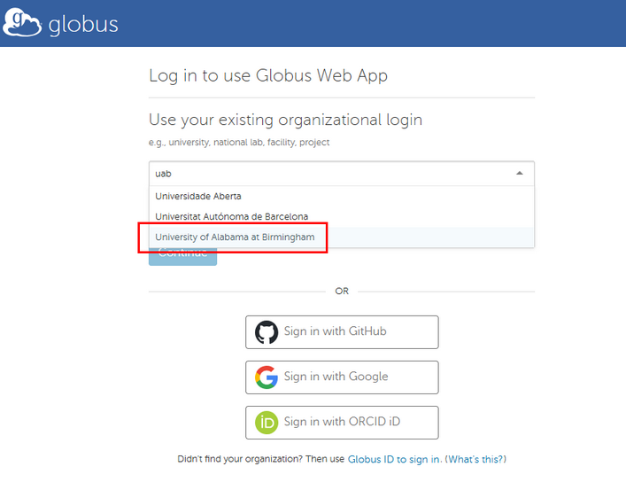
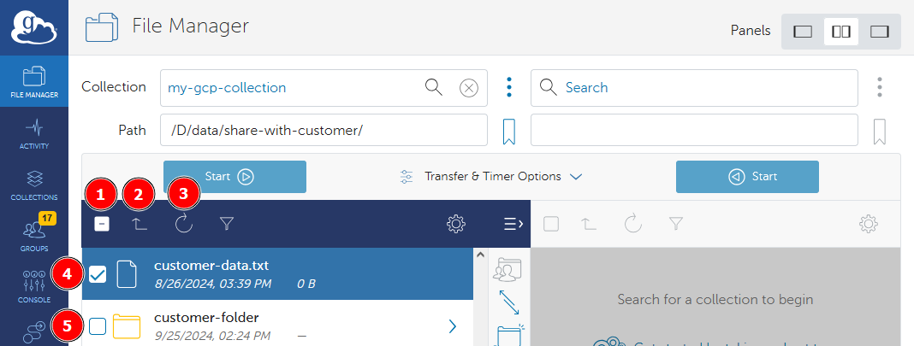

# Logging in to Globus

UAB has a subscription to Globus, and you can set up a Globus account with your UAB credentials.

## Managing Identity

Globus Identity is a concept helping to map Globus Accounts (one per person) to institutions (one or more per person). Most UAB researchers will have a single identity, their UAB identity, tied to their BlazerID. Some researchers may have external collaborations or appointments that provide additional entities which need access to other endpoints on Globus.

To manage your identities, navigate to <https://app.globus.org/account/identities> and sign in.

## How Do I Get Onto the Globus Web App?

1. Use your browser to navigate to <https://app.globus.org>. You should see a login page like below.

    

1. To login, first you must find and select our institution. Type "UAB" or "University of Alabama at Birmingham" into the search bar to locate UAB in the list. The image below shows the correct choice in a red box.

    <!-- markdownlint-disable MD046 -->
    !!! note

        If you are an external collaborator using a [XIAS account](../../../account_management/xias/index.md) (this is uncommon) to interact with UAB-owned storage you will still need to search for "UAB". Do not use your home institution login to access UAB storage systems, as you will only have access to UAB storage with your XIAS credentials.
    <!-- markdownlint-enable MD046 -->

    

1. Select "University of Alabama at Birmingham" from the drop-down menu.

    

1. Click "Continue" to be taken to the UAB Single Sign-On (SSO) form. Enter your BlazerID and password in the SSO form, then click "Log In". Complete the login process as usual.

    

1. You should be taken to the File Manager page of the Globus Web App. We will be revisiting this page frequently throughout the tutorials. We highly recommend taking some time to familiarize yourself with the page as you proceed. The next few steps outline the important features of the File Manager page and its purpose.

    

1. Recall that Globus is a data transfer application. A data transfer means moving data between two computers: source and destination. As we learn more about Globus, data stored on the source and destination will be visible on the File Manager page in the panels in the screenshot above.

    By default, only one panel is visible. We recommend selecting two-panel view mode for improved ease of use. Select two-panel view mode by clicking the button located near the top right corner, as shown in the red box below. Of the three available view mode buttons, the two-panel view mode button is in the center.

    From here on, tutorials will assume you are using two-panel view mode when we refer to the File Manager page.

    

1. Now that two-panel view mode has been selected, you will see two sets of features and panels side-by-side. Most of these features will be used extensively when using Globus.

    - **(1) Collection Search bar**: Clicking here will open the Collection Search page, allowing you to find Collections of data shared by others, or find your own Collections. The next step will demonstrate features of the Collection Search page.
    - **(2) Path text field**: After a Collection has been selected using (1), this text field allows you to enter the path to a specific folder, updating the files and folders shown in (5).
    - **(3) Start Transfer button**: When you have selected files and folders in (5), use this button to start transferring.
    - **(4) Transfer Options drop down menu**: Various options for the transfer are available in this menu. These options are not commonly needed and are not used in the tutorials.
    - **(5) File Browser panel**: After a Collection has been selected in (1), a list of files and folders will appear here for the path shown in (2). You may navigate the Collection here like you would on your operating system.
    - **(6) Navigation panel**: The blue bar at the left hand side of the Globus Web App is the navigation panel. It will be referred to and used many times throughout these tutorials.

    

1. To better prepare you for what to expect, the screenshot below shows the File Manager page with an example Collection selected, called "my-gcp-collection". This example shows a path in the Path text field and contents in the File Browser panel.

    - **(1) Select All checkbox**: Select or unselect all files in the currently displayed folder.
    - **(2) Go Up One Level button**: Go to the folder containing the currently displayed folder.
    - **(3) Refresh button**: Refreshes the view of the currently displayed folder.
    - **(4) File Selection checkbox**: If checked, then the file is selected for transfer. This file is selected.
    - **(5) Folder Selection checkbox**: If checked, then the folder is currently selected for transfer. This folder is not selected.

    

The File Manager page will be your most frequently-visited page when using Globus for data transfers. It is central to usage of the Globus Web Application. Please take some time to familiarize yourself with its look and feel. As you progress in the tutorials, please take time to experiment with transferring data to better understand how the interface works. Feel free to return here for guidance.

From here you can proceed to [How Do I Search for Collections by Name?](./globus_individual_tutorial.md#how-do-i-search-for-collections-by-name) and [How Do I Transfer Data Between Collections?](./globus_individual_tutorial.md#how-do-i-transfer-data-between-collections)

## Where Can I Learn More About Globus?

- Visit the [Globus Events Calendar](https://www.globus.org/events) for official learning opportunities.

At this point, you can already start using Globus through your browser to move data between existing endpoints.

However, if you want to move data to or from your own computer, you will need to install Globus Connect Personal. The [Install Globus Connect Personal](./gcp_install.md) and [Set Up Globus Connect Personal](./gcp_setup.md) walk you through that process.
