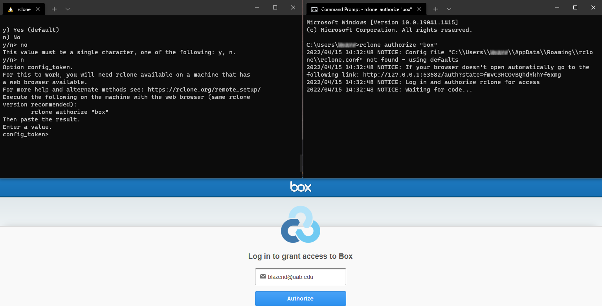
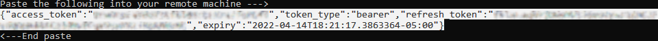
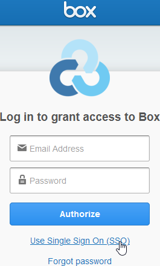
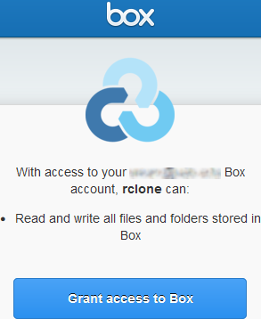
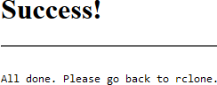
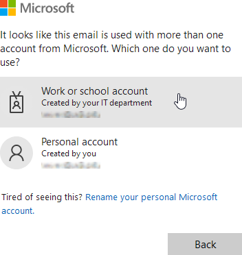
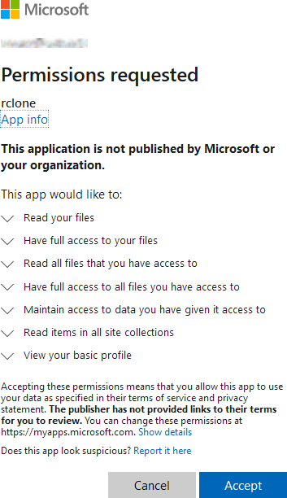
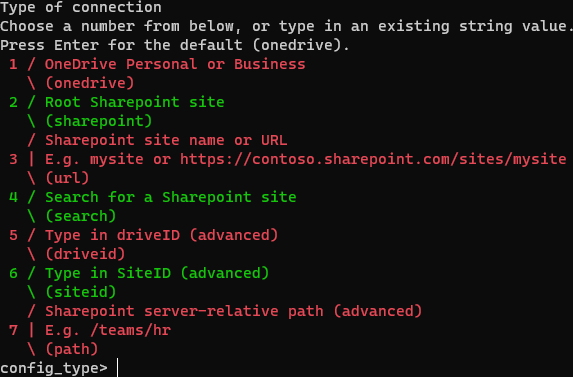

# RClone

[RClone](https://rclone.org/) is a powerful command line tool for transferring and synchronizing files over the internet between various machines, servers and cloud storage services. It is highly recommended for small to moderate amounts of data. For very large amounts of data consider using [Globus](globus.md) for increased robustness against failure. Where Globus is not available, `rclone` is still suitable.

RClone requires a modest amount of setup time on local machines, but once setup can be used fairly easily. RClone uses the concepts of "remotes", which is an abstract term for any storage service or device that is not physically part of the local machine. Many remotes are offered, including [SFTP](../../uab_cloud/remote_access.md#sftp) and various [UAB Cloud Storage Solutions](https://www.uab.edu/it/home/tech-solutions/file-storage/storage-options). SFTP may be used to access Cheaha, cloud.rc and other laptop and desktop computers.

To use RClone effectively, you'll need to setup remotes before using the various commands. Most file manipulation commands on Linux can be found in the RClone commands, but may have slightly different names, e.g. `cp` is `rclone copy`.

RClone is very powerful and, as such, has a wide variety of configuration options and flags to fine tune behavior. We will only cover the basics needed to install the software, setup remotes relevant to work at UAB, and some basic usage commands.

## Quick Tutorial for Cheaha

To use RClone for simple data transfer to and from Cheaha, follow these steps:

1. Load the module using `module load rclone`.
1. [Set up a remote storage provider](#setting-up-remotes)
1. Copy files using the `rclone cp` [command](#copying-files).

    - To transfer from Cheaha, use `rclone cp :path/on/cheaha remote:path/on/dest`
    - To transfer to Cheaha, use `rclone cp remote:/path/on/remote :path/on/cheaha`.

    Be sure to replace `remote` with the name of the remote you set up in step 2.

## Installing

### Installing on Cheaha

On Cheaha, RClone is already installed as a [Module](../../cheaha/software/modules.md). Use `module load rclone` to load it.

### Installing on Linux and cloud.rc

See [Installing Software](../../uab_cloud/installing_software.md) for general good practice on installing software, then use the following command.

```bash
curl https://rclone.org/install.sh | sudo bash
```

Open a new terminal and enter `rclone` to verify installation.

### Installing on Windows

It is highly recommended to install `rclone` in Windows Subsystem for Linux (WSL).

To instead install natively on Windows, you will need to use the following instructions.

1. Download the appropriate version from the [downloads](https://rclone.org/downloads/) page.
1. Extract `rclone.exe` into a memorable folder on your system. Do not put it into `Program Files`.
1. In the Start Menu type `env` and look for the application "Edit the system Environment Variables" to open the System Properties dialog.
1. Click the "Environment Variables..." button.
1. Under "User variables for $USER" find the variable "Path".
1. Click "Path" to select it.
1. Click the "Edit..." button to open a new dialog.
1. Click the "New" button.
1. Type in the folder path to `rclone.exe` as `C:/path/to/rclone_folder`, modified appropriately.
1. Click the "OK" button to confirm and close the dialog box.
1. Click the "OK" button to confirm and close the Environment Variables dialog box.
1. Click the "OK" button to confirm and close the System Properties dialog box.
1. Verify the installation by typing "cmd" in the Start Menu and opening the Command Prompt application.
1. Type `rclone` and you should see the `rclone` help text.

### MacOS

Follow the [online instructions](https://rclone.org/install/#macos-brew) for installing with `brew`.

## Setting Up Remotes

RClone is capable of interfacing with many remote cloud services, as well as using `sftp` for connecting two personal computers or servers. We will only cover those [cloud services](https://www.uab.edu/it/home/tech-solutions/file-storage/storage-options) relevant to UAB use. We will not cover how to connect to any other cloud services using RClone. More detailed information is available at the [RClone documentation](https://rclone.org/docs/)

<!-- markdownlint-disable MD046 -->
!!! important

    Cloud access tokens are always supplied with an expiration date for security reasons. You will need to repeat the setup process periodically to regain access via RClone.
<!-- markdownlint-enable MD046 -->

<!-- markdownlint-disable MD046 -->
!!! note

    RClone has an unusual user interface, using alternating red and green blocks to differentiate list items. The colors do not convey any particular meaning beyond differentiation.
<!-- markdownlint-enable MD046 -->

### Setting Up an SFTP Remote

RClone connects two personal computers or servers using SFTP which is built on SSH, so a lot of these instructions mirror what would be done with an SSH configuration.

1. [Generate a Key Pair](../../uab_cloud/remote_access.md#generating-key-pairs) for use with the remote machine.
1. At the terminal enter `rclone config`.
1. Follow the prompts to choose `sftp`.
1. Enter the following values as they come up, using defaults for other values.
    - `name>` Name of the remote for future reference and configuration
    - `host>` Remote IP address or `cheaha.rc.uab.edu` for Cheaha
    - `user>` The user you will log into on the remote machine
    - `key_file>` The absolute path to the private key file on the local machine, something like `~/.ssh/private_key_ed25519`
    - `key_file_pass>` The passphrase used to secure the private key file (optional, but highly recommended)
1. Verify by using `rclone lsd <name>`.

The official documentation for `rclone sftp` can be found at <https://rclone.org/sftp/>.

### Setting Up UAB Cloud Remotes

The setup process for UAB cloud remotes is generally the same, except for the specifics of authentication. The instruction template is outlined below and will point you to the authentication section specific to each remote when it becomes relevant.

As you step through the process, you will ultimately open two terminal windows and a browser window, and will need to copy text between the terminal windows. The first terminal window will be used to setup the RClone cloud remote. The second terminal will be used to authenticate to that cloud service and gain a token that will be passed back to the first terminal. Authentication will happen by logging into the service in a browser window. This setup method is necessary for any machine where a browser is not readily available, such as a cloud.rc virtual machine. To facilitate setup on these machines, the second terminal will be opened on a machine with RClone and a browser. An example of what this setup might look like is given below.



<!-- markdownlint-disable MD046 -->
!!! important

    If you are using RClone in Windows Subsystem for Linux (WSL), you won't be able to open a browser using WSL. Instead, you will need to [Install RClone on Windows](#installing-on-windows) and use the Windows Command Prompt terminal to use `rclone authorize`.
<!-- markdownlint-enable MD046 -->

1. Open a terminal on the device you wish to authorize to access the chosen cloud service provider using RClone. This terminal will be referred to as terminal-1.
1. At terminal-1 enter `rclone config`.
1. Follow the prompts to choose one of the following. The selection here will be used later and will be referred to as `<remote>`.
   - UAB Box: select `Box`. `<remote>` will be replaced by  `box`.
   - UAB SharePoint Site: select `Microsoft OneDrive`. `<remote>` will be replaced by `onedrive`.
   - UAB OneDrive: select `Microsoft OneDrive`. `<remote>` will be replaced by `onedrive`.
1. Enter a short, memorable name for future reference when prompted with `name>`. Keep this `<name>` in mind as it will be how you access the remote when [Using Commands](#usage).
1. Press enter to leave all additional prompts blank until "Use auto config?". Type "n", for no, and press enter.
1. The prompt should now read `config_token>`.
1. On a machine with a browser, such as your personal computer, open a new terminal and enter `rclone authorize "<remote>"`. Replacing `<remote>` with the value from step (3). This terminal will be referred to as terminal-2.
1. When the browser window opens, use it to authenticate to your selected service.
    - [Authenticate to UAB Box](#authenticating-to-uab-box).
    - [Authenticate to Microsoft OneDrive](#authenticating-to-microsoft-onedrive).
    - Other services not officially supported by UAB IT are possible, but are not documented here. You will need to provide your own credentials for these services.
1. Terminal-2 will print a secret token, which will appear like in the following image. You will need to copy the portion highlighted in the image, between the lines with `--->` and `<---`.

    

1. Copy and paste the token from the terminal-2 to terminal-1.
1. Follow the remaining prompts.
1. Verify success by using `rclone lsd <name>:` in terminal-1.

### Authenticating to Cloud Remotes

#### Authenticating to UAB Box

1. Click "Use Single Sign On (SSO)".

    

1. Type in your UAB email address (not your @uabmc.edu email!).
1. Click "Authorize".

    

1. You will be redirected to the UAB SSO page.
1. Authenticate with your BlazerID credentials.
1. You will be asked to grant permission to the RClone software. Click "Grant access to Box" if you want the software to work with Box. If you do not grant permission, you will not be able to use RClone with Box.

    

1. You will be redirected to a "Success!" page. Return to Terminal (5) to find the authentication token.

    

1. Return to [Setting up UAB Cloud Remotes](#setting-up-uab-cloud-remotes).

<!-- markdownlint-disable MD046 -->
!!! warning

    Tokens are set to expire after some time of disuse to decrease risk of a data breach. If your token expires, you can [Reconnect to an Existing Remote](#reconnecting-to-an-existing-remote) rather than recreate the remote configuration completely from scratch.
<!-- markdownlint-enable MD046 -->

#### Authenticating to Microsoft OneDrive

1. Type in your UAB email address (not your @uabmc.edu email!).
1. Click "Next".

    

1. If prompted, click "Work or school account".

    

1. You will be asked to grant permission to the RClone software. Click "Accept" if you want the software to work with OneDrive. If you do not grant permission, you will not be able to use RClone with OneDrive.

    

1. You will be redirected to a "Success!" page. Return to Terminal (5) to find the authentication token.

    

1. Next you will return to the general instructions. Before you do, note that you'll be asked to choose which type of OneDrive service to access. The prompt will look like the image below. For UAB, the two relevant selections will be (1) to access your personal OneDrive space and (3) for a SharePoint Site, e.g. for a lab or department.

    

1. With your selection in mind, return to [Setting up UAB Cloud Remotes](#setting-up-uab-cloud-remotes).

### Setting Up an S3 LTS Remote

The full S3 configuration process can be done from a single command line terminal. Open a terminal and enter `rclone config` to begin the configuration process.

<!-- markdownlint-disable MD046 -->
!!! note

    The locations where you will need to input either a command or select an option are preceded with a `$` for easier navigation.
<!-- markdownlint-enable MD046 -->

``` bash
$ rclone config

2022/02/22 13:02:15 NOTICE: Config file "/home/mdefende/.config/rclone/rclone.conf" not found - using defaults
No remotes found - make a new one
n) New remote
s) Set configuration password
q) Quit config

# select 'n' to create a new remote
$ n/s/q> n

# name the new remote
$ name> uablts
```

At this point, you've created a new remote configuration called uablts. This will be the remote name used in further commands. You can name the remote whatever you would like, but will need to replace uablts in the instructions with whichever name you chose, if you chose a different name.

``` bash
...
4 / Amazon Drive
  \ (amazon cloud drive)
5 / Amazon S3 Compliant Storage Providers including AWS, Alibaba, Ceph, Digital Ocean, Dreamhost, IBM COS, Lyve Cloud, Minio, RackCorp, SeaweedFS, and Tencent COS
  \ (s3)
6 / Backblaze B2
  \ (b2)
...

$ Storage> 5

...
2 / Alibaba Cloud Object Storage System (OSS) formerly Aliyun
  \ (Alibaba)
3 / Ceph Object Storage
  \ (Ceph)
4 / Digital Ocean Spaces
  \ (DigitalOcean)
...

$ provider> 3

Option env_auth.
Get AWS credentials from runtime (environment variables or EC2/ECS meta data if no env vars).
Only applies if access_key_id and secret_access_key is blank.
Choose a number from below, or type in your own boolean value (true or false).
Press Enter for the default (false).
 1 / Enter AWS credentials in the next step.
   \ (false)
 2 / Get AWS credentials from the environment (env vars or IAM).
   \ (true)

$ env_auth> 1 (or leave blank)

Option access_key_id.
AWS Access Key ID.
Leave blank for anonymous access or runtime credentials.
Enter a value. Press Enter to leave empty.

$ access_key_id> (Enter your access key given to you by research computing)

Option secret_access_key.
AWS Secret Access Key (password).
Leave blank for anonymous access or runtime credentials.
Enter a value. Press Enter to leave empty.

$ secret_access_key> (Enter your secret access key given to you by research computing here)

Option region.
Region to connect to.
Leave blank if you are using an S3 clone and you don't have a region.
Choose a number from below, or type in your own value.
Press Enter to leave empty.
   / Use this if unsure.
 1 | Will use v4 signatures and an empty region.
   \ ()
   / Use this only if v4 signatures don't work.
 2 | E.g. pre Jewel/v10 CEPH.
   \ (other-v2-signature)

$ region> (Leave empty)

Option endpoint.
Endpoint for S3 API.
Required when using an S3 clone.
Enter a value. Press Enter to leave empty.

$ endpoint> s3.lts.rc.uab.edu
```

From here, press Enter to accept default options until it gives you a summary of your connection

``` bash
[uablts]
type = s3
provider = Ceph
access_key_id = ****************** # these will be filled in on your screen
secret_access_key = ********************************
endpoint = s3.lts.rc.uab.edu
--------------------
y) Yes this is OK (default)
e) Edit this remote
d) Delete this remote
y/e/d>
```

Make sure everything looks correct here, then press Enter. At this point, it will bring you back to the main configuration menu. You can choose the `Quit Config` option and exit back to a basic terminal.

### Reconnecting to an Existing Remote

When your tokens expire, rather than recreate the remote from scratch, simply use the following command with your existing remote `<name>`.

```bash
rclone config reconnect <name>:
```

- If you already have a token, you will be asked if you want to refresh it. Choose yes if so, then continue.
- You will be prompted with `Use auto config?`. If you are on a machine with no access to a browser, respond `n`, as in the original setup.
- Follow the steps in the appropriate section under [Authenticating to Cloud Remotes](#authenticating-to-cloud-remotes), as in the original setup.

## Usage

RClone is a powerful tool with many commands available. We will only cover a small subset of the available commands, as most are beyond typical usage, so please see the [RClone documentation](https://rclone.org/docs/) for more information.

All commands have access to the [global flags](https://rclone.org/flags/). An important global flag is `--dry-run` to show what will happen without actually executing the command, which can be helpful to prevent costly mistakes. [Other Helpful Global Flags](#other-helpful-global-flags) are also available.

The various remotes each have their own individual page with their own specific flags, and are linked in the relevant [Setting up Remotes](#setting-up-remotes) section above.

<!-- markdownlint-disable MD046 -->
!!! important

    Remote paths are always prefixed by the name of the remote like `cheaha:/path/to/files`. The colon character `:` is required for all remote paths. Local paths have no prefix like `/path/to/local/files`. RClone can thus be used between any two machines that are configured where `rclone` is being used, including from the local machine to itself. In the following instructions, replace `<remote:>` by the appropriate remote name from configuration. To access local files, leave `<remote:>` off entirely.
<!-- markdownlint-enable MD046 -->

<!-- markdownlint-disable MD046 -->
!!! important

    Remember to use quotes `"` around paths with spaces like `"path\to\a folder with spaces"`
<!-- markdownlint-enable MD046 -->

### Usage Concept

All `rclone` commands follow the same general patterns outlined below. `source` is the name of the source remote and `destination` is the name of the `destination` remote. Remotes must be [set up](#setting-up-remotes) before using commands. To work with local files use the format `:path/to/data` instead of `remote:path/to/data`. The colon is necessary to access local files.

- Single-source commands like `ls`:

    ```bash
    rclone ls <flags...> source:path/to/data
    ```

- Transfer commands like `cp`:

    ```bash
    rclone cp <flags...> source:path/to/data destination:path/to/data
    ```

    Source always comes before destination. To change the direction of file transfer, swap the order of `source` and `destination`.

### Creating a Directory

To create a directory use `rclone mkdir <remote:><path>`.

Example: `rclone mkdir box:manuscript`.

### Listing Files and Directories

To list files on a machine use `rclone ls <remote:><path>`.

Example `rclone ls box:`.

To list directories on a machine use `rclone lsd <remote:><path>`.

Example: `rclone lsd box:` should show `manuscript`.

### Copying Files

To copy files without changing their name, or to recursively copy directory content, use `rclone copy <source:><path> <destination:><path>`. Note that the directory contents are copied, so when copying a directory, be sure that directory exists on the remote and that you are copying into it.

Example: `rclone copy "C:\users\Name\My Documents" box:manuscript`

To copy a single file and change its name, use `rclone copyto <source:><path/oldname> <destination:><path/newname>`.

Example `rclone copyto "C:\users\Name\My Documents\manuscript.docx" box:manuscript\newest.docx`

### Syncing Between Two Devices

To make a destination directory's contents identical to a source directory, use `rclone sync <source:><path> <destination:><path>`

Example: `rclone sync cheaha:"C:\users\Name\My Documents" box:manuscript`.

<!-- markdownlint-disable MD046 -->
!!! danger

    `rclone sync` is a destructive operation and cannot be undone! If files exist on the destination that do not exist on the source, then they will be deleted permanently from the destination. To avoid accidental destruction of files use the `--immutable` [flag](#other-helpful-global-flags).
<!-- markdownlint-enable MD046 -->

## Other Helpful Global Flags

Flag used with any RClone command are called global flags. Below are some useful global flags.

- `-C` or `--checksum`: Skip syncing files based on checksum instead of last modified time.
- `--dry-run`: Show what will happen if the command were executed. No changes are made.
- `--immutable`: Do not allow any files to be modified. Helpful to avoid unintended deletions and overwrites.
- `--max-depth <integer>`: Only recurse to `<integer>` depth within directory tree. Using `rclone ls --max-depth 1` means only show top-level files in the current directory.
- `-P` or `--progress`: Show progress of command as it runs.
- `--quiet`: Print as little as possible. Useful in scripts.
- `-u` or `--update`: Skips files that are newer on the remote.
