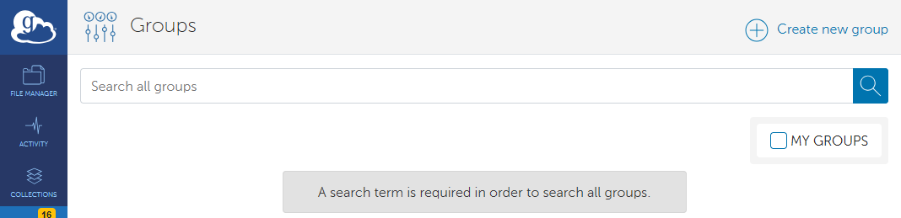

# Globus Group Management

## Where Can I Find the Groups Page in the Globus Web App?

1. [Get onto the Globus Web App](./globus_individual_tutorial.md#how-do-i-get-onto-the-globus-web-app).
1. Click Groups in the left-hand navigation panel.

## How Do I Find a Group?

1. If you are looking for new groups, ensure the "MY GROUPS" Checkbox is unchecked. If you are looking for groups you are already a member of, ensure the "MY GROUPS" Checkbox is checked.

    

1. Enter the name of the group you wish to find in the "Filter groups" search bar.

    

1. If the group you typed exists, you should see it appear in the results. If it does not, ensure that the "MY GROUPS" Checkbox is unchecked, if needed.

    

1. To view the group's page click its name in the results.

    

## How Do I Request to Join a Group?

1. [Get onto the Globus Web App](./globus_individual_tutorial.md#how-do-i-get-onto-the-globus-web-app).
1. [Find the Group you wish to join](./globus_group_management.md#how-do-i-find-a-group). Be sure the "MY GROUPS" Checkbox is unchecked.
1. Click the "Join this Group" button.

    

    

1. Fill in the form and click the "Submit Application" button. Other groups may have additional fields to fill out.

    

1. You will see a notice of your pending membership application and will need to wait for approval from the group administrators.

    

## How Do I Find and Accept an Invitation From a Group?

1. [Get onto the Globus Web App](./globus_individual_tutorial.md#how-do-i-get-onto-the-globus-web-app).
1. Be sure the "MY GROUPS" Checkbox is checked. When checked, you should see any pending invitations in the list of groups.

    

1. Click the name of the group with a pending invitation, or the right arrow at the right side of the table entry. You will be taken to the group specific page. Click "Accept Invitation" to join the group. Click "Decline Invitation" to dismiss the invitation without joining.

    

1. If you clicked the "Accept Invitation" button, you will be taken to a form. Fill out the form and click "Accept Invitation" to join the group. Other groups may have additional fields to fill out.

    

## How Do I Leave a Group?

1. [Get onto the Globus Web App](./globus_individual_tutorial.md#how-do-i-get-onto-the-globus-web-app).
1. [Find the Group you wish to leave](./globus_group_management.md#how-do-i-find-a-group). It may help to check the "MY GROUPS" Checkbox.
1. Click the "Leave Group" button. This action cannot be undone, but you may [Rejoin the Group](#how-do-i-request-to-join-a-group) or be [Invited to Rejoin](#how-do-i-find-and-accept-an-invitation-from-a-group).

    

## How Do I Create a Group?

1. [Get to the Groups page of the Globus Web App](#where-can-i-find-the-groups-page-in-the-globus-web-app).
1. Click the "Create New Group" button at the top-right of the window.

    

1. Fill in the form. More information about each field is below. When you have finished, click the "Create Group" button to create the group.

    If you need to change the Group settings later, you can modify the group.

    1. **Group Name**: Enter a group name here.
    1. **Description** (optional): Describe the purpose and scope of the group here.
    1. **Terms & Conditions** (optional): should not be necessary for UAB groups.
    1. **Enable High Assurance** checkbox: Check if your group will deal with PHI, HIPAA, or other protected data.
    1. **Users may request to join this group** checkbox: Uncheck to make the group invite-only. Core administrators should consider leaving this box checked for their top-level group to avoid work filtering invitations and reduce noise.
    1. **Signup Fields** buttons: First Name, Last Name, and Organization are always required. We recommend also selecting "Project", "Department", and "Field of Science". Feel free to select any fields you wish.
    1. **Group Visibility** radio buttons: Click "Members of this Group" to hide the group from non-members.
    1. **Membership Visibility** radio buttons: Click "Administrators and Managers Only" to hide member names from each other. Core adminstrators should consider using the "Administrators and Managers Only" option for their top-level groups because it improves the user experience when members are looking for administrator names.

    

1. Once the Group is created you should be taken to the newly-created Group's details page. Veryify the settings you picked are correct by clicking the "Additional Properties" drop down label to expand it, as highlighted below.

    

1. [Find the Group you wish to delete](./globus_group_management.md#how-do-i-find-a-group). It may help to check the "MY GROUPS" Checkbox.
1. Click the "Delete Group" button to delete the group. This action is highly destructive and cannot be undone. Be absolutely certain you know what you are doing before deleting a group.

    Subgroups will no longer have this group as their parent and cannot be added as subgroups of other groups. The parent-child relationship between this group and its subgroups will be permanently destroyed. Subgroups will become independent groups following deletion and will not be deleted.

    <!-- markdownlint-disable MD046 -->
    !!! danger

        Deleting a group is a highly destructive action. Deleting a group cannot be undone. Be absolutely certain you know what you are doing before deleting a group.
    <!-- markdownlint-enable MD046 -->

    

## How Do I Invite My Staff to My Core's Group?

1. [Get onto the Globus Web App](./globus_individual_tutorial.md#how-do-i-get-onto-the-globus-web-app).
1. [Find the Group you wish to invite others to join](./globus_group_management.md#how-do-i-find-a-group). It may help to check the "MY GROUPS" Checkbox.
1. Click the "Invite Others" button to invite others to your group.

    

1. Type the name, email, or BlazerID of the person you wish to add into the search bar and click "Add".

    

1. Select the role to give the user when adding them. See [What Does Each Role Mean?](#what-does-each-role-mean) to help decide.

    

1. Click "Send Invitation" to invite the user. You should see the following confirmation page. They will need to follow instructions at [How Do I Find and Accept an Invitation From a Group?](#how-do-i-find-and-accept-an-invitation-from-a-group) to join.

    

## How Do I Modify Group Members?

1. [Get to the Groups page of the Globus Web App](#where-can-i-find-the-groups-page-in-the-globus-web-app).
1. [Find the Group you wish to change](#how-do-i-find-a-group).
1. On the Group's details page, click the Members tab to see a list of Group members.

    

1. Locate the member. Click the right arrow button at the right-hand side of the member's entry to be taken to their membership page.

    

## How Do I Change a Group Member's Role Level?

1. [Prepare to modify Group memberships](#how-do-i-modify-group-members).
1. Click the pencil icon just to the right of the member's role to make changes to the role as highlighted in the image.

    

1. After clicking the icon, new controls become available in place of the existing role. Select the new role from the drop-down menu, then click "Save" to make the change permanent.

    

## What Does Each Role Mean?

{{ read_csv('data_management/transfer/tutorial/res/globus-group-roles.csv', keep_default_na=False, colalign=("left","center","center","center")) }}

- For Research Core data management
    - Will the person be managing subgroups and memberships? Give them the "Manager" role.
    - Will the person need to be in charge of operations? Give them the "Administrator" role.
- For PI labs in Research Core customer pickup subgroups?
    - Will the person need only access to the data? Give them the "Member" role.
    - Will the person need to manage membership? Give them the "Manager" role.
    - Will the person need to be in charge of operations? Give them the "Administrator" role.

## How Do I Remove a Group Member?

1. [Prepare to modify Group memberships](#how-do-i-modify-group-members).
1. Click the "Remove Membership" button to immediately remove the member from the group. There is no confirmation for this action.

    

1. The page should update to reflect the change immediately. Instead of the "Remove Membership" button, you should see "Add Membership" and "Send Invitation" buttons.

    
