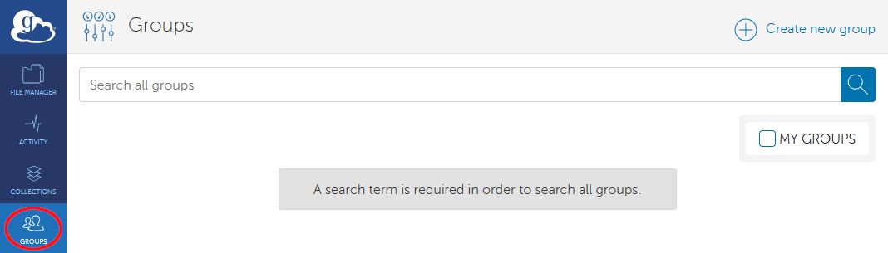
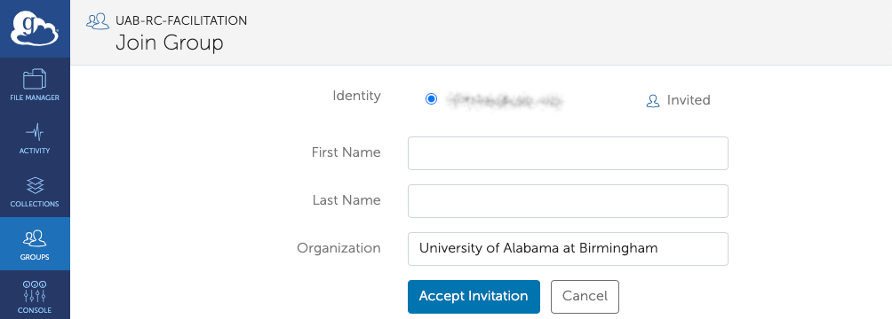

# Globus Group Management

## How Do I Find a Group?

1. [Get onto the Globus Web App](./globus_individual_tutorial.md#how-do-i-get-onto-the-globus-web-app).
1. Click Groups in the left-hand navigation panel.

    

1. If you are looking for new groups, ensure the "MY GROUPS" Checkbox is unchecked. If you are looking for groups you are already a member of, ensure the "MY GROUPS" Checkbox is checked.

    

1. Enter the name of the group you wish to find in the "Filter groups" search bar.

    

1. If the group you typed exists, you should see it appear in the results. If it does not, ensure that the "MY GROUPS" Checkbox is unchecked, if needed.

    

1. To view the group's page click its name in the results.

    

## How Do I Request to Join a Group?

1. [Get onto the Globus Web App](./globus_individual_tutorial.md#how-do-i-get-onto-the-globus-web-app).
1. [Find the Group you wish to join](./globus_group_management.md#how-do-i-find-a-group). Be sure the "MY GROUPS" checkbox is unchecked.
1. Click the "Join this Group" button.

    

    

1. Fill in the form and click the "Submit Application" button. Other groups may have additional fields to fill out.

    

1. You will see a notice of your pending membership application and will need to wait for approval from the group administrators.

    

## How Do I Find and Accept an Invitation From a Group?

1. [Get onto the Globus Web App](./globus_individual_tutorial.md#how-do-i-get-onto-the-globus-web-app).
1. Be sure the "MY GROUPS" checkbox is checked. When checked, you should see any pending invitations in the list of groups.

    

1. Click the name of the group with a pending invitation, or the right arrow at the right side of the table entry. You will be taken to the group specific page. Click "Accept Invitation" to join the group. Click "Decline Invitation" to dismiss the invitation without joining.

    

1. If you clicked the "Accept Invitation" button, you will be taken to a form. Fill out the form and click "Accept Invitation" to join the group. Other groups may have additional fields to fill out.

    

## How Do I Leave a Group?

1. [Get onto the Globus Web App](./globus_individual_tutorial.md#how-do-i-get-onto-the-globus-web-app).
1. [Find the Group you wish to leave](./globus_group_management.md#how-do-i-find-a-group).
1. Click the "Leave Group" button. This action cannot be undone, but you may [Rejoin the Group](#how-do-i-request-to-join-a-group) or be [Invited to Rejoin](#how-do-i-find-and-accept-an-invitation-from-a-group).

    
