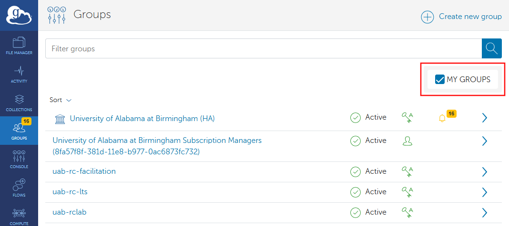
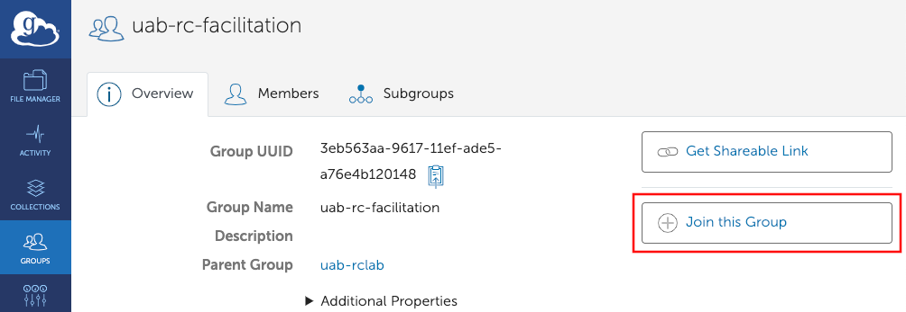
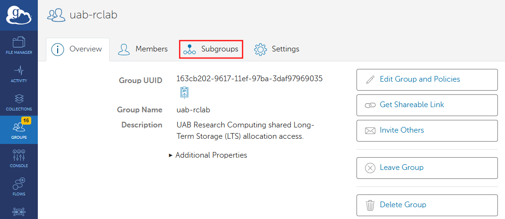
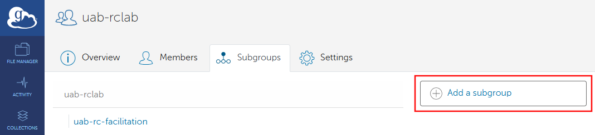
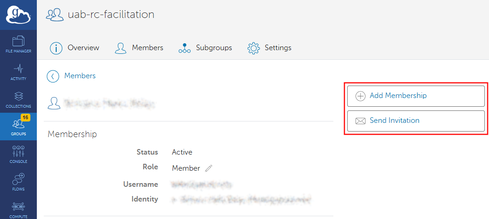

# Globus Group Management

Organizations can manage students, staff, collaborators, and customers in Globus using the Group feature. Representatives can create groups and subgroups to manage and document associations between related people. With a Group, you can grant access to a Guest Collection to many people at once.

If you are new to Globus, we recommend starting with our [Globus Tutorials for Individual Researchers](./globus_individual_tutorial.md) first to familiarize yourself with how Globus is used.

Below is a list of topics covered in this article.

- General information:
    - [Where Can I Find the Groups Page in the Globus Web App?](#where-can-i-find-the-groups-page-in-the-globus-web-app)
    - [How Do I Find a Group?](#how-do-i-find-a-group)
- For Group members:
    - [How Do I Request to Join a Group?](#how-do-i-request-to-join-a-group)
    - [How Do I Find and Accept an Invitation From a Group?](#how-do-i-find-and-accept-an-invitation-from-a-group)
    - [How Do I Leave a Group?](#how-do-i-leave-a-group)
- For Group administrators:
    - Managing Groups and Subgroups
        - [How Do I Create a Group?](#how-do-i-create-a-group)
        - [How Do I Create a Subgroup?](#how-do-i-create-a-subgroup)
        - [How Do I See Subgroups of a Group?](#how-do-i-see-subgroups-of-a-group)
        - [How Do I Modify a Group or Subgroup?](#how-do-i-modify-a-group-or-subgroup)
            - [How Do I Make My Group Invite Only?](#how-do-i-make-a-group-invite-only)
            - [How Do I Hide My Group from Others?](#how-do-i-hide-a-group-from-others)
            - [How Do I Keep Members from Seeing Each Other?](#how-do-i-keep-group-members-from-seeing-each-other)
        - [How Do I Delete a Group or Subgroup?](#how-do-i-delete-a-group-or-subgroup)
    - Managing Group Members and Roles
        - [How Do I Invite Others to a Group?](#how-do-i-invite-others-to-a-group)
        - [How Do I See Group Members?](#how-do-i-see-group-members)
        - [How Do I Modify Group Members?](#how-do-i-modify-group-members)
            - [How Do I Change a Group Member's Role Level?](#how-do-i-change-a-group-members-role-level)
            - [What Does Each Role Mean?](#what-does-each-role-mean)
            - [How Do I Remove a Group Member?](#how-do-i-remove-a-group-member)

## Where Can I Find the Groups Page in the Globus Web App?

1. [Get onto the Globus Web App](./globus_individual_tutorial.md#how-do-i-get-onto-the-globus-web-app).
1. In the left-hand navigation panel, click Groups to be taken to the Groups page. All Group management activities in this tutorial document start on this page, so take some time to familiarize yourself with getting to this point.

    

## How Do I Find a Group?

1. [Get to the Groups page of the Globus Web App](#where-can-i-find-the-groups-page-in-the-globus-web-app).
1. If you are looking for new groups, ensure the "MY GROUPS" Checkbox is unchecked. If you are looking for groups you are already a member of, ensure the "MY GROUPS" Checkbox is checked.

    

1. Enter the name of the group you wish to find in the "Filter groups" search bar.

    

1. If the group you typed exists, you should see it appear in the results. If it does not, ensure that the "MY GROUPS" Checkbox is unchecked, if needed.

    

1. To view the newly-created Group's details page click its name in the results. If you are a Lab PI or Core Manager, please familiarize yourself with finding this details page. The details page is central to managing Groups.

    

## How Do I Request to Join a Group?

1. [Get to the Groups page of the Globus Web App](#where-can-i-find-the-groups-page-in-the-globus-web-app).
1. [Find the Group you wish to join](./globus_group_management.md#how-do-i-find-a-group). Be sure the "MY GROUPS" Checkbox is unchecked or you will not be able to see new Groups in the search results.

    

1. Click the "Join this Group" button. You can find this button on the main Groups page after searching for the Group. Note that some Groups may not allow invitation requests. To join restricted-access groups you will need to communicate with the Group's administrators.

    

    You can also find the button on the Group's details page.

    

1. Fill in the form and click the "Submit Application" button. Other groups may have additional fields to fill out.

    

1. You will see a notice of your pending membership application and will need to wait for approval from the group administrators.

    

## How Do I Find and Accept an Invitation From a Group?

1. [Get to the Groups page of the Globus Web App](#where-can-i-find-the-groups-page-in-the-globus-web-app).
1. Be sure the "MY GROUPS" Checkbox is checked. When checked, you should see any pending invitations in the list of groups.

    

1. Click the name of the group with a pending invitation, or the right arrow at the right side of the table entry. You will be taken to the Group's details page. Click "Accept Invitation" to join the group. Click "Decline Invitation" to dismiss the invitation without joining.

    

1. If you clicked the "Accept Invitation" button, you will be taken to a form. Fill out the form and click "Accept Invitation" to join the group. Other groups may have additional fields to fill out.

    

## How Do I Leave a Group?

1. [Get to the Groups page of the Globus Web App](#where-can-i-find-the-groups-page-in-the-globus-web-app).
1. [Find the Group you wish to leave](./globus_group_management.md#how-do-i-find-a-group). It may help to check the "MY GROUPS" Checkbox to only show Groups you are a member of.

    

1. Click the "Leave Group" button. Note that this action cannot be undone, but you may [Rejoin the Group](#how-do-i-request-to-join-a-group) or be [Invited to Rejoin](#how-do-i-find-and-accept-an-invitation-from-a-group).

    

## How Do I Create a Group?

1. [Get to the Groups page of the Globus Web App](#where-can-i-find-the-groups-page-in-the-globus-web-app).
1. Click the "Create New Group" button at the top-right of the window.

    

1. Fill in the form. More information about each field is below. When you have finished, click the "Create Group" button to create the group.

    If you need to change the Group settings later, you can [Modify the Group](#how-do-i-modify-a-group-or-subgroup).

    - **(1) Group Name**: Enter a group name here.
    - **(2) Description** (optional): Describe the purpose and scope of the group here.
    - **(3) Terms & Conditions** (optional): should not be necessary for UAB groups.
    - **(4) Enable High Assurance** checkbox: Check if your group will deal with PHI, HIPAA, or other protected data.
    - **(5) Users may request to join this group** checkbox: Uncheck to make the group invite-only. Core administrators should consider leaving this box checked for their top-level group to avoid work filtering invitations and reduce noise.
    - **(6) Signup Fields** buttons: First Name, Last Name, and Organization are always required. We recommend also selecting "Project", "Department", and "Field of Science". Feel free to select any fields you wish.
    - **(7) Group Visibility** radio buttons: Click "Members of this Group" to hide the group from non-members.
    - **(8) Membership Visibility** radio buttons: Click "Administrators and Managers Only" to hide member names from each other. Core adminstrators should consider using the "Administrators and Managers Only" option for their top-level groups because it improves the user experience when members are looking for administrator names.

    

1. Once the Group is created you should be taken to the newly-created Group's details page. Veryify the settings you picked are correct by clicking the "Additional Properties" drop down label to expand it, as highlighted below.

    

## How Do I Create a Subgroup?

Subgroups are also full-fledged groups that happen to have a parent-child relationship with another group. Specifically, subgroups have a parent, and the subgroup is a child of the parent group. As a consequence, all members of the child subgroup are also members of the parent group. Subgroups may also have subgroups of their own. Otherwise, subgroups behave like any other group.

1. [Get to the Groups page of the Globus Web App](#where-can-i-find-the-groups-page-in-the-globus-web-app).
1. [Find the Group](./globus_group_management.md#how-do-i-find-a-group). It may help to check the "MY GROUPS" Checkbox to only show Groups you are a member of.

    

1. On the Group's details page, click the "Subgroups" tab.

    

1. On the "Subgroups" tab, click the "Add a Subgroup" button.

    

1. You should be taken to the Group Creation form. Proceed from here as though you are [Creating a Group](#how-do-i-create-a-group).

## How Do I See Subgroups of a Group?

1. [Get to the Groups page of the Globus Web App](#where-can-i-find-the-groups-page-in-the-globus-web-app).
1. [Find the Group](./globus_group_management.md#how-do-i-find-a-group).
1. On the Group's details page, click the "Subroups" tab. Subgroups will be listed here. In this case, the only subgroup is "uab-rc-facilitation".

    

## How Do I Modify a Group or Subgroup?

1. [Get to the Groups page of the Globus Web App](#where-can-i-find-the-groups-page-in-the-globus-web-app).
1. [Find the Group You Want to Modify](#how-do-i-find-a-group).
1. Click the Settings tab and modify the settings as necessary. To review what the fields are used for, see [How Do I Create a Group?](#how-do-i-create-a-group)

    

## How Do I Make a Group Invite Only?

1. [Prepare to modify the Group](#how-do-i-modify-a-group-or-subgroup).
1. Under "Policies" find the "Membership Visibility" controls and select "Administrators and Managers Only" to hide Group members from each other. This can be useful for groups with many members to make it easier to find managers and administrators.

    

## How Do I Keep Group Members From Seeing Each Other?

1. [Prepare to modify the Group](#how-do-i-modify-a-group-or-subgroup).
1. Under "Policies" find the "Membership Visibility" controls and select "Administrators and Managers Only" to hide Group members from each other. This can be useful for groups with many members to make it easier to find managers and administrators.

    

## How Do I Hide a Group From Others?

1. [Prepare to modify the Group](#how-do-i-modify-a-group-or-subgroup).
1. Under "Policies" find the "Group Visibility" controls and select "Members of the Group" to hide your group from non-members. This can be useful for groups with restricted or controlled access.

    

## How Do I Delete a Group or Subgroup?

1. [Get to the Groups page of the Globus Web App](#where-can-i-find-the-groups-page-in-the-globus-web-app).
1. [Find the Group you wish to delete](./globus_group_management.md#how-do-i-find-a-group). It may help to check the "MY GROUPS" Checkbox.
1. Click the "Delete Group" button to delete the group. This action is highly destructive and cannot be undone. Be absolutely certain you know what you are doing before deleting a group.

    Subgroups will no longer have this group as their parent and cannot be added as subgroups of other groups. The parent-child relationship between this group and its subgroups will be permanently destroyed. Subgroups will become independent groups following deletion and will not be deleted.

    <!-- markdownlint-disable MD046 -->
    !!! danger

        Deleting a group is a highly destructive action. Deleting a group cannot be undone. Be absolutely certain you know what you are doing before deleting a group.
    <!-- markdownlint-enable MD046 -->

    

## How Do I Invite Others to a Group?

1. [Get to the Groups page of the Globus Web App](#where-can-i-find-the-groups-page-in-the-globus-web-app).
1. [Find the Group you wish to invite others to join](./globus_group_management.md#how-do-i-find-a-group). It may help to check the "MY GROUPS" Checkbox.
1. Click the "Invite Others" button to invite others to your group.

    

1. Type the name, email, or BlazerID of the person you wish to add into the search bar and click "Add".

    

1. Select the role to give the user when adding them. See [What Does Each Role Mean?](#what-does-each-role-mean) to help decide.

    

1. Click "Send Invitation" to invite the user. You should see the following confirmation page. They will need to follow instructions at [How Do I Find and Accept an Invitation From a Group?](#how-do-i-find-and-accept-an-invitation-from-a-group) to join.

    

## How Do I See Group Members?

1. [Get to the Groups page of the Globus Web App](#where-can-i-find-the-groups-page-in-the-globus-web-app).
1. [Find the Group](./globus_group_management.md#how-do-i-find-a-group).
1. On the Group's details page, click the "Members" tab. Members will be listed here.

    

## How Do I Modify Group Members?

1. [Get to the Groups page of the Globus Web App](#where-can-i-find-the-groups-page-in-the-globus-web-app).
1. [Find the Group you wish to change](#how-do-i-find-a-group).
1. On the Group's details page, click the Members tab to see a list of Group members.

    

1. Locate the member. Click the right arrow button at the right-hand side of the member's entry to be taken to their membership page.

    

## How Do I Change a Group Member's Role Level?

1. [Prepare to modify Group memberships](#how-do-i-modify-group-members).
1. Click the pencil icon just to the right of the member's role to make changes to the role as highlighted in the image.

    

1. After clicking the icon, new controls become available in place of the existing role. Select the new role from the drop-down menu, then click "Save" to make the change permanent.

    

## What Does Each Role Mean?

Different roles have different purposes. The Administrator role is intended to be for managing both the group itself and its members. The Manager role is for managing members of the group. The Member role is purely for granting access to collections associated with the group. The table below contains more details.

{{ read_csv('data_management/transfer/tutorial/res/globus-group-roles.csv', keep_default_na=False, colalign=("left","center","center","center")) }}

## How Do I Remove a Group Member?

1. [Prepare to modify Group memberships](#how-do-i-modify-group-members).
1. Click the "Remove Membership" button to immediately remove the member from the group. There is no confirmation for this action.

    

1. The page should update to reflect the change immediately. Instead of the "Remove Membership" button, you should see "Add Membership" and "Send Invitation" buttons.

    
